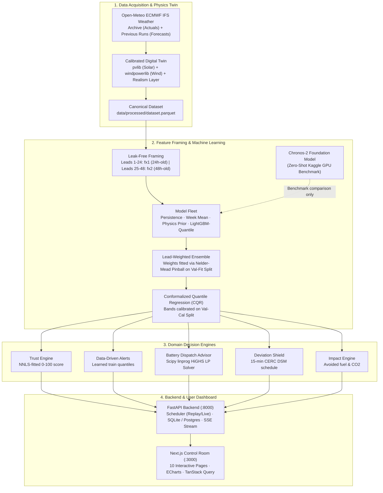
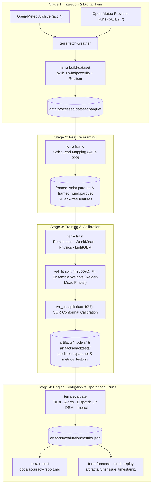
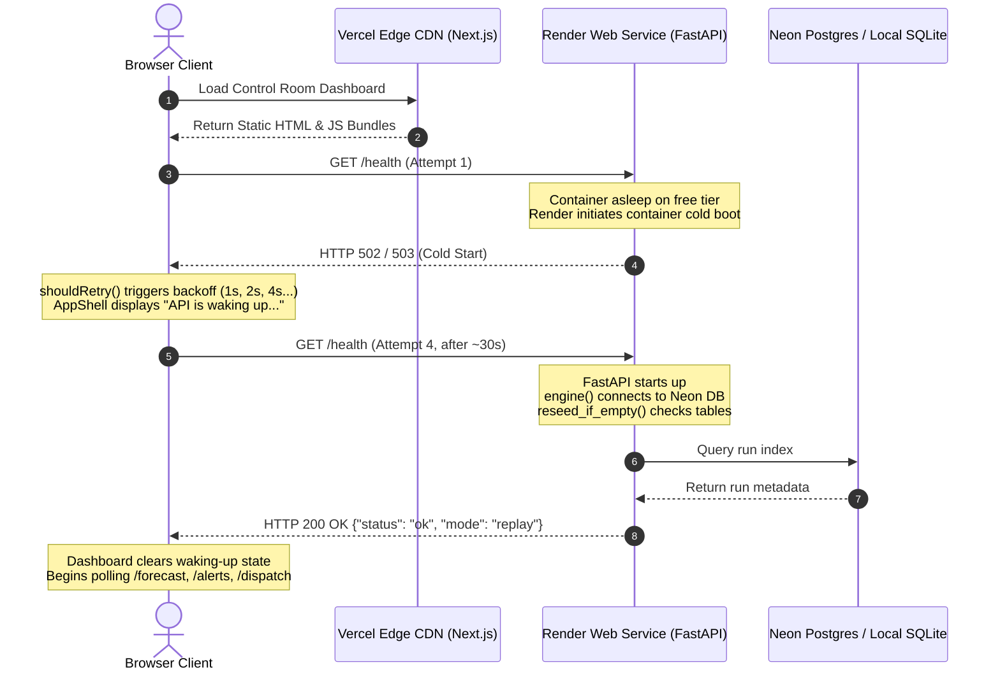
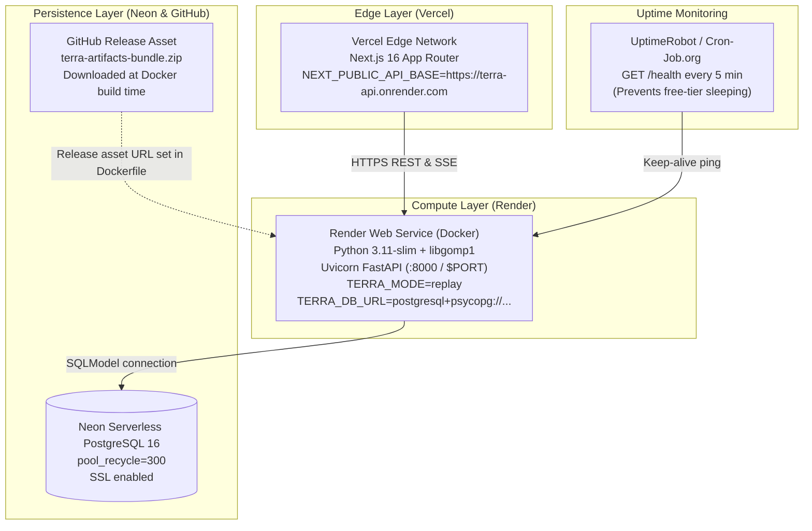

# DEV.md — TERRA Technical Guide & Architecture Reference

> **Repository Baseline**: Last verified against repository state on 2026-10-09 (commit: `79b7d5b`).  
> **Metrics Policy**: Accuracy and financial metrics are generated dynamically by the evaluation harness. Performance numbers are intentionally not hard-coded in this guide. To inspect the latest numbers, see [accuracy-report.md](file:///home/overxpowered/padhai_in_linux/Projects/AGNITIA-TERRA06/docs/accuracy-report.md), [engine-results.md](file:///home/overxpowered/padhai_in_linux/Projects/AGNITIA-TERRA06/docs/engine-results.md), `artifacts/backtests/*/metrics_test.csv`, or the `/models/compare` API endpoint and the web dashboard.

---

### If You Only Have 10 Minutes: Targeted Reading Paths
- **For an Evaluation / Hackathon Demo**: Read [Section 1 (Real vs Simulated)](#1-what-we-are-building--what-is-real-vs-simulated), [Section 2 (One-Page Overview)](#2-how-it-works-in-one-page), [Section 6 (Honest Limitations)](#6-honest-limitations--known-issues), and [Section 7 (Judge Q&A Cheat-Sheet)](#7-judge--teammate-qa-cheat-sheet).
- **For a Code & Modeling Review**: Read [Section 4 (Key Ideas Explained Simply)](#4-key-ideas-explained-simply), [Section 10 (The Machine Learning Pipeline in Detail)](#10-the-machine-learning-pipeline-in-detail), [Section 14 (Testing & Quality Gates)](#14-testing-ci-and-quality-gates), and [Section 16 (Engineering Rules & ADR Index)](#16-engineering-rules--adr-index).
- **For Cloud Deployment & Operations**: Read [Section 11 (Backend Service Architecture)](#11-backend-service-architecture), [Section 13 (Deployment Architecture & Cloud Strategy)](#13-deployment-architecture--cloud-strategy), [Section 15 (How-To Runbook)](#15-how-to-runbook-for-engineers), and [Section 18 (Troubleshooting Guide)](#18-troubleshooting-guide).

---

## Table of Contents

- [PART 1 — THE BIG PICTURE](#part-1--the-big-picture)
  - [1. What We Are Building & What Is Real vs Simulated](#1-what-we-are-building--what-is-real-vs-simulated)
  - [2. How It Works in One Page](#2-how-it-works-in-one-page)
  - [3. The Data Journey Step by Step](#3-the-data-journey-step-by-step)
  - [4. Key Ideas Explained Simply](#4-key-ideas-explained-simply)
  - [5. The Tech Stack](#5-the-tech-stack)
  - [6. Honest Limitations & Known Issues](#6-honest-limitations--known-issues)
  - [7. Judge & Teammate Q&A Cheat-Sheet](#7-judge--teammate-qa-cheat-sheet)
- [PART 2 — TECHNICAL REFERENCE](#part-2--technical-reference)
  - [8. Repository Map & Extension Workflows](#8-repository-map--extension-workflows)
  - [9. Conventions and Contracts](#9-conventions-and-contracts)
  - [10. The Machine Learning Pipeline in Detail](#10-the-machine-learning-pipeline-in-detail)
  - [11. Backend Service Architecture](#11-backend-service-architecture)
  - [12. Frontend Control Room Architecture](#12-frontend-control-room-architecture)
  - [13. Deployment Architecture & Cloud Strategy](#13-deployment-architecture--cloud-strategy)
  - [14. Testing, CI, and Quality Gates](#14-testing-ci-and-quality-gates)
  - [15. How-To Runbook for Engineers](#15-how-to-runbook-for-engineers)
  - [16. Engineering Rules & ADR Index](#16-engineering-rules--adr-index)
  - [17. Technical Glossary (A–Z)](#17-technical-glossary-a-z)
  - [18. Troubleshooting Guide](#18-troubleshooting-guide)

---

# PART 1 — THE BIG PICTURE

## 1. What We Are Building & What Is Real vs Simulated

### The Problem Story
Renewable energy grid integration in India faces an operational challenge: variable weather causes unexpected generation spikes and drops. Grid operators require power producers to submit day-ahead generation schedules in 15-minute time blocks. If an operator under-delivers or over-delivers beyond strict regulatory tolerance bands (governed by the Central Electricity Regulatory Commission Deviation Settlement Mechanism, CERC DSM Regulations), they incur severe monetary penalties.

Solar produces power strictly during daylight, peaking around noon, whereas wind in western Madhya Pradesh peaks during monsoon gusts and overnight hours. Co-locating solar and wind provides natural physical complementarity. However, to operate safely and profitably, plant operators need more than a single point forecast. They need:
1. Hourly 24–48 hour ahead generation forecasts for solar, wind, and the combined hybrid facility.
2. Honest, calibrated uncertainty intervals ($P_{10}$ to $P_{90}$) that reflect weather uncertainty.
3. Automated operational alerts (high generation curtailment risk, low generation deficits, rapid ramps).
4. A dispatch optimizer that schedules a co-located battery energy storage system (BESS) to buffer imbalances.
5. A regulatory "Deviation Shield" that converts forecasts into day-ahead schedules and calculates DSM deviation penalties.
6. A reliability "Trust Score" indicating hour-by-hour forecast confidence.

### Who Uses It
- **Renewable Plant Operators & Dispatch Engineers**: Monitor the control room, review day-ahead battery schedules, acknowledge alerts, and export compliant 15-minute scheduling sheets for the State Load Despatch Centre (SLDC) or Qualified Coordinating Agency (QCA).
- **Asset Managers & Commercial Analysts**: Run what-if simulations (e.g., adding battery capacity or testing extreme cloud cover) and assess avoided backup fuel costs and carbon emissions.

### The Honesty Box: Real vs Simulated
We practice strict provenance honesty across the platform.

```
┌────────────────────────────────────────────────────────────────────────────────────────┐
│                                   THE HONESTY BOX                                      │
├─────────────────────────────────────┬──────────────────────────────────────────────────┤
│ COMPONENT                           │ PROVENANCE & REALITY STATUS                      │
├─────────────────────────────────────┼──────────────────────────────────────────────────┤
│ Weather data (Actuals & Forecasts) │ 100% REAL. Sourced from Open-Meteo ECMWF IFS      │
│                                     │ 0.25° model (Archive API for actuals; Previous   │
│                                     │ Runs API for true historic 24h/48h forecasts).    │
├─────────────────────────────────────┼──────────────────────────────────────────────────┤
│ Plant Telemetry & Generation        │ SIMULATED DIGITAL TWIN. There is no physical     │
│                                     │ operator meter at this location. A virtual 90 MW │
│                                     │ plant (40 MW AC solar + 50 MW wind) is modeled   │
│                                     │ in the Dewas wind belt (Jamgudrani hills, MP).    │
├─────────────────────────────────────┼──────────────────────────────────────────────────┤
│ Physics & Realism Calibration       │ CALIBRATED ON REAL DATA. Solar PV temperature    │
│                                     │ degradation and inverter losses calibrated on    │
│                                     │ real Indian plants (R1). Wind wake losses and    │
│                                     │ outages calibrated on turbine SCADA (R2). CF     │
│                                     │ validated against Central Electricity Authority  │
│                                     │ (CEA) Madhya Pradesh regional statistics (R4).   │
├─────────────────────────────────────┼──────────────────────────────────────────────────┤
│ Demand Profile                      │ REAL PROFILE, SCALED. Derived from real hourly   │
│                                     │ Grid-India demand records (R3), scaled to 30 MW. │
├─────────────────────────────────────┼──────────────────────────────────────────────────┤
│ DSM Penalty Rates                   │ ILLUSTRATIVE. Tolerance bands (5% solar/hybrid,  │
│                                     │ 10% wind) and X-factor (1.0) match CERC 2024.    │
│                                     │ Financial rupee penalty slabs are illustrative   │
│                                     │ placeholders (verify: true in config/dsm.yaml).  │
└─────────────────────────────────────┴──────────────────────────────────────────────────┘
```

---

## 2. How It Works in One Page

### End-to-End System Overview


### The Two Modes: Offline Pipeline vs Online Serving
- **Offline Training & Evaluation (`ml/terra/`)**: Runs batch data ingestion, twin simulation, feature engineering, model training, CQR fitting, backtesting, and metric reporting. Writes static bundles into `artifacts/models/`, `artifacts/backtests/`, and `artifacts/evaluation/`.
- **Online Serving (`backend/` & `frontend/`)**: FastAPI loads the pre-computed bundles from `artifacts/` into memory. In `replay` mode, a background scheduler steps hour-by-hour through the historical test set; in `live` mode, it queries live Open-Meteo forecasts. It indexes runs in SQLite/Postgres and broadcasts alerts over Server-Sent Events (SSE).

---

## 3. The Data Journey Step by Step

```
Stage 1: Ingestion (data/raw/, data/interim/)
   Command: terra fetch-weather (or make data)
   Input:   Open-Meteo APIs (Archive + Previous Runs) for lat 22.96, lon 76.05.
   Output:  weather_actual.parquet, weather_fx0.parquet, weather_fx1.parquet, weather_fx2.parquet.

Stage 2: Digital Twin Generation (data/processed/dataset.parquet)
   Command: terra build-dataset
   Process: Feeds actual weather (act_*) into pvlib (solar DC/AC model) and windpowerlib
            (MM100/2000 turbine power curves). Applies AR(1) noise, inverter soiling,
            random component outages, and wind curtailments calibrated from Indian datasets.
   Output:  Hourly target time-series: solar_mw, wind_mw, demand_mw.

Stage 3: Framing & Feature Construction (data/processed/framed_{solar,wind}.parquet)
   Command: terra frame
   Process: Generates forecast issues every 6 hours (00, 06, 12, 18 UTC). For each issue,
            creates 48 horizon rows (lead 1 to 48). Binds forecast weather (fx_*),
            physics twin predictions (phys_mw), calendar/solar geometry (cal_*),
            and historical generation observed at or before issue time (hist_*).
   Guard:   Enforces strict lead mapping and asserts zero data leakage.

Stage 4: Training & Calibration (artifacts/models/, artifacts/backtests/)
   Command: terra train [--chronos-dir artifacts/chronos]
   Process: Fits models on train split (2024-03-08 to 2025-09-30). Fits ensemble weights on
            val_fit (first 60% of validation). Calibrates conformal uncertainty adjustments
            on val_cal (last 40% of validation). Evaluates predictions across test split.
   Output:  Model bundles, predictions.parquet, metrics_test.csv, meta.json.

Stage 5: Engine Evaluation & Artifact Generation (artifacts/evaluation/)
   Command: terra evaluate
   Process: Executes Trust, Alert, Battery Dispatch, Deviation Settlement, and Impact engines
            over the test split. Persists learned alert thresholds into artifacts/models/hybrid/engines/.
   Output:  results.json, dsm_summary.parquet, dispatch_kpis.json.

Stage 6: Forecast Execution (artifacts/runs/<timestamp>/)
   Command: terra forecast --mode replay
   Process: Produces an operational run for an issue time: runs models, applies CQR, calculates
            trust scores, triggers alerts, solves the battery LP, and formats the 15-min DSM schedule.
   Output:  forecast.parquet, dispatch.parquet, alerts.json, dsm_schedule.parquet, run.json.

Stage 7: Live Serving & Presentation
   Command: make api (FastAPI :8000) & make web (Next.js :3000)
   Process: API serves cached parquet files via REST endpoints and streams alerts over SSE.
            Frontend renders charts, dispatch schedules, and alert banners in IST.
```

---

## 4. Key Ideas Explained Simply

### 1. The Digital Twin
A digital twin is a software simulation of a physical asset. Because real commercial plant operators in Madhya Pradesh do not release public, hourly, multi-year telemetry with matching weather, we built a physics-accurate digital twin using industry-standard libraries:
- **Solar**: `pvlib` models sun position, plane-of-array irradiance, cell temperature degradation ($\gamma_{pdc} = -0.00434 /^\circ\text{C}$), and inverter clipping (50 MW DC panel array clipped to 40 MW AC inverter limit).
- **Wind**: `windpowerlib` models 25 turbines (2.0 MW MM100/2000, 90m hub height) using power curves with air density correction, 7% wake loss, and 2% electrical loss.
- **Realism Layer**: Pure physics curves are too smooth. Real plants experience inverter tripping, dust/soiling on panels, and grid curtailment. We add calibrated AR(1) autocorrelation noise, stochastic component outages, panel soiling that cleans when rainfall exceeds 5 mm, and wind curtailments.

### 2. Why Forecasts Can "Cheat" (Data Leakage) & Prevention
Data leakage occurs when an algorithm uses information during training or testing that would not actually be available at forecast time. Common leaks include:
- *Weather Leak*: Using actual recorded weather (`act_*`) as an input feature to predict generation.
- *Issue Bleed*: Using weather forecasts issued *after* the forecast timestamp.
- *Shuffle Leak*: Randomly shuffling time-series data during train/test splits, allowing models to interpolate between known hours.

**How we prevent leakage**:
1. All model features are restricted to forecast weather (`fx*`), deterministic solar geometry (`cal*`), and historical telemetry observed $\le t_0$ (`hist*`).
2. Train, validation, and test splits are strictly partitioned by time. Rows whose target timestamps cross split boundaries are dropped.
3. Feature column lists are checked at runtime whenever features are extracted using `assert_no_leakage()` in `ml/terra/features/build_features.py` (which validates allowed prefixes and bans `act_*`), and verified comprehensively by offline framing unit tests (`ml/tests/test_framing.py`).

### 3. Forecast Lead & The 24 h / 48 h Rule (ADR-009)
Open-Meteo's Previous Runs service archives numerical weather predictions:
- `_previous_day0`: Forecast issued today (lead ~0 h).
- `_previous_day1`: Forecast issued 24 hours ago.
- `_previous_day2`: Forecast issued 48 hours ago.

If an operator issues a 48-hour forecast at 00:00 UTC today, a 24-hour-ahead forecast issued 0 hours ago does not exist yet for tomorrow's hours. Under ADR-009, we enforce strict leak-free lead mapping:
- **Leads 1–24 h**: Map strictly to `fx1_` (24 h-old forecast).
- **Leads 25–48 h**: Map strictly to `fx2_` (48 h-old forecast).
- `fx0_` is never used as a lead forecast feature. It is retained only for historical model residuals at times $\le t_0$.

### 4. Baseline vs ML vs Foundation Models (The Six-Model Fleet)
For each energy source (solar and wind), the evaluated fleet on the test split consists of six models:
- **`Persistence` (`ml/terra/models/baselines.py`)**: Predicts the observed generation from 24 hours prior ($t - 24 \times \lceil\text{lead}/24\rceil$). Quantile bands are derived from empirical training residuals.
- **`WeekMean` (`ml/terra/models/baselines.py`)**: Predicts the average of the same hour over the preceding 7 observed days.
- **`Physics` (`ml/terra/models/physics.py`)**: Runs the physical digital twin directly on forecast numerical weather variables. Provides strong physical boundaries without machine learning.
- **`GBMQuantile` (`ml/terra/models/gbm.py`)**: Five LightGBM regressors per source (one for each target quantile: $P_{05}, P_{10}, P_{50}, P_{90}, P_{95}$). Under ADR-015, hyperparameters were tuned via Optuna on a temporal hold-out inside the training data (`tune_holdout`, dropping split boundary crossings), adopting new parameters under a pre-registered $\ge 1.0\%$ pinball improvement threshold.
- **`Ensemble` (`ml/terra/models/ensemble.py`)**: The model deployed to the API and dashboard. Blends physics and tuned LightGBM quantile predictions.
- **`Chronos-2` (`ml/terra/models/chronos2.py`)**: Amazon Chronos-2 (`amazon/chronos-2`) evaluated zero-shot with weather covariates on Kaggle GPUs (2× Tesla T4). Per ADR-016, Chronos-2 serves as an external comparison-only benchmark and is excluded from the default serving ensemble to keep deployment bundles lightweight without requiring PyTorch.

### 5. Quantiles & Uncertainty Bands
A single number (e.g. "Tomorrow at noon: 35 MW") fails to capture risk. If a cloud bank approaches, generation could be 15 MW or 38 MW.
We predict five quantiles:
- $P_{50}$ (Median): The central forecast (50% probability the actual is higher or lower).
- $P_{10}$ to $P_{90}$: The 80% uncertainty interval.
- $P_{05}$ to $P_{95}$: The 90% uncertainty interval.

### 6. Conformal Calibration (CQR — Making the Band Honest)
Raw quantile regression models can suffer from empirical miscalibration on unseen data.
**Conformalized Quantile Regression (CQR)** adjusts interval boundaries using calibration residuals. On the calibration split (`val_cal`), CQR calculates conformity scores:
$$\text{score}_i = \max(\hat{q}_{10, i} - y_i,\, y_i - \hat{q}_{90, i})$$
It finds the empirical $(1-\alpha)$ quantile of these scores, $Q$, across `(lead_bucket, cal_is_day)` strata. If the raw model undercovers, $Q > 0$ and CQR expands the bands ($\hat{q}_{10} - Q$, $\hat{q}_{90} + Q$); if it overcovers, $Q < 0$ and CQR shrinks them.
> [!IMPORTANT]
> **Exchangeability and Coverage Caveat**: Conformal prediction mathematically guarantees nominal coverage only when calibration data and test data are independent and identically distributed (exchangeable). In renewable forecasting with marked seasonality, exchangeability does not strictly hold. Here, `val_cal` covers a dry winter period (January – March 2026), whereas the test window spans the wind-heavy Indian monsoon (April – September 2026). Consequently, empirical coverage on the test set deviates from nominal levels (documented honestly in [accuracy-report.md](file:///home/overxpowered/padhai_in_linux/Projects/AGNITIA-TERRA06/docs/accuracy-report.md)).

### 7. Lead-Weighted Ensemble
The operational forecast combines the physical simulation and the LightGBM models. In `ml/terra/models/ensemble.py`, ensemble weights over member models are fitted per lead bucket (`1-24` and `25-48`) on the `val_fit` split by minimizing pinball loss across the five quantiles using `scipy.optimize.minimize(method="Nelder-Mead")` with softmax-parameterized non-negative weights summing to 1.
Because weights were fitted on the dry winter validation window, honest test evaluation shows that while solar clearly benefits, the wind ensemble is slightly worse than standalone tuned LightGBM and Chronos-2 on the monsoon test window.

### 8. The Trust Score (0–100)
A dispatcher needs to know: "Can I rely on this specific forecast hour?"
The Trust Engine (`ml/terra/engines/trust.py`) computes a 0–100 score based on four features normalized to plant capacity:
1. Relative uncertainty band width: $(P_{90} - P_{10}) / \text{capacity}$
2. Model disagreement spread: standard deviation of member $P_{50}$ medians divided by capacity
3. Normalized lead time: $\text{lead\_h} / 48$
4. Recent 7-day mean absolute error fraction: mean $|y - P_{50}| / \text{capacity}$ over 168 hours

**Weight Fitting & Score Formula**:
Weights are fitted via Non-Negative Least Squares (`scipy.optimize.nnls`) on the validation split to predict observed $|y - P_{50}| / \text{capacity}$. The reference error $\text{err\_ref}$ is set to the 95th percentile of predicted error on validation:
$$\text{pred} = \sum w_j \cdot \text{feature}_j, \quad \text{score} = \text{clip}\left(100 \times \left(1 - \frac{\text{pred}}{\text{err\_ref}}\right),\, 0,\, 100\right)$$
Categorical levels are defined by strict cutoffs: **High** ($\ge 70$), **Medium** ($\ge 40$), **Low** ($< 40$). Under ADR-011, the hybrid plant trust is the expected-generation-weighted average:
$$\text{Trust}_{\text{hybrid}} = \frac{P_{50,\text{solar}} \cdot \text{Trust}_{\text{solar}} + P_{50,\text{wind}} \cdot \text{Trust}_{\text{wind}}}{P_{50,\text{solar}} + P_{50,\text{wind}}}$$
(falling back to unweighted mean if both $P_{50} < 10^{-6}$ MW). Because $\text{err\_ref}$ reflects the validation distribution, typical high-uncertainty monsoon replay days rate mostly as "low" or "medium".

### 9. Learned Alert Thresholds (ADR-010)
Rather than hardcoding arbitrary cutoffs (which cause alert fatigue or miss genuine anomalies), alert thresholds are learned strictly from the training distribution:
- **Low Generation**: $P_{10}$ of training generation for solar (daylight-only) and hybrid; $P_{25}$ for wind in `config/site.yaml` to establish an operationally meaningful threshold for calm conditions without test-split tuning.
- **High Generation**: $P_{90}$ of training generation.
- **Ramp Alert**: $P_{95}$ of hourly absolute delta ($|\Delta \text{MW}|$).
The system calculates the probabilistic risk $P(X \le \text{Threshold})$ using quantile interpolation and raises an alert when probability exceeds 60%.

### 10. Battery Dispatch Advisor (Linear Programming)
The hybrid plant includes a 25 MW / 50 MWh battery storage system. The dispatch advisor (`ml/terra/engines/dispatch.py`) solves an hourly linear program over the 48-hour horizon using SciPy's HiGHS solver (`scipy.optimize.linprog(method="highs")`) with sparse matrix formulation across decision variables $[\text{charge}(T),\, \text{discharge}(T),\, \text{soc}(T),\, \text{backup}(T),\, \text{curtail}(T)]$:
- **Objective**: Minimize total operational cost = (Backup purchase cost $\times$ Backup MW) + (Curtailment penalty $\times$ Curtailed MW) + (Cell degradation cost $\times$ [Charge + Discharge MW]).
- **Constraints**: Exact hourly energy balance ($\text{gen}_t - \text{curt}_t - \text{ch}_t + \text{dis}_t + \text{backup}_t = \text{demand}_t$), state-of-charge dynamics with round-trip efficiency ($\eta = \sqrt{0.90}$), SoC limits (10% to 90%), battery power rating (25 MW), and a dynamic safety reserve buffer kept to protect against the $P_{10}$ low-generation shortfall.
- A rule-based greedy heuristic (`rule_based`) and a no-battery baseline (`no_battery`) are also evaluated for benchmark comparison.

### 11. Deviation Shield & CERC DSM Regulations
Under Indian grid regulations, renewable generators submit schedules in 15-minute time blocks (96 blocks per day). Deviations beyond tolerance are penalized:
- **Tolerance**: 5% for solar/hybrid, 10% for wind.
- **Denominator**: Available Capacity ($X=1.0$ for FY2026-27 under CERC 2024 orders).
- **Quantile Selection**: The Deviation Shield searches quantile levels $\tau \in [0.30, 0.70]$ on validation data to identify the scheduling quantile that empirically minimizes deviation charges.
- **Schedule Export**: Generates compliant 96-block CSV files with IST timestamps ready for regulatory submission.

### 12. What-If Scenario Simulator
Asset planners can perturb forecast parameters in real time (e.g., reduce irradiance by 40% for heavy monsoon clouds, increase wind by 20%, or scale battery capacity from 25 MW to 50 MW). The backend updates the physics twin, adjusts LightGBM predictions, recalculates the hybrid copula, and re-solves the battery dispatch LP within milliseconds.

### 13. Replay vs Live Mode
- **Replay Mode**: Steps through historical test dates at 6-hour intervals using cached Open-Meteo forecasts and digital twin actuals. Allows deterministic review of any historical weather event.
- **Live Mode**: Queries the live Open-Meteo ECMWF forecast API, runs the full ML pipeline, writes the run to storage, and notifies connected browser clients.

### 14. IST vs UTC Time Handling
All backend computations, database records, and parquet datasets store timestamps in UTC (`ts_utc`, tz-aware). Timestamps are converted to Indian Standard Time (`Asia/Kolkata`, UTC+05:30) exclusively in presentation layers (frontend UI, exported scheduling CSVs, and reports). All hourly intervals use the hour-ending convention.

---

## 5. The Tech Stack

### Data & Machine Learning Stack
| Technology | How We Use It Here | Why This & Alternative Rejected |
|---|---|---|
| **Python 3.11** | Core language for `ml/terra` | Standard data science ecosystem; fast startup. |
| **pandas & pyarrow** | High-performance tabular data and Parquet storage | Binary Parquet files provide fast, compressed, typed column storage. Rejected CSV/JSON for datasets. |
| **LightGBM** | Quantile regression ($P_{05}, P_{10}, P_{50}, P_{90}, P_{95}$) | Extremely fast training (< 1 min), native quantile objective, excellent tabular performance. Rejected Deep AR / complex neural nets for local runtime due to training overhead and memory footprint. |
| **pvlib-python** | Physical solar PV digital twin | Gold standard PV modeling library (Ineichen clear-sky, Sandia/PVWatts cell temperature). Rejected custom approximations. |
| **windpowerlib** | Physical wind turbine digital twin | Standard wind simulation tool with turbine power curve libraries and density correction. Rejected manual polynomial fits. |
| **scipy** | Linear programming (`linprog`) for dispatch; NNLS for trust weights | Built-in, robust, lightweight simplex/interior-point solvers. Avoided heavyweight commercial solvers (Gurobi/CPLEX). |
| **Amazon Chronos-2** | Zero-shot foundation model comparison | Evaluated zero-shot with weather covariates on Kaggle GPU as an external benchmark. Kept out of core serving runtime to avoid multi-GB PyTorch dependencies. |

### Backend Service Stack
| Technology | How We Use It Here | Why This & Alternative Rejected |
|---|---|---|
| **FastAPI** | REST API and SSE event streaming | Asynchronous, auto-generates OpenAPI documentation, high performance. Rejected Flask (synchronous) and Django (unnecessary overhead). |
| **Pydantic v2** | Data contract validation and schema serialization | Strict typing, fast C-based parsing, unified config validation. |
| **SQLModel** | ORM for run history and alert acknowledgment | Seamless bridge between Pydantic and SQLAlchemy. Compatible with both SQLite and PostgreSQL. |
| **APScheduler** | Background forecast pipeline scheduler | In-process background scheduler for hourly live/replay ticks. Rejected Celery/Redis to keep zero-dependency local operation. |
| **SSE (Server-Sent Events)** | Real-time alert streaming to dashboard | Lightweight, unidirectional HTTP streaming natively supported by browsers. Rejected WebSockets due to unnecessary bidirectional complexity. |

### Frontend Web Stack
| Technology | How We Use It Here | Why This & Alternative Rejected |
|---|---|---|
| **Next.js 16 (App Router)** | Dashboard UI and static/SSR pages | Modern React framework, file-based routing, robust production build tooling. Rejected plain Vite/SPA to allow flexible SSR/SSG. |
| **TypeScript** | Type safety across all components | Full type coverage generated directly from OpenAPI schema (`make types`). |
| **Tailwind CSS & shadcn/ui** | Clean control room design tokens and components | Responsive, modern utility styling with dark-mode aesthetic. |
| **Apache ECharts** | Interactive time-series charts, ribbon bands, dispatch stacked bars | Handles dense 48-hour multi-series datasets, area bands, and dual axes smoothly. Rejected Chart.js (limited band/candlestick support). |
| **TanStack Query** | Data fetching, auto-refresh, and cold-start retry policy | Robust caching, window focus refetching, and exponential backoff retry logic for waking sleeping backend containers. |

### Deployment & Tooling Stack
| Technology | How We Use It Here | Why This & Alternative Rejected |
|---|---|---|
| **Docker** | Containerization of FastAPI backend | Standard reproducible environment (`python:3.11-slim` + `libgomp1`). |
| **Render** | Backend container hosting | Free web service tier supporting Docker containers. |
| **Neon** | Serverless PostgreSQL database | Serverless Postgres on free tier. SQLite is retained as local default. |
| **Vercel** | Frontend hosting | Global CDN edge network optimized for Next.js. |
| **GitHub Actions** | Continuous integration quality gate | Automated linting, unit testing, and synthetic pipeline build verification. |

---

## 6. Honest Limitations & Known Issues

We commit to complete transparency about platform constraints. Each limitation below describes what is constrained, why it matters, and what we would do next.

1. **Virtual Digital Twin Target**:
   - *What it is*: While the numerical weather data is 100% real and the physics models are calibrated against empirical Indian plant datasets, the hourly target generation is produced by a calibrated simulation rather than a physical revenue meter at Jamgudrani hills.
   - *Why it matters*: Simulated telemetry cannot capture unexpected local events such as unmodelled local grid substation tripping, localized lightning strikes, or site-specific construction shadowing.
   - *What we would do next*: Ingest live SCADA telemetry via MQTT/Modbus protocols from an operating RE developer in Madhya Pradesh and fine-tune inverter clipping curves on site-specific revenue meters.
2. **Seasonal Distribution Shift & Uncertainty Band Coverage**:
   - *What it is*: Conformalized Quantile Regression (CQR) was fitted on the dry winter validation tail (`val_cal`, January – March 2026), whereas the test window spans the monsoon season (April – September 2026).
   - *Why it matters*: Conformal prediction mathematically guarantees nominal coverage only when calibration and test data are exchangeable. Because wind turbulence and monsoonal cloud formations create distinct error distributions compared to winter, empirical test coverage deviates from nominal levels (documented in [accuracy-report.md](file:///home/overxpowered/padhai_in_linux/Projects/AGNITIA-TERRA06/docs/accuracy-report.md)).
   - *What we would do next*: Implement seasonally stratified or rolling-window conformal calibration that dynamically recalibrates conformity scores over the preceding 30 days of observations.
3. **Wind Ensemble Weight Fit vs Standalone GBM & Chronos-2**:
   - *What it is*: Ensemble blend weights over member models were fitted via Nelder-Mead on the dry winter `val_fit` split. On the test split, the wind ensemble is slightly worse than standalone tuned LightGBM and Chronos-2.
   - *Why it matters*: Fixed static blend weights trained on low-variance winter wind conditions overweight the physics prior when facing turbulent monsoon regimes where gradient-boosted trees and foundation models adapt better.
   - *What we would do next*: Introduce regime-switching or lead-and-seasonality-dependent dynamic blending weights re-estimated online via rolling exponential decay.
4. **Trust Score Scaling Relative to Validation Tail**:
   - *What it is*: The reference error $\text{err\_ref}$ used in the trust score formula is defined as the 95th percentile of validation predicted error.
   - *Why it matters*: Because validation errors during dry winter are substantially smaller than high-wind monsoon errors, the default replay day (set during the test window) rates predominantly as "low" or "medium" trust.
   - *What we would do next*: Normalize trust features using rolling percentiles across a full 12-month multi-seasonal climatology.
5. **Illustrative DSM Slabs & PPA Rates**:
   - *What it is*: While the regulatory framing, tolerance percentage thresholds (5% solar/hybrid, 10% wind), and available capacity $X$-factor (1.0) mirror CERC 2024 orders, rupee penalty rates in `config/dsm.yaml` carry `illustrative: true`.
   - *Why it matters*: Rupee settlement sums displayed in the dashboard represent illustrative scenarios rather than legally binding commercial settlements.
   - *What we would do next*: Allow asset managers to upload developer-specific Power Purchase Agreements (PPAs) and state-specific MPERC tariff orders to compute exact audited invoices.

6. **Hourly Model Resolution & 15-Minute Downscaling**:
   - *What it is*: Core ML models predict at 1-hour resolution. The 96 daily 15-minute grid scheduling blocks are generated using physical downscaling algorithms (`downscale_solar` via clear-sky profile and `downscale_wind` via mid-point linear interpolation preserving hourly energy).
   - *Why it matters*: Sub-hourly micro-ramps (such as 10-minute cloud passages or sudden wind gusts) are smoothed out by hourly model resolution.
   - *What we would do next*: Train native 15-minute resolution LightGBM models utilizing 15-minute satellite irradiance and high-frequency anemometer inputs.

7. **Chronos-2 Foundation Model is Comparison-Only**:
   - *What it is*: Amazon Chronos-2 zero-shot predictions are pre-computed on Kaggle GPUs and evaluated in backtest reports, but excluded from the production serving ensemble bundle under ADR-016.
   - *Why it matters*: Live/replay forecast serving cannot dynamically re-run Chronos-2 inference on CPU containers without multi-gigabyte PyTorch dependencies and substantial latency.
   - *What we would do next*: Export a quantized ONNX runtime graph of Chronos-2 or deploy a dedicated GPU microservice endpoint for foundation model inference.

8. **Live Mode End-to-End Operational Exercise**:
   - *What it is*: While `terra forecast --mode live` successfully queries the live Open-Meteo API, hackathon evaluation relies primarily on deterministic historical replay (`--mode replay`).
   - *Why it matters*: Live streaming relies on Open-Meteo upstream API uptime and internet connectivity during scheduled hourly ticks.
   - *What we would do next*: Deploy redundant commercial weather API providers (e.g., ECMWF direct dissemination, Solcast) with automated fallback.

9. **Cloud Deployment Prepared But Deferred**:
   - *What it is*: The cloud deployment stack (Docker, Render, Neon Postgres, Vercel) has been verified locally through bundling tools and endpoint tests, but live cloud provisioning is on hold per project rules until explicit owner authorization.
   - *Why it matters*: Remote Docker image build on Render's build servers, real remote Neon SSL connection latency, and Render's 512 MB free-tier container memory ceiling remain unverified in the live cloud environment.
   - *What we would do next*: Execute deployment runbook [deployment.md](file:///home/overxpowered/padhai_in_linux/Projects/AGNITIA-TERRA06/docs/deployment.md), observe Render memory profiles under live load, and enable keep-alive uptime pingers.

10. **Raw Real-Data Ingestion Reproducibility (R1, R2, R4)**:
    - *What it is*: Real-data calibration scripts require external raw files (Indian solar Kaggle data R1, turbine SCADA R2, CEA state reports R4) that are not checked into git due to licensing and file size constraints.
    - *Why it matters*: A fresh git clone cannot execute `make calibrate` from scratch without manually downloading external data assets.
    - *What we would do next*: Host anonymized, permissible calibration benchmark slices on an automated DVC / S3 data registry.

11. **Calibrated Stochastic Noise & Irreducible Error Floor**:
    - *What it is*: Plant generation telemetry incorporates calibrated AR(1) noise, random component outages, and soiling drops to mirror real-world operational messiness.
    - *Why it matters*: Because random generator trips and turbulent micro-fluctuations are inherently stochastic, no deterministic weather-driven model can achieve zero error; an irreducible error floor is mathematically present.
    - *What we would do next*: Ingest inverter status codes and SCADA alarm registers as real-time binary categorical features.

12. **Replay Default Day Choice**:
    - *What it is*: The default replay issue timestamp (`2026-04-10T00:00 UTC`, 7 days into the test set) was selected as a fixed representative scenario during the spring transitional weather period.
    - *Why it matters*: An operator viewing a single replay timestamp sees only one specific operational condition rather than full annual meteorological diversity.
    - *What we would do next*: Add a date-picker dropdown in the UI allowing operators to step through any historical day across the 179-day test partition.

13. **Free-Tier Infrastructure Cold Starts**:
    - *What it is*: Render free-tier compute instances spin down after 15 minutes of inactivity, requiring 30–50 seconds to cold boot.
    - *Why it matters*: First-time visitors experience an initial loading delay before the control room populates.
    - *What we would do next*: Maintain continuous warm status using external HTTP pingers (e.g., UptimeRobot / cron-job.org) hitting `GET /health` every 5 minutes.

14. **Single-Tenant Architecture Without Authentication**:
    - *What it is*: The current FastAPI backend and Next.js frontend operate without user authentication, role-based access control (RBAC), or multi-tenant database isolation.
    - *Why it matters*: Any user with network access to the dashboard can acknowledge operational alerts or trigger what-if scenario calculations.
    - *What we would do next*: Implement OAuth2 / OIDC authentication (e.g., Clerk or Auth0) with distinct roles for Dispatchers, Plant Engineers, and Commercial Analysts.

---

## 7. Judge & Teammate Q&A Cheat-Sheet

**Q1: Why did you build a virtual plant rather than using a real plant's meter data?**  
*Answer*: No commercial hybrid plant in the Dewas/Indore wind-solar corridor publishes multi-year, hourly, uncurtailed co-located generation telemetry alongside synchronized numerical weather forecasts. Rather than using an unrelated, geographically disconnected open dataset, we modeled a digital twin at a real location in Madhya Pradesh using real ECMWF weather, calibrated against real Indian solar plants (Kaggle), turbine SCADA (R2), and Central Electricity Authority state statistics (R4). File evidence: [site.yaml](file:///home/overxpowered/padhai_in_linux/Projects/AGNITIA-TERRA06/config/site.yaml), `ml/terra/real/`.

**Q2: How do you prove there is zero data leakage in your models?**  
*Answer*: We enforce strict split partitioning by date (train, validation, test) where rows spanning split boundaries are dropped. Furthermore, under ADR-009, forecast features use strict lead mapping: leads 1–24 use 24 h-old forecasts (`fx1_`) and leads 25–48 use 48 h-old forecasts (`fx2_`). Live actuals (`act_*`) and zero-lead forecasts (`fx0_`) are strictly banned from feature matrices. Feature columns are checked at runtime with `assert_no_leakage()` in `ml/terra/features/build_features.py` and validated by framing tests in `ml/tests/test_framing.py`.

**Q3: Why are your skill scores and error metrics modest compared to academic papers?**  
*Answer*: Many academic papers report 24-hour forecast accuracy using zero-lead weather (`fx0_`) or reanalysis weather, which introduces look-ahead bias and artificially flatters accuracy. Our metrics are evaluated under operational conditions using true archived day-ahead forecasts. Additionally, solar metrics are evaluated on daylight-only hours (`cal_is_day == 1`) to avoid inflating accuracy with nighttime zeros. File evidence: `ml/terra/eval/metrics.py`, [accuracy-report.md](file:///home/overxpowered/padhai_in_linux/Projects/AGNITIA-TERRA06/docs/accuracy-report.md).

**Q4: What does the uncertainty band mean and does conformal prediction guarantee coverage?**  
*Answer*: We predict five quantiles ($P_{05}, P_{10}, P_{50}, P_{90}, P_{95}$) producing 80% and 90% prediction intervals. Conformal prediction (CQR) recalibrates these intervals empirically on `val_cal`. However, conformal guarantees hold strictly only when calibration and test data are exchangeable. Because our calibration window is dry winter and our test window spans the monsoon season, coverage on the test set deviates from nominal levels, which we document honestly rather than masking. File evidence: `ml/terra/models/conformal.py`.

**Q5: What models make up your fleet and what are their specific roles?**  
*Answer*: We compare six models per source on the test split: persistence and week_mean (baselines), physics (first-principles prior), gbm (Optuna-tuned LightGBM quantile regressors), ensemble (lead-weighted combination of physics and gbm served by the API), and chronos2_zs (Amazon Chronos-2 zero-shot foundation model benchmark). File evidence: `ml/terra/pipelines/train.py`, `ml/terra/models/`.

**Q6: Why is the wind ensemble slightly worse than standalone tuned LightGBM and Chronos-2 on test?**  
*Answer*: Ensemble blend weights were fitted on the dry winter validation window (`val_fit`). When evaluated on the monsoon-heavy test split, the static weights over-weighted the physics model compared to the tuned tree model and transformer, which adapted better to wind variability. In future work, we would fit weights across a multi-seasonal window or use rolling dynamic blending. File evidence: `ml/terra/models/ensemble.py`, [accuracy-report.md](file:///home/overxpowered/padhai_in_linux/Projects/AGNITIA-TERRA06/docs/accuracy-report.md).

**Q7: Why is Amazon Chronos-2 evaluated as a comparison-only benchmark rather than served live?**  
*Answer*: Per ADR-016, Chronos-2 is a transformer model requiring PyTorch and multi-gigabyte checkpoint weights. Including it in the live serving ensemble would bloat the deployment container image beyond free-tier memory limits and require GPU infrastructure. We pre-computed Chronos-2 zero-shot inference on Kaggle GPUs to benchmark foundation models honestly while keeping production serving lightweight. File evidence: [decisions.md](file:///home/overxpowered/padhai_in_linux/Projects/AGNITIA-TERRA06/.agent/context/decisions.md) (ADR-016), `ml/terra/pipelines/train.py`.

**Q8: What did hyperparameter tuning change and how was it conducted?**  
*Answer*: Under ADR-015, LightGBM models were tuned per source using Optuna with 5-quantile mean pinball loss on a leak-free temporal holdout (`tune_holdout`) inside the training data. New parameters were adopted only if pinball loss improved by at least 1.0%. Tuning clearly benefited solar and slightly improved wind metrics on the unseen test split. File evidence: `ml/scripts/tune_gbm.py`, [gbm_params.yaml](file:///home/overxpowered/padhai_in_linux/Projects/AGNITIA-TERRA06/config/gbm_params.yaml).

**Q9: How is the Trust Score calculated and validated?**  
*Answer*: The Trust Engine computes a 0–100 reliability score using four features: uncertainty band width, model spread, lead time, and recent error. Weights are fitted on validation data via Non-Negative Least Squares (`scipy.optimize.nnls`), with score 0 anchored to the 95th percentile of validation error. It is validated by measuring Spearman rank correlation between trust scores and actual absolute errors on the test split, confirming that low trust scores reliably correspond to higher forecast errors. File evidence: `ml/terra/engines/trust.py`, [engine-results.md](file:///home/overxpowered/padhai_in_linux/Projects/AGNITIA-TERRA06/docs/engine-results.md).

**Q10: Why does the default replay day show mostly low trust scores?**  
*Answer*: Trust score scaling is calibrated relative to the validation split error distribution (dry winter). The default replay day is situated during the test window where forecast uncertainty is higher, so the trust engine correctly and conservatively rates multiple hours as low or medium confidence. File evidence: `ml/terra/engines/trust.py`, `ml/terra/pipelines/forecast.py`.

**Q11: How are operational alerts defined and evaluated?**  
*Answer*: Under ADR-010, alert thresholds are learned strictly from the training distribution: low generation ($P_{10}$ solar/hybrid, $P_{25}$ wind in config), high generation ($P_{90}$), and ramp rate ($P_{95}$). Alerts trigger when the cumulative probability exceeds 60%. Alert precision and recall are systematically evaluated on the test set with deduplicated overlapping forecast windows. File evidence: `ml/terra/engines/alerts.py`, [site.yaml](file:///home/overxpowered/padhai_in_linux/Projects/AGNITIA-TERRA06/config/site.yaml).

**Q12: What is the Battery Dispatch Advisor and how does it solve?**  
*Answer*: The Dispatch Advisor schedules a 25 MW / 50 MWh co-located battery to serve a contracted 30 MW demand profile over the 48-hour forecast horizon. It solves an exact linear program using SciPy's HiGHS solver (`scipy.optimize.linprog(method="highs")`) balancing generation, charge, discharge, state of charge, curtailment, and backup purchases while preserving a dynamic safety reserve for the $P_{10}$ low-generation scenario. File evidence: `ml/terra/engines/dispatch.py`.

**Q13: What is the Deviation Shield (DSM) and are the rupee numbers real?**  
*Answer*: India's CERC Deviation Settlement Mechanism penalizes generators for deviations between scheduled and actual 15-minute generation beyond tolerance bands (5% solar/hybrid, 10% wind). The Deviation Shield searches quantile levels on validation data to pick the penalty-minimizing schedule. While the regulatory formula and tolerance bands match CERC 2024 orders, rupee penalty slabs in `config/dsm.yaml` carry `illustrative: true` and should not be quoted as binding commercial invoices. File evidence: `ml/terra/engines/dsm.py`, [dsm.yaml](file:///home/overxpowered/padhai_in_linux/Projects/AGNITIA-TERRA06/config/dsm.yaml).

**Q14: How does physical downscaling to 15-minute blocks work?**  
*Answer*: Hourly forecasts are converted to 96 daily 15-minute blocks while preserving hourly energy totals: solar is shaped using the 15-minute Ineichen clear-sky GHI curve, and wind is shaped via mid-point linear interpolation, followed by energy-conserving rescaling. File evidence: `ml/terra/models/downscale.py`.

**Q15: What happens when the backend API is asleep on free-tier hosting?**  
*Answer*: Render free-tier instances sleep after 15 minutes of inactivity. Our Next.js frontend uses a custom TanStack Query retry policy that retries up to 12 times with exponential backoff for network errors and 502/503/504 responses. During this window, the UI renders an accessible "API is waking up..." indicator and spinner until the service responds. File evidence: `frontend/src/hooks/api.ts`, `frontend/src/components/ui/states.tsx`.

**Q16: Is the platform deployed live to the cloud?**  
*Answer*: The deployment stack is fully architected, containerized, and verified locally (bundle creation, empty-directory execution, database failover), but live cloud deployment is deferred per AGENTS.md Rule 10 until explicit project owner authorization. The application runs identically locally via Makefile, Docker Compose, or native CLI. File evidence: [deployment.md](file:///home/overxpowered/padhai_in_linux/Projects/AGNITIA-TERRA06/docs/deployment.md), `scripts/make_deploy_bundle.py`.

**Q17: Why Neon PostgreSQL and what happens if the database connection drops?**  
*Answer*: Neon provides serverless PostgreSQL on a generous free tier. In `backend/app/db/models.py`, database connections are pooled with `pool_recycle=300` and `pool_pre_ping=True`. If the remote database is unreachable at startup, the backend automatically degrades gracefully to a local SQLite database under `artifacts/terra.db` so forecast endpoints remain fully operational. File evidence: `backend/app/db/models.py`.

**Q18: How reproducible is the pipeline from scratch?**  
*Answer*: The weather fetching (`terra fetch-weather`), dataset generation (`terra build-dataset`), feature framing (`terra frame`), model training (`terra train`), and serving (`terra forecast`) pipelines are 100% automated and deterministic. Synthetic development pipelines can be executed offline via `make demo-synthetic` for code verification. Real-data calibration scripts require external Kaggle/SCADA downloads. File evidence: `Makefile`, `ml/terra/pipelines/cli.py`.

**Q19: What would you do with two more weeks of engineering time?**  
*Answer*: We would: (1) integrate sub-hourly satellite nowcasting (INSAT-3D GHR) for the first 4 hours of the horizon; (2) implement rolling dynamic ensemble blending; (3) quantize Chronos-2 to ONNX for CPU serving; (4) deploy an automated API connector to the MP SLDC scheduling portal; and (5) secure live telemetry from an operating plant developer in Madhya Pradesh.

---

# PART 2 — TECHNICAL REFERENCE

## 8. Repository Map & Extension Workflows

```
AGNITIA-TERRA06/
├── .agent/                    # Agent rules, workflows, architecture contexts, and decision log
│   ├── context/               # architecture.md, decisions.md, data-contracts.md, domain-glossary.md
│   ├── rules/                 # 00-project-core.md, data-integrity.md, git-and-progress.md
│   └── workflows/             # add-model.md, add-api-endpoint.md, add-frontend-page.md
├── artifacts/                 # Generated models, backtests, runs (gitignored)
│   ├── backtests/{solar,wind} # predictions.parquet, metrics_test.csv, meta.json
│   ├── evaluation/            # results.json, dispatch_kpis.json
│   ├── models/                # Saved bundle pickles and LATEST pointers
│   └── runs/                  # Operational run folders and LATEST pointer
├── backend/                   # FastAPI backend service
│   ├── app/
│   │   ├── api/routes/        # forecast.py, models.py, alerts.py, dispatch.py, dsm.py, whatif.py, health.py
│   │   ├── db/                # SQLModel database models, engine initialization, fallback logic
│   │   ├── schemas/           # Pydantic response models matching OpenAPI contract
│   │   ├── services/          # runs.py (cached parquet loaders, NoRunYet handling)
│   │   ├── main.py            # App factory, lifespan, CORS, exception handlers
│   │   ├── scheduler.py       # APScheduler ForecastJob, replay stepper, SSE broadcaster
│   │   └── settings.py        # Settings loaded from TERRA_* environment variables
│   ├── tests/                 # test_api.py, test_deploy_db.py
│   └── Dockerfile             # Production container definition (Python 3.11-slim + libgomp1)
├── config/                    # Single source of truth YAML configuration files
│   ├── site.yaml              # Plant parameters, coordinates, realism settings, split dates, alerts
│   ├── dsm.yaml               # CERC DSM regulations, tolerance bands, illustrative charge slabs
│   └── gbm_params.yaml        # Optuna-tuned LightGBM hyperparameters for solar and wind
├── docs/                      # Technical documentation and generated reports
│   ├── accuracy-report.md     # Auto-generated model accuracy metrics report
│   ├── architecture.md        # System architecture and data flow documentation
│   ├── data-assumptions.md    # Plant capacity and weather assumption documentation
│   ├── deployment.md          # Cloud deployment runbook (Render, Neon, Vercel)
│   └── engine-results.md      # Auto-generated decision engine evaluation report
├── frontend/                  # Next.js 16 (App Router) web dashboard
│   ├── src/
│   │   ├── app/               # Page routes: forecast, models, alerts, dispatch, deviation, whatif...
│   │   ├── components/        # UI primitives, charts (ECharts wrappers), shell (AppShell, nav)
│   │   ├── hooks/api.ts       # TanStack Query data hooks with cold-start retry logic
│   │   └── lib/               # api/client.ts, api/types.ts, format.ts, cn.ts
├── ml/                        # Core Python ML, physics, and forecasting package
│   ├── terra/
│   │   ├── data/              # openmeteo.py, solar_twin.py, wind_twin.py, realism.py, dataset.py
│   │   ├── engines/           # hybrid.py, trust.py, alerts.py, dispatch.py, dsm.py, impact.py, whatif.py
│   │   ├── eval/              # backtest.py, metrics.py, report.py
│   │   ├── features/          # build_features.py, calendar.py, solar_geom.py, history.py
│   │   ├── models/            # base.py, baselines.py, physics.py, gbm.py, conformal.py, ensemble.py
│   │   ├── pipelines/         # cli.py (typer CLI), train.py, forecast.py, bundle.py
│   │   ├── real/              # loaders.py (R1-R4 data loaders), benchmarks.py
│   │   ├── config.py          # Pydantic configuration loader
│   │   ├── paths.py           # Project path definitions
│   │   └── schema.py          # Central column-name contracts and lead definitions
│   ├── tests/                 # Unit tests (test_framing.py, test_models.py, test_engines.py...)
│   └── kaggle/                # Kaggle notebook definitions for Chronos-2 GPU execution
├── scripts/                   # make_deploy_bundle.py (runtime artifact packaging)
├── Makefile                   # Primary developer command interface
├── docker-compose.yml         # Local multi-container development environment
└── render.yaml                # Render cloud deployment blueprint
```

### Where New Code Goes
- **New Data Ingestion**: Add loader in `ml/terra/data/` or `ml/terra/real/`. Follow workflow in `.agent/workflows/fetch-weather-data.md`.
- **New Forecasting Model**: Implement the `Model` interface in `ml/terra/models/`. Follow `.agent/workflows/add-model.md`.
- **New Decision Engine**: Implement pure Python functions in `ml/terra/engines/`. No web dependencies.
- **New API Endpoint**: Add schema in `backend/app/schemas/`, route in `backend/app/api/routes/`, and register in `backend/app/main.py`. Follow `.agent/workflows/add-api-endpoint.md`.
- **New Frontend Page**: Add page in `frontend/src/app/<route>/page.tsx`, hook in `frontend/src/hooks/api.ts`, and nav link in `frontend/src/components/shell/nav.ts`. Follow `.agent/workflows/add-frontend-page.md`.

---

## 9. Conventions and Contracts

### Time & Dates
- **Internal Storage**: UTC (`ts_utc`), tz-aware ISO-8601 strings.
- **Display Layer**: Converted to `Asia/Kolkata` (IST) exclusively in UI components, charts, and scheduling exports.
- **Hour-Ending Convention**: A timestamp of `12:00:00` represents the integration period from `11:00:00` to `12:00:00`.

### Units of Measurement
- **Power**: Megawatts (MW).
- **Energy**: Megawatt-hours (MWh).
- **Solar Irradiance**: Watts per square meter ($\text{W/m}^2$).
- **Wind Speed**: Meters per second (m/s).
- **Temperature**: Degrees Celsius ($^\circ\text{C}$).
- **Pressure**: Hectopascals (hPa).
- **Currency**: Indian Rupees (₹ / INR).

### Column Prefixes (`ml/terra/schema.py`)
```
Prefix      Meaning                                        Model Feature?
──────────────────────────────────────────────────────────────────────────
act_        Actual recorded weather (reanalysis/archive)   NO  (Twin only)
fx0_        Live forecast run (_previous_day0)             NO  (Residuals <= t0 only)
fx1_        Day-ahead forecast (_previous_day1, 24h old)   YES (Leads 1-24)
fx2_        Two-day-ahead forecast (_previous_day2, 48h)   YES (Leads 25-48)
fx_         Lead-resolved forecast feature                 YES
phys_       Physical twin simulated on forecast weather    YES
hist_       Generation observed at or before issue time    YES
cal_        Calendar and deterministic solar geometry      YES
```

### Quantile Columns
Quantile outputs are represented by five standard columns: `q05`, `q10`, `q50`, `q90`, `q95`. All quantile predictions are monotonically clipped between $0$ and plant capacity.

### Configuration Hierarchy
All parameters are managed in `config/*.yaml` and validated by Pydantic in `ml/terra/config.py`:
- `config/site.yaml`: Capacities, turbine count, coordinates, realism settings, split dates, alert quantiles.
- `config/dsm.yaml`: Regulatory parameters, tolerance percentages, available capacity factor $X$, illustrative penalty slabs.
- `config/gbm_params.yaml`: Hyperparameters for LightGBM regressors tuned via Optuna.

### Split Boundaries (`config/site.yaml`)
- **Train Split**: `2024-03-08` to `2025-09-30`
- **Validation Split**: `2025-10-03` to `2026-03-31`
  - `val_fit` (first 60% of validation issue times): Ensemble weights, residual baseline fitting.
  - `val_cal` (last 40% of validation issue times): Conformalized Quantile Regression (CQR) calibration.
- **Test Split**: `2026-04-03` to `2026-09-28`

---

## 10. The Machine Learning Pipeline in Detail

### Offline Training Pipeline Flowchart


### CLI Commands & Makefile Targets
| Task | CLI Command | Makefile Target | Notes |
|---|---|---|---|
| Fetch Weather | `terra fetch-weather` | `make data` (part 1) | Downloads Open-Meteo archive and previous runs |
| Build Dataset | `terra build-dataset` | `make data` (part 2) | Simulates digital twin targets on actual weather |
| Synthetic Dataset | `terra build-dataset --synthetic` | `make data-synthetic` | Generates fast offline synthetic fixtures (never quote in reports) |
| Frame Features | `terra frame` | `make frame` | Binds 34 leak-free features across 48 leads |
| Real Benchmark | `terra real-benchmark` | `make real-benchmark`| Benchmarks baselines on real Indian plant data |
| Train Models | `terra train [--chronos-dir DIR]` | `make train` | Fits persistence, physics, tuned GBM, ensemble, CQR |
| Evaluate Engines | `terra evaluate` | `make evaluate` | Evaluates Trust, Alerts, Dispatch, DSM, Impact |
| Generate Report | `terra report` | `make report` | Writes docs/accuracy-report.md and plots |
| Run Forecast | `terra forecast --mode replay` | `make forecast` | Generates a 48h operational forecast run |
| Export Kaggle Bundle | `terra export-kaggle` | `make export-kaggle` | Packages dataset and issue indices for Kaggle GPU jobs |
| Package Bundle | `python scripts/make_deploy_bundle.py` | `make bundle` | Packages runtime artifacts into dist/ |

### Framing & Feature Architecture
For each issue time $t_0$, the framing pipeline constructs 48 future target rows ($t_0 + 1$ to $t_0 + 48$). It binds 34 features:
1. **Forecast Weather (`fx_*`, 16 features)**: GHI, DNI, DHI, cloud cover, 2m temperature, relative humidity, surface pressure, 10m wind speed, 100m wind speed, wind direction sine/cosine, air density, wind shear, precipitation, clear sky index, and wind speed cubed ($ws_{100}^3$).
2. **Physics Prediction (`phys_mw`, 1 feature)**: Digital twin generation simulated directly on forecast weather.
3. **Calendar & Solar Geometry (`cal_*`, 8 features)**: Hour sine/cosine, day-of-year sine/cosine, day of week, clear sky GHI (pvlib Ineichen), solar zenith angle, and daylight flag (`cal_is_day`).
4. **Historical Generation (`hist_*`, 8 features)**: Observed output at same hour yesterday, 7-day average of same hour, output at issue time, 24-hour rolling mean/max, and rolling residuals between observed generation and physics simulations.
5. **Lead Time (`lead_h`, 1 feature)**: Horizon step from 1 to 48.

### Model Classes & Tuning Protocol
- **`Persistence` (`ml/terra/models/baselines.py`)**: Predicts the observed generation from 24 hours prior ($t - 24 \times \lceil\text{lead}/24\rceil$). Quantile bands are derived from empirical training residuals.
- **`WeekMean` (`ml/terra/models/baselines.py`)**: Predicts the average of the same hour over the preceding 7 observed days.
- **`Physics` (`ml/terra/models/physics.py`)**: Runs physical twin models directly on forecast weather features. Quantile bands are constructed using empirical validation error distributions.
- **`GBMQuantile` (`ml/terra/models/gbm.py`)**: Five LightGBM regressors per source (one for each target quantile: $P_{05}, P_{10}, P_{50}, P_{90}, P_{95}$).
  - *Tuning Protocol (`ml/scripts/tune_gbm.py`, ADR-015)*: Hyperparameters were tuned separately per source on the training split minus its last 20% temporal holdout (`tune_holdout`, dropping split boundary crossings to prevent leakage). Using Optuna TPE with a 40-minute timeout per source, the objective minimized mean pinball loss across the five quantiles on `tune_holdout`. New parameters were adopted only under a pre-registered relative improvement rule ($\ge 1.0\%$). Tuned parameters are committed to `config/gbm_params.yaml` and loaded automatically during training.
- **`Ensemble` (`ml/terra/models/ensemble.py`)**: The model served by the API. Combines physics and tuned LightGBM quantile predictions. Weights are fitted per lead bucket (`1-24` and `25-48`) on the `val_fit` split by minimizing 5-quantile pinball loss using `scipy.optimize.minimize(method="Nelder-Mead")` over softmax-parameterized non-negative weights summing to 1.
- **`CQR` (`ml/terra/models/conformal.py`)**: Calibrates the 80% and 90% prediction intervals on the `val_cal` split across `(lead_bucket, cal_is_day)` strata.
- **`Chronos-2` (`ml/terra/models/chronos2.py`, ADR-013, ADR-014, ADR-016)**:
  - *Kaggle GPU Execution*: Formatted inputs with 1,024 h context and lead-resolved future weather covariates (`fx1_` leads 1–24, `fx2_` leads 25–48) using per-item forward/backward filling to prevent cross-issue data bleed. Packaged via `terra export-kaggle` and executed zero-shot on Kaggle GPUs (2× Tesla T4, notebook `ml/kaggle/chronos2_infer.ipynb`).
  - *Comparison-Only Role*: Evaluated across all 68,576 rows on validation and test splits. Predictions are loaded via `terra train --chronos-dir artifacts/chronos` and compared in backtest tables and dashboard charts, but excluded from the production ensemble bundle to keep the serving backend free of PyTorch dependencies.

### Evaluation Metrics Methodology
All metrics are computed on the held-out test split using numpy arrays in MW:
- **Mean Absolute Error (MAE)**:
  $$\text{MAE} = \frac{1}{N}\sum |y_i - \hat{y}_i|$$
- **Root Mean Squared Error (RMSE)**:
  $$\text{RMSE} = \sqrt{\frac{1}{N}\sum (y_i - \hat{y}_i)^2}$$
- **Normalized MAE (nMAE %)**: $\text{MAE} / \text{Capacity} \times 100$
- **Bias**: $\frac{1}{N}\sum (\hat{y}_i - y_i)$
- **Pinball Loss (Quantile Loss)**:
  $$\mathcal{L}_\alpha(y, \hat{q}_\alpha) = \frac{1}{N}\sum \max(\alpha(y_i - \hat{q}_{\alpha, i}),\, (\alpha - 1)(y_i - \hat{q}_{\alpha, i}))$$
- **Prediction Interval Coverage Probability (PICP)**:
  $$\text{PICP} = \frac{1}{N}\sum \mathbb{I}(y_i \in [\hat{q}_{\text{lo}, i}, \hat{q}_{\text{hi}, i}])$$
- **Mean Prediction Interval Width (MPIW %)**:
  $$\text{MPIW} = \frac{1}{\text{Capacity}} \left(\frac{1}{N}\sum (\hat{q}_{\text{hi}, i} - \hat{q}_{\text{lo}, i})\right) \times 100$$
- **Skill Score vs Persistence**:
  $$\text{Skill} = 1 - \frac{\text{MAE}_{\text{model}}}{\text{MAE}_{\text{persistence}}}$$
- **Daylight-Only Solar Evaluation**: Evaluates solar metrics exclusively on timestamps where `cal_is_day == 1` (solar zenith $< 90^\circ$).

---

## 11. Backend Service Architecture

### Settings & Environment Variables (`backend/app/settings.py`)
All backend configuration settings are read from environment variables prefixed with `TERRA_`:
| Variable | Default Value | Description |
|---|---|---|
| `TERRA_MODE` | `replay` | Operational mode: `replay` or `live`. |
| `TERRA_REPLAY_START` | `2026-04-10T00:00` | Initial issue timestamp for replay stepping. |
| `TERRA_REPLAY_STEP_HOURS`| `6` | Hours advanced per replay scheduler tick. |
| `TERRA_SCHEDULE_MINUTES` | `60` | Interval between background forecast runs. |
| `TERRA_SCHEDULER_ENABLED`| `true` | Enables background APScheduler runner. |
| `TERRA_CORS_ORIGINS` | `http://localhost:3000`| Comma-separated list of allowed CORS origins. |
| `TERRA_DB_URL` | `sqlite:///./terra.db` | SQLModel database URL (SQLite or PostgreSQL). |
| `TERRA_VERSION` | `0.1.0` | API application version string. |

### Database Architecture, Reseeding & SQLite Fallback
The backend uses SQLModel to manage two database tables:
- `RunRow`: Stores run metadata (`name`, `issue_time_utc`, `mode`, `created_at`, `n_alerts`).
- `AlertRow`: Stores individual generated alerts (`id`, `type`, `source`, `start_utc`, `end_utc`, `severity`, `probability`, `magnitude_mw`, `message`, `acknowledged`).

**Robust Connection Handling**:
- When connecting to Neon PostgreSQL, URLs prefixed with `postgres://` are automatically normalized to `postgresql+psycopg://` with `pool_recycle=300` and `pool_pre_ping=True`.
- If the remote PostgreSQL database is unreachable at startup, the backend logs a warning and gracefully degrades to a local SQLite database under `artifacts/terra.db`.
- On startup, `reseed_if_empty()` inspects the database. If empty, it automatically repopulates run records and alerts directly from pre-existing artifact files in `artifacts/runs/`.

### Scheduler & SSE Streaming
The `ForecastJob` class in `backend/app/scheduler.py` uses APScheduler's `BackgroundScheduler`:
- On each tick, it executes `run_forecast()`, records new run metadata and alerts into the database, clears the in-memory cache, and publishes events to active async queues.
- The `/alerts/stream` endpoint streams real-time events to connected browser clients using Server-Sent Events (SSE).

### API Route Reference
| Method | Path | Purpose | Data Source |
|---|---|---|---|
| `GET` | `/health` | System health, operational mode, version | In-memory settings and DB check |
| `GET` | `/site` | Site coordinates, capacities, timezone | `config/site.yaml` |
| `GET` | `/forecast` | 48h quantile forecasts (solar, wind, hybrid) | Latest run `forecast.parquet` |
| `GET` | `/forecast/history` | Historical backtest actuals vs predictions | `backtests/<source>/predictions.parquet` |
| `GET` | `/models/compare` | Model comparison metrics across test set | `backtests/<source>/metrics_test.csv` |
| `GET` | `/alerts` | Active and unacknowledged alerts | SQLModel database `AlertRow` table |
| `POST` | `/alerts/{id}/ack` | Acknowledge a specific alert | Updates `AlertRow.acknowledged` in DB |
| `GET` | `/alerts/stream` | Real-time SSE alert and run event stream | In-memory asyncio subscriber queue |
| `GET` | `/dispatch` | Battery dispatch schedule and KPIs | Latest run `dispatch.parquet` |
| `GET` | `/dsm/summary` | Deviation Shield penalty summary | Latest run `dsm_schedule.parquet` |
| `GET` | `/dsm/schedule.csv` | Export 96-block 15-min schedule in IST | Latest run schedule converted to CSV |
| `POST` | `/whatif` | Re-forecast and re-dispatch scenario | Dynamic execution of `run_whatif()` |
| `GET` | `/impact` | Headline avoided fuel and carbon numbers | `artifacts/evaluation/results.json` |
| `GET` | `/assumptions` | Plant and regulatory assumptions | `config/site.yaml` and `config/dsm.yaml` |
| `GET` | `/trust` | Trust engine Spearman correlation summary | `artifacts/evaluation/results.json` |

### Error Handling & The 503 NO_DATA_YET State
If the backend starts up before the ML pipeline has generated artifacts, calls to `/services/runs.py` raise `NoRunYet`.
The application registers a custom exception handler that traps `NoRunYet` and returns HTTP 503:
```json
{
  "error": {
    "code": "NO_DATA_YET",
    "message": "no forecast run yet - run `terra forecast` or wait for the scheduler"
  }
}
```
The frontend explicitly recognizes `NO_DATA_YET` as an expected initial state and displays a helpful "Generating initial forecast..." message rather than a generic network failure.

---

## 12. Frontend Control Room Architecture

### Next.js Pages Reference
| Route | Page Title | Primary Display | API Hooks Used |
|---|---|---|---|
| `/` | Overview | Plant generation summary, live alerts, dispatch status | `useHealth`, `useForecast`, `useAlerts` |
| `/forecast` | Forecast | 48h interactive chart with 80% & 90% uncertainty bands | `useForecast`, `useHistory` |
| `/models` | Models | Model accuracy comparison table, skill scores, lead breakdown | `useModels` |
| `/alerts` | Alerts | Filterable alert list, severity badges, one-click acknowledgment | `useAlerts`, `ackAlert` |
| `/dispatch` | Dispatch | Battery dispatch schedule, state-of-charge curve, avoided cost KPIs | `useDispatch` |
| `/whatif` | What-If | Interactive sliders (clouds, wind, battery) with real-time recalculation | `useWhatIf` |
| `/deviation` | Deviation Shield | 15-minute CERC schedule, deviation penalty breakdown, CSV export | `useDsm` |
| `/impact` | Impact | Avoided backup energy (MWh), diesel cost savings, and avoided CO2 | `useImpact` |
| `/trust` | Trust Score | Hourly trust ribbon, feature explanation, Spearman reliability | `useTrustSummary`, `useForecast` |
| `/assumptions`| Assumptions | Plant hardware parameters, digital twin calibration, regulatory rules | `useAssumptions`, `useSite` |

### Cold-Start Retry Logic & Data Hooks (`frontend/src/hooks/api.ts`)
Render free-tier instances sleep after 15 minutes of inactivity, requiring 30–50 seconds to boot.
To handle this, our custom TanStack Query retry policy in `frontend/src/hooks/api.ts` implements:
```typescript
export function shouldRetry(failureCount: number, error: unknown): boolean {
  if (failureCount >= 12) return false;
  if (error instanceof ApiError) {
    if (error.status >= 400 && error.status < 500) return false;
    if (error.status === 503 && error.code === "NO_DATA_YET") return false;
    if ([502, 503, 504].includes(error.status)) return true;
    return false;
  }
  return true; // Network errors
}

export function retryDelay(attemptIndex: number): number {
  return Math.min(1000 * 2 ** attemptIndex, 8000); // Exponential backoff capped at 8s
}
```
When `health.failureCount > 0` and data is not yet available, `AppShell.tsx` displays a visible "API is waking up..." indicator in the header.

### Cold-Start Request Sequence Diagram


### TypeScript API Type Generation
API contracts between FastAPI and Next.js are strictly typed. We generate TypeScript definitions directly from the live FastAPI OpenAPI schema without running a local server:
```bash
make types
```
This runs `app.openapi()` through `openapi-typescript` and writes `frontend/src/lib/api/schema.d.ts`.

---

## 13. Deployment Architecture & Cloud Strategy



### Environment Variables Reference
| Variable Name | Environment | Description |
|---|---|---|
| `NEXT_PUBLIC_API_BASE` | Vercel (Frontend) | URL of the backend API (e.g., `https://terra-api.onrender.com`). |
| `TERRA_MODE` | Render (Backend) | Set to `replay` for hackathon evaluation; `live` for production. |
| `TERRA_DB_URL` | Render (Backend) | Connection string for Neon Postgres (`postgres://...`). |
| `TERRA_CORS_ORIGINS` | Render (Backend) | Allowed frontend URL (e.g., `https://terra-app.vercel.app`). |
| `TERRA_SCHEDULER_ENABLED`| Render (Backend) | Set to `false` in serverless/ephemeral environments if external jobs run. |
| `ARTIFACT_URL` | Dockerfile `ARG` default | HTTPS download URL of the GitHub Release artifact zip (already set in `backend/Dockerfile`; edit it to point at a new release). |
| `ARTIFACT_SHA256` | Dockerfile `ARG` default | SHA-256 checksum verifying the integrity of the artifact zip (set next to `ARTIFACT_URL`). |

> [!IMPORTANT]
> **Deployment Status**: Per AGENTS.md Rule 10 and ADR-008, live cloud deployment remains **ON HOLD** until explicitly approved by the project owner. The codebase and build artifacts are 100% cloud-ready. Complete deployment instructions live in [deployment.md](file:///home/overxpowered/padhai_in_linux/Projects/AGNITIA-TERRA06/docs/deployment.md).

---

## 14. Testing, CI, and Quality Gates

### Test Suite Map
| Test File | Target Area | What It Validates |
|---|---|---|
| `ml/tests/test_framing.py` | Data Framing | Strict lead bucket mapping, no `act_*` or `fx0_` features, no target bleed across split boundaries. |
| `ml/tests/test_chronos2_covariates.py`| Foundation Model | Chronos-2 covariate framing, strict per-item forward/backward fill to guarantee zero cross-issue data bleed. |
| `ml/tests/test_models.py` | ML Models | Persistence, WeekMean, Physics, and LightGBM quantile sorting and capacity clipping. |
| `ml/tests/test_engines.py` | Decision Engines | Hybrid copula aggregation, Trust NNLS score bounds, alert probabilistic thresholds, battery dispatch LP balance. |
| `ml/tests/test_loaders_india_hourly.py` | Real Data | Proper UTC parsing and scaling for Indian solar (R1), SCADA (R2), and demand (R3) loaders. |
| `backend/tests/test_api.py` | Backend Routes | REST endpoint response schemas, SSE stream connectivity, and 503 `NO_DATA_YET` handling. |
| `backend/tests/test_deploy_db.py` | DB & Deployment | PostgreSQL URL normalization, automatic SQLite degradation, and database reseeding. |

### Continuous Integration Pipeline (`.github/workflows/ci.yml`)
The GitHub Actions workflow runs on every push to `main` and all pull requests:
1. **Python Job**:
   - Sets up Python 3.11 with pip caching.
   - Installs `ml[dev]` and `backend[dev]`.
   - Runs `ruff check ml backend`.
   - Executes offline tests via `pytest -q` in `ml/`.
   - Builds a synthetic pipeline end-to-end (`terra build-dataset --synthetic && terra frame && terra train && terra evaluate && terra forecast --mode replay`).
   - Runs backend integration tests via `pytest -q` in `backend/`.
2. **Frontend Job**:
   - Sets up Node.js 22 with npm caching.
   - Runs `npm ci`, `npm run lint`, `npx tsc --noEmit`, and `npm run build`.

---

## 15. How-To Runbook for Engineers

### 1. Running Everything Locally
#### Bash Shell
```bash
# 1. Set up virtual environment and install dependencies
python3.11 -m venv .venv
source .venv/bin/activate
make setup

# 2. Run fast synthetic pipeline for offline development only
# WARNING: demo-synthetic uses synthetic weather fixtures for fast offline code/smoke verification (~3 min).
# NEVER report or quote numbers generated from demo-synthetic.
make demo-synthetic

# 3. Start backend API (:8000) in one terminal
make api

# 4. Start frontend dashboard (:3000) in a second terminal
make web
```

#### Fish Shell
```fish
# In fish shell, activate virtual environment using activate.fish
python3.11 -m venv .venv
source .venv/bin/activate.fish
make setup
# Fast offline synthetic check only (never report these numbers)
make demo-synthetic
make api
# In second terminal:
source .venv/bin/activate.fish
make web
```

### 2. Rebuilding Models with Real Weather
```bash
make data       # Downloads Open-Meteo weather and builds calibrated digital twin
make train      # Frames features and trains Persistence, Physics, LightGBM, Ensemble, CQR
make evaluate   # Evaluates decision engines (Trust, Alerts, Dispatch LP, DSM, Impact)
make report     # Regenerates docs/accuracy-report.md and evaluation plots
make forecast   # Generates the latest operational replay forecast
```

### 3. Adding a New Forecasting Model
1. Create `ml/terra/models/my_model.py` subclassing `Model` from `ml/terra/models/base.py`.
2. Implement `.fit(Xtr, ytr, Xval, yval)` and `.predict(X)`.
3. Register the model in `ml/terra/pipelines/train.py`.
4. Run `cd ml && pytest tests/test_models.py`.
5. Retrain using `make train` and verify that the model appears in `docs/accuracy-report.md`.

### 4. Adding a New Backend Endpoint
1. Define the Pydantic schema in `backend/app/schemas/`.
2. Add the route handler in `backend/app/api/routes/`.
3. Include the router in `backend/app/main.py`.
4. Regenerate frontend TypeScript types:
   ```bash
   make types
   ```
5. Add unit tests in `backend/tests/test_api.py`.

### 5. Adding a New Frontend Page
1. Create `frontend/src/app/<route>/page.tsx`.
2. Add the data query hook in `frontend/src/hooks/api.ts`.
3. Register the route in navigation items in `frontend/src/components/shell/nav.ts`.
4. Run `cd frontend && npm run lint && npx tsc --noEmit`.

### 6. Changing Alert Thresholds
1. Modify quantile parameters in `config/site.yaml` under `alerts:` (e.g., adjust `low_quantile` or `high_quantile`).
2. Re-run engine evaluation:
   ```bash
   make evaluate
   ```
3. This recalculates thresholds from the training split and updates `artifacts/models/hybrid/engines/`.

### 7. Packaging a Production Deployment Bundle
```bash
make bundle
```
This executes `scripts/make_deploy_bundle.py`, performs security checks (confirming no `.env`, secrets, or Kaggle credentials are included), and produces:
- `dist/terra-artifacts-<timestamp>.zip`
- `dist/terra-artifacts-<timestamp>.zip.sha256`

---

## 16. Engineering Rules & ADR Index

### AGENTS.md Non-Negotiable Rules Summary
1. **No Data Leakage**: Features may use only forecast weather (`fx*`), deterministic solar geometry (`cal*`), and generation observed at or before issue time (`hist*`). Time-based splits only; never shuffle.
2. **Never Hand-Type Metrics**: All performance numbers in reports, UI, and documentation must originate from the automated evaluation harness.
3. **Honesty About Provenance**: The plant is a virtual digital twin at a real location in Madhya Pradesh. Unverified regulatory rates carry `illustrative: true`.
4. **UTC Inside, IST for Presentation**: Store tz-aware UTC (`ts_utc`) across all databases and files. Convert to `Asia/Kolkata` only in presentation layers.
5. **Units in Ambiguous Names**: Explicitly suffix variables (`_mw`, `_mwh`, `_wm2`, `_ms`). Power is in MW, energy in MWh.
6. **Config, Not Constants**: Plant hardware, costs, and thresholds live in `config/*.yaml`.
7. **Attribution**: Display "Weather data by Open-Meteo.com (CC BY 4.0)" wherever weather data appears.
8. **No Secrets or Large Artifacts in Git**: Model binaries and datasets stay out of git history. Deliver via release bundles.
9. **Training Budget**: Jobs must remain strictly under 12 hours (planned budget $\le 2$ hours).
10. **Deployment Deferred**: Cloud deployment is on hold until explicitly authorized by the project owner.

### Architectural Decision Records (ADR) Index
| ADR ID | Title | Summary & Decision Rationale |
|---|---|---|
| **ADR-001** | Hybrid Solar + Wind Scope | Co-locate solar and wind to capture diurnal and seasonal complementarity in Madhya Pradesh. |
| **ADR-002** | FastAPI Backend | Use FastAPI for asynchronous Python energy library support and automatic OpenAPI generation. |
| **ADR-003** | Dewas Site Selection | Situate virtual plant on Jamgudrani hills ridge east of Dewas (Indore region) for realistic wind belt topography. |
| **ADR-004** | Open-Meteo Previous Runs | Use Open-Meteo Previous Runs API to obtain true historic day-ahead forecasts from March 2024. |
| **ADR-005** | Chronos-2 LoRA on Kaggle | Benchmark Amazon Chronos-2 foundation model on free Kaggle 2×T4 GPUs within a strict compute time-box. |
| **ADR-006** | Real-Data Calibration (R1–R5) | Calibrate digital twin parameters on real Indian solar (Kaggle), turbine SCADA, and CEA monthly statistics. |
| **ADR-007** | Deviation Shield & DSM Engine | Implement Indian grid deviation settlement charge modeling with illustrative placeholder tariff slabs. |
| **ADR-008** | Cloud Deployment Deferred | Keep live cloud deployment on hold until explicitly approved by the project owner. |
| **ADR-009** | Strict Lead Mapping | Enforce leak-free forecast features: leads 1–24 use `fx1_` (24h old); leads 25–48 use `fx2_` (48h old). Banned `fx0_`. |
| **ADR-010** | Data-Driven Alert Thresholds | Learn alert thresholds ($P_{10}, P_{90}, P_{95}$) strictly from the training split to prevent alert fatigue. |
| **ADR-011** | Generation-Weighted Trust | Calculate hybrid plant trust as expected-generation-weighted mean to prevent compound pessimism. |
| **ADR-012** | Cloud Deployment Architecture | Deploy via Neon Postgres, Render Docker (with release-asset artifact downloading), Vercel, and uptime pinger. |
| **ADR-013** | Chronos-2 Zero-Shot on Kaggle | Formulate leak-free Chronos-2 covariate framing with per-item filling to prevent cross-issue data bleed. |
| **ADR-014** | Chronos-2 Evaluation Results | Execute zero-shot Chronos-2 inference on Kaggle GPU across 68,928 rows, confirming 100% test coverage. |
| **ADR-015** | LightGBM Hyperparameter Tuning | Tune quantile LightGBM models via Optuna on leak-free temporal holdout (`tune_holdout`); pre-registered adoption rule ($\ge 1.0\%$ pinball improvement). |
| **ADR-016** | Chronos-2 Comparison-Only Role | Treat Amazon Chronos-2 zero-shot as an external comparison benchmark; exclude from default serving ensemble to keep production bundle PyTorch-free. |

---

## 17. Technical Glossary (A–Z)

- **ADR (Architectural Decision Record)**: A lightweight document recording significant architectural choices, context, and consequences.
- **BESS**: Battery Energy Storage System. In TERRA, a 25 MW / 50 MWh lithium-ion battery.
- **Capacity Factor (CF)**: The ratio of actual electrical energy output over a period to maximum possible output at continuous rated power.
- **CERC**: Central Electricity Regulatory Commission. The primary national electricity regulatory body in India.
- **Clear-Sky Index (csi)**: The ratio of observed global horizontal irradiance to modelled clear-sky irradiance. Values near 1.0 indicate clear skies; values near 0.2 indicate dense clouds.
- **Clipping**: When solar panel DC power exceeds the inverter AC capacity, capping the exported output at the inverter's rating.
- **Combined Margin (CM)**: The emission factor used for calculating avoided grid emissions (CEA: 0.705 $\text{tCO}_2/\text{MWh}$ for FY2025-26).
- **Conformalized Quantile Regression (CQR)**: A distribution-free technique that adjusts prediction intervals using calibration residuals to aim for nominal coverage (a formal guarantee needs calibration and test data to be exchangeable, which the winter-vs-monsoon shift here violates; see Section 6).
- **DSM (Deviation Settlement Mechanism)**: CERC regulatory framework in India penalizing generators for deviations between scheduled and actual power.
- **ECMWF**: European Centre for Medium-Range Weather Forecasts. Producer of the IFS 0.25° numerical weather prediction model used in TERRA.
- **Hour-Ending**: Timestamping convention where a timestamp denotes the conclusion of the preceding hourly integration period.
- **LightGBM**: Fast, distributed gradient boosting framework using tree-based learning algorithms.
- **MAE / RMSE**: Mean Absolute Error / Root Mean Squared Error. Standard regression loss metrics.
- **MPIW (Mean Prediction Interval Width)**: The average difference between upper and lower prediction interval bounds, expressed in MW or % of plant capacity.
- **nMAE**: Normalized Mean Absolute Error, expressed as a percentage of total plant capacity ($\text{MAE} / \text{Capacity} \times 100$).
- **NNLS (Non-Negative Least Squares)**: Constrained least-squares optimization where coefficients are restricted to non-negative values. Used in TERRA's Trust Engine.
- **NWP (Numerical Weather Prediction)**: Physics-based computer simulations of the atmosphere (e.g., ECMWF IFS, GFS).
- **PICP (Prediction Interval Coverage Probability)**: The empirical percentage of actual observations falling inside the predicted uncertainty band.
- **Pinball Loss**: Asymmetric linear loss function used for training and evaluating quantile regression models.
- **pvlib**: Industry-standard open-source Python library for simulating the physical performance of photovoltaic energy systems.
- **QCA (Qualified Coordinating Agency)**: Entity responsible for aggregating, forecasting, and submitting schedules to load despatch centres on behalf of renewable generators in India.
- **SCADA**: Supervisory Control and Data Acquisition. Industrial telemetry and control systems monitoring wind turbines and solar inverters.
- **Skill Score**: Relative improvement of a forecasting model compared to a naive reference baseline ($1 - \text{Error}_{\text{model}} / \text{Error}_{\text{baseline}}$).
- **SLDC / RLDC**: State Load Despatch Centre / Regional Load Despatch Centre. Operational grid bodies governing electricity dispatch in India.
- **SoC (State of Charge)**: The available battery energy expressed as a fraction of its total rated storage capacity.
- **SSE (Server-Sent Events)**: Web standard enabling servers to push real-time data updates to browsers over a persistent HTTP connection.
- **windpowerlib**: Open-source Python library for modeling wind turbine power curves and wind farm generation.

---

## 18. Troubleshooting Guide

| Symptom | Probable Cause | Verified Resolution |
|---|---|---|
| **HTTP 503 `NO_DATA_YET` on API startup** | Backend started before model and forecast artifacts were created. | Run `make train && make forecast` to generate real artifacts, or `make demo-synthetic` for fast offline development. |
| **Backend integration tests fail (12 test failures)** | Running `pytest` in `backend/` when `artifacts/` has no trained bundles or runs. | Run `make demo-synthetic` or `make train && make forecast` prior to running backend route tests. |
| **TypeScript compile error: missing `schema.d.ts`** | Frontend cannot find generated OpenAPI type definitions. | Run `make types` from repository root. This updates `frontend/src/lib/api/schema.d.ts` directly from the FastAPI schema without needing a running server. |
| **Missing `libgomp.so.1` in Docker container** | Debian/Ubuntu slim base images lack OpenMP shared library required by LightGBM C++ binaries. | Ensure `apt-get install -y libgomp1` is executed in `backend/Dockerfile` (already configured in production image). |
| **Kaggle GPU job failing with network error / internet disabled** | Kaggle account has not completed phone verification in account settings. | Visit `https://www.kaggle.com/settings`, complete SMS phone verification to unlock outbound internet access and GPU accelerator quotas. |
| **Fish shell: `source .venv/bin/activate` syntax error** | The standard activate script is written for POSIX shells (bash/zsh). | In fish shell, run `source .venv/bin/activate.fish`. |
| **Slow `uv pip install` or DNS resolution failures** | Upstream package index network timeouts or intermittent DNS drops. | Set environment variables to retry: `UV_HTTP_TIMEOUT=120 UV_HTTP_RETRIES=5 uv pip install ...` or use standard pip with retries. |
| **CORS errors after Vercel deployment** | Browser blocks cross-origin requests from frontend domain to backend API. | Set `TERRA_CORS_ORIGINS="https://your-app.vercel.app"` in Render environment settings and restart the backend service. |
| **Production frontend displays configuration card banner** | `NEXT_PUBLIC_API_BASE` was missing or pointed to `localhost` when Next.js built. | In Vercel Project Settings, define `NEXT_PUBLIC_API_BASE` with your Render API URL (e.g. `https://terra-api.onrender.com`) and trigger a fresh redeploy (Next.js bakes `NEXT_PUBLIC_*` at build time). |
| **Initial requests take 30–50 s on Render free tier** | Render free-tier container was asleep and is executing a cold start. | Expected behavior on free hosting. TanStack Query will automatically retry up to 12 times with backoff while UI displays "API is waking up...". Keep service warm with UptimeRobot hitting `GET /health` every 5 min. |
| **Neon PostgreSQL connection drops / connection reset** | Serverless compute suspended or connection idle beyond gateway timeout. | Verify SQLModel engine uses `pool_pre_ping=True` and `pool_recycle=300` in `backend/app/db/models.py`. Ensure query string includes `?sslmode=require`. |
| **Database fails to connect on startup** | Remote Neon database unreachable or credentials expired. | The backend automatically logs a warning and gracefully degrades to local SQLite (`artifacts/terra_fallback.db`), keeping forecast endpoints operational. |
| **Port 8000 already in use** | An earlier instance of uvicorn is still running in the background. | Check active processes with `lsof -i :8000` and terminate the orphaned process with `kill <PID>`. |
| **Pandas / PyArrow ArrowInvalid or version mismatch errors** | Discrepancy between pandas/pyarrow versions across virtual environments. | Re-sync packages with `pip install -U pandas pyarrow` ensuring virtual environment uses Python 3.11+. |
| **R3 demand loader fails on Mendeley dataset** | R3 loader expected small hourly CEA/POSOCO summary CSVs but encountered unexpected raw multi-file directory layout. | Ensure only the small hourly consolidated files are placed in `data/raw/mendeley/` as expected by `ml/terra/real/loaders.py`. |
| **Next.js hydration warning or date format mismatch** | Timezone mismatch between server-side rendering (UTC) and client browser (IST). | Use consistent presentation formatting with `formatInIST()` helpers and suppress hydration mismatch where explicit client-side local formatting is rendered. |

---
*End of DEV.md — AGNITIA TERRA06 Technical Guide*
