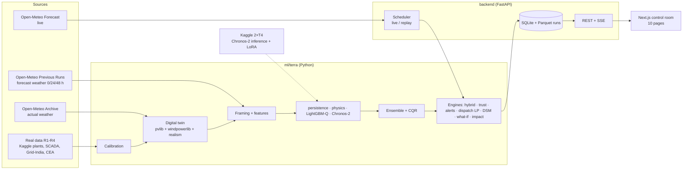

# IMPLEMENTATION ROADMAP — AGNITIA TERRA06 (v3, build guide)

**TERRA — Hybrid Renewable Forecasting, Trust & Dispatch Platform** for a virtual solar + wind plant in the Dewas wind belt near Indore, Madhya Pradesh.

This file is the **step-by-step build guide**. It gives the exact files and folders to create, the code that goes in each, the commands to run and how to check every step. It is written so that any AI coding agent, including a smaller model, can follow it task by task without making design decisions.

| File | Role |
|---|---|
| `IMPLEMENTATION_ROADMAP.md` (this file) | What to build, where and how; tasks are numbered `T<phase>.<sub>.<n>` |
| `IMPLEMENTATION_COMPLETION.md` | Checkbox tracker with the same task IDs |
| `ROADMAP.md` (v2) | Background: research, rationale, sources (read for *why*, not for *how*) |
| `AGENTS.md`, `.agent/` | Rules every agent must follow |

---

## 0. How to use this guide (read fully before starting)

### A. Rules for the implementing agent

1. **Work strictly in order** inside a subphase (`T1.4.1` before `T1.4.2`). Across subphases, follow the `Depends on:` line in each subphase header.
2. **One task = one small change.** After each task, run its **Check**. Do not start the next task until the check passes.
3. **Create files exactly at the paths given**, with the exact file, function and column names. Other modules import them by these names.
4. **Code blocks headed `FILE: <path>` are complete file contents.** Copy them in full. Blocks headed `SNIPPET` are partial and say where they go.
5. **Code status labels:**
   - ✅ **Tested**: this exact code was run during planning (on synthetic weather) and worked. Copy as-is.
   - 🧩 **Spec code**: complete code, syntax-checked but not executed during planning. Copy it, then make the task's **Check** pass, fixing small issues if needed.
   - 📝 **Write from spec**: no full code given; implement from the numbered instructions.
6. **`[verify]` items** are facts not confirmed during planning (an API parameter, a dataset column name, a regulation rate). The task says how to confirm them. If the real value differs, fix the code and record what you found in `.agent/memory/known-issues.md`.
7. **Never** use `act_*` columns as model features. **Never** shuffle time series. **Never** tune on the test split. (See `.agent/rules/data-integrity.md`.)
8. After every task, tick it in `IMPLEMENTATION_COMPLETION.md`. After a whole subphase, follow `.agent/workflows/finish-subphase.md`.
9. If a task is impossible as written (for example, a library API changed), **stop**, write the problem in `.agent/memory/known-issues.md` and ask the user. Do not invent a different design.
10. Do not deploy anything. Task group 8.5 stays on hold until the user says "deploy".
11. **This file is large (~350 KB) on purpose.** Do not load all of it into a model's context. Open only the subphase you are working on (search for its heading, e.g. `### 1.4`), plus section 0 ("How to use this guide") and `AGENTS.md`.

### B. Phase index

| Phase | Title | Days |
|---|---|---|
| 0 | Foundations | 1 |
| 1 | Weather data & digital twin | 1–2 |
| 2 | Real plant data & calibration | 2–3 |
| 3 | Features, baselines, evaluation harness | 3 |
| 4 | ML models (LightGBM, Chronos-2, ensemble, CQR) | 4–5 |
| 5 | Engines: hybrid, trust, alerts, dispatch, what-if, DSM, impact | 5–7 |
| 6 | Backend API (FastAPI) | 5–7 |
| 7 | Frontend (Next.js) | 4–9 |
| 8 | Integration (deployment on hold) | 8–9 |
| 9 | Docs, business case, report, demo | 9–10 |
| §10–13 | Troubleshooting, schedule, AI skills, sources | — |

### C. Environment prerequisites (each developer machine)

| Tool | Version | Check command |
|---|---|---|
| Python | 3.11 or 3.12 (3.10 minimum) | `python --version` |
| uv (recommended) or pip | latest | `uv --version` |
| Node.js | 20 LTS or 22 LTS | `node --version` |
| npm | ≥ 10 | `npm --version` |
| git | ≥ 2.40 | `git --version` |
| make | any (Windows: use WSL2) | `make --version` |
| Kaggle CLI (Phases 2 and 4) | latest | `kaggle --version` |
| Docker (Phase 8 only) | latest | `docker --version` |

**Windows users:** run everything inside WSL2 (Ubuntu). All paths in this guide use `/`.

### D. Global conventions (all code)

| Topic | Rule |
|---|---|
| Time | Store `ts_utc` as a tz-aware UTC `DatetimeIndex`, hourly. Convert to `Asia/Kolkata` (IST) only for display. |
| Hour convention | **Hour-ending.** A row at `ts_utc = 10:00` describes the interval 09:00–10:00 (Open-Meteo radiation is the mean of the preceding hour). Solar geometry uses `ts_utc − 30 min`. *(This replaces the "hour-beginning" note in ROADMAP v2 §4.)* |
| Units | MW, MWh, W/m², m/s, °C, hPa, %, ₹. Suffix names when ambiguous (`_mw`, `_mwh`). |
| Column prefixes | `act_` actual weather (never a feature) · `fx0_/fx1_/fx2_` forecast at 0/24/48 h lead · `fx_` lead-resolved forecast · `phys_` physics on forecast · `hist_` history at issue time · `cal_` calendar and solar geometry |
| Quantiles | Always the 5 columns `q05, q10, q50, q90, q95` (MW), monotone, clipped to `[0, capacity]` |
| Lead buckets | `1-12` → `fx0_`, `13-36` → `fx1_`, `37-48` → `fx2_` |
| Python style | `ruff` clean, line length 110, type hints on public functions, `from __future__ import annotations` at the top of every module |
| Logging | `from terra.logs import get_logger; log = get_logger(__name__)`; no `print()` in package code (CLI may print) |
| Paths | Import from `terra.paths`; never hard-code absolute paths |
| Config | Every assumed number lives in `config/*.yaml`, loaded with `terra.config.load_config()` |

> **Note:** the logging module is `terra/logs.py` (not `logging.py`), so it never shadows Python's standard `logging`. Update `.agent/rules/python-ml.md` (it says `terra.logging`) in task T0.2.4.

### E. Task format

```
#### T<phase>.<sub>.<n> — <title>      [status label]
Where:  <file paths>
Do:     <numbered instructions and/or code block>
Check:  <command and expected result>
```

### F. Who does what (2 developers)

| Track | Owner | Phases |
|---|---|---|
| A: data & ML | Dev A | 0.2, 0.3, 1, 2, 3, 4, 5 |
| B: app | Dev B | 0.1, 0.4, 0.5, 0.6, 6, 7, 8 |
| Both | — | 9 (docs, report, demo) |

Dev B does not need to wait for Dev A: `make demo-synthetic` (task T1.9.3) builds the full pipeline on synthetic weather in about 3 minutes, which produces every artifact the backend and frontend need. Replace it with real data later; no code changes. The day-by-day schedule is in §11.

---

## Repository tree (target state)

Create folders when their phase reaches them. Each file below is created by the task ID shown on the right.

```
AGNITIA-TERRA06/
├── AGENTS.md  CLAUDE.md  GEMINI.md                         (already exist)
├── README.md                                               T0.1.3, T9.6.1
├── ROADMAP.md  COMPLETION.md                               (v2, background only)
├── IMPLEMENTATION_ROADMAP.md  IMPLEMENTATION_COMPLETION.md (this guide + tracker)
├── LICENSE                                                 T0.1.2
├── Makefile                                                T0.6.1
├── .gitignore  .editorconfig  ruff.toml                    T0.1.1
├── .agent/ …                                               (already exists)
├── .github/
│   ├── copilot-instructions.md                             (already exists)
│   └── workflows/ci.yml                                    T0.6.2
├── config/
│   ├── site.yaml                                           T0.3.1
│   ├── dsm.yaml                                            T0.3.2
│   ├── calibration/  solar.yaml wind.yaml wind_curve.csv state.yaml   T2.3.2, T2.4.2, T2.5.2 (generated)
│   └── gbm_params.yaml                                     T4.5.1 (generated, optional)
├── data/  README.md  raw/ external/ interim/ processed/ samples/   T0.1.4 (contents gitignored)
├── artifacts/  README.md                                   T0.1.4 (contents gitignored)
├── docs/
│   ├── data-assumptions.md                                 T1.8.4, T2.8.1
│   ├── calibration.md                                      T2.3.4, T2.4.4, T2.5.4
│   ├── real-data-results.md                                T2.6.3, T2.7.4
│   ├── baseline-results.md                                 T3.5.1
│   ├── model-card.md                                       T3.2.1, T4.8.5
│   ├── engine-results.md                                   T5.9.2
│   ├── accuracy-report.md                                  T9.3.1
│   ├── business-case.md                                    T9.4.1
│   ├── architecture.md                                     T9.1.1
│   ├── images/                                             (generated plots)
│   └── report/report.md                                    T9.5.1
├── notebooks/  01_recon.ipynb  02_real_profile.ipynb       T1.1.1, T2.2.4
├── ml/
│   ├── pyproject.toml                                      T0.2.1
│   ├── kaggle/  README.md chronos2_infer.ipynb chronos2_finetune.ipynb   T4.3.3, T4.4.1
│   ├── scripts/ tune_gbm.py                                T4.5.1
│   ├── terra/
│   │   ├── __init__.py paths.py logs.py schema.py config.py               T0.2.2, T0.3.3–T0.3.5
│   │   ├── data/      __init__.py openmeteo.py synthetic_weather.py weather_tables.py solar_twin.py
│   │   │              wind_twin.py realism.py demand.py build_dataset.py quality.py      Phase 1
│   │   ├── real/      __init__.py loaders.py calibrate_solar.py calibrate_wind.py
│   │   │              calibrate_state.py benchmarks.py                                  Phase 2
│   │   ├── features/  __init__.py framing.py build_features.py                          Phase 3
│   │   ├── models/    __init__.py base.py baselines.py physics.py gbm.py chronos2.py
│   │   │              ensemble.py conformal.py downscale.py registry.py                 Phases 3–4
│   │   ├── eval/      __init__.py metrics.py backtest.py report.py                      Phase 3
│   │   ├── engines/   __init__.py hybrid.py trust.py alerts.py dispatch.py
│   │   │              value_of_forecast.py whatif.py dsm.py impact.py                   Phase 5
│   │   └── pipelines/ __init__.py cli.py bundle.py train.py evaluate.py forecast.py     Phases 1–6
│   └── tests/  conftest.py test_*.py                                                     every phase
├── backend/
│   ├── pyproject.toml  Dockerfile  .env.example                                         T0.5.1, T8.2.1
│   ├── app/
│   │   ├── __init__.py main.py settings.py scheduler.py
│   │   ├── schemas/     __init__.py api.py
│   │   ├── api/routes/  __init__.py health.py forecast.py models.py alerts.py dispatch.py
│   │   │                whatif.py dsm.py impact.py assumptions.py
│   │   ├── services/    __init__.py runs.py whatif.py
│   │   └── db/          __init__.py models.py
│   └── tests/  conftest.py test_*.py
├── frontend/   Next.js app (full tree in Phase 7)
└── docker-compose.yml                                                                   T8.2.3
```

---

## PHASE 0 — Foundations (Day 1)

Goal: an empty repo becomes a working skeleton. Python package installs, config loads, the Next.js app builds, the FastAPI app answers `/health`, and CI runs.

---

### 0.1 Repo scaffold & conventions  ·  Owner: Dev B  ·  Depends on: nothing

#### T0.1.1 — Root config files  ✅ Tested
Where: repo root
Do: create these three files exactly.

**FILE: `.gitignore`** — ✅ Tested

````gitignore
# Python
__pycache__/
*.py[cod]
.venv/
venv/
*.egg-info/
.pytest_cache/
.ruff_cache/
.mypy_cache/
.coverage
htmlcov/
# Node / Next
node_modules/
.next/
out/
frontend/src/lib/api/schema.d.ts
# Env & secrets
.env
.env.*
!.env.example
kaggle.json
# Data & artifacts (keep READMEs and tiny samples)
data/**
!data/README.md
!data/*/
!data/*/.gitkeep
!data/samples/**
artifacts/**
!artifacts/README.md
*.db
# Notebooks checkpoints & OS
.ipynb_checkpoints/
.DS_Store
Thumbs.db
frontend/openapi.json
````

**FILE: `.editorconfig`** — ✅ Tested

````ini
root = true

[*]
end_of_line = lf
insert_final_newline = true
charset = utf-8
indent_style = space
indent_size = 4

[*.{ts,tsx,js,json,css,yml,yaml,md}]
indent_size = 2

[Makefile]
indent_style = tab
````

**FILE: `ruff.toml`** — ✅ Tested

````toml
line-length = 125
target-version = "py310"

[lint]
select = ["E", "F", "I"]
ignore = ["E731", "E402"]

[lint.isort]
known-first-party = ["terra", "app"]
````

Check: `git status` shows the three new files.

#### T0.1.2 — LICENSE  📝 Write from spec
Where: `LICENSE`
Do: standard MIT licence text. First line `MIT License`, then `Copyright (c) 2026 Team AGNITIA`, then the standard MIT body (copy from https://choosealicense.com/licenses/mit/).
Check: file exists.

#### T0.1.3 — README skeleton  📝 Write from spec
Where: `README.md` (replace the existing one)
Do: sections in this order: `# TERRA`, a one-paragraph pitch (copy from ROADMAP.md §1.1), `## Status` ("under construction"), `## Quick start` (placeholder: `make setup && make demo-synthetic && make api` + `make web`), `## Docs` (links to IMPLEMENTATION_ROADMAP.md, IMPLEMENTATION_COMPLETION.md, ROADMAP.md, AGENTS.md), and a footer line `Weather data by Open-Meteo.com (CC BY 4.0)`. The final README is written in T9.6.1.
Check: renders on GitHub.

#### T0.1.4 — Data and artifact folders  📝 Write from spec
Where: `data/`, `artifacts/`, `docs/images/`, `notebooks/`
Do:
1. Create the folders `data/raw`, `data/external`, `data/interim`, `data/processed`, `data/samples`, `artifacts`, `docs/images`, `notebooks`. Put an empty `.gitkeep` file in each.
2. Create `data/README.md`:
   ```markdown
   # data/
   Nothing in here is committed except this README, .gitkeep files and data/samples/.
   - raw/        cached Open-Meteo JSON responses (created by `terra fetch-weather`)
   - external/   real datasets R1–R4 downloaded by hand (see IMPLEMENTATION_ROADMAP.md Phase 2); each subfolder has its own README with source, licence and download date
   - interim/    aligned weather tables, cleaned real data
   - processed/  dataset.parquet and framed_*.parquet (model inputs)
   - samples/    3-week sample used by tests (small, committed)
   ```
3. Create `artifacts/README.md`:
   ```markdown
   # artifacts/
   Generated, never committed: models/ (trained models + meta.json), backtests/, evaluation/, runs/ (forecast runs read by the backend), chronos/ (Kaggle outputs).
   Recreate with `make demo-synthetic` (offline) or the real pipeline (`make data train evaluate forecast`).
   ```
Check: `git status` shows only the READMEs and `.gitkeep` files under data/ and artifacts/.

#### T0.1.5 — First commit  📝
Do: `git add -A && git commit -m "chore(0.1): repo scaffold"` then `git push origin main`.
Check: the files appear on GitHub.

---

### 0.2 Python environment for `ml/`  ·  Owner: Dev A  ·  Depends on: 0.1

#### T0.2.1 — `ml/pyproject.toml`  ✅ Tested
**FILE: `ml/pyproject.toml`** — ✅ Tested

````toml
[build-system]
requires = ["setuptools>=68", "wheel"]
build-backend = "setuptools.build_meta"

[project]
name = "terra"
version = "0.1.0"
description = "TERRA hybrid solar + wind forecasting engine"
requires-python = ">=3.10"
dependencies = [
  "pandas>=2.1",
  "numpy>=1.26",
  "pyarrow>=14",
  "scipy>=1.11",
  "scikit-learn>=1.4",
  "lightgbm>=4.3",
  "pvlib>=0.11",
  "windpowerlib>=0.2.2",
  "httpx>=0.27",
  "pydantic>=2.6",
  "pyyaml>=6",
  "tenacity>=8.2",
  "joblib>=1.3",
  "typer>=0.12",
  "matplotlib>=3.8",
  "tabulate>=0.9",
]

[project.optional-dependencies]
fm = ["chronos-forecasting>=2.0", "torch>=2.2", "peft>=0.10"]   # Chronos-2 (Kaggle GPU / optional locally)
tune = ["optuna>=3.6"]
real = ["kaggle>=1.6", "pdfplumber>=0.11", "openpyxl>=3.1"]
dev = ["pytest>=8", "pytest-cov>=5", "ruff>=0.5"]

[project.scripts]
terra = "terra.pipelines.cli:app"

[tool.setuptools.packages.find]
include = ["terra*"]

[tool.pytest.ini_options]
testpaths = ["tests"]
markers = ["slow: needs network or large data (skipped by default)"]
addopts = "-m 'not slow'"
````

Check: file exists. (Installing comes in T0.2.3.)

#### T0.2.2 — Package skeleton  📝 Write from spec
Do: create these folders and **empty** `__init__.py` files:
```
ml/terra/__init__.py            (content below)
ml/terra/data/__init__.py
ml/terra/real/__init__.py
ml/terra/features/__init__.py
ml/terra/models/__init__.py
ml/terra/eval/__init__.py
ml/terra/engines/__init__.py
ml/terra/pipelines/__init__.py
ml/tests/                        (folder only)
ml/kaggle/                       (folder only)
```
`ml/terra/__init__.py` contains exactly:
```python
"""TERRA forecasting engine (see IMPLEMENTATION_ROADMAP.md)."""
__version__ = "0.1.0"
```
Check: `find ml/terra -name "__init__.py" | wc -l` prints `8`.

#### T0.2.3 — Create the virtual environment and install  📝
Do (from the repo root):
```bash
python -m venv .venv
source .venv/bin/activate              # Windows WSL: same command
python -m pip install -U pip
pip install -e "ml[dev,tune,real]"
```
Optional, only if the machine has a GPU or you want Chronos-2 locally (CPU works but is slow): `pip install -e "ml[fm]"`.
Check: `python -c "import terra, pvlib, windpowerlib, lightgbm; print(terra.__version__)"` prints `0.1.0`. `terra --help` fails until T1.9.1 (expected).

#### T0.2.4 — Align the agent rule files with this guide  📝
Do: edit `.agent/rules/python-ml.md`:
1. Replace `terra.logging.get_logger(__name__)` with `terra.logs.get_logger(__name__)`.
2. Replace `line length 100` with `line length 125`.
3. Under "Modelling", replace the interface sentence with: "All models subclass `terra.models.base.ForecastModel` (`fit(X, y, X_val, y_val)`, `predict(X)` → DataFrame `q05,q10,q50,q90,q95`, `save`, `load`)."

Edit `.agent/rules/frontend-nextjs.md`: replace the shadcn/ui bullet with "UI primitives live in `src/components/ui/primitives.tsx` (no UI kit); charts use the in-house `EChart` wrapper in `src/components/charts/`."

Edit `AGENTS.md`: under "What this project is", add the line `- Build guide: [IMPLEMENTATION_ROADMAP.md](./IMPLEMENTATION_ROADMAP.md) · tracker: [IMPLEMENTATION_COMPLETION.md](./IMPLEMENTATION_COMPLETION.md)`, and in "How to work" step 1 replace `ROADMAP.md` with `IMPLEMENTATION_ROADMAP.md`.
Check: `grep -n "terra.logs" .agent/rules/python-ml.md` finds the line.

---

### 0.3 Site & plant configuration  ·  Owner: Dev A  ·  Depends on: 0.2

#### T0.3.1 — `config/site.yaml`  ✅ Tested
**FILE: `config/site.yaml`** — ✅ Tested

````yaml
# TERRA site & plant configuration — single source of truth for every assumption.
# Values marked "verify" must be checked before they are quoted in the report/pitch.

site:
  name: "TERRA Dewas Hybrid (virtual plant)"
  latitude: 22.96          # Jamgudrani hills wind area, Dewas district (approximate; confirm on map in task 0.3.3)
  longitude: 76.05
  altitude_m: 550          # verify on map / Open-Meteo "elevation" field in task 1.1
  timezone: "Asia/Kolkata" # display only; all data stored in UTC

solar:
  dc_capacity_mw: 50.0
  ac_capacity_mw: 40.0
  tilt_deg: 23.0
  azimuth_deg: 180.0
  albedo: 0.20
  gamma_pdc: -0.0037        # 1/°C, calibrated in 2.3
  system_loss_frac: 0.14    # DC wiring, mismatch, soiling baseline; calibrated in 2.3
  eta_inv_nom: 0.96

wind:
  turbine_type: "MM100/2000" # 2 MW, 100 m rotor (closest windpowerlib match to Gamesa G97/2000)
  n_turbines: 25
  rated_mw: 2.0
  hub_height_m: 90.0
  wake_loss_frac: 0.07
  electrical_loss_frac: 0.02
  cut_out_ms: 25.0

battery:
  power_mw: 25.0
  energy_mwh: 50.0
  round_trip_eff: 0.90
  soc_min_frac: 0.10
  soc_max_frac: 0.90
  soc_init_frac: 0.50
  degradation_inr_per_mwh: 300.0
  reserve_factor: 1.0       # MWh of reserve kept per MW of (P50 - P10) next-hour shortfall

demand:
  peak_mw: 30.0            # contracted supply profile served by the hybrid plant (+ battery + backup)
  temp_coeff_per_c: 0.010   # +1% load per °C above 25 °C
  noise_std_frac: 0.02
  shape_source: "parametric" # "parametric" | "india_hourly" (set after task 2.1 loads R3)

realism:
  seed: 42
  solar:
    ar1_phi: 0.70
    ar1_sigma: 0.06
    soiling_rate_per_day: 0.002
    soiling_reset_rain_mm: 5.0
    outage_rate_per_day: 0.02
    outage_mean_hours: 6.0
    outage_capacity_frac: 0.10
  wind:
    ar1_phi: 0.60
    ar1_sigma: 0.08
    outage_rate_per_day: 0.03
    outage_mean_hours: 12.0
    outage_capacity_frac: 0.12
    curtail_rate_per_day: 0.02
    curtail_mean_hours: 4.0
    curtail_level_frac: 0.60

costs:
  backup_inr_per_mwh: 9000.0           # verify (gas/diesel backup or market purchase cost)
  curtail_penalty_inr_per_mwh: 1000.0  # verify
  emission_factor_t_per_mwh: 0.705     # CEA CO2 Baseline Database v22, FY2025-26, combined margin
  emission_factor_source: "CEA CO2 Baseline Database v22.0 (combined margin, FY2025-26)"

alerts:
  low_generation_frac: 0.10    # combined output below 10% of total capacity
  high_generation_frac: 0.85   # above 85% → curtailment risk
  ramp_mw_per_h: 20.0
  low_trust_score: 40
  min_probability: 0.60

weather:
  forecast_model: "ecmwf_ifs025"   # confirm in 1.1; fallback "best_match"
  actual_model: null               # null = Open-Meteo default (best match of IFS/ERA5)
  start_date: "2024-01-01"
  end_date: "2026-09-30"

splits:
  train_start: "2024-01-08"
  train_end: "2025-09-30"
  val_start: "2025-10-03"
  val_end: "2026-03-31"
  test_start: "2026-04-03"
  test_end: "2026-09-28"

forecast:
  horizon_h: 48
  quantiles: [0.05, 0.10, 0.50, 0.90, 0.95]
  train_issue_hours_utc: [0, 6, 12, 18]
  dayahead_issue_hour_utc: 0      # 05:30 IST issue; covers next IST day (leads 19-42 h), before 10:00 IST deadline
````

#### T0.3.2 — `config/dsm.yaml`  ✅ Tested
**FILE: `config/dsm.yaml`** — ✅ Tested

````yaml
# Deviation Settlement Mechanism (DSM) profile used by the Deviation Shield engine (task 5.7).
# verified: tolerance bands from 2026-04-01 (solar/hybrid 5 %, wind 10 %) and the FY2026-27 X factor (100 %).
# NOT verified: the charge slabs/rates below are ILLUSTRATIVE placeholders. Replace them with the rates in
# the CERC DSM Regulations 2024 (or MPERC rules for intra-state plants) before quoting rupee numbers.
illustrative: true
regulation: "CERC DSM Regulations 2024 (X-factor order effective 2026-04-01)"
block_minutes: 15
tolerance_pct:
  solar: 5.0
  wind: 10.0
  hybrid: 5.0
x_factor:            # weight of available capacity in the deviation denominator (FY2026-27 = 1.0)
  solar: 1.0
  wind: 1.0
  hybrid: 1.0
slabs:               # deviation % (of denominator) beyond tolerance -> INR per kWh of deviation energy
  - {upto_pct: 10.0, inr_per_kwh: 0.50}
  - {upto_pct: 20.0, inr_per_kwh: 1.00}
  - {upto_pct: 1000.0, inr_per_kwh: 1.50}
````

#### T0.3.3 — `paths.py` and `logs.py`  ✅ Tested
**FILE: `ml/terra/paths.py`** — ✅ Tested

````python
"""Repository-relative paths. Import these constants instead of hard-coding paths."""
from __future__ import annotations

import os
from pathlib import Path

# ml/terra/paths.py -> parents[2] is the repo root
REPO_ROOT = Path(os.environ.get("TERRA_REPO_ROOT", Path(__file__).resolve().parents[2]))
CONFIG_DIR = REPO_ROOT / "config"
DATA_DIR = Path(os.environ.get("TERRA_DATA_DIR", REPO_ROOT / "data"))
DATA_RAW = DATA_DIR / "raw"
DATA_EXTERNAL = DATA_DIR / "external"
DATA_INTERIM = DATA_DIR / "interim"
DATA_PROCESSED = DATA_DIR / "processed"
DATA_SAMPLES = DATA_DIR / "samples"
ARTIFACTS = Path(os.environ.get("TERRA_ARTIFACTS_DIR", REPO_ROOT / "artifacts"))
DOCS = REPO_ROOT / "docs"
DOCS_IMAGES = DOCS / "images"


def ensure_dirs() -> None:
    """Create all writable directories (safe to call repeatedly)."""
    for p in (DATA_RAW, DATA_EXTERNAL, DATA_INTERIM, DATA_PROCESSED, DATA_SAMPLES, ARTIFACTS, DOCS_IMAGES):
        p.mkdir(parents=True, exist_ok=True)
````

**FILE: `ml/terra/logs.py`** — ✅ Tested

````python
"""Logging helper. Use `log = get_logger(__name__)` in every module; never print()."""
from __future__ import annotations

import logging
import os

_CONFIGURED = False


def get_logger(name: str) -> logging.Logger:
    global _CONFIGURED
    if not _CONFIGURED:
        logging.basicConfig(
            level=os.environ.get("TERRA_LOG_LEVEL", "INFO"),
            format="%(asctime)s %(levelname)s %(name)s: %(message)s",
        )
        _CONFIGURED = True
    return logging.getLogger(name)
````

#### T0.3.4 — `schema.py` (column-name contract)  ✅ Tested
**FILE: `ml/terra/schema.py`** — ✅ Tested

````python
"""Column-name contract shared by every module (mirror of .agent/context/data-contracts.md)."""
from __future__ import annotations

# short name -> Open-Meteo hourly variable
OPENMETEO_VARS: dict[str, str] = {
    "ghi": "shortwave_radiation",
    "dni": "direct_normal_irradiance",
    "dhi": "diffuse_radiation",
    "cloud": "cloud_cover",
    "t2m": "temperature_2m",
    "rh2m": "relative_humidity_2m",
    "psfc": "surface_pressure",
    "ws10": "wind_speed_10m",
    "ws100": "wind_speed_100m",
    "wd100": "wind_direction_100m",
    "precip": "precipitation",
}
# Variables requested from the Previous Runs API (gusts not offered there).
FORECAST_VARS = list(OPENMETEO_VARS)
ACTUAL_VARS = list(OPENMETEO_VARS)

ACT = "act_"           # actual weather (never a model feature)
FX_LEADS = ("fx0_", "fx1_", "fx2_")   # previous_day0/1/2
FX = "fx_"             # lead-resolved forecast weather (after framing)
PHYS = "phys_"         # physics model output on forecast weather
HIST = "hist_"         # generation history observed at/before issue time
CAL = "cal_"           # calendar / solar geometry (deterministic)
ALLOWED_FEATURE_PREFIXES = (FX, PHYS, HIST, CAL)
EXTRA_FEATURES = ("lead_h",)

TARGETS = {"solar": "solar_mw", "wind": "wind_mw"}
QUANTILES = (0.05, 0.10, 0.50, 0.90, 0.95)
QCOLS = ("q05", "q10", "q50", "q90", "q95")
LEAD_BUCKETS = ((1, 12, "1-12", "fx0_"), (13, 36, "13-36", "fx1_"), (37, 48, "37-48", "fx2_"))


def lead_bucket(lead_h: int) -> str:
    for lo, hi, name, _ in LEAD_BUCKETS:
        if lo <= lead_h <= hi:
            return name
    raise ValueError(f"lead {lead_h} outside 1..48")


def lead_prefix(lead_h: int) -> str:
    for lo, hi, _, prefix in LEAD_BUCKETS:
        if lo <= lead_h <= hi:
            return prefix
    raise ValueError(f"lead {lead_h} outside 1..48")


def is_feature(col: str) -> bool:
    return col.startswith(ALLOWED_FEATURE_PREFIXES) or col in EXTRA_FEATURES
````

#### T0.3.5 — `config.py` (typed config)  ✅ Tested
**FILE: `ml/terra/config.py`** — ✅ Tested

````python
"""Typed configuration loaded from config/site.yaml (and config/dsm.yaml).

Usage:
    from terra.config import load_config
    cfg = load_config()            # default path config/site.yaml
    cfg.solar.ac_capacity_mw
"""
from __future__ import annotations

import hashlib
import json
from functools import lru_cache
from pathlib import Path
from typing import Literal, Optional

import pandas as pd
import yaml
from pydantic import BaseModel, Field, field_validator, model_validator

from terra.paths import CONFIG_DIR


class SiteCfg(BaseModel):
    name: str
    latitude: float = Field(ge=-90, le=90)
    longitude: float = Field(ge=-180, le=180)
    altitude_m: float = 0.0
    timezone: str = "Asia/Kolkata"

    @field_validator("timezone")
    @classmethod
    def _tz_valid(cls, v: str) -> str:
        pd.Timestamp("2025-01-01", tz=v)  # raises if unknown
        return v


class SolarCfg(BaseModel):
    dc_capacity_mw: float = Field(gt=0)
    ac_capacity_mw: float = Field(gt=0)
    tilt_deg: float = Field(ge=0, le=90)
    azimuth_deg: float = Field(ge=0, lt=360)
    albedo: float = Field(default=0.2, ge=0, le=1)
    gamma_pdc: float = Field(default=-0.0037, lt=0)
    system_loss_frac: float = Field(default=0.14, ge=0, lt=1)
    eta_inv_nom: float = Field(default=0.96, gt=0, le=1)


class WindCfg(BaseModel):
    turbine_type: str
    n_turbines: int = Field(gt=0)
    rated_mw: float = Field(gt=0)
    hub_height_m: float = Field(gt=10)
    wake_loss_frac: float = Field(default=0.07, ge=0, lt=1)
    electrical_loss_frac: float = Field(default=0.02, ge=0, lt=1)
    cut_out_ms: float = 25.0

    @property
    def capacity_mw(self) -> float:
        return self.n_turbines * self.rated_mw


class BatteryCfg(BaseModel):
    power_mw: float = Field(ge=0)
    energy_mwh: float = Field(ge=0)
    round_trip_eff: float = Field(default=0.9, gt=0, le=1)
    soc_min_frac: float = Field(default=0.1, ge=0, le=1)
    soc_max_frac: float = Field(default=0.9, ge=0, le=1)
    soc_init_frac: float = Field(default=0.5, ge=0, le=1)
    degradation_inr_per_mwh: float = 300.0
    reserve_factor: float = 1.0

    @model_validator(mode="after")
    def _soc_order(self) -> "BatteryCfg":
        if not self.soc_min_frac <= self.soc_init_frac <= self.soc_max_frac:
            raise ValueError("require soc_min_frac <= soc_init_frac <= soc_max_frac")
        return self


class DemandCfg(BaseModel):
    peak_mw: float = Field(gt=0)
    temp_coeff_per_c: float = 0.01
    noise_std_frac: float = 0.02
    shape_source: Literal["parametric", "india_hourly"] = "parametric"


class SolarRealismCfg(BaseModel):
    ar1_phi: float = 0.7
    ar1_sigma: float = 0.06
    soiling_rate_per_day: float = 0.002
    soiling_reset_rain_mm: float = 5.0
    outage_rate_per_day: float = 0.02
    outage_mean_hours: float = 6.0
    outage_capacity_frac: float = 0.10


class WindRealismCfg(BaseModel):
    ar1_phi: float = 0.6
    ar1_sigma: float = 0.08
    outage_rate_per_day: float = 0.03
    outage_mean_hours: float = 12.0
    outage_capacity_frac: float = 0.12
    curtail_rate_per_day: float = 0.02
    curtail_mean_hours: float = 4.0
    curtail_level_frac: float = 0.6


class RealismCfg(BaseModel):
    seed: int = 42
    solar: SolarRealismCfg = SolarRealismCfg()
    wind: WindRealismCfg = WindRealismCfg()


class CostsCfg(BaseModel):
    backup_inr_per_mwh: float
    curtail_penalty_inr_per_mwh: float
    emission_factor_t_per_mwh: float
    emission_factor_source: str = ""


class AlertsCfg(BaseModel):
    low_generation_frac: float = 0.10
    high_generation_frac: float = 0.85
    ramp_mw_per_h: float = 20.0
    low_trust_score: float = 40
    min_probability: float = 0.6


class WeatherCfg(BaseModel):
    forecast_model: Optional[str] = "ecmwf_ifs025"
    actual_model: Optional[str] = None
    start_date: str
    end_date: str


class SplitsCfg(BaseModel):
    train_start: str
    train_end: str
    val_start: str
    val_end: str
    test_start: str
    test_end: str

    def bounds(self) -> dict[str, tuple[pd.Timestamp, pd.Timestamp]]:
        """UTC [start, end] (inclusive end-of-day) for each split."""
        def ts(d: str, end: bool) -> pd.Timestamp:
            t = pd.Timestamp(d, tz="UTC")
            return t + pd.Timedelta(hours=23) if end else t
        return {
            "train": (ts(self.train_start, False), ts(self.train_end, True)),
            "val": (ts(self.val_start, False), ts(self.val_end, True)),
            "test": (ts(self.test_start, False), ts(self.test_end, True)),
        }

    @model_validator(mode="after")
    def _ordered(self) -> "SplitsCfg":
        b = self.bounds()
        if not (b["train"][1] < b["val"][0] - pd.Timedelta(hours=47)
                and b["val"][1] < b["test"][0] - pd.Timedelta(hours=47)):
            raise ValueError("splits must be chronological with >= 48 h gaps")
        return self


class ForecastCfg(BaseModel):
    horizon_h: int = 48
    quantiles: list[float] = [0.05, 0.10, 0.50, 0.90, 0.95]
    train_issue_hours_utc: list[int] = [0, 6, 12, 18]
    dayahead_issue_hour_utc: int = 0


class TerraConfig(BaseModel):
    site: SiteCfg
    solar: SolarCfg
    wind: WindCfg
    battery: BatteryCfg
    demand: DemandCfg
    realism: RealismCfg = RealismCfg()
    costs: CostsCfg
    alerts: AlertsCfg = AlertsCfg()
    weather: WeatherCfg
    splits: SplitsCfg
    forecast: ForecastCfg = ForecastCfg()

    def capacity_mw(self, source: str) -> float:
        if source == "solar":
            return self.solar.ac_capacity_mw
        if source == "wind":
            return self.wind.capacity_mw
        if source == "hybrid":
            return self.solar.ac_capacity_mw + self.wind.capacity_mw
        raise ValueError(f"unknown source {source!r}")

    def hash(self) -> str:
        """Stable short hash, stored in every artifact's meta.json."""
        blob = json.dumps(self.model_dump(), sort_keys=True, default=str).encode()
        return hashlib.sha256(blob).hexdigest()[:12]


def load_config(path: str | Path | None = None) -> TerraConfig:
    path = Path(path) if path else CONFIG_DIR / "site.yaml"
    with open(path, encoding="utf-8") as f:
        raw = yaml.safe_load(f)
    return TerraConfig.model_validate(raw)


@lru_cache(maxsize=1)
def default_config() -> TerraConfig:
    return load_config()


def load_yaml(name: str) -> dict:
    """Load any other YAML from config/ (e.g. 'dsm.yaml', 'calibration/solar.yaml')."""
    with open(CONFIG_DIR / name, encoding="utf-8") as f:
        return yaml.safe_load(f) or {}
````

#### T0.3.6 — Test fixtures and config tests  ✅ Tested
**FILE: `ml/tests/conftest.py`** — ✅ Tested

````python
"""Shared fixtures: a small synthetic config/dataset so tests run offline in seconds.

Imports of later-phase modules happen INSIDE fixtures, so Phase 0 tests run before Phase 1 exists.
"""
from __future__ import annotations

import pytest


@pytest.fixture(scope="session")
def cfg():
    from terra.config import SplitsCfg, load_config
    c = load_config()
    weather = c.weather.model_copy(update={"start_date": "2024-01-01", "end_date": "2024-05-31"})
    splits = SplitsCfg(train_start="2024-01-08", train_end="2024-03-31", val_start="2024-04-03",
                       val_end="2024-04-30", test_start="2024-05-03", test_end="2024-05-28")
    return c.model_copy(update={"weather": weather, "splits": splits})


@pytest.fixture(scope="session")
def tables(cfg):
    from terra.data.weather_tables import build_weather_tables
    return build_weather_tables(cfg, synthetic=True, save=False)


@pytest.fixture(scope="session")
def ds(cfg, tables):
    from terra.data.build_dataset import build_dataset
    return build_dataset(cfg, *tables, save=False)


@pytest.fixture(scope="session")
def frames(cfg, ds):
    from terra.features.framing import frame_all
    return frame_all(ds, cfg)
````

**FILE: `ml/tests/test_config.py`** — ✅ Tested

````python
import pytest
from pydantic import ValidationError

from terra.config import BatteryCfg, SplitsCfg, load_config


def test_load_default_config():
    c = load_config()
    assert c.capacity_mw("hybrid") == c.solar.ac_capacity_mw + c.wind.capacity_mw
    assert len(c.hash()) == 12


def test_battery_soc_order_validated():
    with pytest.raises(ValidationError):
        BatteryCfg(power_mw=10, energy_mwh=20, soc_min_frac=0.5, soc_init_frac=0.3, soc_max_frac=0.9)


def test_splits_need_gaps():
    with pytest.raises(ValidationError):
        SplitsCfg(train_start="2024-01-01", train_end="2024-03-31", val_start="2024-04-01",
                  val_end="2024-04-30", test_start="2024-05-03", test_end="2024-05-30")
````

Check: `cd ml && pytest -q tests/test_config.py` → `3 passed`.

#### T0.3.7 — Confirm site facts  📝 [verify]
Do:
1. Open https://www.openstreetmap.org/?mlat=22.96&mlon=76.05#map=12/22.96/76.05 and confirm the point sits on the Jamgudrani hills ridge east of Dewas town. Measure the road distance to Indore (expected about 35–40 km).
2. Find the elevation: call `https://api.open-meteo.com/v1/elevation?latitude=22.96&longitude=76.05` in a browser. Put the value in `site.altitude_m`.
3. Record both facts in `.agent/context/decisions.md` under ADR-003.
Check: `python -c "from terra.config import load_config; print(load_config().site)"` shows the updated altitude.

---

### 0.4 Frontend scaffold  ·  Owner: Dev B  ·  Depends on: 0.1

#### T0.4.1 — Create the Next.js app  📝
Do (repo root):
```bash
npx create-next-app@latest frontend --ts --app --tailwind --eslint --src-dir --import-alias "@/*" --use-npm --yes
cd frontend
npm install echarts @tanstack/react-query clsx tailwind-merge react-markdown remark-gfm
npm install -D openapi-typescript
```
Planning used Next.js 16.4, React 19.3, Tailwind 4, ECharts 6.1, TanStack Query 5. Newer minor versions are fine.
Check: `npm run build` succeeds.

#### T0.4.2 — Remove template content  📝
Do:
1. Delete `frontend/src/app/page.module.css` if it exists, and replace `frontend/src/app/page.tsx` with:
   ```tsx
   export default function Home() {
     return <main className="p-6 text-xl">TERRA — coming soon</main>;
   }
   ```
2. In `frontend/src/app/layout.tsx`, remove the `next/font/google` imports (Google font download can fail offline). The final layout comes in T7.1.4.
3. Create `frontend/.env.example` containing exactly `NEXT_PUBLIC_API_BASE=http://localhost:8000`, then copy it to `frontend/.env.local`.
Check: `npm run lint && npm run build` both succeed.

---

### 0.5 Backend scaffold  ·  Owner: Dev B  ·  Depends on: 0.2

#### T0.5.1 — `backend/pyproject.toml` and `.env.example`  ✅ Tested
**FILE: `backend/pyproject.toml`** — ✅ Tested

````toml
[build-system]
requires = ["setuptools>=68", "wheel"]
build-backend = "setuptools.build_meta"

[project]
name = "terra-backend"
version = "0.1.0"
requires-python = ">=3.10"
# NOTE: install the ML package first:  pip install -e "ml[dev]"   (provides the `terra` import)
dependencies = [
  "fastapi>=0.110",
  "uvicorn[standard]>=0.29",
  "pydantic>=2.6",
  "pydantic-settings>=2.2",
  "sqlmodel>=0.0.16",
  "apscheduler>=3.10,<4",
  "sse-starlette>=2.0",
]

[project.optional-dependencies]
dev = ["pytest>=8", "httpx>=0.27", "ruff>=0.5"]

[tool.setuptools.packages.find]
include = ["app*"]

[tool.ruff]
line-length = 110

[tool.pytest.ini_options]
testpaths = ["tests"]
````

**FILE: `backend/.env.example`** — ✅ Tested

````bash
# Copy to backend/.env and adjust. All variables are optional.
TERRA_MODE=replay                 # live | replay
TERRA_REPLAY_START=2026-04-10T00:00   # replay: first virtual "now" (UTC)
TERRA_REPLAY_STEP_HOURS=6         # replay: virtual hours advanced per scheduler tick
TERRA_SCHEDULE_MINUTES=60         # how often the forecast job runs
TERRA_SCHEDULER_ENABLED=true
TERRA_CORS_ORIGINS=http://localhost:3000
TERRA_DB_URL=sqlite:///./terra.db
# TERRA_ARTIFACTS_DIR / TERRA_DATA_DIR default to <repo>/artifacts and <repo>/data
````

#### T0.5.2 — Package skeleton and temporary app  📝
Do:
1. Create empty `__init__.py` in: `backend/app/`, `backend/app/api/`, `backend/app/api/routes/`, `backend/app/schemas/`, `backend/app/services/`, `backend/app/db/`. Create the folder `backend/tests/`.
2. Create a **temporary** `backend/app/main.py` (replaced in T6.4.1):
   ```python
   from fastapi import FastAPI

   app = FastAPI(title="TERRA API")


   @app.get("/health")
   def health() -> dict:
       return {"status": "ok"}
   ```
3. Install: `pip install -e "backend[dev]"` (with the venv active).
Check: `cd backend && uvicorn app.main:app --port 8000`, then open http://localhost:8000/health → `{"status":"ok"}` and http://localhost:8000/docs shows Swagger.

---

### 0.6 CI & dev ergonomics  ·  Owner: Dev B  ·  Depends on: 0.2–0.5

#### T0.6.1 — Makefile  ✅ Tested
Recipe lines must start with a **TAB**, not spaces. If `make` says "missing separator", your editor replaced the tabs.

**FILE: `Makefile`** — ✅ Tested

````makefile
# TERRA — one command per task. Recipe lines MUST start with a TAB character.
PY ?= python
ML_ENV = cd ml &&
API_ENV = cd backend &&

.PHONY: setup setup-ml setup-backend setup-web data data-synthetic frame calibrate real-benchmark train evaluate \
        report forecast demo-synthetic api web test test-ml test-backend lint types export-kaggle clean-artifacts

setup: setup-ml setup-backend setup-web

setup-ml:
	$(PY) -m pip install -e "ml[dev,tune,real]"

setup-backend:
	$(PY) -m pip install -e "backend[dev]"

setup-web:
	cd frontend && npm install

data:            ## real weather (needs internet) -> dataset
	terra fetch-weather && terra build-dataset

data-synthetic:  ## offline development only — never report these numbers
	terra build-dataset --synthetic

frame:
	terra frame

calibrate:
	terra calibrate

real-benchmark:
	terra real-benchmark

train: frame
	terra train $(if $(CHRONOS),--chronos-dir $(CHRONOS),)

evaluate:
	terra evaluate

report:
	terra report

forecast:
	terra forecast --mode $(or $(MODE),replay)

demo-synthetic: data-synthetic train evaluate report forecast  ## full offline pipeline in ~3 min

api:
	$(API_ENV) uvicorn app.main:app --reload --port 8000

web:
	cd frontend && npm run dev

test: test-ml test-backend

test-ml:
	$(ML_ENV) pytest -q

test-backend:
	$(API_ENV) TERRA_SCHEDULER_ENABLED=false pytest -q

lint:
	ruff check ml backend
	cd frontend && npm run lint && npx tsc --noEmit

types:           ## regenerate frontend/src/lib/api/schema.d.ts from the FastAPI OpenAPI schema (no server needed)
	$(API_ENV) TERRA_SCHEDULER_ENABLED=false $(PY) -c "import json; from app.main import app; print(json.dumps(app.openapi()))" > ../frontend/openapi.json
	cd frontend && npx openapi-typescript openapi.json -o src/lib/api/schema.d.ts

export-kaggle:
	terra export-kaggle

clean-artifacts:
	rm -rf artifacts/models artifacts/backtests artifacts/evaluation artifacts/runs
````

Check: `make -n demo-synthetic` prints the six `terra …` commands.

#### T0.6.2 — GitHub Actions CI  ✅ Tested (steps), 📝 (staging)
**FILE: `.github/workflows/ci.yml`** — ✅ Tested commands

````yaml
name: ci
on:
  push:
    branches: [main]
  pull_request:

jobs:
  python:
    runs-on: ubuntu-latest
    steps:
      - uses: actions/checkout@v4
      - uses: actions/setup-python@v5
        with:
          python-version: "3.11"
          cache: pip
      - run: pip install -e "ml[dev]" -e "backend[dev]"
      - run: ruff check ml backend
      - run: cd ml && pytest -q
      # backend API tests need artifacts: build a small synthetic pipeline first
      - run: terra build-dataset --synthetic && terra frame && terra train && terra evaluate && terra forecast --mode replay
        env:
          TERRA_LOG_LEVEL: WARNING
      - run: cd backend && TERRA_SCHEDULER_ENABLED=false pytest -q

  frontend:
    runs-on: ubuntu-latest
    defaults:
      run:
        working-directory: frontend
    steps:
      - uses: actions/checkout@v4
      - uses: actions/setup-node@v4
        with:
          node-version: "22"
          cache: npm
          cache-dependency-path: frontend/package-lock.json
      - run: npm ci
      - run: npm run lint
      - run: npx tsc --noEmit
      - run: npm run build
````

Do: until Phase 6 exists, **comment out** the last two steps of the `python` job (the synthetic pipeline and backend pytest). Re-enable them in T6.6.3.
Check: push; the Actions tab shows a green run.

---

### 0.7 AI agent tooling  ·  Done during planning

#### T0.7.1 — Verify agent files  📝
Do: confirm that `AGENTS.md`, `CLAUDE.md`, `GEMINI.md`, `.github/copilot-instructions.md` and `.agent/` (rules, workflows, context, memory, prompts, templates) exist. Update `.agent/memory/handoff.md` → "Next up" with "Start IMPLEMENTATION_ROADMAP Phase 0".
Check: `ls .agent/rules` lists 7 files.

---

## PHASE 1 — Weather data & digital twin (Day 1–2)

Goal: `data/processed/dataset.parquet` has 33 months of hourly actual weather, forecast weather at 0/24/48 h lead, realistic solar and wind generation for the virtual plant, physics-on-forecast columns and demand. Every column follows the contract in `.agent/context/data-contracts.md`.

How the data fits together:
```
Open-Meteo Archive (actual)  ──► act_*  ──► solar_twin / wind_twin ──► realism ──► solar_mw, wind_mw  (TARGETS)
Open-Meteo Previous Runs     ──► fx0_*, fx1_*, fx2_* ──► twins ──► phys0/1/2_*_mw                   (FEATURES)
temperature + demand shape   ──► demand_mw
```

---

### 1.1 API reconnaissance & freeze  ·  Owner: Dev A  ·  Depends on: 0.3

#### T1.1.1 — Recon notebook  📝 [verify]
Where: `notebooks/01_recon.ipynb`
Do: run these cells and write the answers in markdown cells:
```python
import httpx, pandas as pd
LAT, LON = 22.96, 76.05
base = ["shortwave_radiation", "direct_normal_irradiance", "diffuse_radiation", "cloud_cover", "temperature_2m",
        "relative_humidity_2m", "surface_pressure", "wind_speed_10m", "wind_speed_100m", "wind_direction_100m",
        "precipitation"]
hourly = base + [f"{v}_previous_day{d}" for v in base for d in (1, 2)]
for model in ("ecmwf_ifs025", None):
    params = {"latitude": LAT, "longitude": LON, "start_date": "2024-01-01", "end_date": "2024-01-07",
              "hourly": ",".join(hourly), "wind_speed_unit": "ms", "timezone": "GMT"}
    if model: params["models"] = model
    r = httpx.get("https://previous-runs-api.open-meteo.com/v1/forecast", params=params, timeout=60)
    print(model, r.status_code)
    if r.ok:
        df = pd.DataFrame(r.json()["hourly"])
        print(df.isna().mean().sort_values().tail(10))       # columns that are mostly empty
a = httpx.get("https://archive-api.open-meteo.com/v1/archive", params={"latitude": LAT, "longitude": LON,
    "start_date": "2024-01-01", "end_date": "2024-01-07", "hourly": ",".join(base), "wind_speed_unit": "ms",
    "timezone": "GMT"}, timeout=60)
print("archive", a.status_code, a.json().get("elevation"))
```
Answer these questions in the notebook:
1. Does Previous Runs accept `start_date`/`end_date`? **[verify]** (The docs only show `past_days`.) If it returns 400, try `past_days=92&forecast_days=1` and tell the user. The client in T1.2.1 must then be changed to page by `past_days`, which only reaches about 3 months back. Stop and ask before redesigning.
2. Which model returns non-null values for **all** variables, including `wind_speed_100m_previous_day2`? Prefer `ecmwf_ifs025`; otherwise use `null` (best match). Put the answer in `site.yaml → weather.forecast_model`.
3. What is the earliest date with data for the chosen model? If it is later than 2024-01-01, move `weather.start_date` and `splits.train_start` (keep `train_start` ≥ `start_date` + 7 days).
4. Does the archive return all variables? Note the `elevation` field (use it for T0.3.7 if not done).
Check: notebook saved with outputs; decisions copied into `.agent/context/decisions.md` (new ADR "Weather API facts").

#### T1.1.2 — Data-assumptions draft  📝
Where: `docs/data-assumptions.md`
Do: create the file with these headings (fill what you know now; the rest is completed in T1.8.4 and T2.8.1): `# Data assumptions`, `## Site`, `## Weather data (Open-Meteo)` (APIs, model, variables, span, licence CC BY 4.0, free tier non-commercial), `## Timestamp convention` (hour-ending, copy from section D of this guide), `## Lead-time mapping` (table 1–12→day0, 13–36→day1, 37–48→day2), `## Digital twin`, `## Realism layer`, `## Demand`, `## Real data and calibration`, `## What is real vs simulated`.
Check: file exists.

---

### 1.2 Weather ingestion client with caching  ·  Depends on: 1.1

#### T1.2.1 — `openmeteo.py`  ✅ Tested (parsing), 🧩 (network calls, run in T1.3.3)
**FILE: `ml/terra/data/openmeteo.py`** — ✅ parsing tested · network calls are checked when you run T1.3.3

````python
"""Open-Meteo client with monthly chunking, on-disk cache, retries and rate limiting.

APIs used
- Previous Runs  https://previous-runs-api.open-meteo.com/v1/forecast  -> forecast weather fx0/fx1/fx2
- Archive        https://archive-api.open-meteo.com/v1/archive         -> actual weather act_
- Forecast       https://api.open-meteo.com/v1/forecast                -> live forecast (platform runtime)

Licence: Open-Meteo data is CC BY 4.0; free tier is non-commercial. Always show ATTRIBUTION.
"""
from __future__ import annotations

import hashlib
import json
import time
from dataclasses import dataclass, field
from pathlib import Path

import httpx
import pandas as pd
from tenacity import retry, retry_if_exception, stop_after_attempt, wait_exponential

from terra.logs import get_logger
from terra.paths import DATA_RAW
from terra.schema import OPENMETEO_VARS

log = get_logger(__name__)

ATTRIBUTION = "Weather data by Open-Meteo.com (CC BY 4.0)"
PREVIOUS_RUNS_URL = "https://previous-runs-api.open-meteo.com/v1/forecast"
ARCHIVE_URL = "https://archive-api.open-meteo.com/v1/archive"
FORECAST_URL = "https://api.open-meteo.com/v1/forecast"


def month_chunks(start: str, end: str) -> list[tuple[str, str]]:
    """Split [start, end] (YYYY-MM-DD, inclusive) into calendar-month chunks."""
    s, e = pd.Timestamp(start), pd.Timestamp(end)
    out: list[tuple[str, str]] = []
    cur = s
    while cur <= e:
        month_end = (cur + pd.offsets.MonthEnd(0)).normalize()
        chunk_end = min(month_end, e)
        out.append((cur.strftime("%Y-%m-%d"), chunk_end.strftime("%Y-%m-%d")))
        cur = chunk_end + pd.Timedelta(days=1)
    return out


def _retryable(exc: BaseException) -> bool:
    if isinstance(exc, httpx.HTTPStatusError):
        return exc.response.status_code == 429 or exc.response.status_code >= 500
    return isinstance(exc, httpx.TransportError)


@dataclass
class OpenMeteoClient:
    cache_dir: Path = field(default_factory=lambda: DATA_RAW / "openmeteo")
    min_interval_s: float = 0.25          # <= 4 requests/s, far below 600/min
    timeout_s: float = 60.0
    offline: bool = False                 # True -> only read cache, never call the network
    _last_call: float = 0.0

    def __post_init__(self) -> None:
        self.cache_dir.mkdir(parents=True, exist_ok=True)
        self._http = httpx.Client(timeout=self.timeout_s)

    # ---------- low level ----------
    def _cache_path(self, url: str, params: dict) -> Path:
        key = json.dumps({"url": url, "params": params}, sort_keys=True)
        h = hashlib.sha256(key.encode()).hexdigest()[:24]
        api = url.split("//")[1].split(".")[0]
        return self.cache_dir / api / f"{h}.json"

    @retry(retry=retry_if_exception(_retryable), wait=wait_exponential(multiplier=2, min=2, max=60),
           stop=stop_after_attempt(6), reraise=True)
    def _fetch(self, url: str, params: dict) -> dict:
        wait = self.min_interval_s - (time.monotonic() - self._last_call)
        if wait > 0:
            time.sleep(wait)
        self._last_call = time.monotonic()
        r = self._http.get(url, params=params)
        if r.status_code == 400:
            raise ValueError(f"Open-Meteo 400: {r.text[:500]}")
        r.raise_for_status()
        return r.json()

    def get_json(self, url: str, params: dict, use_cache: bool = True) -> dict:
        path = self._cache_path(url, params)
        if use_cache and path.exists():
            return json.loads(path.read_text())
        if self.offline:
            raise FileNotFoundError(f"offline mode and no cache for {url} {params}")
        data = self._fetch(url, params)
        if use_cache:
            path.parent.mkdir(parents=True, exist_ok=True)
            path.write_text(json.dumps(data))
        return data

    # ---------- parsing ----------
    @staticmethod
    def to_frame(payload: dict, rename: dict[str, str]) -> pd.DataFrame:
        hourly = payload["hourly"]
        idx = pd.to_datetime(hourly["time"], utc=True)
        data = {new: hourly.get(old) for old, new in rename.items() if old in hourly}
        missing = [old for old in rename if old not in hourly]
        if missing:
            log.warning("variables missing in response: %s", missing)
        df = pd.DataFrame(data, index=idx).astype("float64")
        df.index.name = "ts_utc"
        return df

    # ---------- public API ----------
    def fetch_archive(self, lat: float, lon: float, start: str, end: str,
                      variables: list[str], model: str | None = None) -> pd.DataFrame:
        """Actual (reanalysis) weather -> columns act_<short>."""
        frames = []
        hourly = ",".join(OPENMETEO_VARS[v] for v in variables)
        for s, e in month_chunks(start, end):
            params = {"latitude": lat, "longitude": lon, "start_date": s, "end_date": e,
                      "hourly": hourly, "wind_speed_unit": "ms", "timezone": "GMT"}
            if model:
                params["models"] = model
            payload = self.get_json(ARCHIVE_URL, params)
            frames.append(self.to_frame(payload, {OPENMETEO_VARS[v]: f"act_{v}" for v in variables}))
            log.info("archive %s..%s ok", s, e)
        return pd.concat(frames).sort_index().pipe(lambda d: d[~d.index.duplicated()])

    def fetch_previous_runs(self, lat: float, lon: float, start: str, end: str,
                            variables: list[str], days: tuple[int, ...] = (0, 1, 2),
                            model: str | None = None) -> pd.DataFrame:
        """Archived forecasts at fixed leads -> columns fx{d}_<short>.

        `<var>` is the latest run (previous_day0); `<var>_previous_dayN` was issued N*24 h
        before the valid time.
        """
        frames = []
        rename: dict[str, str] = {}
        names: list[str] = []
        for v in variables:
            base = OPENMETEO_VARS[v]
            for d in days:
                om = base if d == 0 else f"{base}_previous_day{d}"
                names.append(om)
                rename[om] = f"fx{d}_{v}"
        for s, e in month_chunks(start, end):
            params = {"latitude": lat, "longitude": lon, "start_date": s, "end_date": e,
                      "hourly": ",".join(names), "wind_speed_unit": "ms", "timezone": "GMT"}
            if model:
                params["models"] = model
            payload = self.get_json(PREVIOUS_RUNS_URL, params)
            frames.append(self.to_frame(payload, rename))
            log.info("previous-runs %s..%s ok", s, e)
        return pd.concat(frames).sort_index().pipe(lambda d: d[~d.index.duplicated()])

    def fetch_live_forecast(self, lat: float, lon: float, variables: list[str],
                            model: str | None = None, past_days: int = 3,
                            forecast_days: int = 3) -> pd.DataFrame:
        """Latest run for recent past + next days. Never cached (always fresh).

        In live mode every lead uses the latest run, so we copy it to fx0_/fx1_/fx2_.
        """
        params = {"latitude": lat, "longitude": lon, "hourly": ",".join(OPENMETEO_VARS[v] for v in variables),
                  "past_days": past_days, "forecast_days": forecast_days,
                  "wind_speed_unit": "ms", "timezone": "GMT"}
        if model:
            params["models"] = model
        payload = self.get_json(FORECAST_URL, params, use_cache=False)
        base = self.to_frame(payload, {OPENMETEO_VARS[v]: v for v in variables})
        out = {}
        for p in ("fx0_", "fx1_", "fx2_"):
            for v in variables:
                out[f"{p}{v}"] = base[v]
        return pd.DataFrame(out, index=base.index)
````

#### T1.2.2 — Client tests  ✅ Tested
**FILE: `ml/tests/test_openmeteo.py`** — ✅ Tested

````python
from terra.data.openmeteo import OpenMeteoClient, month_chunks


def test_month_chunks_cover_range():
    ch = month_chunks("2024-01-15", "2024-03-02")
    assert ch == [("2024-01-15", "2024-01-31"), ("2024-02-01", "2024-02-29"), ("2024-03-01", "2024-03-02")]


def test_to_frame_parses_utc_and_renames():
    payload = {"hourly": {"time": ["2024-01-01T00:00", "2024-01-01T01:00"],
                          "shortwave_radiation": [0, 10], "wind_speed_100m_previous_day1": [5.0, 6.0]}}
    df = OpenMeteoClient.to_frame(payload, {"shortwave_radiation": "act_ghi",
                                            "wind_speed_100m_previous_day1": "fx1_ws100"})
    assert str(df.index.tz) == "UTC"
    assert list(df.columns) == ["act_ghi", "fx1_ws100"]
    assert df["fx1_ws100"].iloc[1] == 6.0
````

Check: `cd ml && pytest -q tests/test_openmeteo.py` → `2 passed`.

---

### 1.3 Weather tables (actual vs forecast) and alignment  ·  Depends on: 1.2

#### T1.3.1 — Synthetic weather generator (offline development and tests)  ✅ Tested
Why: lets everyone (and CI) run the whole pipeline without internet. **Never report numbers produced from synthetic weather.**
**FILE: `ml/terra/data/synthetic_weather.py`** — ✅ Tested

````python
"""Synthetic but physically plausible weather for tests, CI and offline development.

NOT used for reported results. It lets the full pipeline run without network access.
Forecast columns = actual + lead-dependent error, so models face realistic forecast error.
"""
from __future__ import annotations

import numpy as np
import pandas as pd
from pvlib import irradiance
from pvlib.location import Location

from terra.config import TerraConfig
from terra.schema import OPENMETEO_VARS


def _ar1(n: int, phi: float, sigma: float, rng: np.random.Generator) -> np.ndarray:
    x = np.empty(n)
    x[0] = rng.normal(0, sigma / np.sqrt(1 - phi**2))
    eps = rng.normal(0, sigma, n)
    for t in range(1, n):
        x[t] = phi * x[t - 1] + eps[t]
    return x


def synthetic_actual(cfg: TerraConfig, start: str, end: str, seed: int = 7) -> pd.DataFrame:
    rng = np.random.default_rng(seed)
    idx = pd.date_range(pd.Timestamp(start, tz="UTC"), pd.Timestamp(end, tz="UTC") + pd.Timedelta(hours=23),
                        freq="h", name="ts_utc")
    n = len(idx)
    loc = Location(cfg.site.latitude, cfg.site.longitude, tz="UTC", altitude=cfg.site.altitude_m)
    mid = idx - pd.Timedelta(minutes=30)
    sp = loc.get_solarposition(mid)
    cs = loc.get_clearsky(mid, model="ineichen", solar_position=sp)
    doy = idx.dayofyear.to_numpy()
    monsoon = np.exp(-0.5 * ((doy - 200) / 35.0) ** 2)            # Jun-Sep peak
    # cloudiness: AR(1) + monsoon mean
    cloud_latent = _ar1(n, 0.95, 0.25, rng) + 2.2 * monsoon - 0.6
    cloud = 100 / (1 + np.exp(-2.0 * cloud_latent))
    csi = np.clip(1.0 - 0.75 * (cloud / 100) ** 1.5 + rng.normal(0, 0.03, n), 0.05, 1.05)
    ghi = cs["ghi"].to_numpy() * csi
    zen = sp["zenith"].to_numpy()
    erbs = irradiance.erbs(ghi, zen, mid)
    hour_ist = ((idx.hour + 5.5) % 24).to_numpy()
    t2m = 27 + 6 * np.sin(2 * np.pi * (doy - 80) / 365) - 4 * monsoon + 6 * np.sin(2 * np.pi * (hour_ist - 9) / 24) \
        + _ar1(n, 0.97, 0.4, rng)
    rh = np.clip(40 + 40 * monsoon + 0.3 * cloud - 1.2 * (t2m - 27) + rng.normal(0, 4, n), 5, 100)
    psfc = 950 - 4 * monsoon + _ar1(n, 0.99, 0.3, rng)
    # wind: monsoon-driven, stronger at night at 100 m
    ws_mean = 4.5 + 4.0 * monsoon + 0.8 * np.cos(2 * np.pi * (hour_ist - 2) / 24)
    ws100 = np.clip(ws_mean * np.exp(_ar1(n, 0.93, 0.12, rng)), 0.2, 30)
    alpha = np.clip(0.18 + 0.08 * np.cos(2 * np.pi * (hour_ist - 2) / 24), 0.05, 0.4)
    ws10 = ws100 * (10 / 100) ** alpha
    wd100 = (250 + 30 * monsoon + np.cumsum(rng.normal(0, 4, n))) % 360
    precip = np.where(rng.random(n) < 0.02 + 0.15 * monsoon * (cloud / 100), rng.gamma(1.2, 3.0, n), 0.0)
    df = pd.DataFrame({
        "act_ghi": ghi, "act_dni": erbs["dni"].fillna(0).to_numpy(), "act_dhi": erbs["dhi"].fillna(0).to_numpy(),
        "act_cloud": cloud, "act_t2m": t2m, "act_rh2m": rh, "act_psfc": psfc, "act_ws10": ws10,
        "act_ws100": ws100, "act_wd100": wd100, "act_precip": precip,
    }, index=idx)
    return df


def synthetic_forecast(actual: pd.DataFrame, seed: int = 11) -> pd.DataFrame:
    """fx0/fx1/fx2 = actual + error growing with lead (day0 small, day2 large)."""
    rng = np.random.default_rng(seed)
    n = len(actual)
    out = {}
    for d, scale in ((0, 0.5), (1, 1.0), (2, 1.4)):
        e_cloud = _ar1(n, 0.9, 6 * scale, rng)
        e_ws = _ar1(n, 0.9, 0.08 * scale, rng)
        e_t = _ar1(n, 0.9, 0.5 * scale, rng)
        cloud = np.clip(actual["act_cloud"].to_numpy() + e_cloud, 0, 100)
        ratio = np.clip(1 - 0.75 * (cloud / 100) ** 1.5, 0.05, 1.05) / \
            np.clip(1 - 0.75 * (actual["act_cloud"].to_numpy() / 100) ** 1.5, 0.05, 1.05)
        for v in OPENMETEO_VARS:
            a = actual[f"act_{v}"].to_numpy()
            if v in ("ghi", "dni", "dhi"):
                val = np.clip(a * ratio * (1 + rng.normal(0, 0.03 * scale, n)), 0, None)
            elif v == "cloud":
                val = cloud
            elif v in ("ws10", "ws100"):
                val = np.clip(a * np.exp(e_ws), 0, None)
            elif v == "t2m":
                val = a + e_t
            elif v == "wd100":
                val = (a + rng.normal(0, 15 * scale, n)) % 360
            elif v == "precip":
                val = np.clip(a * rng.lognormal(0, 0.5 * scale, n), 0, None)
            else:
                val = a + rng.normal(0, 0.02 * scale * np.nanstd(a), n)
            out[f"fx{d}_{v}"] = val
    return pd.DataFrame(out, index=actual.index)
````

#### T1.3.2 — `weather_tables.py`  ✅ Tested
**FILE: `ml/terra/data/weather_tables.py`** — ✅ Tested

````python
"""Build aligned hourly weather tables (actual + forecast) on one UTC index.

Timestamp convention (Open-Meteo): radiation is the mean over the PRECEDING hour, other variables
are instantaneous at the timestamp. We therefore treat every row as "hour ending at ts_utc", and all
generation values are the mean power over (ts-1h, ts]. Solar geometry uses ts - 30 min.
"""
from __future__ import annotations

import numpy as np
import pandas as pd

from terra.config import TerraConfig
from terra.data.openmeteo import OpenMeteoClient
from terra.logs import get_logger
from terra.paths import DATA_INTERIM
from terra.schema import ACTUAL_VARS, FORECAST_VARS

log = get_logger(__name__)
MAX_INTERP_HOURS = 3


def complete_hourly(df: pd.DataFrame, start: str, end: str) -> pd.DataFrame:
    idx = pd.date_range(pd.Timestamp(start, tz="UTC"), pd.Timestamp(end, tz="UTC") + pd.Timedelta(hours=23),
                        freq="h", name="ts_utc")
    df = df[~df.index.duplicated(keep="last")].sort_index()
    return df.reindex(idx)


def fill_gaps(df: pd.DataFrame) -> tuple[pd.DataFrame, pd.Series]:
    """Interpolate gaps <= 3 h; return (filled, gap_flag) where gap_flag marks longer gaps."""
    missing_before = df.isna().any(axis=1)
    filled = df.interpolate(method="time", limit=MAX_INTERP_HOURS, limit_area="inside")
    gap_flag = filled.isna().any(axis=1)
    log.info("weather rows missing before=%d, after fill=%d", int(missing_before.sum()), int(gap_flag.sum()))
    return filled, gap_flag


def add_derived(df: pd.DataFrame, prefix: str) -> pd.DataFrame:
    """Add air density, wind-direction sin/cos and shear exponent for one prefix (act_, fx0_, ...)."""
    out = df.copy()
    t_k = out[f"{prefix}t2m"] + 273.15
    out[f"{prefix}rho"] = out[f"{prefix}psfc"] * 100.0 / (287.05 * t_k)          # kg/m3
    rad = np.deg2rad(out[f"{prefix}wd100"])
    out[f"{prefix}wd100_sin"] = np.sin(rad)
    out[f"{prefix}wd100_cos"] = np.cos(rad)
    ratio = (out[f"{prefix}ws100"].clip(lower=0.1) / out[f"{prefix}ws10"].clip(lower=0.1))
    out[f"{prefix}shear"] = (np.log(ratio) / np.log(10.0)).clip(0.05, 0.4)
    return out


def gap_report(df: pd.DataFrame) -> pd.DataFrame:
    rep = pd.DataFrame({"missing": df.isna().sum(), "missing_pct": df.isna().mean() * 100})
    return rep.sort_values("missing_pct", ascending=False)


def build_weather_tables(cfg: TerraConfig, client: OpenMeteoClient | None = None,
                         synthetic: bool = False, save: bool = True) -> tuple[pd.DataFrame, pd.DataFrame]:
    """Return (actual, forecast) hourly tables with identical index; optionally save Parquet."""
    s, e = cfg.weather.start_date, cfg.weather.end_date
    if synthetic:
        from terra.data.synthetic_weather import synthetic_actual, synthetic_forecast
        actual = synthetic_actual(cfg, s, e)
        forecast = synthetic_forecast(actual)
    else:
        client = client or OpenMeteoClient()
        actual = client.fetch_archive(cfg.site.latitude, cfg.site.longitude, s, e, ACTUAL_VARS,
                                      model=cfg.weather.actual_model)
        forecast = client.fetch_previous_runs(cfg.site.latitude, cfg.site.longitude, s, e, FORECAST_VARS,
                                              model=cfg.weather.forecast_model)
    actual = complete_hourly(actual, s, e)
    forecast = complete_hourly(forecast, s, e)
    actual, act_gap = fill_gaps(actual)
    forecast, fx_gap = fill_gaps(forecast)
    actual = add_derived(actual, "act_")
    for p in ("fx0_", "fx1_", "fx2_"):
        forecast = add_derived(forecast, p)
    actual["gap_flag"] = act_gap | fx_gap
    if save:
        DATA_INTERIM.mkdir(parents=True, exist_ok=True)
        actual.to_parquet(DATA_INTERIM / "weather_actual.parquet")
        forecast.to_parquet(DATA_INTERIM / "weather_forecast.parquet")
        gap_report(pd.concat([actual, forecast], axis=1)).to_csv(DATA_INTERIM / "gap_report.csv")
    return actual, forecast
````

#### T1.3.3 — Fetch the real weather  📝 (needs internet; run after T1.9.1 exists, or call the function from a notebook)
Do: `terra fetch-weather`. The first run makes about 33 months × 2 APIs ≈ 66 requests (about 1 minute). Re-runs are instant because responses are cached.
Check:
1. `data/interim/weather_actual.parquet` and `weather_forecast.parquet` exist.
2. Open `data/interim/gap_report.csv`: every column should be under 1% missing. Investigate anything higher (wrong variable name, model not covering the date).
3. Sanity: `python -c "import pandas as pd; d=pd.read_parquet('data/interim/weather_forecast.parquet'); print(d[['fx0_ws100','fx1_ws100','fx2_ws100']].describe())"`. The three should have similar means; fx2 differs more from fx0 than fx1 does.

---

### 1.4 Solar digital twin (pvlib)  ·  Depends on: 1.3

#### T1.4.1 — `solar_twin.py`  ✅ Tested
Uses pvlib 0.16 functions (verified signatures): `pvsystem.pvwatts_dc(effective_irradiance, temp_cell, pdc0, gamma_pdc)`, `inverter.pvwatts(pdc, pdc0, eta_inv_nom)`, `temperature.faiman(poa_global, temp_air, wind_speed)`, `irradiance.get_total_irradiance(...)`. Arguments are passed positionally where names changed between versions.
**FILE: `ml/terra/data/solar_twin.py`** — ✅ Tested

````python
"""Solar digital twin (pvlib): weather -> AC power in MW.

Used three ways:
1. actual weather  -> "true" plant output (before realism layer)          prefix="act_"
2. forecast weather -> physics forecast M1 and the phys_ feature          prefix="fx0_"/"fx1_"/"fx2_"/"fx_"
3. what-if scenarios (modified weather / capacity)
"""
from __future__ import annotations

import numpy as np
import pandas as pd
from pvlib import inverter, irradiance, pvsystem, temperature
from pvlib.location import Location

from terra.config import SiteCfg, SolarCfg


def solar_position(index: pd.DatetimeIndex, site: SiteCfg) -> pd.DataFrame:
    """Solar position at the middle of each hour-ending interval, re-indexed to `index`."""
    loc = Location(site.latitude, site.longitude, tz="UTC", altitude=site.altitude_m)
    mid = index - pd.Timedelta(minutes=30)
    sp = loc.get_solarposition(mid)
    sp.index = index
    return sp


def clearsky(index: pd.DatetimeIndex, site: SiteCfg) -> pd.DataFrame:
    """Ineichen clear-sky GHI/DNI/DHI (W/m2) for hour-ending index."""
    loc = Location(site.latitude, site.longitude, tz="UTC", altitude=site.altitude_m)
    mid = index - pd.Timedelta(minutes=30)
    cs = loc.get_clearsky(mid, model="ineichen")
    cs.index = index
    return cs


def poa_irradiance(weather: pd.DataFrame, site: SiteCfg, solar: SolarCfg, prefix: str,
                   sp: pd.DataFrame | None = None) -> pd.Series:
    """Plane-of-array global irradiance (W/m2)."""
    sp = solar_position(weather.index, site) if sp is None else sp
    ghi = weather[f"{prefix}ghi"].clip(lower=0).fillna(0)
    if f"{prefix}dni" in weather and f"{prefix}dhi" in weather:
        dni = weather[f"{prefix}dni"].clip(lower=0).fillna(0)
        dhi = weather[f"{prefix}dhi"].clip(lower=0).fillna(0)
    else:  # decompose GHI with Erbs if DNI/DHI are not available
        dec = irradiance.erbs(ghi, sp["zenith"], weather.index - pd.Timedelta(minutes=30))
        dni, dhi = dec["dni"].fillna(0), dec["dhi"].fillna(0)
    dni_extra = irradiance.get_extra_radiation(weather.index - pd.Timedelta(minutes=30))
    dni_extra.index = weather.index
    poa = irradiance.get_total_irradiance(
        surface_tilt=solar.tilt_deg, surface_azimuth=solar.azimuth_deg,
        solar_zenith=sp["apparent_zenith"], solar_azimuth=sp["azimuth"],
        dni=dni, ghi=ghi, dhi=dhi, dni_extra=dni_extra, albedo=solar.albedo, model="isotropic",
    )
    return poa["poa_global"].clip(lower=0).fillna(0)


def dc_ac_from_poa(poa_wm2: pd.Series, t_air_c: pd.Series, wind_ms: pd.Series, solar: SolarCfg,
                   t_cell_c: pd.Series | None = None) -> pd.Series:
    """POA irradiance + temperature -> AC MW (PVWatts DC + PVWatts inverter with clipping)."""
    if t_cell_c is None:
        t_cell_c = temperature.faiman(poa_wm2, t_air_c, wind_ms.clip(lower=0.1))
    pdc = pvsystem.pvwatts_dc(poa_wm2, t_cell_c, solar.dc_capacity_mw, solar.gamma_pdc)
    pdc = pdc * (1.0 - solar.system_loss_frac)
    pdc0_inv = solar.ac_capacity_mw / solar.eta_inv_nom     # DC input that gives rated AC output
    pac = inverter.pvwatts(pdc.clip(lower=0), pdc0_inv, eta_inv_nom=solar.eta_inv_nom)
    return pd.Series(np.clip(np.nan_to_num(pac, nan=0.0), 0.0, solar.ac_capacity_mw), index=poa_wm2.index)


def simulate_solar(weather: pd.DataFrame, site: SiteCfg, solar: SolarCfg, prefix: str = "act_",
                   sp: pd.DataFrame | None = None) -> pd.Series:
    """Weather (with <prefix>ghi/dni/dhi/t2m/ws10) -> AC power MW, 0 at night."""
    sp = solar_position(weather.index, site) if sp is None else sp
    poa = poa_irradiance(weather, site, solar, prefix, sp)
    pac = dc_ac_from_poa(poa, weather[f"{prefix}t2m"].ffill().bfill(),
                         weather[f"{prefix}ws10"].ffill().bfill(), solar)
    pac[sp["zenith"].to_numpy() >= 90] = 0.0
    pac.name = "solar_mw"
    return pac
````

Check: covered by `tests/test_twins.py` (T1.8.3).

---

### 1.5 Wind digital twin  ·  Depends on: 1.3

#### T1.5.1 — `wind_twin.py`  ✅ Tested
windpowerlib has **no Gamesa G97** curve (verified). The config uses `MM100/2000` (2 MW, 100 m rotor, the closest match). Other 2 MW options in the library: `E-82/2000`, `V90/2000`. The library's turbine data ships with the package, so no download is needed.
**FILE: `ml/terra/data/wind_twin.py`** — ✅ Tested

````python
"""Wind digital twin: 10 m / 100 m wind -> hub-height wind -> power curve -> farm MW."""
from __future__ import annotations

from functools import lru_cache

import numpy as np
import pandas as pd

from terra.config import WindCfg
from terra.logs import get_logger

log = get_logger(__name__)

# Fallback normalised 2 MW-class power curve (fraction of rated) if windpowerlib lacks the turbine.
GENERIC_CURVE_WS = np.array([0, 2.5, 3, 4, 5, 6, 7, 8, 9, 10, 11, 12, 13, 25, 25.01])
GENERIC_CURVE_P = np.array([0, 0, 0.01, 0.05, 0.12, 0.22, 0.36, 0.52, 0.68, 0.82, 0.93, 0.98, 1.0, 1.0, 0.0])


@lru_cache(maxsize=8)
def power_curve(turbine_type: str, rated_mw: float) -> tuple[np.ndarray, np.ndarray]:
    """Return (wind_speed m/s, power fraction of rated) for the turbine, falling back to generic."""
    try:
        from windpowerlib import WindTurbine
        t = WindTurbine(hub_height=100, turbine_type=turbine_type)
        pc = t.power_curve.sort_values("wind_speed")
        ws = pc["wind_speed"].to_numpy(float)
        p = pc["value"].to_numpy(float) / (rated_mw * 1e6)     # windpowerlib values are in W
        p = np.clip(p / max(p.max(), 1e-9), 0, 1)              # normalise to 1.0 at rated
        log.info("power curve %s loaded (%d points)", turbine_type, len(ws))
        return ws, p
    except Exception as exc:  # noqa: BLE001 - any failure -> documented fallback
        log.warning("windpowerlib curve for %s unavailable (%s); using generic curve", turbine_type, exc)
        return GENERIC_CURVE_WS, GENERIC_CURVE_P


def hub_height_wind(ws10: pd.Series, ws100: pd.Series, hub_height_m: float) -> pd.Series:
    """Power-law extrapolation with an hourly shear exponent fitted from the 10 m and 100 m speeds."""
    ratio = ws100.clip(lower=0.1) / ws10.clip(lower=0.1)
    alpha = (np.log(ratio) / np.log(10.0)).clip(0.05, 0.4).fillna(0.14)
    return ws100.clip(lower=0) * (hub_height_m / 100.0) ** alpha


def density_corrected(ws: pd.Series, rho: pd.Series | None, rho0: float = 1.225) -> pd.Series:
    """IEC 61400-12 density correction for pitch-regulated turbines."""
    if rho is None:
        return ws
    return ws * (rho.clip(0.9, 1.4).fillna(rho0) / rho0) ** (1.0 / 3.0)


def turbine_power_frac(ws_hub: np.ndarray, wind: WindCfg) -> np.ndarray:
    ws_c, p_c = power_curve(wind.turbine_type, wind.rated_mw)
    frac = np.interp(ws_hub, ws_c, p_c, left=0.0, right=0.0)
    frac[ws_hub >= wind.cut_out_ms] = 0.0
    return frac


def simulate_wind(weather: pd.DataFrame, wind: WindCfg, prefix: str = "act_") -> pd.Series:
    """Weather (with <prefix>ws10, ws100 and optionally rho) -> farm power MW."""
    ws_hub = hub_height_wind(weather[f"{prefix}ws10"], weather[f"{prefix}ws100"], wind.hub_height_m)
    rho = weather.get(f"{prefix}rho")
    ws_eff = density_corrected(ws_hub, rho)
    frac = turbine_power_frac(ws_eff.fillna(0).to_numpy(), wind)
    mw = frac * wind.rated_mw * wind.n_turbines * (1 - wind.wake_loss_frac) * (1 - wind.electrical_loss_frac)
    return pd.Series(mw, index=weather.index, name="wind_mw")
````

---

### 1.6 Realism layer  ·  Depends on: 1.4, 1.5

#### T1.6.1 — `realism.py`  ✅ Tested
Parameters come from `config/site.yaml → realism` and are replaced by calibrated values in Phase 2.
**FILE: `ml/terra/data/realism.py`** — ✅ Tested

````python
"""Realism layer: turn clean twin output into realistic "measured" generation.

Applied ONLY to generation from ACTUAL weather. Without it, the target would be a deterministic
function of weather and every model would look unrealistically good.
"""
from __future__ import annotations

import numpy as np
import pandas as pd

from terra.config import SolarRealismCfg, WindRealismCfg


def ar1(n: int, phi: float, sigma: float, rng: np.random.Generator) -> np.ndarray:
    x = np.empty(n)
    x[0] = rng.normal(0, sigma / np.sqrt(max(1 - phi**2, 1e-6)))
    eps = rng.normal(0, sigma, n)
    for t in range(1, n):
        x[t] = phi * x[t - 1] + eps[t]
    return x


def event_mask(n: int, rate_per_day: float, mean_hours: float, rng: np.random.Generator) -> np.ndarray:
    """Random events: start prob rate/24 per hour, exponential duration with given mean."""
    mask = np.zeros(n, dtype=bool)
    starts = np.flatnonzero(rng.random(n) < rate_per_day / 24.0)
    for s in starts:
        dur = max(1, int(round(rng.exponential(mean_hours))))
        mask[s:s + dur] = True
    return mask


def apply_solar_realism(solar_mw: pd.Series, precip_mm: pd.Series, cap_mw: float,
                        cfg: SolarRealismCfg, rng: np.random.Generator) -> tuple[pd.Series, pd.DataFrame]:
    n = len(solar_mw)
    noise = ar1(n, cfg.ar1_phi, cfg.ar1_sigma, rng)                 # sub-hourly cloud effects
    # soiling: grows daily, resets after a rainy day
    daily_rain = precip_mm.fillna(0).resample("D").sum()
    soil_daily = np.zeros(len(daily_rain))
    for i in range(1, len(daily_rain)):
        soil_daily[i] = 0.0 if daily_rain.iloc[i - 1] >= cfg.soiling_reset_rain_mm else \
            min(soil_daily[i - 1] + cfg.soiling_rate_per_day, 0.15)
    soiling = pd.Series(soil_daily, index=daily_rain.index).reindex(solar_mw.index, method="ffill").fillna(0).to_numpy()
    outage = event_mask(n, cfg.outage_rate_per_day, cfg.outage_mean_hours, rng)
    mw = solar_mw.to_numpy() * (1 + noise) * (1 - soiling)
    mw = np.where(outage, mw * (1 - cfg.outage_capacity_frac), mw)
    mw = np.clip(mw, 0, cap_mw)
    mw[solar_mw.to_numpy() <= 0] = 0.0
    flags = pd.DataFrame({"solar_outage": outage, "solar_soiling": soiling}, index=solar_mw.index)
    return pd.Series(mw, index=solar_mw.index, name="solar_mw"), flags


def apply_wind_realism(wind_mw: pd.Series, cap_mw: float, cfg: WindRealismCfg,
                       rng: np.random.Generator) -> tuple[pd.Series, pd.DataFrame]:
    n = len(wind_mw)
    x = wind_mw.to_numpy() / cap_mw
    shape = 4 * x * (1 - x) + 0.15 * (x > 0)          # power-curve scatter largest mid-curve
    noise = ar1(n, cfg.ar1_phi, cfg.ar1_sigma, rng) * shape
    outage = event_mask(n, cfg.outage_rate_per_day, cfg.outage_mean_hours, rng)
    curtail = event_mask(n, cfg.curtail_rate_per_day, cfg.curtail_mean_hours, rng)
    mw = wind_mw.to_numpy() * (1 + noise)
    mw = np.where(outage, mw * (1 - cfg.outage_capacity_frac), mw)
    mw = np.where(curtail, np.minimum(mw, cfg.curtail_level_frac * cap_mw), mw)
    mw = np.clip(mw, 0, cap_mw)
    flags = pd.DataFrame({"wind_outage": outage, "wind_curtailed": curtail}, index=wind_mw.index)
    return pd.Series(mw, index=wind_mw.index, name="wind_mw"), flags
````

---

### 1.7 Demand profile  ·  Depends on: 1.3

#### T1.7.1 — `demand.py`  ✅ Tested (parametric) · 🧩 (`india_hourly` path, after T2.1.4)
`demand_mw` is the **contracted supply profile** the hybrid plant plus battery plus backup must deliver. `peak_mw` (30 MW) is sized against the plant's average output (~19 MW), so the battery and backup both matter.
**FILE: `ml/terra/data/demand.py`** — ✅ Tested

````python
"""Demand / contracted-load profile for the supply-demand gap and dispatch engines.

parametric  : morning + evening peaks, weekday effect, temperature sensitivity
india_hourly: normalised real all-India hourly demand shape (dataset R3), scaled to peak_mw
"""
from __future__ import annotations

import numpy as np
import pandas as pd

from terra.config import DemandCfg


def _gauss(x: np.ndarray, mu: float, sd: float) -> np.ndarray:
    d = np.minimum(np.abs(x - mu), 24 - np.abs(x - mu))          # circular hour distance
    return np.exp(-0.5 * (d / sd) ** 2)


def parametric_shape(index_utc: pd.DatetimeIndex) -> np.ndarray:
    ist = index_utc.tz_convert("Asia/Kolkata")
    h = (ist.hour + ist.minute / 60).to_numpy(float)
    shape = 0.72 + 0.14 * _gauss(h, 10, 2.5) + 0.22 * _gauss(h, 20, 2.2) - 0.06 * _gauss(h, 3.5, 2.5)
    shape *= np.where(ist.dayofweek.to_numpy() == 6, 0.93, 1.0)                     # Sunday
    shape *= 1 + 0.06 * np.sin(2 * np.pi * (ist.dayofyear.to_numpy() - 60) / 365)  # summer high
    return shape / shape.max()


def shape_from_real(index_utc: pd.DatetimeIndex, real_demand_mw: pd.Series) -> np.ndarray:
    """Average normalised real demand by (month, is_sunday, IST hour) and map onto index."""
    r = real_demand_mw.dropna()
    ist = r.index.tz_convert("Asia/Kolkata")
    norm = r / r.groupby(ist.to_period("M")).transform("max")
    key = pd.MultiIndex.from_arrays([ist.month, ist.dayofweek == 6, ist.hour])
    table = norm.groupby(key).mean()
    tgt = index_utc.tz_convert("Asia/Kolkata")
    k2 = pd.MultiIndex.from_arrays([tgt.month, tgt.dayofweek == 6, tgt.hour])
    vals = table.reindex(k2).to_numpy()
    return np.nan_to_num(vals, nan=float(np.nanmean(vals)))


def demand_profile(index_utc: pd.DatetimeIndex, cfg: DemandCfg, t2m_c: pd.Series | None,
                   rng: np.random.Generator, real_demand_mw: pd.Series | None = None) -> pd.Series:
    if cfg.shape_source == "india_hourly" and real_demand_mw is not None:
        shape = shape_from_real(index_utc, real_demand_mw)
    else:
        shape = parametric_shape(index_utc)
    load = cfg.peak_mw * shape
    if t2m_c is not None:
        load *= 1 + cfg.temp_coeff_per_c * np.clip(t2m_c.to_numpy() - 25.0, 0, None)
    load *= 1 + rng.normal(0, cfg.noise_std_frac, len(load))
    return pd.Series(np.clip(load, 0, None), index=index_utc, name="demand_mw")
````

---

### 1.8 Dataset assembly, quality checks, data card  ·  Depends on: 1.4–1.7

#### T1.8.1 — `build_dataset.py`  ✅ Tested
**FILE: `ml/terra/data/build_dataset.py`** — ✅ Tested

````python
"""Assemble data/processed/dataset.parquet: weather + twin targets + physics-on-forecast + demand.

Columns written (see .agent/context/data-contracts.md):
  act_*                     actual weather (analysis only, NEVER a feature)
  fx0_*, fx1_*, fx2_*       forecast weather at previous_day0/1/2
  solar_mw, wind_mw         targets (twin on actual weather + realism layer)
  twin_solar_mw, twin_wind_mw  clean twin output before realism (diagnostics only)
  phys{0,1,2}_solar_mw, phys{0,1,2}_wind_mw  physics model on fx{0,1,2} weather
  demand_mw                 demand / contracted load
  cs_ghi, zenith            clear-sky GHI and solar zenith (deterministic)
  flags: gap_flag, solar_outage, solar_soiling, wind_outage, wind_curtailed
"""
from __future__ import annotations

import numpy as np
import pandas as pd

from terra.config import TerraConfig
from terra.data.demand import demand_profile
from terra.data.realism import apply_solar_realism, apply_wind_realism
from terra.data.solar_twin import clearsky, simulate_solar, solar_position
from terra.data.wind_twin import simulate_wind
from terra.logs import get_logger
from terra.paths import DATA_PROCESSED, DATA_SAMPLES

log = get_logger(__name__)


def build_dataset(cfg: TerraConfig, actual: pd.DataFrame, forecast: pd.DataFrame,
                  real_demand_mw: pd.Series | None = None, save: bool = True) -> pd.DataFrame:
    assert actual.index.equals(forecast.index), "actual and forecast must share the same index"
    rng = np.random.default_rng(cfg.realism.seed)
    idx = actual.index
    sp = solar_position(idx, cfg.site)
    cs = clearsky(idx, cfg.site)

    twin_solar = simulate_solar(actual, cfg.site, cfg.solar, "act_", sp)
    twin_wind = simulate_wind(actual, cfg.wind, "act_")
    solar_mw, s_flags = apply_solar_realism(twin_solar, actual["act_precip"], cfg.solar.ac_capacity_mw,
                                            cfg.realism.solar, rng)
    wind_mw, w_flags = apply_wind_realism(twin_wind, cfg.wind.capacity_mw, cfg.realism.wind, rng)

    phys = {}
    for d in (0, 1, 2):
        phys[f"phys{d}_solar_mw"] = simulate_solar(forecast, cfg.site, cfg.solar, f"fx{d}_", sp)
        phys[f"phys{d}_wind_mw"] = simulate_wind(forecast, cfg.wind, f"fx{d}_")

    demand = demand_profile(idx, cfg.demand, actual["act_t2m"], rng, real_demand_mw)

    df = pd.concat([
        actual, forecast,
        solar_mw, wind_mw,
        twin_solar.rename("twin_solar_mw"), twin_wind.rename("twin_wind_mw"),
        pd.DataFrame(phys, index=idx),
        demand,
        cs["ghi"].rename("cs_ghi"), sp["zenith"].rename("zenith"),
        s_flags, w_flags,
    ], axis=1)
    df.index.name = "ts_utc"
    log.info("dataset built: %d rows, %d cols, solar CF=%.3f wind CF=%.3f", len(df), df.shape[1],
             df["solar_mw"].mean() / cfg.solar.ac_capacity_mw, df["wind_mw"].mean() / cfg.wind.capacity_mw)
    if save:
        DATA_PROCESSED.mkdir(parents=True, exist_ok=True)
        df.to_parquet(DATA_PROCESSED / "dataset.parquet")
        DATA_SAMPLES.mkdir(parents=True, exist_ok=True)
        df.iloc[: 24 * 21].to_parquet(DATA_SAMPLES / "dataset_sample.parquet")   # 3 weeks for tests
    return df


def load_dataset() -> pd.DataFrame:
    return pd.read_parquet(DATA_PROCESSED / "dataset.parquet")
````

#### T1.8.2 — `quality.py`  ✅ Tested
**FILE: `ml/terra/data/quality.py`** — ✅ Tested

````python
"""Dataset quality checks. `check_dataset` returns a list of problems (empty list = OK)."""
from __future__ import annotations

import pandas as pd

from terra.config import TerraConfig
from terra.schema import ACT, is_feature


def check_dataset(df: pd.DataFrame, cfg: TerraConfig) -> list[str]:
    problems: list[str] = []
    if not isinstance(df.index, pd.DatetimeIndex) or df.index.tz is None:
        problems.append("index must be tz-aware DatetimeIndex")
    if not df.index.is_monotonic_increasing:
        problems.append("index not sorted")
    if df.index.has_duplicates:
        problems.append("duplicate timestamps")
    if len(df) > 1 and (pd.Series(df.index).diff().dropna() != pd.Timedelta(hours=1)).any():
        problems.append("index is not strictly hourly")
    for col, cap in (("solar_mw", cfg.solar.ac_capacity_mw), ("wind_mw", cfg.wind.capacity_mw)):
        s = df[col]
        if s.isna().any():
            problems.append(f"{col} has NaN")
        if (s < -1e-9).any():
            problems.append(f"{col} negative")
        if (s > cap + 1e-6).any():
            problems.append(f"{col} exceeds capacity {cap}")
    night = df["zenith"] >= 90
    if (df.loc[night, "solar_mw"] > 1e-6).any():
        problems.append("solar_mw > 0 at night")
    ranges = {"act_ghi": (0, 1400), "act_t2m": (-10, 55), "act_ws100": (0, 60), "act_rh2m": (0, 100.5)}
    for col, (lo, hi) in ranges.items():
        if col in df and ((df[col] < lo) | (df[col] > hi)).any():
            problems.append(f"{col} outside [{lo}, {hi}]")
    return problems


def assert_no_leakage(feature_cols: list[str]) -> None:
    """Raise if any feature is not an allowed prefix or is actual weather / target."""
    bad = [c for c in feature_cols if c.startswith(ACT) or not is_feature(c)]
    if bad:
        raise AssertionError(f"leaky or unknown feature columns: {bad}")
````

#### T1.8.3 — Twin and dataset tests  ✅ Tested
**FILE: `ml/tests/test_twins.py`** — ✅ Tested

````python
import numpy as np


def test_solar_zero_at_night_and_capped(cfg, ds):
    assert (ds.loc[ds["zenith"] >= 90, "twin_solar_mw"] == 0).all()
    assert ds["twin_solar_mw"].max() <= cfg.solar.ac_capacity_mw + 1e-9
    ist_hour = ds.index.tz_convert("Asia/Kolkata").hour
    peak_hour = ds["twin_solar_mw"].groupby(ist_hour).mean().idxmax()
    assert 11 <= peak_hour <= 14


def test_wind_power_curve_behaviour(cfg):
    from terra.data.wind_twin import turbine_power_frac
    ws = np.array([0.0, 2.0, 8.0, 15.0, 30.0])
    p = turbine_power_frac(ws, cfg.wind)
    assert p[0] == 0 and p[1] == 0 and 0 < p[2] < 1 and p[3] > 0.95 and p[4] == 0


def test_quality_checks_pass(cfg, ds):
    from terra.data.quality import check_dataset
    assert check_dataset(ds, cfg) == []
````

Check: `cd ml && pytest -q tests/test_twins.py` → `3 passed`.

#### T1.8.4 — Complete the data card (twin part)  📝
Where: `docs/data-assumptions.md`
Do: fill "Digital twin", "Realism layer" and "Demand" from `config/site.yaml` (copy the numbers and say what each means in one line). Add the capacity factors printed by `terra build-dataset` (real weather run). Add the sentence: "Generation is simulated by a digital twin at a real location driven by real weather; it is not measured data from any operator."
Check: every number in the section exists in `site.yaml`.

---

### 1.9 CLI & offline bootstrap  ·  Depends on: 1.8

#### T1.9.1 — `pipelines/cli.py` (all commands, used by every later phase)  ✅ Tested
Imports sit inside each command, so the file works now even though later modules don't exist yet. Commands for later phases fail with `ModuleNotFoundError` until their phase is done (expected).
**FILE: `ml/terra/pipelines/cli.py`** — ✅ Tested

````python
"""TERRA command line. Installed as the `terra` command (see ml/pyproject.toml [project.scripts]).

Commands (run in this order the first time):
  terra fetch-weather            # Open-Meteo -> data/interim/weather_*.parquet   (needs internet)
  terra build-dataset            # -> data/processed/dataset.parquet   (--synthetic for offline dev)
  terra frame                    # -> data/processed/framed_{solar,wind}.parquet
  terra train [--chronos-dir artifacts/chronos]   # models, ensemble, CQR -> artifacts/
  terra evaluate                 # engines (hybrid, trust, alerts, value-of-forecast, DSM, impact)
  terra report                   # docs/accuracy-report.md + plots
  terra forecast --mode replay   # one run -> artifacts/runs/<issue>/
  terra export-kaggle            # bundle for the Kaggle GPU notebooks
Imports are inside each command so the CLI works before later phases exist.
"""
from __future__ import annotations

import shutil
from pathlib import Path
from typing import Optional

import pandas as pd
import typer

from terra.config import load_config
from terra.paths import ARTIFACTS, CONFIG_DIR, DATA_DIR, DATA_INTERIM, DATA_PROCESSED, ensure_dirs

app = typer.Typer(add_completion=False, help="TERRA forecasting pipeline")


@app.command("fetch-weather")
def fetch_weather(offline: bool = typer.Option(False, help="only use cached responses")) -> None:
    from terra.data.openmeteo import OpenMeteoClient
    from terra.data.weather_tables import build_weather_tables
    cfg = load_config()
    ensure_dirs()
    act, fx = build_weather_tables(cfg, OpenMeteoClient(offline=offline))
    typer.echo(f"actual {act.shape}, forecast {fx.shape} -> {DATA_INTERIM}")


@app.command("build-dataset")
def build_dataset_cmd(synthetic: bool = typer.Option(False, help="use synthetic weather (offline dev only)")) -> None:
    from terra.data.build_dataset import build_dataset
    from terra.data.quality import check_dataset
    from terra.data.weather_tables import build_weather_tables
    cfg = load_config()
    ensure_dirs()
    if synthetic:
        act, fx = build_weather_tables(cfg, synthetic=True)
    else:
        act = pd.read_parquet(DATA_INTERIM / "weather_actual.parquet")
        fx = pd.read_parquet(DATA_INTERIM / "weather_forecast.parquet")
    real_demand = None
    if cfg.demand.shape_source == "india_hourly":
        from terra.real.loaders import load_india_hourly
        real_demand = load_india_hourly()["demand_mw"]
    ds = build_dataset(cfg, act, fx, real_demand)
    problems = check_dataset(ds, cfg)
    if problems:
        typer.echo("QUALITY PROBLEMS:\n- " + "\n- ".join(problems))
        raise typer.Exit(code=1)
    typer.echo(f"dataset OK: {ds.shape} -> {DATA_PROCESSED / 'dataset.parquet'}")


@app.command()
def frame() -> None:
    from terra.data.build_dataset import load_dataset
    from terra.features.framing import frame_all
    cfg = load_config()
    for s, f in frame_all(load_dataset(), cfg).items():
        f.to_parquet(DATA_PROCESSED / f"framed_{s}.parquet")
        typer.echo(f"{s}: {f.shape} {f['split'].value_counts().to_dict()}")


@app.command()
def train(chronos_dir: Optional[Path] = typer.Option(None, help="folder with <source>_<model>.parquet from Kaggle")
          ) -> None:
    from terra.pipelines.train import train_all
    cfg = load_config()
    frames = {s: pd.read_parquet(DATA_PROCESSED / f"framed_{s}.parquet") for s in ("solar", "wind")}
    external = None
    if chronos_dir:
        external = {s: {p.stem.split("_", 1)[1]: pd.read_parquet(p) for p in sorted(chronos_dir.glob(f"{s}_*.parquet"))}
                    for s in ("solar", "wind")}
    params_file = CONFIG_DIR / "gbm_params.yaml"
    gbm_params = None
    if params_file.exists():                      # written by the tuning step (task T4.5.1)
        import yaml
        gbm_params = yaml.safe_load(params_file.read_text())
    train_all(frames, cfg, external, gbm_params=gbm_params)
    typer.echo(f"models saved under {ARTIFACTS / 'models'}")


@app.command()
def evaluate() -> None:
    from terra.pipelines.evaluate import evaluate_all
    r = evaluate_all(load_config())
    typer.echo(r["impact"])


@app.command()
def report() -> None:
    from terra.eval.report import write_reports
    write_reports(load_config())
    typer.echo("docs/accuracy-report.md written")


@app.command()
def forecast(mode: str = typer.Option("replay", help="live | replay"),
             at: Optional[str] = typer.Option(None, help="replay 'now', e.g. 2026-05-10T00:00")) -> None:
    from terra.pipelines.forecast import run_forecast
    out = run_forecast(load_config(), mode, at)
    typer.echo(f"run written: {out}")


@app.command("export-kaggle")
def export_kaggle() -> None:
    """Bundle dataset + config + terra source for the Kaggle GPU notebooks (task T4.3.x / T4.4.x).

    Contains all splits because Chronos-2 must PREDICT val+test; fine-tuning code only ever reads the
    train/val date ranges (enforced in Chronos2Forecaster.finetune_lora).
    """
    from terra.paths import REPO_ROOT
    out = DATA_DIR / "kaggle_upload"
    if out.exists():
        shutil.rmtree(out)
    out.mkdir(parents=True)
    shutil.copy(DATA_PROCESSED / "dataset.parquet", out / "dataset.parquet")
    shutil.copy(CONFIG_DIR / "site.yaml", out / "site.yaml")
    shutil.copytree(REPO_ROOT / "ml" / "terra", out / "terra_src" / "terra",
                    ignore=shutil.ignore_patterns("__pycache__"))
    for s in ("solar", "wind"):
        f = pd.read_parquet(DATA_PROCESSED / f"framed_{s}.parquet", columns=["issue_time_utc", "split"])
        issues = f.loc[f["split"].isin(["val", "test"]), ["issue_time_utc"]].drop_duplicates()
        issues.to_parquet(out / f"issues_{s}.parquet")
    typer.echo(f"Kaggle bundle -> {out}\nUpload: kaggle datasets version -p {out} -m 'update' --dir-mode zip")


@app.command()
def calibrate() -> None:
    from terra.real.calibrate_solar import run as cal_solar
    from terra.real.calibrate_state import run as cal_state
    from terra.real.calibrate_wind import run as cal_wind
    cal_solar()
    cal_wind()
    cal_state()
    typer.echo("calibration written to config/calibration/ and docs/calibration.md")


@app.command("real-benchmark")
def real_benchmark() -> None:
    from terra.real.benchmarks import run_all
    run_all()
    typer.echo("docs/real-data-results.md written")


if __name__ == "__main__":
    app()
````

Check: `pip install -e "ml[dev,tune,real]"` again (registers the `terra` command), then `terra --help` lists 11 commands.

#### T1.9.2 — Build the real dataset  📝
Do: `terra fetch-weather && terra build-dataset`
Check: prints `dataset OK: (…, 78)`. The log line shows `solar CF` around 0.17–0.22 and `wind CF` around 0.20–0.35 for this site. If not, check units (`wind_speed_unit=ms`) and the hour convention.

#### T1.9.3 — Synthetic end-to-end bootstrap  📝 (run once Phases 3–5 code exists; Dev B uses it from Phase 6)
Do: `make demo-synthetic`. This runs build-dataset --synthetic, frame, train, evaluate, report and forecast --mode replay in about 3 minutes on a laptop.
Check: `artifacts/runs/LATEST` exists. **Then rebuild with real weather (`make data train evaluate report forecast`) before quoting any number.**

---

## PHASE 2 — Real plant data & calibration (Day 2–3)

Goal: the twin's parameters come from **real** Indian/real-turbine data, its seasonal output is checked against **official Madhya Pradesh statistics**, and the forecasting method is also scored on **real generation**. This is the "we used real data" story for judges.

| ID | Dataset | Folder | Used in |
|---|---|---|---|
| R1 | Kaggle "Solar Power Generation Data" (2 Indian plants, 34 days, 15-min) | `data/external/kaggle_solar/` | 2.3, 2.6 |
| R2 | Kaggle "Wind Turbine Scada Dataset" (Turkey 2018, 10-min) | `data/external/wind_scada/` | 2.4 |
| R3 | Mendeley "Electricity Demand, Solar and Wind Generation Data of India" (hourly) | `data/external/india_hourly/` | 1.7, 2.7 |
| R4 | CEA Monthly RE Generation Reports (MP rows) | `data/external/cea_monthly/` | 2.5 |

**Never commit these files.** Each folder gets a `README.md` with source URL, licence, download date and citation.

---

### 2.1 Acquire real datasets  ·  Owner: Dev A (or Dev B on Day 2)  ·  Depends on: 0.2

#### T2.1.1 — Kaggle API token  📝
Do: kaggle.com → Settings → API → "Create New Token". Save the file as `~/.kaggle/kaggle.json` and run `chmod 600 ~/.kaggle/kaggle.json`. Never put it in the repo.
Check: `kaggle datasets list -s "solar power generation"` prints results.

#### T2.1.2 — R1 Indian solar plants  📝 [verify]
Do:
```bash
kaggle datasets download -d anikannal/solar-power-generation-data -p data/external/kaggle_solar --unzip
ls data/external/kaggle_solar
```
Expected files: `Plant_1_Generation_Data.csv`, `Plant_1_Weather_Sensor_Data.csv`, `Plant_2_Generation_Data.csv`, `Plant_2_Weather_Sensor_Data.csv`. **[verify]** the names and the columns `DATE_TIME, PLANT_ID, SOURCE_KEY, DC_POWER, AC_POWER, DAILY_YIELD, TOTAL_YIELD` and `AMBIENT_TEMPERATURE, MODULE_TEMPERATURE, IRRADIATION`. If they differ, update `load_kaggle_solar` in T2.1.7.
Write `data/external/kaggle_solar/README.md`: source URL, licence shown on the Kaggle page, download date, "2 plants in India, locations not disclosed".

#### T2.1.3 — R2 wind turbine SCADA  📝 [verify]
Do: search `kaggle datasets list -s "wind turbine scada"`. The commonly used dataset is `berkerisen/wind-turbine-scada-dataset` **[verify slug]**.
```bash
kaggle datasets download -d berkerisen/wind-turbine-scada-dataset -p data/external/wind_scada --unzip
```
Expected file `T1.csv` with columns `Date/Time, LV ActivePower (kW), Wind Speed (m/s), Theoretical_Power_Curve (KWh), Wind Direction (°)` and dates like `01 01 2018 00:00` **[verify]**. Write its README (source, licence, date).
Optional R5: EDP OpenData (registration needed). Skip unless time allows.

#### T2.1.4 — R3 all-India hourly generation  📝 [verify]
Do: open https://data.mendeley.com/datasets/y58jknpgs8 → download all files → put them in `data/external/india_hourly/`. In the README, write the DOI (10.17632/y58jknpgs8.2) and the citation, and note "licence field blank on the page; used for research benchmark with citation; not redistributed".
**[verify]**: (a) the real period (the page says both Dec 2023 and Jun 2025); (b) the column names for timestamp, demand, solar and wind; (c) units (MW vs MWh). If the columns are not matched by `load_india_hourly`'s keyword search (`demand`, `solar`, `wind`, `date/time`), edit the `find(...)` keys.

#### T2.1.5 — R4 Madhya Pradesh monthly statistics  📝 [verify]
Do:
1. Download the CEA "Monthly RE Generation Report" PDFs for every month in the data span. Example URL pattern: `https://cea.nic.in/wp-content/uploads/resd/2025/01/Monthly_RE_Generation_Report_January_2025-1.pdf`. Browse https://cea.nic.in for the list. Save them in `data/external/cea_monthly/pdf/`.
2. For each month, find the **Madhya Pradesh** row for **solar** and **wind** generation (MU). Find MP installed capacity (MW) for the same month; it may be in the same report or in CEA's monthly installed-capacity report **[verify]**. This helper finds the rows:
   ```python
   import pdfplumber, pathlib
   for pdf in sorted(pathlib.Path("data/external/cea_monthly/pdf").glob("*.pdf")):
       with pdfplumber.open(pdf) as doc:
           for page in doc.pages:
               for line in (page.extract_text() or "").splitlines():
                   if "Madhya" in line:
                       print(pdf.name, "|", line)
   ```
3. Type the values into `data/external/cea_monthly/mp_re_monthly.csv`:
   ```
   month,source,generation_mu,capacity_mw
   2024-01,solar,<MU>,<MW>
   2024-01,wind,<MU>,<MW>
   ```
   If time is short, 12 months is enough to show seasonality.
Check: `python -c "from terra.real.loaders import load_cea_mp_monthly as f; print(f().head())"` (after T2.1.6) shows a `cf` column between 0.05 and 0.45.

#### T2.1.6 — `real/loaders.py`  🧩 Spec code
**FILE: `ml/terra/real/loaders.py`** — 🧩 Spec code (lint-checked; confirm [verify] items on the real files)

````python
"""Loaders for the real datasets R1–R4 (see ROADMAP v2 §2.3). Each returns a tidy UTC-indexed frame.

Folder layout (downloaded in task T2.1.x; never committed):
  data/external/kaggle_solar/   Plant_1_Generation_Data.csv  Plant_1_Weather_Sensor_Data.csv  (and Plant_2_*)
  data/external/wind_scada/     T1.csv
  data/external/india_hourly/   *.csv | *.xlsx  (Mendeley DOI 10.17632/y58jknpgs8)
  data/external/cea_monthly/    mp_re_monthly.csv (month, source, generation_mu, capacity_mw) — built in T2.1.6
Column names marked [verify] come from public descriptions; confirm them on the real files first.
"""
from __future__ import annotations

from pathlib import Path

import numpy as np
import pandas as pd

from terra.logs import get_logger
from terra.paths import DATA_EXTERNAL

log = get_logger(__name__)
IST = "Asia/Kolkata"


def _hourly(df: pd.DataFrame) -> pd.DataFrame:
    """15/10-min -> hour-ending hourly means (label = end of hour)."""
    return df.resample("h", label="right", closed="right").mean()


def load_kaggle_solar(plant: int, base: Path | None = None) -> pd.DataFrame:
    """R1. Columns out: ac_mw, dc_mw, irradiation_wm2, t_amb, t_mod, n_inverters, inverter_outage_frac."""
    base = base or DATA_EXTERNAL / "kaggle_solar"
    gen = pd.read_csv(base / f"Plant_{plant}_Generation_Data.csv")
    wx = pd.read_csv(base / f"Plant_{plant}_Weather_Sensor_Data.csv")
    # [verify] Plant 1 uses "15-05-2020 00:00" (day-first), Plant 2 uses "2020-05-15 00:00:00"
    for d in (gen, wx):
        d["ts"] = pd.to_datetime(d["DATE_TIME"], dayfirst=True, format="mixed").dt.tz_localize(IST).dt.tz_convert("UTC")
    per_ts = gen.groupby("ts").agg(ac_kw=("AC_POWER", "sum"), dc_kw=("DC_POWER", "sum"),
                                   n_inverters=("SOURCE_KEY", "nunique"))
    w = wx.groupby("ts").agg(irr=("IRRADIATION", "mean"), t_amb=("AMBIENT_TEMPERATURE", "mean"),
                             t_mod=("MODULE_TEMPERATURE", "mean"))
    # inverter outage: inverter reports AC == 0 while irradiation is clearly positive
    g = gen.merge(w[["irr"]], left_on="ts", right_index=True, how="left")
    g["down"] = (g["AC_POWER"] <= 0) & (g["irr"] > 0.2)
    outage = g.groupby("ts")["down"].mean().rename("inverter_outage_frac")
    df = per_ts.join(w, how="outer").join(outage, how="left")
    # [verify] IRRADIATION is in kW/m2 (max ~1.2) -> convert to W/m2
    if df["irr"].max() < 5:
        df["irr"] = df["irr"] * 1000
    # [verify] Plant 1 DC_POWER is reported ~10x AC (known quirk) -> rescale if so
    ratio = (df["dc_kw"] / df["ac_kw"]).replace([np.inf, -np.inf], np.nan).median()
    if ratio > 5:
        log.warning("plant %d: DC/AC median ratio %.1f -> dividing DC by 10", plant, ratio)
        df["dc_kw"] = df["dc_kw"] / 10
    out = pd.DataFrame({"ac_mw": df["ac_kw"] / 1000, "dc_mw": df["dc_kw"] / 1000, "irradiation_wm2": df["irr"],
                        "t_amb": df["t_amb"], "t_mod": df["t_mod"], "n_inverters": df["n_inverters"],
                        "inverter_outage_frac": df["inverter_outage_frac"]})
    out.index.name = "ts_utc"
    return _hourly(out)


def load_wind_scada(path: Path | None = None) -> pd.DataFrame:
    """R2 (Kaggle 'Wind Turbine Scada Dataset', 2018, 10-min). Columns out: power_kw, ws_ms, wd_deg, theoretical_kw."""
    path = path or DATA_EXTERNAL / "wind_scada" / "T1.csv"
    df = pd.read_csv(path)
    # [verify] expected columns and date format "01 01 2018 00:00"
    rename = {"Date/Time": "ts", "LV ActivePower (kW)": "power_kw", "Wind Speed (m/s)": "ws_ms",
              "Theoretical_Power_Curve (KWh)": "theoretical_kw", "Wind Direction (°)": "wd_deg"}
    df = df.rename(columns=rename)
    df["ts"] = pd.to_datetime(df["ts"], format="%d %m %Y %H:%M").dt.tz_localize("UTC")   # timezone unknown
    df = df.set_index("ts").sort_index()
    df.index.name = "ts_utc"
    return df[["power_kw", "ws_ms", "wd_deg", "theoretical_kw"]]


def load_india_hourly(base: Path | None = None) -> pd.DataFrame:
    """R3 all-India hourly. Columns out: demand_mw, solar_mw, wind_mw (MW, UTC)."""
    base = base or DATA_EXTERNAL / "india_hourly"
    files = sorted(list(base.glob("*.csv")) + list(base.glob("*.xlsx")))
    if not files:
        raise FileNotFoundError(f"no files in {base}")
    parts = [pd.read_csv(f) if f.suffix == ".csv" else pd.read_excel(f) for f in files]
    df = pd.concat(parts, ignore_index=True)
    cols = {c: c.lower() for c in df.columns}
    find = lambda key: next(c for c, low in cols.items() if key in low)  # noqa: E731  [verify] column names
    ts_col = next(c for c, low in cols.items() if "date" in low or "time" in low)
    out = pd.DataFrame({
        "demand_mw": pd.to_numeric(df[find("demand")], errors="coerce"),
        "solar_mw": pd.to_numeric(df[find("solar")], errors="coerce"),
        "wind_mw": pd.to_numeric(df[find("wind")], errors="coerce"),
    })
    out.index = pd.to_datetime(df[ts_col], dayfirst=True, format="mixed").dt.tz_localize(IST).dt.tz_convert("UTC")
    out.index.name = "ts_utc"
    out = out[~out.index.duplicated()].sort_index()
    log.info("india_hourly: %s .. %s, %d rows", out.index.min(), out.index.max(), len(out))
    return out


def load_cea_mp_monthly(path: Path | None = None) -> pd.DataFrame:
    """R4 hand-built table. Columns: month (YYYY-MM), source (solar|wind), generation_mu, capacity_mw -> + cf."""
    path = path or DATA_EXTERNAL / "cea_monthly" / "mp_re_monthly.csv"
    df = pd.read_csv(path)
    hours = pd.PeriodIndex(df["month"], freq="M").days_in_month * 24
    df["cf"] = df["generation_mu"] * 1000 / (df["capacity_mw"] * hours)
    return df
````

Check (each must run without error):
```bash
python -c "from terra.real.loaders import *; print(load_kaggle_solar(1).describe().T)"
python -c "from terra.real.loaders import *; print(load_wind_scada().describe().T)"
python -c "from terra.real.loaders import *; d=load_india_hourly(); print(d.index.min(), d.index.max(), d.describe().T)"
```
Expected: R1 `irradiation_wm2` max about 1000–1200 W/m², `ac_mw` max a few MW; R2 `power_kw` max about 3600 kW; R3 solar has a midday peak in IST.

---

### 2.2 Profile & clean real data  ·  Depends on: 2.1

#### T2.2.1 — Resolve every [verify] in the loaders  📝
Do: for each loader, compare the printed stats with the expectations above. Fix units, date formats and column names in `loaders.py` and record each fix in `.agent/memory/known-issues.md`.

#### T2.2.2 — Save cleaned copies  📝
Do: in a notebook or Python shell:
```python
from terra.paths import DATA_INTERIM
from terra.real.loaders import load_kaggle_solar, load_wind_scada, load_india_hourly
(DATA_INTERIM / "real").mkdir(parents=True, exist_ok=True)
for p in (1, 2):
    load_kaggle_solar(p).to_parquet(DATA_INTERIM / "real" / f"kaggle_solar_p{p}.parquet")
load_wind_scada().to_parquet(DATA_INTERIM / "real" / "wind_scada.parquet")
load_india_hourly().to_parquet(DATA_INTERIM / "real" / "india_hourly.parquet")
```

#### T2.2.3 — Switch demand to the real Indian shape  📝
Do: once R3 loads, set `demand.shape_source: "india_hourly"` in `config/site.yaml` and re-run `terra build-dataset`.
Check: the log shows no error; a plot of `demand_mw` for one week has evening peaks.

#### T2.2.4 — Profiling notebook  📝
Where: `notebooks/02_real_profile.ipynb`
Do: for each dataset, plot (a) one week of the time series, (b) mean by IST hour, (c) for R2, a wind speed vs power scatter. Write 2–3 bullet observations per dataset.

---

### 2.3 Calibrate the solar twin on real Indian plants (R1)  ·  Depends on: 2.2

#### T2.3.1 — `real/calibrate_solar.py`  🧩 Spec code (fit function smoke-tested on synthetic data: recovered γ = −0.0043 for a true −0.004)
**FILE: `ml/terra/real/calibrate_solar.py`** — 🧩 Spec code

````python
"""Calibrate solar twin parameters on the real Indian plants (R1).

Fitted on daylight hours without inverter outages:
    ac = min(k * irr/1000 * (1 + gamma * (t_mod - 25)), ac_cap)
Exported (config/calibration/solar.yaml): gamma_pdc, realism AR(1) phi/sigma of the relative residual,
outage statistics. Nameplate capacity of the Kaggle plants is unknown, so system_loss_frac is NOT transferred.
"""
from __future__ import annotations

import numpy as np
import pandas as pd
import yaml
from scipy.optimize import least_squares

from terra.logs import get_logger
from terra.paths import CONFIG_DIR, DOCS
from terra.real.loaders import load_kaggle_solar

log = get_logger(__name__)


def fit_plant(df: pd.DataFrame) -> dict:
    d = df.dropna(subset=["ac_mw", "irradiation_wm2", "t_mod"])
    d = d[(d["irradiation_wm2"] > 150) & (d["inverter_outage_frac"].fillna(0) < 0.01)]
    ac_cap = float(d["ac_mw"].quantile(0.995))
    irr, tm, y = d["irradiation_wm2"].to_numpy() / 1000, d["t_mod"].to_numpy(), d["ac_mw"].to_numpy()

    def model(p: np.ndarray) -> np.ndarray:
        k, gamma = p
        return np.minimum(k * irr * (1 + gamma * (tm - 25)), ac_cap)

    res = least_squares(lambda p: model(p) - y, x0=[ac_cap * 1.1, -0.004], bounds=([0, -0.01], [ac_cap * 3, 0]))
    k, gamma = res.x
    rel = (y - model(res.x)) / np.maximum(model(res.x), 1e-3)
    rel = pd.Series(rel, index=d.index)
    phi = float(rel.autocorr(lag=1)) if len(rel) > 10 else 0.5
    sigma = float(np.std(rel) * np.sqrt(max(1 - phi**2, 1e-3)))
    # outages: hours with any inverter down during daylight
    day = df[df["irradiation_wm2"] > 150]
    down = (day["inverter_outage_frac"].fillna(0) > 0).astype(int)
    starts = int(((down.diff() == 1) | ((down == 1) & (down.shift().isna()))).sum())
    days = max(len(day) / 12, 1)
    mean_dur = float(down.sum() / max(starts, 1))
    return {"k_mw_per_kwm2": float(k), "gamma_pdc": float(gamma), "ac_cap_mw": ac_cap,
            "fit_nmae_pct": float(100 * np.mean(np.abs(model(res.x) - y)) / ac_cap),
            "ar1_phi": float(np.clip(phi, 0, 0.95)), "ar1_sigma": float(np.clip(sigma, 0.01, 0.2)),
            "outage_rate_per_day": float(starts / days), "outage_mean_hours": mean_dur,
            "outage_capacity_frac": float(day["inverter_outage_frac"][day["inverter_outage_frac"] > 0].mean())
            if (day["inverter_outage_frac"] > 0).any() else 0.05}


def run() -> dict:
    results = {f"plant_{p}": fit_plant(load_kaggle_solar(p)) for p in (1, 2)}
    avg = {k: float(np.mean([r[k] for r in results.values()])) for k in
           ("gamma_pdc", "ar1_phi", "ar1_sigma", "outage_rate_per_day", "outage_mean_hours", "outage_capacity_frac")}
    out = {"source": "Kaggle Solar Power Generation Data (2 Indian plants, 34 days)", "per_plant": results,
           "recommended": avg}
    (CONFIG_DIR / "calibration").mkdir(parents=True, exist_ok=True)
    (CONFIG_DIR / "calibration" / "solar.yaml").write_text(yaml.safe_dump(out, sort_keys=False))
    lines = ["## Solar calibration (R1)", "", pd.DataFrame(results).T.round(4).to_markdown(), "",
             "Recommended values (copy into config/site.yaml after review):", "", "```yaml",
             yaml.safe_dump(avg, sort_keys=False), "```", ""]
    _append_doc(lines)
    log.info("solar calibration: %s", avg)
    return out


def _append_doc(lines: list[str]) -> None:
    DOCS.mkdir(parents=True, exist_ok=True)
    p = DOCS / "calibration.md"
    head = "" if p.exists() else "# Calibration of the digital twin\n\nGenerated by `terra calibrate`.\n\n"
    with open(p, "a", encoding="utf-8") as f:
        f.write(head + "\n".join(lines) + "\n")
````

#### T2.3.2 — Run it  📝
Do: `python -c "from terra.real.calibrate_solar import run; run()"`.
Check: `config/calibration/solar.yaml` exists; `fit_nmae_pct` < 8 for both plants; `gamma_pdc` between −0.006 and −0.002. Outside that range means bad inputs (check irradiance units).

#### T2.3.3 — Apply the calibrated values  📝
Do: copy `recommended.gamma_pdc` into `solar.gamma_pdc`, and `ar1_phi`, `ar1_sigma`, `outage_rate_per_day`, `outage_mean_hours`, `outage_capacity_frac` into `realism.solar`, in `config/site.yaml`. Add a comment `# calibrated on R1 (T2.3)` on each line. Re-run `terra build-dataset`.

#### T2.3.4 — Document  📝
Check: `docs/calibration.md` has the "Solar calibration (R1)" section (written automatically). Add 2 sentences in your own words on what was transferred and what was not (nameplate unknown → `system_loss_frac` unchanged).

---

### 2.4 Calibrate the wind twin on real SCADA (R2)  ·  Depends on: 2.2

#### T2.4.1 — `real/calibrate_wind.py`  🧩 Spec code (curve binning smoke-tested)
**FILE: `ml/terra/real/calibrate_wind.py`** — 🧩 Spec code

````python
"""Calibrate the wind twin on real turbine SCADA (R2): empirical power curve, scatter, availability."""
from __future__ import annotations

import numpy as np
import pandas as pd
import yaml

from terra.logs import get_logger
from terra.paths import CONFIG_DIR
from terra.real.calibrate_solar import _append_doc
from terra.real.loaders import load_wind_scada

log = get_logger(__name__)


def empirical_curve(df: pd.DataFrame, rated_kw: float, bin_ms: float = 0.5) -> pd.DataFrame:
    ok = df[(df["power_kw"] > 0) | (df["ws_ms"] < 3.5)]              # drop obvious downtime
    bins = np.arange(0, 26 + bin_ms, bin_ms)
    cut = pd.cut(ok["ws_ms"], bins)
    g = (ok["power_kw"] / rated_kw).groupby(cut, observed=False)
    curve = pd.DataFrame({"ws_ms": bins[:-1] + bin_ms / 2, "p_frac_median": g.median().to_numpy(),
                          "p_frac_std": g.std().to_numpy(), "n": g.size().to_numpy()})
    return curve[curve["n"] >= 10].reset_index(drop=True)


def run() -> dict:
    df = load_wind_scada()
    rated = float(df["theoretical_kw"].max())
    curve = empirical_curve(df, rated)
    frac_curve = np.interp(df["ws_ms"], curve["ws_ms"], curve["p_frac_median"].fillna(0))
    resid = pd.Series(df["power_kw"].to_numpy() / rated - frac_curve, index=df.index)
    hourly = resid.resample("h").mean().dropna()
    phi = float(np.clip(hourly.autocorr(1), 0, 0.95))
    sigma = float(np.clip(hourly.std() * np.sqrt(1 - phi**2), 0.01, 0.3))
    down = ((df["ws_ms"] > 4) & (df["power_kw"] <= 0)).astype(int)
    starts = int((down.diff() == 1).sum())
    days = (df.index.max() - df.index.min()).days or 1
    curtailed = (df["ws_ms"] > 13) & (df["power_kw"] < 0.8 * df["theoretical_kw"]) & (df["power_kw"] > 0)
    out = {
        "source": "Kaggle wind turbine SCADA (Turkey, 2018, 10-min)", "rated_kw": rated,
        "recommended": {"ar1_phi": phi, "ar1_sigma": sigma, "outage_rate_per_day": starts / days,
                        "outage_mean_hours": float(down.sum() / max(starts, 1) / 6),
                        "curtail_fraction_of_time_above_13ms": float(curtailed.mean())},
    }
    (CONFIG_DIR / "calibration").mkdir(parents=True, exist_ok=True)
    (CONFIG_DIR / "calibration" / "wind.yaml").write_text(yaml.safe_dump(out, sort_keys=False))
    curve.to_csv(CONFIG_DIR / "calibration" / "wind_curve.csv", index=False)
    _append_doc(["## Wind calibration (R2)", "", "Empirical power curve (fraction of rated):", "",
                 curve.round(3).to_markdown(index=False), "", "Recommended realism values:", "", "```yaml",
                 yaml.safe_dump(out["recommended"], sort_keys=False), "```", ""])
    log.info("wind calibration: %s", out["recommended"])
    return out
````

#### T2.4.2 — Run it  📝
Do: `python -c "from terra.real.calibrate_wind import run; run()"`.
Check: `config/calibration/wind.yaml` and `wind_curve.csv` exist; the empirical curve rises from ~0 at 3 m/s to ~1.0 near 12–13 m/s.

#### T2.4.3 — Apply  📝
Do: copy `ar1_phi`, `ar1_sigma`, `outage_rate_per_day`, `outage_mean_hours` into `realism.wind` in `site.yaml` (comment `# calibrated on R2 (T2.4)`). Re-run `terra build-dataset`.

#### T2.4.4 — Document  📝
Check: `docs/calibration.md` has the wind section; add one sentence comparing the empirical and manufacturer curves.

---

### 2.5 Calibrate to Madhya Pradesh monthly statistics (R4)  ·  Depends on: 2.1.5, 1.9.2

#### T2.5.1 — `real/calibrate_state.py`  🧩 Spec code
**FILE: `ml/terra/real/calibrate_state.py`** — 🧩 Spec code

````python
"""Compare twin monthly capacity factor with Madhya Pradesh official monthly CF (R4) and suggest scaling."""
from __future__ import annotations

import matplotlib

matplotlib.use("Agg")
import matplotlib.pyplot as plt  # noqa: E402
import pandas as pd  # noqa: E402
import yaml  # noqa: E402

from terra.config import load_config  # noqa: E402
from terra.data.build_dataset import load_dataset  # noqa: E402
from terra.paths import CONFIG_DIR, DOCS_IMAGES  # noqa: E402
from terra.real.calibrate_solar import _append_doc  # noqa: E402
from terra.real.loaders import load_cea_mp_monthly  # noqa: E402


def run() -> dict:
    cfg = load_config()
    ds = load_dataset()
    mp = load_cea_mp_monthly()
    month = ds.index.tz_convert("Asia/Kolkata").to_period("M").astype(str)
    twin = pd.DataFrame({
        "solar": ds["twin_solar_mw"].groupby(month).mean() / cfg.capacity_mw("solar"),
        "wind": ds["twin_wind_mw"].groupby(month).mean() / cfg.capacity_mw("wind"),
    })
    rows, scales = [], {}
    for s in ("solar", "wind"):
        m = mp[mp["source"] == s].set_index("month")["cf"]
        common = twin.index.intersection(m.index)
        comp = pd.DataFrame({"twin_cf": twin.loc[common, s], "mp_cf": m.loc[common]})
        comp["ratio"] = comp["mp_cf"] / comp["twin_cf"]
        rows.append(comp.assign(source=s))
        by_cal_month = comp["ratio"].groupby(pd.PeriodIndex(comp.index, freq="M").month).mean()
        mad = float((comp["ratio"] - 1).abs().mean())
        # only scale if the twin is systematically off by more than 10 %
        scales[s] = {int(k): float(min(max(v, 0.8), 1.2)) for k, v in by_cal_month.items()} if mad > 0.10 else {}
        fig, ax = plt.subplots(figsize=(8, 3))
        comp[["twin_cf", "mp_cf"]].plot(ax=ax, marker="o")
        ax.set_title(f"{s.title()}: TERRA twin vs Madhya Pradesh official monthly capacity factor")
        ax.set_ylabel("capacity factor")
        fig.tight_layout()
        DOCS_IMAGES.mkdir(parents=True, exist_ok=True)
        fig.savefig(DOCS_IMAGES / f"calibration_state_{s}.png", dpi=150)
        plt.close(fig)
    table = pd.concat(rows)
    out = {"source": "CEA Monthly RE Generation Reports (Madhya Pradesh)", "monthly_scale": scales}
    (CONFIG_DIR / "calibration").mkdir(parents=True, exist_ok=True)
    (CONFIG_DIR / "calibration" / "state.yaml").write_text(yaml.safe_dump(out, sort_keys=False))
    _append_doc(["## Madhya Pradesh monthly capacity factor (R4)", "", table.round(3).to_markdown(), "",
                 "", "", "", "",
                 f"Suggested monthly scaling (empty = twin within 10 %, no scaling): `{scales}`", ""])
    return out
````

#### T2.5.2 — Run it  📝
Do: `python -c "from terra.real.calibrate_state import run; run()"`.
Check: `docs/images/calibration_state_solar.png` and `_wind.png` show both lines with similar seasonal shape (MP wind peaks June–August).

#### T2.5.3 — Apply monthly scaling only if needed  🧩 SNIPPET
Do: if `config/calibration/state.yaml → monthly_scale` is **empty** for both sources, skip this task (the twin already agrees within 10%). Otherwise, add this to `build_dataset()` in `ml/terra/data/build_dataset.py`, right after `twin_wind = simulate_wind(...)`:
```python
    # monthly scaling to Madhya Pradesh official capacity factors (task T2.5.3)
    from terra.config import load_yaml
    try:
        scales = load_yaml("calibration/state.yaml").get("monthly_scale", {})
    except FileNotFoundError:
        scales = {}
    months = idx.tz_convert("Asia/Kolkata").month
    if scales.get("solar"):
        f = pd.Series(months).map(scales["solar"]).fillna(1.0).to_numpy()
        twin_solar = (twin_solar * f).clip(upper=cfg.solar.ac_capacity_mw)
    if scales.get("wind"):
        f = pd.Series(months).map(scales["wind"]).fillna(1.0).to_numpy()
        twin_wind = (twin_wind * f).clip(upper=cfg.wind.capacity_mw)
```
YAML loads month keys as integers, which matches `months` (1–12). Re-run `terra build-dataset` and `pytest`.

#### T2.5.4 — Document  📝
Check: the section exists in `docs/calibration.md`; write one sentence stating the agreement (e.g. "twin within X% of MP official monthly CF").

---

### 2.6 Real-data benchmark A — Indian solar plants  ·  Depends on: 2.2

#### T2.6.1 — `real/benchmarks.py`  🧩 Spec code
**FILE: `ml/terra/real/benchmarks.py`** — 🧩 Spec code

````python
"""Real-data forecasting benchmarks.

A (R1, Indian solar plant, 34 days): day-ahead persistence vs LightGBM fed with
   (i) persistence of irradiance (realistic) and (ii) next-day measured irradiance (oracle upper bound).
B (R3, all-India hourly solar & wind): day-ahead persistence vs LightGBM with Open-Meteo weather at RE hubs.
   Uses Previous Runs (true forecasts) where the period overlaps Jan 2024+, else Archive weather and is labelled
   "weather-known upper bound".
"""
from __future__ import annotations

import lightgbm as lgb
import numpy as np
import pandas as pd

from terra.data.openmeteo import OpenMeteoClient
from terra.eval.metrics import mae, rmse, skill
from terra.logs import get_logger
from terra.paths import DOCS
from terra.real.loaders import load_india_hourly, load_kaggle_solar

log = get_logger(__name__)

# Representative RE hubs (lat, lon). [verify] adjust to the states with most installed capacity.
HUBS = {"jodhpur": (26.24, 73.02), "bhuj": (23.25, 69.67), "anantapur": (14.68, 77.60),
        "tirunelveli": (8.71, 77.76), "dewas": (22.96, 76.05), "satara": (17.68, 74.02)}
PARAMS = dict(objective="l1", n_estimators=800, learning_rate=0.03, num_leaves=31, min_child_samples=20, verbose=-1)


def _row(name: str, y: np.ndarray, p: np.ndarray, base_mae: float, cap: float, note: str = "") -> dict:
    return {"model": name, "mae": mae(y, p), "rmse": rmse(y, p), "nmae_pct": 100 * mae(y, p) / cap,
            "skill_vs_persistence": skill(mae(y, p), base_mae), "note": note}


def benchmark_a() -> pd.DataFrame:
    rows = []
    for plant in (1, 2):
        d = load_kaggle_solar(plant).dropna(subset=["ac_mw", "irradiation_wm2"])
        d = d.asfreq("h")
        y = d["ac_mw"]
        cap = float(y.max())
        X = pd.DataFrame({"hour": d.index.tz_convert("Asia/Kolkata").hour, "lag24": y.shift(24),
                          "irr_lag24": d["irradiation_wm2"].shift(24), "irr_oracle": d["irradiation_wm2"]})
        ok = X["lag24"].notna() & y.notna()
        X, yy = X[ok], y[ok]
        cut = X.index[int(len(X) * 0.7)]
        tr, te = X.index < cut, X.index >= cut
        base = mae(yy[te].to_numpy(), X.loc[te, "lag24"].to_numpy())
        rows.append({"plant": plant, **_row("persistence", yy[te].to_numpy(), X.loc[te, "lag24"].to_numpy(), base, cap)})
        for feats, note in ((["hour", "lag24", "irr_lag24"], "realistic"), (["hour", "lag24", "irr_oracle"], "oracle")):
            m = lgb.LGBMRegressor(**PARAMS).fit(X.loc[tr, feats], yy[tr])
            rows.append({"plant": plant, **_row(f"gbm_{note}", yy[te].to_numpy(), m.predict(X.loc[te, feats]),
                                                base, cap, note)})
    return pd.DataFrame(rows)


def hub_weather(start: str, end: str) -> tuple[pd.DataFrame, str]:
    client = OpenMeteoClient()
    use_forecast = pd.Timestamp(start) >= pd.Timestamp("2024-01-01")
    frames = []
    for name, (lat, lon) in HUBS.items():
        if use_forecast:
            w = client.fetch_previous_runs(lat, lon, start, end, ["ghi", "ws100", "t2m", "cloud"], days=(1,))
            w = w.rename(columns=lambda c: c.replace("fx1_", ""))
        else:
            w = client.fetch_archive(lat, lon, start, end, ["ghi", "ws100", "t2m", "cloud"])
            w = w.rename(columns=lambda c: c.replace("act_", ""))
        frames.append(w.add_prefix(f"{name}_"))
    label = "day-ahead NWP forecast" if use_forecast else "weather-known upper bound (reanalysis)"
    return pd.concat(frames, axis=1), label


def benchmark_b() -> pd.DataFrame:
    r = load_india_hourly()
    start = max(r.index.min(), pd.Timestamp("2024-01-01", tz="UTC")) if r.index.max() >= pd.Timestamp(
        "2024-03-01", tz="UTC") else r.index.min()
    r = r.loc[start:]
    wx, label = hub_weather(r.index.min().strftime("%Y-%m-%d"), r.index.max().strftime("%Y-%m-%d"))
    rows = []
    for s in ("solar", "wind"):
        y = r[f"{s}_mw"].asfreq("h")
        X = wx.reindex(y.index)
        X["hour"] = y.index.tz_convert("Asia/Kolkata").hour
        X["doy"] = y.index.dayofyear
        X["lag24"], X["lag48"] = y.shift(24), y.shift(48)
        X["ghi_mean"] = X.filter(like="_ghi").mean(axis=1)
        X["ws100_cubed_mean"] = (X.filter(like="_ws100") ** 3).mean(axis=1)
        ok = X["lag48"].notna() & y.notna()
        X, yy = X[ok], y[ok]
        cut = X.index[int(len(X) * 0.75)]
        tr, te = X.index < cut, X.index >= cut
        cap = float(yy.max())
        base = mae(yy[te].to_numpy(), X.loc[te, "lag24"].to_numpy())
        rows.append({"source": s, **_row("persistence", yy[te].to_numpy(), X.loc[te, "lag24"].to_numpy(), base, cap)})
        m = lgb.LGBMRegressor(**PARAMS).fit(X[tr], yy[tr])
        rows.append({"source": s, **_row("gbm", yy[te].to_numpy(), m.predict(X[te]), base, cap, label)})
    return pd.DataFrame(rows)


def run_all() -> None:
    lines = ["# Real-data results", "", "Generated by `terra real-benchmark`. Numbers on REAL generation data.", ""]
    try:
        a = benchmark_a()
        lines += ["## A — Indian solar plants (Kaggle, 34 days, day-ahead)", "",
                  a.round(3).to_markdown(index=False), ""]
    except FileNotFoundError as e:
        lines += [f"## A — skipped ({e})", ""]
    try:
        b = benchmark_b()
        lines += ["## B — All-India hourly solar & wind (Grid-India via Mendeley)", "",
                  b.round(3).to_markdown(index=False), ""]
    except FileNotFoundError as e:
        lines += [f"## B — skipped ({e})", ""]
    DOCS.mkdir(parents=True, exist_ok=True)
    (DOCS / "real-data-results.md").write_text("\n".join(lines))
````

#### T2.6.2 — Run benchmark A  📝
Do: `terra real-benchmark` (runs A and B; B is skipped with a message if R3 is missing).
Check: `docs/real-data-results.md` section A has `persistence`, `gbm_realistic` and `gbm_oracle` rows per plant. Expected: oracle < realistic ≤ persistence in MAE. If realistic is worse than persistence, write that down honestly (34 days is short).

#### T2.6.3 — Interpret  📝
Do: add a short paragraph under the table: what "oracle" means (perfect irradiance knowledge = upper bound), and that this is real inverter data from Indian plants.

---

### 2.7 Real-data benchmark B — all-India hourly solar & wind  ·  Depends on: 2.1.4, 1.2

#### T2.7.1 — Choose the hub list  📝 [verify]
Do: check which states have the most installed solar and wind (CEA or MNRE state-wise installed capacity). Adjust `HUBS` in `benchmarks.py` to about 6 representative locations (largest solar parks and wind clusters). Record the source.

#### T2.7.2 — Run benchmark B  📝
Do: `terra real-benchmark`. The first run fetches hub weather (about 6 hubs × months of requests; cached afterwards).
Check: section B has `persistence` and `gbm` rows for solar and wind, and the `note` column says either "day-ahead NWP forecast" (R3 overlaps 2024+) or "weather-known upper bound".

#### T2.7.3 — Sanity checks  📝
Do: confirm (a) GBM skill vs persistence is positive for both sources; (b) the test period is the last 25% of the data (time-based). If skill is negative, check timezone alignment first (R3 is local time; the loader converts IST → UTC).

#### T2.7.4 — Document  📝
Do: add a paragraph to `docs/real-data-results.md`: "On real all-India generation, the same approach beats persistence by X% (solar) and Y% (wind)." Use only numbers from the table.

---

### 2.8 Real-vs-simulated provenance card  ·  Depends on: 2.3–2.7

#### T2.8.1 — Provenance table  📝
Where: `docs/data-assumptions.md → ## What is real vs simulated`
Do: write this table, filled with your actual results:

| Item | Real or simulated | Source / method |
|---|---|---|
| Weather inputs (actual and forecast) | Real | Open-Meteo Archive + Previous Runs, model …, CC BY 4.0 |
| Solar & wind generation at the Dewas site | Simulated (digital twin) | pvlib + windpowerlib + realism layer |
| Twin temperature coefficient, noise, outages | Calibrated on real data | R1 (Kaggle Indian plants), R2 (turbine SCADA) |
| Twin seasonal capacity factor | Checked against real statistics | R4 CEA monthly MP |
| Demand shape | Real shape, scaled | R3 all-India hourly demand |
| Real-generation benchmark | Real | R1 (plant), R3 (all-India) |
| Deviation charge rates | Illustrative until verified | config/dsm.yaml |

Check: the Assumptions page (T7.12) will render this file.

---

## PHASE 3 — Features, baselines, evaluation harness (Day 3)

Goal: turn the hourly dataset into leakage-free supervised rows, define the common model interface, build the baselines and the single trusted evaluator.

A framed row = one (issue time, lead hour) pair:
```
issue_time_utc  target_time_utc  lead_h  lead_bucket  split  fx_* (from fx0/fx1/fx2 by lead)  phys_mw  cal_*  hist_*  y
2025-01-10 00:00 2025-01-11 06:00  30     13-36       train  …                                 …        …      …      12.3
```

---

### 3.1 Forecast framing & splits  ·  Owner: Dev A  ·  Depends on: 1.8

#### T3.1.1 — `features/framing.py`  ✅ Tested
Key rules implemented here: weather by lead bucket; `hist_lag_day` uses lag `24 × ceil(lead/24)` so it is always observed before the issue time; split by issue time; rows whose target crosses a split boundary are dropped.
**FILE: `ml/terra/features/framing.py`** — ✅ Tested

````python
"""Turn the hourly dataset into supervised forecast rows (issue_time, target_time, lead_h).

Leakage rules enforced here:
- weather features come from the lead-appropriate forecast column (fx0/fx1/fx2), never act_*
- generation history uses only values at or before issue_time
- the split is assigned by issue_time and rows whose target crosses a split boundary are dropped
"""
from __future__ import annotations

import numpy as np
import pandas as pd

from terra.config import TerraConfig
from terra.schema import CAL, FX, HIST, LEAD_BUCKETS, PHYS, TARGETS

WEATHER_FEATURES = ("ghi", "dni", "dhi", "cloud", "t2m", "rh2m", "psfc", "ws10", "ws100",
                    "wd100_sin", "wd100_cos", "rho", "shear", "precip")


def issue_times(index: pd.DatetimeIndex, hours_utc: list[int], horizon_h: int = 48,
                history_h: int = 7 * 24) -> pd.DatetimeIndex:
    """Issue times at the given UTC hours with enough history before and horizon after."""
    first, last = index[0] + pd.Timedelta(hours=history_h), index[-1] - pd.Timedelta(hours=horizon_h)
    cand = index[(index >= first) & (index <= last)]
    return cand[cand.hour.isin(hours_utc)]


def assign_split(times: pd.DatetimeIndex, cfg: TerraConfig) -> np.ndarray:
    out = np.full(len(times), "none", dtype=object)
    for name, (lo, hi) in cfg.splits.bounds().items():
        out[(times >= lo) & (times <= hi)] = name
    return out


def history_features(y: pd.Series, phys0: pd.Series) -> pd.DataFrame:
    """Per-timestamp history stats; looked up at issue_time (so only past data is used)."""
    resid = y - phys0
    return pd.DataFrame({
        "hist_last": y,
        "hist_mean24": y.rolling(24, min_periods=1).mean(),
        "hist_max24": y.rolling(24, min_periods=1).max(),
        "hist_resid_mean24": resid.rolling(24, min_periods=1).mean(),
        "hist_resid_mean168": resid.rolling(168, min_periods=1).mean(),
        "hist_absresid_mean168": resid.abs().rolling(168, min_periods=1).mean(),   # also used by Trust
    }, index=y.index)


def calendar_features(times: pd.DatetimeIndex, ds: pd.DataFrame) -> pd.DataFrame:
    ist = times.tz_convert("Asia/Kolkata")
    h = ist.hour.to_numpy(float)
    doy = ist.dayofyear.to_numpy(float)
    cs = ds["cs_ghi"].reindex(times).to_numpy()
    zen = ds["zenith"].reindex(times).to_numpy()
    return pd.DataFrame({
        f"{CAL}hour_sin": np.sin(2 * np.pi * h / 24), f"{CAL}hour_cos": np.cos(2 * np.pi * h / 24),
        f"{CAL}doy_sin": np.sin(2 * np.pi * doy / 365.25), f"{CAL}doy_cos": np.cos(2 * np.pi * doy / 365.25),
        f"{CAL}weekday": ist.dayofweek.to_numpy(), f"{CAL}cs_ghi": cs, f"{CAL}zenith": zen,
        f"{CAL}is_day": (zen < 90).astype(int),
    })


def frame_source(ds: pd.DataFrame, source: str, cfg: TerraConfig, issues: pd.DatetimeIndex,
                 horizon_h: int | None = None, require_target: bool = True) -> pd.DataFrame:
    """Build the framed table for one source ('solar' | 'wind').

    `require_target=False` allows framing future targets (live forecasting) where y is unknown.
    """
    horizon_h = horizon_h or cfg.forecast.horizon_h
    ycol = TARGETS[source]
    y = ds[ycol]
    hist = history_features(y, ds[f"phys0_{source}_mw"])
    hist_at_issue = hist.reindex(issues).reset_index(drop=True)
    split = assign_split(issues, cfg)
    frames = []
    for lead in range(1, horizon_h + 1):
        prefix = next(p for lo, hi, _, p in LEAD_BUCKETS if lo <= lead <= hi)
        d = prefix[2]                                                   # "0" | "1" | "2"
        bucket = next(b for lo, hi, b, _ in LEAD_BUCKETS if lo <= lead <= hi)
        targets = issues + pd.Timedelta(hours=lead)
        part = pd.DataFrame({"issue_time_utc": issues, "target_time_utc": targets,
                             "lead_h": lead, "lead_bucket": bucket, "split": split})
        wx = ds.reindex(targets)
        for v in WEATHER_FEATURES:
            part[f"{FX}{v}"] = wx[f"{prefix}{v}"].to_numpy()
        part[f"{PHYS}mw"] = wx[f"phys{d}_{source}_mw"].to_numpy()
        cal = calendar_features(targets, ds)
        part = pd.concat([part, cal], axis=1)
        # same hour on the most recent fully observed day: lag = 24 * ceil(lead / 24)
        lag = 24 * int(np.ceil(lead / 24))
        part[f"{HIST}lag_day"] = y.reindex(targets - pd.Timedelta(hours=lag)).to_numpy()
        part[f"{HIST}lag_week_mean"] = np.nanmean(np.stack(
            [y.reindex(targets - pd.Timedelta(hours=lag + 24 * k)).to_numpy() for k in range(7)]), axis=0)
        part = pd.concat([part, hist_at_issue], axis=1)
        part["y"] = y.reindex(targets).to_numpy()
        target_split = assign_split(pd.DatetimeIndex(targets), cfg)
        part = part[(part["split"] == target_split) | (not require_target)]
        frames.append(part)
    out = pd.concat(frames, ignore_index=True)
    # derived forecast features
    cs = out[f"{CAL}cs_ghi"].to_numpy()
    out[f"{FX}csi"] = np.where(cs > 20, out[f"{FX}ghi"] / np.maximum(cs, 1e-6), 0.0).clip(0, 1.5)
    out[f"{FX}ws100_cubed"] = out[f"{FX}ws100"] ** 3
    out["capacity_mw"] = cfg.capacity_mw(source)
    out["source"] = source
    if require_target:
        out = out[(out["split"] != "none") & out["y"].notna()]
    return out.reset_index(drop=True)


def frame_all(ds: pd.DataFrame, cfg: TerraConfig, issue_hours: list[int] | None = None) -> dict[str, pd.DataFrame]:
    issues = issue_times(ds.index, issue_hours or cfg.forecast.train_issue_hours_utc, cfg.forecast.horizon_h)
    return {s: frame_source(ds, s, cfg, issues) for s in ("solar", "wind")}
````

#### T3.1.2 — `features/build_features.py`  ✅ Tested
**FILE: `ml/terra/features/build_features.py`** — ✅ Tested

````python
"""Feature selection helpers on top of the framed table."""
from __future__ import annotations

import pandas as pd

from terra.data.quality import assert_no_leakage
from terra.schema import is_feature


def feature_columns(frame: pd.DataFrame) -> list[str]:
    cols = [c for c in frame.columns if is_feature(c)]
    assert_no_leakage(cols)
    return cols


def xy(frame: pd.DataFrame, split: str | None = None) -> tuple[pd.DataFrame, pd.Series]:
    """X = feature columns + 'lead_bucket' (metadata used for bands/conformal, ignored by GBM)."""
    f = frame if split is None else frame[frame["split"] == split]
    return f[feature_columns(f) + ["lead_bucket"]], f["y"]
````

#### T3.1.3 — Leakage tests  ✅ Tested
**FILE: `ml/tests/test_framing.py`** — ✅ Tested

````python
import pandas as pd
import pytest

from terra.data.quality import assert_no_leakage
from terra.features.build_features import feature_columns


def test_no_actual_weather_in_features(frames):
    for f in frames.values():
        cols = feature_columns(f)
        assert not any(c.startswith("act_") for c in cols)
        assert "y" not in cols


def test_leakage_guard_raises():
    with pytest.raises(AssertionError):
        assert_no_leakage(["fx_ghi", "act_ghi"])


def test_history_lag_is_before_issue(frames, ds):
    f = frames["wind"]
    row = f[f["lead_h"] == 30].iloc[0]
    lag_time = row["target_time_utc"] - pd.Timedelta(hours=48)
    assert lag_time <= row["issue_time_utc"]
    assert row["hist_lag_day"] == pytest.approx(ds.loc[lag_time, "wind_mw"])


def test_lead_uses_correct_forecast_column(frames, ds):
    f = frames["solar"]
    for lead, prefix in ((5, "fx0_"), (20, "fx1_"), (45, "fx2_")):
        row = f[f["lead_h"] == lead].iloc[10]
        assert row["fx_t2m"] == pytest.approx(ds.loc[row["target_time_utc"], f"{prefix}t2m"])


def test_splits_do_not_cross(frames, cfg):
    b = cfg.splits.bounds()
    for f in frames.values():
        for name, (lo, hi) in b.items():
            part = f[f["split"] == name]
            assert part["target_time_utc"].max() <= hi and part["issue_time_utc"].min() >= lo
````

Check: `cd ml && pytest -q tests/test_framing.py` → `5 passed`.

#### T3.1.4 — Frame the real dataset  📝
Do: `terra frame`
Check: prints two lines like `solar: (≈190000, 41) {'train': …, 'val': …, 'test': …}`. Every split is non-empty.

---

### 3.2 Feature review  ·  Depends on: 3.1

#### T3.2.1 — Feature list in the model card  📝
Where: `docs/model-card.md` (create with the template `.agent/templates/model-card.md`)
Do: list every feature column with a one-line meaning, grouped by prefix: `fx_` (14 weather + `fx_csi`, `fx_ws100_cubed`), `phys_mw`, `cal_` (8), `hist_` (8), `lead_h` — 34 features in total. Get the exact list with `python -c "import pandas as pd; from terra.features.build_features import feature_columns; print(feature_columns(pd.read_parquet('data/processed/framed_solar.parquet')))"`.

#### T3.2.2 — Importance sanity check  📝
Do: after T4.1 trains GBM, print `bundle.models['gbm'].feature_importance().head(15)`. Expected top features: `phys_mw`, `fx_ghi`/`fx_csi` (solar) or `fx_ws100`/`fx_ws100_cubed` (wind), `cal_cs_ghi`. If a `hist_*` feature dominates long leads, re-check leakage.

---

### 3.3 Baseline models  ·  Depends on: 3.1

#### T3.3.1 — `models/base.py` (interface, quantile helpers, residual bands)  ✅ Tested
**FILE: `ml/terra/models/base.py`** — ✅ Tested

````python
"""Common model interface. Every model returns quantiles q05,q10,q50,q90,q95 in MW."""
from __future__ import annotations

import json
from abc import ABC, abstractmethod
from pathlib import Path

import joblib
import numpy as np
import pandas as pd

from terra.schema import QCOLS, QUANTILES


def finalize_quantiles(q: np.ndarray, capacity: float, night: np.ndarray | None = None) -> np.ndarray:
    """Sort each row (removes quantile crossing), clip to [0, capacity], zero at night."""
    q = np.sort(np.asarray(q, float), axis=1)
    q = np.clip(q, 0.0, capacity)
    if night is not None:
        q[np.asarray(night, bool)] = 0.0
    return q


def to_qframe(q: np.ndarray, index: pd.Index) -> pd.DataFrame:
    return pd.DataFrame(q, index=index, columns=list(QCOLS))


class ForecastModel(ABC):
    """fit(X, y) on framed features; predict(X) -> DataFrame[q05..q95]."""

    name: str = "base"

    def __init__(self, capacity_mw: float, source: str):
        self.capacity_mw = capacity_mw
        self.source = source
        self.meta: dict = {}

    @abstractmethod
    def fit(self, X: pd.DataFrame, y: pd.Series, X_val: pd.DataFrame | None = None,
            y_val: pd.Series | None = None) -> "ForecastModel": ...

    @abstractmethod
    def predict(self, X: pd.DataFrame) -> pd.DataFrame: ...

    def night_mask(self, X: pd.DataFrame) -> np.ndarray | None:
        if self.source == "solar" and "cal_is_day" in X:
            return X["cal_is_day"].to_numpy() == 0
        return None

    def save(self, directory: str | Path) -> Path:
        d = Path(directory)
        d.mkdir(parents=True, exist_ok=True)
        joblib.dump(self, d / "model.joblib")
        (d / "meta.json").write_text(json.dumps({"name": self.name, "source": self.source,
                                                 "capacity_mw": self.capacity_mw, **self.meta},
                                                indent=2, default=str))
        return d

    @staticmethod
    def load(directory: str | Path) -> "ForecastModel":
        return joblib.load(Path(directory) / "model.joblib")


class ResidualBands:
    """Empirical residual quantiles per (lead_bucket, is_day) added around a point forecast."""

    def __init__(self) -> None:
        self.table: dict[tuple[str, int], np.ndarray] = {}
        self.default = np.zeros(len(QUANTILES))

    @staticmethod
    def _keys(X: pd.DataFrame) -> list[tuple[str, int]]:
        buckets = X["lead_bucket"] if "lead_bucket" in X else pd.Series("all", index=X.index)
        day = X["cal_is_day"] if "cal_is_day" in X else pd.Series(1, index=X.index)
        return list(zip(buckets.astype(str), day.astype(int)))

    def fit(self, X: pd.DataFrame, resid: np.ndarray) -> "ResidualBands":
        keys = self._keys(X)
        df = pd.DataFrame({"k": keys, "r": resid})
        for k, g in df.groupby("k"):
            self.table[k] = np.quantile(g["r"].to_numpy(), QUANTILES)
        self.default = np.quantile(resid, QUANTILES)
        return self

    def apply(self, X: pd.DataFrame, point: np.ndarray) -> np.ndarray:
        offs = np.stack([self.table.get(k, self.default) for k in self._keys(X)])
        offs = offs - offs[:, [2]]            # centre on the median residual
        return point[:, None] + offs
````

#### T3.3.2 — `models/baselines.py` (M0)  ✅ Tested
**FILE: `ml/terra/models/baselines.py`** — ✅ Tested

````python
"""M0 baselines: persistence and 7-day same-hour mean, with empirical residual bands."""
from __future__ import annotations

import numpy as np
import pandas as pd

from terra.models.base import ForecastModel, ResidualBands, finalize_quantiles, to_qframe


class _PointPlusBands(ForecastModel):
    point_col = ""

    def _point(self, X: pd.DataFrame) -> np.ndarray:
        return X[self.point_col].fillna(X.get("hist_mean24", 0)).to_numpy(float)

    def fit(self, X, y, X_val=None, y_val=None):
        # bands are fitted on validation if given (honest out-of-sample residuals), else on train
        Xb, yb = (X_val, y_val) if X_val is not None else (X, y)
        self.bands = ResidualBands().fit(Xb, yb.to_numpy() - self._point(Xb))
        return self

    def predict(self, X):
        q = self.bands.apply(X, self._point(X))
        q = finalize_quantiles(q, self.capacity_mw, self.night_mask(X))
        return to_qframe(q, X.index)


class Persistence(_PointPlusBands):
    """Same hour on the most recent fully observed day."""
    name = "persistence"
    point_col = "hist_lag_day"


class WeekMean(_PointPlusBands):
    """Mean of the same hour over the last 7 observed days (seasonal naive)."""
    name = "week_mean"
    point_col = "hist_lag_week_mean"
````

#### T3.3.3 — `models/physics.py` (M1)  ✅ Tested
**FILE: `ml/terra/models/physics.py`** — ✅ Tested

````python
"""M1: physics model = digital twin applied to the forecast weather (feature phys_mw)."""
from __future__ import annotations

import pandas as pd

from terra.models.base import ForecastModel, ResidualBands, finalize_quantiles, to_qframe


class Physics(ForecastModel):
    name = "physics"

    def fit(self, X, y, X_val=None, y_val=None):
        Xb, yb = (X_val, y_val) if X_val is not None else (X, y)
        self.bands = ResidualBands().fit(Xb, yb.to_numpy() - Xb["phys_mw"].to_numpy())
        return self

    def predict(self, X: pd.DataFrame) -> pd.DataFrame:
        point = X["phys_mw"].to_numpy(float)
        q = finalize_quantiles(self.bands.apply(X, point), self.capacity_mw, self.night_mask(X))
        return to_qframe(q, X.index)
````

---

### 3.4 Metrics & backtest harness  ·  Depends on: 3.3

#### T3.4.1 — `eval/metrics.py`  ✅ Tested
**FILE: `ml/terra/eval/metrics.py`** — ✅ Tested

````python
"""Forecast metrics. All functions take numpy arrays in MW."""
from __future__ import annotations

from typing import Sequence

import numpy as np
import pandas as pd

from terra.schema import QCOLS, QUANTILES


def mae(y: np.ndarray, p: np.ndarray) -> float:
    return float(np.mean(np.abs(y - p)))


def rmse(y: np.ndarray, p: np.ndarray) -> float:
    return float(np.sqrt(np.mean((y - p) ** 2)))


def bias(y: np.ndarray, p: np.ndarray) -> float:
    return float(np.mean(p - y))


def pinball(y: np.ndarray, q_pred: np.ndarray, alpha: float) -> float:
    d = y - q_pred
    return float(np.mean(np.maximum(alpha * d, (alpha - 1) * d)))


def pinball_multi(y: np.ndarray, q: np.ndarray, alphas: Sequence[float]) -> float:
    """Mean pinball loss over all quantile columns of q (shape N x Q)."""
    return float(np.mean([pinball(y, q[:, i], a) for i, a in enumerate(alphas)]))


def picp(y: np.ndarray, lo: np.ndarray, hi: np.ndarray) -> float:
    return float(np.mean((y >= lo) & (y <= hi)))


def mpiw(lo: np.ndarray, hi: np.ndarray) -> float:
    return float(np.mean(hi - lo))


def summary(df: pd.DataFrame, capacity: float) -> dict[str, float]:
    """df has columns y, q05..q95. Returns the standard metric dict."""
    y = df["y"].to_numpy(float)
    p = df["q50"].to_numpy(float)
    q = df[list(QCOLS)].to_numpy(float)
    return {
        "n": int(len(df)),
        "mae": mae(y, p), "rmse": rmse(y, p), "bias": bias(y, p),
        "nmae_pct": 100 * mae(y, p) / capacity, "nrmse_pct": 100 * rmse(y, p) / capacity,
        "pinball": pinball_multi(y, q, QUANTILES),
        "picp80": picp(y, df["q10"].to_numpy(), df["q90"].to_numpy()),
        "picp90": picp(y, df["q05"].to_numpy(), df["q95"].to_numpy()),
        "mpiw80_pct": 100 * mpiw(df["q10"].to_numpy(), df["q90"].to_numpy()) / capacity,
    }


def skill(model_mae: float, baseline_mae: float) -> float:
    return float(1.0 - model_mae / baseline_mae) if baseline_mae > 0 else float("nan")


def metrics_table(preds: pd.DataFrame, capacity: float, by: list[str] | None = None,
                  baseline: str = "persistence", daylight_only: bool = False) -> pd.DataFrame:
    """preds: long table with columns model, y, q05..q95 [, lead_bucket, cal_is_day ...]."""
    p = preds[preds["cal_is_day"] == 1] if daylight_only and "cal_is_day" in preds else preds
    keys = ["model"] + (by or [])
    rows = [{**dict(zip(keys, k if isinstance(k, tuple) else (k,))), **summary(g, capacity)}
            for k, g in p.groupby(keys, sort=True)]
    t = pd.DataFrame(rows)
    if baseline in set(t["model"]):
        base = t[t["model"] == baseline].set_index(by or ["model"])["mae"] if by else \
            t.loc[t["model"] == baseline, "mae"].iloc[0]
        if by:
            t["skill_vs_persistence"] = [skill(r["mae"], base.loc[tuple(r[b] for b in by)] if len(by) > 1
                                               else base.loc[r[by[0]]]) for _, r in t.iterrows()]
        else:
            t["skill_vs_persistence"] = [skill(m, base) for m in t["mae"]]
    return t
````

#### T3.4.2 — `eval/backtest.py`  ✅ Tested
**FILE: `ml/terra/eval/backtest.py`** — ✅ Tested

````python
"""Backtest helpers: long-format predictions for many models on one split."""
from __future__ import annotations

import pandas as pd

from terra.schema import QCOLS

META_COLS = ["issue_time_utc", "target_time_utc", "lead_h", "lead_bucket", "cal_is_day", "split", "y"]


def long_predictions(frame: pd.DataFrame, preds: dict[str, pd.DataFrame], source: str) -> pd.DataFrame:
    """Stack {model: q-frame aligned with frame rows} into one long table with metadata."""
    parts = []
    meta = frame[META_COLS].reset_index(drop=True)
    for name, q in preds.items():
        p = pd.concat([meta, q[list(QCOLS)].reset_index(drop=True)], axis=1)
        p["model"] = name
        p["source"] = source
        parts.append(p)
    return pd.concat(parts, ignore_index=True)


def align_external(frame: pd.DataFrame, ext: pd.DataFrame) -> pd.DataFrame:
    """Align externally produced predictions (e.g. Chronos-2, keyed by issue/target) to frame rows."""
    keys = ["issue_time_utc", "target_time_utc"]
    m = frame[keys].merge(ext[keys + list(QCOLS)], on=keys, how="left")
    m.index = frame.index
    return m[list(QCOLS)]
````

#### T3.4.3 — Metric tests  ✅ Tested
**FILE: `ml/tests/test_metrics.py`** — ✅ Tested

````python
import numpy as np
import pytest

from terra.eval.metrics import mae, picp, pinball, rmse, skill


def test_basic_metrics():
    y, p = np.array([1.0, 2.0, 3.0]), np.array([1.0, 3.0, 5.0])
    assert mae(y, p) == pytest.approx(1.0)
    assert rmse(y, p) == pytest.approx(np.sqrt(5 / 3))
    assert skill(0.5, 1.0) == pytest.approx(0.5)


def test_pinball_asymmetry():
    y = np.array([10.0])
    assert pinball(y, np.array([8.0]), 0.9) == pytest.approx(1.8)
    assert pinball(y, np.array([12.0]), 0.9) == pytest.approx(0.2)


def test_picp():
    y = np.array([1, 5, 9.0])
    assert picp(y, np.array([0, 0, 0.0]), np.array([2, 6, 8.0])) == pytest.approx(2 / 3)
````

Check: `pytest -q tests/test_metrics.py` → `3 passed`.

---

### 3.5 Baseline report  ·  Depends on: 3.4

#### T3.5.1 — Baseline results on validation  ✅ Tested (one-off script)
Where: run in a notebook or `python -`; output `docs/baseline-results.md`
```python
import pandas as pd
from terra.config import load_config
from terra.eval.backtest import long_predictions
from terra.eval.metrics import metrics_table
from terra.features.build_features import xy
from terra.models.baselines import Persistence, WeekMean
from terra.models.physics import Physics
from terra.paths import DATA_PROCESSED, DOCS

cfg = load_config()
lines = ["# Baseline results (validation split)", ""]
for s in ("solar", "wind"):
    f = pd.read_parquet(DATA_PROCESSED / f"framed_{s}.parquet")
    Xtr, ytr = xy(f, "train"); Xva, yva = xy(f, "val")
    cap = cfg.capacity_mw(s)
    preds = {m.name: m.fit(Xtr, ytr).predict(Xva) for m in (Persistence(cap, s), WeekMean(cap, s), Physics(cap, s))}
    lp = long_predictions(f[f.split == "val"], preds, s)
    t = metrics_table(lp, cap)
    lines += [f"## {s}", "", t[["model", "mae", "rmse", "nmae_pct", "picp80", "skill_vs_persistence"]].round(3).to_markdown(index=False), ""]
(DOCS / "baseline-results.md").write_text("\n".join(lines))
```
Check: physics beats persistence for both sources (positive skill). If not, the forecast weather or the twin is misaligned (hour convention).

---

## PHASE 4 — ML models (Day 4–5)

Goal: LightGBM quantile models, Chronos-2 (zero-shot and LoRA fine-tuned on Kaggle), a weighted ensemble, conformal calibration of the bands, saved artifacts and a model card.

Model line-up (names are used everywhere: in artifacts, API and UI):

| Name | What | Trained where | Training time |
|---|---|---|---|
| `persistence` | same hour on last observed day | laptop | seconds |
| `week_mean` | 7-day same-hour mean | laptop | seconds |
| `physics` | twin on forecast weather | none | none |
| `gbm` | LightGBM quantile × 5 | laptop CPU | ~1 min per source (measured on 33 months synthetic) |
| `chronos2_zs` | Chronos-2 zero-shot + covariates | Kaggle GPU | none (inference only) |
| `chronos2_ft` | Chronos-2 LoRA fine-tune | Kaggle GPU | time box 2 h (hard cap 12 h) |
| `ensemble` | weighted quantile average + CQR | laptop | seconds |

---

### 4.1 LightGBM point + quantile model  ·  Owner: Dev A  ·  Depends on: 3.4

#### T4.1.1 — `models/gbm.py`  ✅ Tested
LightGBM ≥ 4.7 prints a deprecation warning for `eval_set` (it still works). If a future version removes it, replace `eval_set=[(X_val, y_val)]` with `eval_X=…, eval_y=…`.
**FILE: `ml/terra/models/gbm.py`** — ✅ Tested

````python
"""M2: LightGBM quantile regression, one booster per quantile."""
from __future__ import annotations

import time

import lightgbm as lgb
import numpy as np
import pandas as pd

from terra.logs import get_logger
from terra.models.base import ForecastModel, finalize_quantiles, to_qframe
from terra.schema import QUANTILES

log = get_logger(__name__)

DEFAULT_PARAMS = dict(n_estimators=3000, learning_rate=0.03, num_leaves=63, min_child_samples=50,
                      subsample=0.8, subsample_freq=1, colsample_bytree=0.8, reg_lambda=1.0,
                      verbose=-1, n_jobs=-1, random_state=42)


class GBMQuantile(ForecastModel):
    name = "gbm"

    def __init__(self, capacity_mw: float, source: str, params: dict | None = None,
                 early_stopping_rounds: int = 100):
        super().__init__(capacity_mw, source)
        self.params = {**DEFAULT_PARAMS, **(params or {})}
        self.early_stopping_rounds = early_stopping_rounds
        self.models: dict[float, lgb.LGBMRegressor] = {}
        self.features: list[str] = []

    def _prep(self, X: pd.DataFrame) -> pd.DataFrame:
        return X[self.features].astype("float32")

    def fit(self, X, y, X_val=None, y_val=None):
        self.features = [c for c in X.columns if c != "lead_bucket"]
        t0 = time.time()
        for q in QUANTILES:
            m = lgb.LGBMRegressor(objective="quantile", alpha=q, **self.params)
            kw = {}
            if X_val is not None:
                kw = dict(eval_set=[(self._prep(X_val), y_val)], eval_metric="quantile",
                          callbacks=[lgb.early_stopping(self.early_stopping_rounds, verbose=False)])
            m.fit(self._prep(X), y, **kw)
            self.models[q] = m
            log.info("%s %s q=%.2f best_iter=%s", self.name, self.source, q, m.best_iteration_)
        self.meta["train_seconds"] = round(time.time() - t0, 1)
        self.meta["features"] = self.features
        self.meta["params"] = self.params
        return self

    def predict(self, X):
        Xp = self._prep(X)
        q = np.column_stack([self.models[qq].predict(Xp) for qq in QUANTILES])
        q = finalize_quantiles(q, self.capacity_mw, self.night_mask(X))
        return to_qframe(q, X.index)

    def feature_importance(self) -> pd.Series:
        m = self.models[0.5]
        return pd.Series(m.booster_.feature_importance("gain"), index=self.features).sort_values(ascending=False)
````

#### T4.1.2 — Model tests  ✅ Tested
**FILE: `ml/tests/test_models.py`** — ✅ Tested

````python
import numpy as np

from terra.features.build_features import xy
from terra.models.baselines import Persistence
from terra.models.gbm import GBMQuantile
from terra.models.physics import Physics
from terra.schema import QCOLS


def _check_q(q, cap):
    a = q[list(QCOLS)].to_numpy()
    assert (np.diff(a, axis=1) >= -1e-9).all()
    assert a.min() >= 0 and a.max() <= cap + 1e-9


def test_models_quantiles_valid(cfg, frames, tmp_path):
    f = frames["solar"]
    Xtr, ytr = xy(f, "train")
    Xva, yva = xy(f, "val")
    cap = cfg.capacity_mw("solar")
    for m in (Persistence(cap, "solar"), Physics(cap, "solar"),
              GBMQuantile(cap, "solar", {"n_estimators": 60})):
        m.fit(Xtr, ytr, Xva, yva)
        q = m.predict(Xva)
        _check_q(q, cap)
        night = Xva["cal_is_day"].to_numpy() == 0
        assert (q.loc[night, "q95"] == 0).all()
    d = m.save(tmp_path / "gbm")
    again = GBMQuantile.load(d)
    assert np.allclose(again.predict(Xva)["q50"], q["q50"])
````

Check: `pytest -q tests/test_models.py` → `1 passed`.

---

### 4.2 Quantile models  ·  Depends on: 4.1

#### T4.2.1 — Confirm quantile behaviour  📝
`GBMQuantile` already trains one booster per quantile (0.05, 0.10, 0.50, 0.90, 0.95), sorts each row (removes crossing), clips to `[0, capacity]` and zeroes solar at night. Nothing new to write.
Check: the T4.1.2 test passes (it asserts monotone, clipped quantiles and zero at night).

---

### 4.3 Chronos-2 zero-shot with covariates  ·  Depends on: 3.1 (framed data), 4.1

#### T4.3.1 — `models/chronos2.py`  🧩 Spec code (API verified against `chronos2/pipeline.py`; not executed during planning because it needs torch)
**FILE: `ml/terra/models/chronos2.py`** — 🧩 Spec code

````python
"""M3 / M3-FT: Chronos-2 foundation model (amazon/chronos-2, Apache-2.0) with weather covariates.

Install: pip install "chronos-forecasting>=2.0" torch   (peft also needed for LoRA fine-tuning)
API facts used (verified against chronos2/pipeline.py):
- Chronos2Pipeline.from_pretrained("amazon/chronos-2", device_map="cuda"|"cpu")
- predict_df(df, future_df=None, id_column="item_id", timestamp_column="timestamp", target="target",
             prediction_length=..., quantile_levels=[...]) -> columns
             item_id, timestamp, target_name, predictions, "<q>" for each quantile level (e.g. "0.05")
- fit(inputs, prediction_length, validation_inputs=None, finetune_mode="full"|"lora", lora_config=None,
      context_length=None, learning_rate=1e-6, num_steps=1000, batch_size=256, output_dir=None, ...)
  inputs = [{"target": 1-d array, "past_covariates": {name: array}, "future_covariates": {name: None}}]
"""
from __future__ import annotations

import time
from pathlib import Path

import pandas as pd

from terra.config import TerraConfig
from terra.logs import get_logger
from terra.models.base import finalize_quantiles
from terra.schema import LEAD_BUCKETS, QCOLS, QUANTILES, TARGETS

log = get_logger(__name__)
COVARIATES = ("ghi", "cloud", "t2m", "ws100", "ws10", "rho")   # + "phys" (physics MW)


def _covariate_series(ds: pd.DataFrame, source: str, prefix: str) -> pd.DataFrame:
    """Covariates named without prefix so past and future share keys."""
    d = prefix[2]
    cov = {c: ds[f"{prefix}{c}"] for c in COVARIATES}
    cov["phys"] = ds[f"phys{d}_{source}_mw"]
    return pd.DataFrame(cov, index=ds.index)


def build_inputs(ds: pd.DataFrame, source: str, issues: pd.DatetimeIndex, context_h: int,
                 horizon_h: int) -> tuple[pd.DataFrame, pd.DataFrame]:
    """Long context_df (history up to issue) and future_df (lead-resolved covariates) for many issues."""
    y = ds[TARGETS[source]]
    past_cov = _covariate_series(ds, source, "fx1_")             # day-ahead quality covariates in history
    lead_cov = {p: _covariate_series(ds, source, p) for _, _, _, p in LEAD_BUCKETS}
    ctx, fut = [], []
    for t0 in issues:
        item = t0.strftime("%Y-%m-%dT%H")
        hist_idx = pd.date_range(t0 - pd.Timedelta(hours=context_h - 1), t0, freq="h")
        c = past_cov.reindex(hist_idx).copy()
        c["target"] = y.reindex(hist_idx).to_numpy()
        c["item_id"], c["timestamp"] = item, hist_idx.tz_convert(None)
        ctx.append(c)
        rows = []
        for lead in range(1, horizon_h + 1):
            p = next(pr for lo, hi, _, pr in LEAD_BUCKETS if lo <= lead <= hi)
            ts = t0 + pd.Timedelta(hours=lead)
            rows.append(lead_cov[p].loc[ts].to_dict() | {"item_id": item, "timestamp": ts.tz_convert(None)})
        fut.append(pd.DataFrame(rows))
    context_df = pd.concat(ctx, ignore_index=True).ffill().bfill()
    future_df = pd.concat(fut, ignore_index=True).ffill().bfill()
    return context_df, future_df


class Chronos2Forecaster:
    """Wraps the pipeline; predictions are aligned to (issue_time_utc, target_time_utc)."""

    name = "chronos2_zs"

    def __init__(self, model_id: str = "amazon/chronos-2", device: str | None = None,
                 context_h: int = 1024, batch_issues: int = 64):
        import torch
        from chronos import Chronos2Pipeline
        self.device = device or ("cuda" if torch.cuda.is_available() else "cpu")
        self.pipeline = Chronos2Pipeline.from_pretrained(model_id, device_map=self.device)
        self.context_h = context_h
        self.batch_issues = batch_issues

    def predict_issues(self, ds: pd.DataFrame, source: str, issues: pd.DatetimeIndex, capacity: float,
                       horizon_h: int = 48) -> pd.DataFrame:
        out = []
        t0 = time.time()
        for i in range(0, len(issues), self.batch_issues):
            batch = issues[i:i + self.batch_issues]
            ctx, fut = build_inputs(ds, source, batch, self.context_h, horizon_h)
            pred = self.pipeline.predict_df(ctx, future_df=fut, id_column="item_id", timestamp_column="timestamp",
                                            target="target", prediction_length=horizon_h,
                                            quantile_levels=list(QUANTILES))
            qcols = [str(q) for q in QUANTILES]
            missing = [c for c in qcols if c not in pred.columns]
            if missing:   # column names can be "0.05" or "0.050000..." depending on version
                lookup = {float(c): c for c in pred.columns if _is_float(c)}
                qcols = [lookup[q] for q in QUANTILES]
            q = finalize_quantiles(pred[qcols].to_numpy(), capacity)
            res = pd.DataFrame(q, columns=list(QCOLS))
            res["issue_time_utc"] = pd.to_datetime(pred["item_id"], format="%Y-%m-%dT%H").dt.tz_localize("UTC")
            res["target_time_utc"] = pd.to_datetime(pred["timestamp"]).dt.tz_localize("UTC")
            out.append(res)
            log.info("chronos2 %s %d/%d issues", source, min(i + self.batch_issues, len(issues)), len(issues))
        df = pd.concat(out, ignore_index=True)
        df["lead_h"] = ((df["target_time_utc"] - df["issue_time_utc"]) / pd.Timedelta(hours=1)).astype(int)
        if source == "solar":
            df.loc[ds["zenith"].reindex(df["target_time_utc"]).to_numpy() >= 90, list(QCOLS)] = 0.0
        df.attrs["seconds"] = round(time.time() - t0, 1)
        return df

    # ---------- fine-tuning (run on Kaggle GPU; see ml/kaggle/README.md) ----------
    def finetune_lora(self, ds: pd.DataFrame, cfg: TerraConfig, out_dir: str | Path, num_steps: int = 1500,
                      learning_rate: float = 1e-5, batch_size: int = 32) -> float:
        """LoRA fine-tune on train split, validate on val split. Returns wall-clock seconds."""
        b = cfg.splits.bounds()

        def task(source: str, lo: pd.Timestamp, hi: pd.Timestamp) -> dict:
            sl = ds.loc[lo:hi]
            cov = _covariate_series(sl, source, "fx1_")
            return {"target": sl[TARGETS[source]].to_numpy("float32"),
                    "past_covariates": {c: cov[c].to_numpy("float32") for c in cov.columns},
                    "future_covariates": {c: None for c in cov.columns}}

        train = [task(s, *b["train"]) for s in ("solar", "wind")]
        val = [task(s, *b["val"]) for s in ("solar", "wind")]
        t0 = time.time()
        self.pipeline = self.pipeline.fit(train, prediction_length=cfg.forecast.horizon_h, validation_inputs=val,
                                          finetune_mode="lora", lora_config={"r": 8, "lora_alpha": 16},
                                          context_length=self.context_h, learning_rate=learning_rate,
                                          num_steps=num_steps, batch_size=batch_size, output_dir=str(out_dir))
        self.name = "chronos2_ft"
        return time.time() - t0


def _is_float(s: object) -> bool:
    try:
        float(str(s))
        return True
    except ValueError:
        return False
````

#### T4.3.2 — Build and upload the Kaggle bundle  📝
Do:
```bash
terra export-kaggle                                    # -> data/kaggle_upload/ (dataset, site.yaml, terra source, issue lists)
kaggle datasets init -p data/kaggle_upload             # first time only; edit dataset-metadata.json:
#   "title": "terra-bundle", "id": "<your-kaggle-username>/terra-bundle", "licenses": [{"name": "other"}]
kaggle datasets create -p data/kaggle_upload --dir-mode zip      # first time (dataset is private by default)
kaggle datasets version -p data/kaggle_upload -m "update" --dir-mode zip   # later updates
```
Check: kaggle.com → Your Work → Datasets shows `terra-bundle` (private) with `dataset.parquet`, `site.yaml`, `issues_solar.parquet`, `issues_wind.parquet` and `terra_src`.

#### T4.3.3 — Kaggle inference notebook  🧩 Spec code
Where: create on Kaggle, then download and commit as `ml/kaggle/chronos2_infer.ipynb`
Do: New Notebook → Add Data → your `terra-bundle` → Settings: **Accelerator GPU T4 ×2**, **Internet on**. Cells:
```python
# Cell 1 — install (pin the version you get, write it in ml/kaggle/README.md)
!pip install -q "chronos-forecasting>=2.0" pydantic pyyaml tenacity joblib
import chronos, torch; print(chronos.__version__ if hasattr(chronos, "__version__") else "?", torch.cuda.device_count())
```
```python
# Cell 2 — locate the bundle and import terra  [verify the folder: zipped dirs are unpacked by Kaggle]
import glob, os, sys, yaml, pandas as pd
B = os.path.dirname(glob.glob("/kaggle/input/**/dataset.parquet", recursive=True)[0])
src = glob.glob(f"{B}/**/terra/__init__.py", recursive=True)[0]
sys.path.insert(0, os.path.dirname(os.path.dirname(src)))
from terra.config import TerraConfig
from terra.models.chronos2 import Chronos2Forecaster
cfg = TerraConfig.model_validate(yaml.safe_load(open(f"{B}/site.yaml")))
ds = pd.read_parquet(f"{B}/dataset.parquet")
print(B, ds.shape)
```
```python
# Cell 3 — zero-shot predictions for every val + test issue time
import time
fc = Chronos2Forecaster(device="cuda", context_h=1024, batch_issues=64)
for s in ("solar", "wind"):
    issues = pd.DatetimeIndex(pd.read_parquet(f"{B}/issues_{s}.parquet")["issue_time_utc"])
    t0 = time.time()
    pred = fc.predict_issues(ds, s, issues, cfg.capacity_mw(s))
    pred.to_parquet(f"/kaggle/working/{s}_chronos2_zs.parquet")
    print(s, len(issues), "issues", pred.shape, f"{time.time() - t0:.0f}s")
```
Check: two Parquet files in `/kaggle/working` with columns `q05…q95, issue_time_utc, target_time_utc, lead_h`, and rows = issues × 48.

#### T4.3.4 — Bring results back  📝
Do: download both files (notebook → Output → download) into `artifacts/chronos/`. The file names must be exactly `solar_chronos2_zs.parquet` and `wind_chronos2_zs.parquet` (the CLI reads `<source>_<model>.parquet`).
Check: `python -c "import pandas as pd; d=pd.read_parquet('artifacts/chronos/solar_chronos2_zs.parquet'); print(d.describe())"`; `q50` stays within [0, 40].

---

### 4.4 Chronos-2 LoRA fine-tune on Kaggle  ·  Depends on: 4.3

#### T4.4.1 — Fine-tune notebook  🧩 Spec code
Where: Kaggle (same bundle), then commit as `ml/kaggle/chronos2_finetune.ipynb`
Do: reuse cells 1–2 from T4.3.3 and add `!pip install -q peft` to cell 1. Then:
```python
# Cell 3 — LoRA fine-tune on TRAIN, early-stop on VAL (test never touched). Time box: 2 h.
fc = Chronos2Forecaster(device="cuda", context_h=1024, batch_issues=64)
secs = fc.finetune_lora(ds, cfg, "/kaggle/working/chronos2_ft", num_steps=1500, learning_rate=1e-5, batch_size=32)
print(f"fine-tune wall-clock: {secs/60:.1f} min")
```
```python
# Cell 4 — predict val + test with the fine-tuned pipeline
for s in ("solar", "wind"):
    issues = pd.DatetimeIndex(pd.read_parquet(f"{B}/issues_{s}.parquet")["issue_time_utc"])
    fc.predict_issues(ds, s, issues, cfg.capacity_mw(s)).to_parquet(f"/kaggle/working/{s}_chronos2_ft.parquet")
import json; json.dump({"train_seconds": secs, "num_steps": 1500, "lr": 1e-5}, open("/kaggle/working/ft_meta.json", "w"))
```
Rules: stop at **2 hours** wall-clock (reduce `num_steps` if needed); absolute cap **12 hours** (user rule). If `fit` raises a signature error, print `help(fc.pipeline.fit)` and adjust the argument names. Record the change in `known-issues.md`.
Check: `ft_meta.json` shows `train_seconds` < 7200.

#### T4.4.2 — Save the checkpoint and outputs  📝
Do: download `/kaggle/working/chronos2_ft/` (whole folder) to `artifacts/chronos/chronos2_ft/`, plus `solar_chronos2_ft.parquet`, `wind_chronos2_ft.parquet` and `ft_meta.json` to `artifacts/chronos/`. **[verify]** the checkpoint sub-folder name (default `finetuned-ckpt`); `pipelines/forecast.py` loads `artifacts/chronos/chronos2_ft/finetuned-ckpt`.
Check: the folder contains model weights (`*.safetensors` or similar).

#### T4.4.3 — If fine-tuning is skipped  📝
Do: if the time box is hit or the API fails, mark 4.4 `[-]` in the tracker with the reason. Zero-shot (`chronos2_zs`) still goes into the ensemble.

---

### 4.5 Time-boxed GBM tuning  ·  Depends on: 4.1

#### T4.5.1 — Tuning script  ✅ Tested (with 2 trials)
Where: `ml/scripts/tune_gbm.py`. Install `optuna` first (`pip install -e "ml[tune]"`).
**FILE: `ml/scripts/tune_gbm.py`** — ✅ Tested

````python
"""Time-boxed LightGBM tuning on val_fit (never test). Writes config/gbm_params.yaml."""
import lightgbm as lgb
import optuna
import pandas as pd
import yaml

from terra.eval.metrics import mae
from terra.features.build_features import xy
from terra.paths import CONFIG_DIR, DATA_PROCESSED
from terra.pipelines.train import split_val

N_TRIALS, TIMEOUT_S = 40, 1800          # per source; ~30 min max each
best = {}
for s in ("solar", "wind"):
    f = split_val(pd.read_parquet(DATA_PROCESSED / f"framed_{s}.parquet"))
    Xtr, ytr = xy(f, "train")
    Xv, yv = xy(f, "val_fit")
    Xtr, Xv = Xtr.drop(columns="lead_bucket"), Xv.drop(columns="lead_bucket")

    def objective(trial: optuna.Trial) -> float:
        p = {"num_leaves": trial.suggest_int("num_leaves", 15, 255, log=True),
             "learning_rate": trial.suggest_float("learning_rate", 0.01, 0.1, log=True),
             "min_child_samples": trial.suggest_int("min_child_samples", 10, 200, log=True),
             "colsample_bytree": trial.suggest_float("colsample_bytree", 0.5, 1.0),
             "reg_lambda": trial.suggest_float("reg_lambda", 1e-3, 10, log=True)}
        m = lgb.LGBMRegressor(objective="quantile", alpha=0.5, n_estimators=2000, subsample=0.8, subsample_freq=1,
                              verbose=-1, **p)
        m.fit(Xtr, ytr, eval_set=[(Xv, yv)], callbacks=[lgb.early_stopping(100, verbose=False)])
        return mae(yv.to_numpy(), m.predict(Xv))

    study = optuna.create_study(direction="minimize", sampler=optuna.samplers.TPESampler(seed=42))
    study.optimize(objective, n_trials=N_TRIALS, timeout=TIMEOUT_S)
    best[s] = study.best_params
    print(s, round(study.best_value, 3), study.best_params)
(CONFIG_DIR / "gbm_params.yaml").write_text(yaml.safe_dump(best))
````

Do: `python ml/scripts/tune_gbm.py` (≤ 30 min per source).
Check: `config/gbm_params.yaml` exists; `terra train` picks it up automatically (see `train` in `cli.py`). Compare test MAE before and after in the log; keep the file only if validation improved.

---

### 4.6 Ensemble  ·  Depends on: 4.1, (4.3)

#### T4.6.1 — `models/ensemble.py`  ✅ Tested
Weights per lead bucket minimise pinball loss on `val_fit`. Members: `physics`, `gbm`, plus any Chronos model whose predictions cover all val and test rows.
**FILE: `ml/terra/models/ensemble.py`** — ✅ Tested

````python
"""M4 ensemble: per-lead-bucket non-negative weights over member models (quantile averaging)."""
from __future__ import annotations

import numpy as np
import pandas as pd
from scipy.optimize import minimize

from terra.eval.metrics import pinball_multi
from terra.schema import QCOLS, QUANTILES


def _softmax(z: np.ndarray) -> np.ndarray:
    e = np.exp(z - z.max())
    return e / e.sum()


class Ensemble:
    name = "ensemble"

    def __init__(self, members: list[str]):
        self.members = members
        self.weights: dict[str, np.ndarray] = {}

    def fit(self, preds: dict[str, pd.DataFrame], y: np.ndarray, buckets: np.ndarray) -> "Ensemble":
        """preds[m] = DataFrame[q05..q95] aligned row-by-row with y (validation split)."""
        stack = np.stack([preds[m][list(QCOLS)].to_numpy() for m in self.members])   # (M, N, Q)
        for b in np.unique(buckets):
            sel = buckets == b
            def loss(z: np.ndarray) -> float:
                w = _softmax(z)
                q = np.tensordot(w, stack[:, sel, :], axes=1)
                return pinball_multi(y[sel], q, QUANTILES)
            res = minimize(loss, np.zeros(len(self.members)), method="Nelder-Mead",
                           options={"maxiter": 400, "xatol": 1e-4, "fatol": 1e-6})
            self.weights[str(b)] = _softmax(res.x)
        return self

    def predict(self, preds: dict[str, pd.DataFrame], buckets: np.ndarray) -> pd.DataFrame:
        stack = np.stack([preds[m][list(QCOLS)].to_numpy() for m in self.members])
        out = np.zeros(stack.shape[1:])
        for b, w in self.weights.items():
            sel = buckets == b
            out[sel] = np.tensordot(w, stack[:, sel, :], axes=1)
        out = np.sort(out, axis=1)
        return pd.DataFrame(out, columns=list(QCOLS), index=next(iter(preds.values())).index)

    def spread(self, preds: dict[str, pd.DataFrame]) -> np.ndarray:
        """Std of member medians — the model-disagreement signal used by the Trust engine."""
        return np.std(np.stack([preds[m]["q50"].to_numpy() for m in self.members]), axis=0)

    def weights_table(self) -> pd.DataFrame:
        return pd.DataFrame(self.weights, index=self.members).T
````

---

### 4.7 Conformal calibration (CQR)  ·  Depends on: 4.6

#### T4.7.1 — `models/conformal.py`  ✅ Tested
Fitted on `val_cal` (the last 40% of validation, not used for weights), per lead bucket × day/night.
**FILE: `ml/terra/models/conformal.py`** — ✅ Tested

````python
"""Conformalized quantile regression (CQR): recalibrate bands to hit nominal coverage.

For each interval (q10,q90 -> 80%) and (q05,q95 -> 90%) and each group (lead_bucket x is_day):
  score_i = max(lo_i - y_i, y_i - hi_i);  Q = quantile(scores, ceil((n+1)(1-alpha))/n)
  lo -= Q; hi += Q          (Q < 0 shrinks an over-wide band)
"""
from __future__ import annotations

import numpy as np
import pandas as pd

INTERVALS = (("q10", "q90", 0.20), ("q05", "q95", 0.10))


class CQR:
    def __init__(self) -> None:
        self.adj: dict[tuple[str, str, int], float] = {}

    @staticmethod
    def _groups(meta: pd.DataFrame) -> list[tuple[str, int]]:
        day = meta["cal_is_day"] if "cal_is_day" in meta else pd.Series(1, index=meta.index)
        return list(zip(meta["lead_bucket"].astype(str), day.astype(int)))

    def fit(self, q: pd.DataFrame, y: np.ndarray, meta: pd.DataFrame) -> "CQR":
        groups = np.array(self._groups(meta), dtype=object)
        keys = pd.Series([f"{a}|{b}" for a, b in groups])
        for lo, hi, alpha in INTERVALS:
            scores = np.maximum(q[lo].to_numpy() - y, y - q[hi].to_numpy())
            for k in keys.unique():
                s = scores[(keys == k).to_numpy()]
                n = len(s)
                level = min(1.0, np.ceil((n + 1) * (1 - alpha)) / n)
                b, d = k.split("|")
                self.adj[(lo, b, int(d))] = float(np.quantile(s, level))
        return self

    def apply(self, q: pd.DataFrame, meta: pd.DataFrame, capacity: float,
              zero_at_night: bool = False) -> pd.DataFrame:
        out = q.copy()
        groups = self._groups(meta)
        for lo, hi, _ in INTERVALS:
            a = np.array([self.adj.get((lo, b, d), 0.0) for b, d in groups])
            out[lo] = out[lo].to_numpy() - a
            out[hi] = out[hi].to_numpy() + a
        arr = np.sort(np.clip(out.to_numpy(), 0, capacity), axis=1)
        if zero_at_night and "cal_is_day" in meta:
            arr[meta["cal_is_day"].to_numpy() == 0] = 0.0
        return pd.DataFrame(arr, index=q.index, columns=q.columns)
````

---

### 4.8 Registry, bundle, training pipeline, model card  ·  Depends on: 4.1–4.7

#### T4.8.1 — `models/registry.py`  ✅ Tested
**FILE: `ml/terra/models/registry.py`** — ✅ Tested

````python
"""Artifact registry: artifacts/models/<source>/<name>/<version>/{model.joblib, meta.json}."""
from __future__ import annotations

import json
import subprocess
from datetime import datetime, timezone
from pathlib import Path

import joblib

from terra.paths import ARTIFACTS


def git_sha() -> str:
    try:
        return subprocess.check_output(["git", "rev-parse", "--short", "HEAD"], text=True,
                                       stderr=subprocess.DEVNULL).strip()
    except Exception:  # noqa: BLE001
        return "unknown"


def save_object(obj, source: str, name: str, meta: dict, version: str | None = None) -> Path:
    version = version or datetime.now(timezone.utc).strftime("%Y%m%dT%H%M%S")
    d = ARTIFACTS / "models" / source / name / version
    d.mkdir(parents=True, exist_ok=True)
    joblib.dump(obj, d / "model.joblib")
    (d / "meta.json").write_text(json.dumps({"name": name, "source": source, "version": version,
                                             "git_sha": git_sha(), **meta}, indent=2, default=str))
    latest = d.parent / "LATEST"
    latest.write_text(version)
    return d


def load_object(source: str, ref: str):
    """ref = 'gbm@latest' or 'gbm@20261012T101500'."""
    name, _, version = ref.partition("@")
    base = ARTIFACTS / "models" / source / name
    if version in ("", "latest"):
        version = (base / "LATEST").read_text().strip()
    return joblib.load(base / version / "model.joblib")


def load_meta(source: str, ref: str) -> dict:
    name, _, version = ref.partition("@")
    base = ARTIFACTS / "models" / source / name
    if version in ("", "latest"):
        version = (base / "LATEST").read_text().strip()
    return json.loads((base / version / "meta.json").read_text())
````

#### T4.8.2 — `pipelines/bundle.py`  ✅ Tested
**FILE: `ml/terra/pipelines/bundle.py`** — ✅ Tested

````python
"""ForecastBundle: everything needed to turn framed rows into a calibrated ensemble forecast."""
from __future__ import annotations

from dataclasses import dataclass, field

import numpy as np
import pandas as pd

from terra.eval.backtest import align_external
from terra.features.build_features import feature_columns
from terra.models.base import ForecastModel
from terra.models.conformal import CQR
from terra.models.ensemble import Ensemble
from terra.schema import QCOLS


@dataclass
class ForecastBundle:
    source: str
    capacity_mw: float
    models: dict[str, ForecastModel]
    ensemble: Ensemble
    cqr: CQR
    features: list[str]
    meta: dict = field(default_factory=dict)

    def member_predictions(self, rows: pd.DataFrame, external: dict[str, pd.DataFrame] | None = None
                           ) -> dict[str, pd.DataFrame]:
        X = rows[self.features + ["lead_bucket"]]
        preds = {name: m.predict(X) for name, m in self.models.items()}
        for name, ext in (external or {}).items():
            preds[name] = align_external(rows, ext)
        return preds

    def predict(self, rows: pd.DataFrame, external: dict[str, pd.DataFrame] | None = None
                ) -> tuple[pd.DataFrame, dict[str, pd.DataFrame], np.ndarray]:
        """Returns (calibrated ensemble q-frame, member q-frames, model spread)."""
        preds = self.member_predictions(rows, external)
        members = {m: preds[m] for m in self.ensemble.members}
        if any(members[m][list(QCOLS)].isna().any().any() for m in members):
            raise ValueError("an ensemble member has missing predictions for some rows")
        buckets = rows["lead_bucket"].astype(str).to_numpy()
        raw = self.ensemble.predict(members, buckets)
        cal = self.cqr.apply(raw, rows, self.capacity_mw, zero_at_night=self.source == "solar")
        return cal, preds, self.ensemble.spread(members)


def check_features(rows: pd.DataFrame, bundle: ForecastBundle) -> None:
    missing = set(bundle.features) - set(feature_columns(rows))
    if missing:
        raise KeyError(f"rows missing features: {sorted(missing)}")
````

#### T4.8.3 — `pipelines/train.py`  ✅ Tested
**FILE: `ml/terra/pipelines/train.py`** — ✅ Tested

````python
"""Train all models for one source, fit ensemble + CQR, evaluate on val and test, save artifacts.

Validation split usage (test is never touched until the final evaluation):
  val_fit (first 60% of val issue times): early stopping, residual bands, ensemble weights
  val_cal (last 40%)                     : conformal calibration (CQR)
"""
from __future__ import annotations

import json

import numpy as np
import pandas as pd

from terra.config import TerraConfig
from terra.eval.backtest import align_external, long_predictions
from terra.eval.metrics import metrics_table
from terra.features.build_features import feature_columns, xy
from terra.logs import get_logger
from terra.models.baselines import Persistence, WeekMean
from terra.models.conformal import CQR
from terra.models.ensemble import Ensemble
from terra.models.gbm import GBMQuantile
from terra.models.physics import Physics
from terra.models.registry import save_object
from terra.paths import ARTIFACTS
from terra.pipelines.bundle import ForecastBundle
from terra.schema import QCOLS

log = get_logger(__name__)


def split_val(frame: pd.DataFrame, frac: float = 0.6) -> pd.DataFrame:
    f = frame.copy()
    val_issues = np.sort(f.loc[f["split"] == "val", "issue_time_utc"].unique())
    if len(val_issues):
        cut = val_issues[int(len(val_issues) * frac)]
        is_val = f["split"] == "val"
        f.loc[is_val & (f["issue_time_utc"] < cut), "split"] = "val_fit"
        f.loc[is_val & (f["issue_time_utc"] >= cut), "split"] = "val_cal"
    return f


def train_source(frame: pd.DataFrame, source: str, cfg: TerraConfig,
                 external: dict[str, pd.DataFrame] | None = None, gbm_params: dict | None = None
                 ) -> tuple[ForecastBundle, pd.DataFrame, pd.DataFrame]:
    """external: optional {name: predictions keyed by issue/target} e.g. {'chronos2_zs': df}."""
    cap = cfg.capacity_mw(source)
    f = split_val(frame)
    Xtr, ytr = xy(f, "train")
    Xvf, yvf = xy(f, "val_fit")
    log.info("%s rows train=%d val_fit=%d val_cal=%d test=%d", source, len(Xtr), len(Xvf),
             (f.split == "val_cal").sum(), (f.split == "test").sum())

    models = {
        "persistence": Persistence(cap, source).fit(Xtr, ytr, Xvf, yvf),
        "week_mean": WeekMean(cap, source).fit(Xtr, ytr, Xvf, yvf),
        "physics": Physics(cap, source).fit(Xtr, ytr, Xvf, yvf),
        "gbm": GBMQuantile(cap, source, gbm_params).fit(Xtr, ytr, Xvf, yvf),
    }
    members = ["physics", "gbm"]
    ext_ok = {}
    for name, ext in (external or {}).items():
        cover = align_external(f[f.split.isin(["val_fit", "val_cal", "test"])], ext)
        if cover.isna().any().any():
            log.warning("%s lacks full val/test coverage -> evaluated but not in ensemble", name)
        else:
            members.append(name)
        ext_ok[name] = ext

    bundle = ForecastBundle(source, cap, models, Ensemble(members), CQR(), feature_columns(f))

    def preds_for(split: str) -> tuple[pd.DataFrame, dict[str, pd.DataFrame]]:
        rows = f[f["split"] == split]
        return rows, bundle.member_predictions(rows, ext_ok)

    rows_vf, p_vf = preds_for("val_fit")
    bundle.ensemble.fit({m: p_vf[m] for m in members}, rows_vf["y"].to_numpy(),
                        rows_vf["lead_bucket"].astype(str).to_numpy())
    rows_vc, p_vc = preds_for("val_cal")
    raw_vc = bundle.ensemble.predict({m: p_vc[m] for m in members}, rows_vc["lead_bucket"].astype(str).to_numpy())
    bundle.cqr.fit(raw_vc, rows_vc["y"].to_numpy(), rows_vc)

    results = []
    for split in ("val_cal", "test"):
        rows = f[f["split"] == split]
        in_ensemble = {n: e for n, e in ext_ok.items() if n in members}
        cal, preds, _ = bundle.predict(rows, in_ensemble)
        for n, e in ext_ok.items():          # also report externals that are not ensemble members
            preds[n] = align_external(rows, e)
        preds["ensemble"] = cal
        lp = long_predictions(rows, preds, source)
        lp["split"] = split
        results.append(lp.dropna(subset=list(QCOLS)))
    preds_long = pd.concat(results, ignore_index=True)
    test = preds_long[preds_long["split"] == "test"]
    table = metrics_table(test, cap)
    bundle.meta = {"config_hash": cfg.hash(), "members": members,
                   "ensemble_weights": bundle.ensemble.weights_table().round(4).to_dict(),
                   "gbm_train_seconds": models["gbm"].meta.get("train_seconds"),
                   "test_metrics": table.round(4).to_dict(orient="records")}
    return bundle, preds_long, table


def train_all(frames: dict[str, pd.DataFrame], cfg: TerraConfig,
              external: dict[str, dict[str, pd.DataFrame]] | None = None, save: bool = True,
              gbm_params: dict[str, dict] | None = None) -> dict:
    """gbm_params: optional {source: LightGBM params} from config/gbm_params.yaml (task T4.5)."""
    out = {}
    for source, frame in frames.items():
        bundle, preds, table = train_source(frame, source, cfg, (external or {}).get(source),
                                            (gbm_params or {}).get(source))
        out[source] = (bundle, preds, table)
        log.info("%s test metrics:\n%s", source, table[["model", "mae", "rmse", "nmae_pct", "picp80",
                                                        "skill_vs_persistence"]].round(3).to_string(index=False))
        if save:
            d = save_object(bundle, source, "bundle", bundle.meta)
            bt = ARTIFACTS / "backtests" / source
            bt.mkdir(parents=True, exist_ok=True)
            preds.to_parquet(bt / "predictions.parquet")
            table.to_csv(bt / "metrics_test.csv", index=False)
            (bt / "meta.json").write_text(json.dumps({"bundle_dir": str(d), **bundle.meta}, indent=2, default=str))
    return out
````

#### T4.8.4 — Train for real  📝
Do: `terra train` (without Chronos), then `terra train --chronos-dir artifacts/chronos` once 4.3/4.4 are done.
Check: the log prints a test-metrics table per source with `ensemble` MAE ≤ `gbm` MAE (or within 1%) and both far below `persistence`. Artifacts: `artifacts/models/{solar,wind}/bundle/<version>/model.joblib + meta.json` and `artifacts/backtests/{solar,wind}/predictions.parquet`. If Chronos lacks coverage, the log says "lacks full val/test coverage" and it is evaluated but not ensembled.

#### T4.8.5 — Model card  📝
Where: `docs/model-card.md`
Do: fill the template for the ensemble: inputs (T3.2.1 list), training data and splits (from `site.yaml`), training cost (`gbm_train_seconds` from `artifacts/backtests/*/meta.json`, Chronos time from `ft_meta.json`), test metrics (copy the table from `docs/accuracy-report.md` after T9.3.1), ensemble weights, limitations (virtual plant, lead-time approximation, synthetic demand scale).

---

### 4.9 15-minute block downscaler  ·  Depends on: 4.8

#### T4.9.1 — `models/downscale.py`  ✅ Tested (energy preserved within 0.5%)
**FILE: `ml/terra/models/downscale.py`** — ✅ Tested

````python
"""Hourly (hour-ending) MW -> 96 x 15-minute blocks per day, preserving each hour's energy."""
from __future__ import annotations

import numpy as np
import pandas as pd
from pvlib.location import Location

from terra.config import SiteCfg


def block_index(hourly_index: pd.DatetimeIndex) -> pd.DatetimeIndex:
    """15-min block END times covering every hour-ending interval of `hourly_index`."""
    return pd.DatetimeIndex(np.concatenate([hourly_index - pd.Timedelta(minutes=m) for m in (45, 30, 15, 0)])
                            ).sort_values()


def downscale_wind(hourly: pd.Series, capacity: float) -> pd.Series:
    """Linear interpolation between hour mid-points, then rescale so each hour's mean is preserved."""
    blocks = block_index(hourly.index)
    mid_h = hourly.index - pd.Timedelta(minutes=30)
    mid_b = blocks - pd.Timedelta(minutes=7.5)
    vals = np.interp(mid_b.asi8, mid_h.asi8, hourly.to_numpy())
    s = pd.Series(vals, index=blocks)
    return _rescale(s, hourly, capacity)


def downscale_solar(hourly: pd.Series, site: SiteCfg, capacity: float) -> pd.Series:
    """Shape each hour with the 15-min clear-sky GHI profile, scaled to the hourly mean."""
    blocks = block_index(hourly.index)
    loc = Location(site.latitude, site.longitude, tz="UTC", altitude=site.altitude_m)
    cs = loc.get_clearsky(blocks - pd.Timedelta(minutes=7.5), model="ineichen")["ghi"].to_numpy()
    s = pd.Series(cs, index=blocks)
    return _rescale(s, hourly, capacity)


def _rescale(blocks: pd.Series, hourly: pd.Series, capacity: float) -> pd.Series:
    hour_of_block = blocks.index.ceil("h")
    shape_mean = blocks.groupby(hour_of_block).transform("mean").to_numpy()
    target = hourly.reindex(hour_of_block).to_numpy()
    with np.errstate(divide="ignore", invalid="ignore"):
        scaled = np.where(shape_mean > 1e-9, blocks.to_numpy() * target / shape_mean, target)
    scaled = np.clip(np.nan_to_num(scaled), 0, capacity)
    return pd.Series(scaled, index=blocks.index, name=hourly.name)
````

Check: covered by `test_downscale_preserves_energy` in T5.9.1.

---

## PHASE 5 — Engines: hero features, revenue & impact (Day 5–7)

Goal: pure-Python engines that turn calibrated forecasts into the five hero features, plus one evaluation pipeline that fits them on validation and scores them on test. **No web code in this phase.**

| Engine | File | Hero feature |
|---|---|---|
| Hybrid (copula combine, complementarity) | `engines/hybrid.py` | H1 Control Room |
| Trust score | `engines/trust.py` | H3 Trust Layer |
| Alerts | `engines/alerts.py` | requirement: low/high alerts |
| Battery dispatch LP | `engines/dispatch.py` | H2 Dispatch Advisor |
| Value of forecast | `engines/value_of_forecast.py` | H2 impact numbers |
| What-if | `engines/whatif.py` | H4 Simulator |
| Deviation (DSM) | `engines/dsm.py` | H5 Deviation Shield |
| Impact summary | `engines/impact.py` | Impact page / pitch |

---

### 5.1 H1 — Hybrid engine  ·  Owner: Dev A  ·  Depends on: 4.8

#### T5.1.1 — `engines/hybrid.py`  ✅ Tested
**FILE: `ml/terra/engines/hybrid.py`** — ✅ Tested

````python
"""H1 Hybrid engine: combine solar + wind forecasts with a Gaussian copula; complementarity stats.

Never add quantiles of two variables (that over-states uncertainty). Instead:
1. Fit the correlation rho of the two sources' PIT values (probability integral transform) on validation.
2. Sample correlated uniforms, map through each source's quantile function, add, take quantiles.
"""
from __future__ import annotations

import numpy as np
import pandas as pd
from scipy.stats import norm

from terra.schema import QCOLS, QUANTILES

_LEVELS = np.array(QUANTILES)


def _quantile_fn(qrow: np.ndarray, capacity: float):
    """Piecewise-linear quantile function through (0,0),(0.05,q05)...(0.95,q95),(1,cap-ish)."""
    lo = max(0.0, qrow[0] - (qrow[1] - qrow[0]))
    hi = min(capacity, qrow[-1] + (qrow[-1] - qrow[-2]))
    levels = np.concatenate([[0.0], _LEVELS, [1.0]])
    values = np.concatenate([[lo], qrow, [hi]])
    return levels, np.maximum.accumulate(values)


def pit(y: np.ndarray, q: np.ndarray, capacity: float) -> np.ndarray:
    """Probability integral transform u = F(y) for each row (y actual, q rows of quantiles)."""
    u = np.empty(len(y))
    for i in range(len(y)):
        lv, vals = _quantile_fn(q[i], capacity)
        u[i] = np.interp(y[i], vals, lv) if vals[-1] > vals[0] else 0.5
    return np.clip(u, 1e-3, 1 - 1e-3)


def fit_copula_rho(u_solar: np.ndarray, u_wind: np.ndarray, is_day: np.ndarray) -> dict[int, float]:
    """Gaussian-copula correlation separately for day and night hours."""
    out = {}
    for d in (0, 1):
        sel = is_day == d
        if sel.sum() > 30:
            z1, z2 = norm.ppf(u_solar[sel]), norm.ppf(u_wind[sel])
            r = np.corrcoef(z1, z2)[0, 1]          # NaN if one side is constant (e.g. solar at night)
            out[d] = float(np.clip(np.nan_to_num(r, nan=0.0), -0.95, 0.95))
        else:
            out[d] = 0.0
    return out


def combine(q_solar: np.ndarray, q_wind: np.ndarray, cap_solar: float, cap_wind: float,
            rho: np.ndarray, n_samples: int = 1000, seed: int = 0) -> np.ndarray:
    """Return combined quantiles (N x 5) for each hour; rho is per-row correlation."""
    rng = np.random.default_rng(seed)
    out = np.empty((len(q_solar), len(QUANTILES)))
    z1 = rng.standard_normal(n_samples)
    e = rng.standard_normal(n_samples)
    for i in range(len(q_solar)):
        z2 = rho[i] * z1 + np.sqrt(1 - rho[i] ** 2) * e
        u1, u2 = norm.cdf(z1), norm.cdf(z2)
        ls, vs = _quantile_fn(q_solar[i], cap_solar)
        lw, vw = _quantile_fn(q_wind[i], cap_wind)
        total = np.interp(u1, ls, vs) + np.interp(u2, lw, vw)
        out[i] = np.quantile(total, QUANTILES)
    return out


def hybrid_forecast(solar_q: pd.DataFrame, wind_q: pd.DataFrame, is_day: np.ndarray,
                    rho_by_day: dict[int, float], cap_solar: float, cap_wind: float) -> pd.DataFrame:
    rho = np.array([rho_by_day.get(int(d), 0.0) for d in is_day])
    q = combine(solar_q[list(QCOLS)].to_numpy(), wind_q[list(QCOLS)].to_numpy(), cap_solar, cap_wind, rho)
    return pd.DataFrame(q, index=solar_q.index, columns=list(QCOLS))


def complementarity(solar: pd.Series, wind: pd.Series) -> dict[str, float]:
    """How much the two sources smooth each other (computed on actual or P50 series)."""
    total = solar + wind
    cv = lambda s: float(s.std() / s.mean()) if s.mean() > 0 else float("nan")  # noqa: E731
    solar_dip = solar < 0.2 * solar.max()
    covered = (wind > 0.3 * wind.max()) & solar_dip
    return {
        "pearson": float(solar.corr(wind)),
        "cv_solar": cv(solar), "cv_wind": cv(wind), "cv_combined": cv(total),
        "smoothing_pct": 100 * (1 - cv(total) / min(cv(solar), cv(wind))) if min(cv(solar), cv(wind)) > 0 else 0.0,
        "hours_wind_covers_solar_dip_pct": 100 * float(covered.sum() / max(solar_dip.sum(), 1)),
    }
````

---

### 5.2 H3 — Trust engine  ·  Depends on: 4.8

#### T5.2.1 — `engines/trust.py`  ✅ Tested
Measured on synthetic data during planning: Spearman(score, |error|) ≈ −0.65 for both sources, i.e. low-trust hours really have larger errors.
**FILE: `ml/terra/engines/trust.py`** — ✅ Tested

````python
"""H3 Trust engine: per-hour reliability score 0-100 that ranks hours by expected error.

Inputs per hour: relative band width, model disagreement, lead time, recent error.
Weights are fitted with non-negative least squares to predict |error| / capacity on validation.
"""
from __future__ import annotations

from dataclasses import dataclass, field

import numpy as np
import pandas as pd
from scipy.optimize import nnls

FEATURES = ("band_width", "spread", "lead", "recent_err")
REASONS = {
    "band_width": "wide uncertainty band",
    "spread": "models disagree",
    "lead": "far-ahead hour",
    "recent_err": "recent forecasts were off",
}


def trust_features(q: pd.DataFrame, spread: np.ndarray, lead_h: np.ndarray, recent_err_frac: np.ndarray,
                   capacity: float) -> pd.DataFrame:
    return pd.DataFrame({
        "band_width": (q["q90"].to_numpy() - q["q10"].to_numpy()) / capacity,
        "spread": spread / capacity,
        "lead": lead_h / 48.0,
        "recent_err": recent_err_frac,
    }, index=q.index)


@dataclass
class TrustModel:
    weights: np.ndarray = field(default_factory=lambda: np.array([1.0, 1.0, 0.02, 0.5]))
    err_ref: float = 0.15                   # |error|/capacity that maps to score 0

    def fit(self, feats: pd.DataFrame, abs_err_frac: np.ndarray) -> "TrustModel":
        A = feats[list(FEATURES)].to_numpy()
        self.weights, _ = nnls(A, abs_err_frac)
        pred = A @ self.weights
        self.err_ref = float(max(np.quantile(pred, 0.95), 1e-6))
        return self

    def score(self, feats: pd.DataFrame) -> np.ndarray:
        pred = feats[list(FEATURES)].to_numpy() @ self.weights
        return np.clip(100 * (1 - pred / self.err_ref), 0, 100).round(0)

    def explain(self, feats: pd.DataFrame) -> list[str]:
        contrib = feats[list(FEATURES)].to_numpy() * self.weights
        return [REASONS[FEATURES[int(np.argmax(c))]] if c.max() > 0 else "stable conditions" for c in contrib]


def level(score: float) -> str:
    return "high" if score >= 70 else ("medium" if score >= 40 else "low")


def recent_error(history: pd.DataFrame, capacity: float, window_h: int = 168) -> float:
    """Mean |y - q50| / capacity over the last `window_h` hours of a history table (y, q50)."""
    h = history.dropna(subset=["y", "q50"]).tail(window_h)
    return float((h["y"] - h["q50"]).abs().mean() / capacity) if len(h) else 0.05
````

---

### 5.3 Alerts engine  ·  Depends on: 4.8

#### T5.3.1 — `engines/alerts.py`  ✅ Tested
Alert types: `LOW_GENERATION`, `HIGH_GENERATION`, `RAMP`, `DEFICIT_VS_DEMAND` (hybrid only), `LOW_CONFIDENCE`. Thresholds live in `site.yaml → alerts`.
**FILE: `ml/terra/engines/alerts.py`** — ✅ Tested

````python
"""Alerts engine: probabilistic threshold alerts merged into time windows."""
from __future__ import annotations

from dataclasses import asdict, dataclass

import numpy as np
import pandas as pd

from terra.config import AlertsCfg
from terra.schema import QCOLS, QUANTILES

_LV = np.array(QUANTILES)


def prob_below(q: np.ndarray, thr: float | np.ndarray) -> np.ndarray:
    """P(X < thr) per row from quantile rows (linear CDF interpolation; tails extrapolated).

    `thr` may be a scalar or one threshold per row.
    """
    thrs = np.broadcast_to(np.asarray(thr, float), (len(q),))
    out = np.empty(len(q))
    for i, row in enumerate(q):
        thr = thrs[i]
        if thr <= row[0]:
            out[i] = 0.025 * (thr / row[0]) if row[0] > 0 else 0.0
        elif thr >= row[-1]:
            out[i] = 0.975 + 0.025 * min(1.0, (thr - row[-1]) / max(row[-1], 1e-6))
        else:
            out[i] = np.interp(thr, row, _LV)
    return np.clip(out, 0, 1)


@dataclass
class Alert:
    id: str
    type: str
    source: str
    start_utc: str
    end_utc: str
    severity: str
    probability: float
    magnitude_mw: float
    message: str
    issue_time_utc: str

    def to_dict(self) -> dict:
        return asdict(self)


def _windows(mask: np.ndarray) -> list[tuple[int, int]]:
    out, start = [], None
    for i, m in enumerate(mask):
        if m and start is None:
            start = i
        if not m and start is not None:
            out.append((start, i - 1))
            start = None
    if start is not None:
        out.append((start, len(mask) - 1))
    return out


def _severity(p: float, frac: float) -> str:
    s = p * (0.5 + frac)
    return "critical" if s >= 0.9 else ("warning" if s >= 0.55 else "info")


def generate_alerts(fc: pd.DataFrame, source: str, capacity: float, cfg: AlertsCfg, issue_time: pd.Timestamp,
                    demand: pd.Series | None = None, trust: pd.Series | None = None) -> list[Alert]:
    """fc: index target_time_utc, columns q05..q95 (MW). Optional demand (MW) and trust (0-100)."""
    q = fc[list(QCOLS)].to_numpy()
    t = fc.index
    alerts: list[Alert] = []
    iso = lambda ts: pd.Timestamp(ts).isoformat()  # noqa: E731

    def add(kind: str, mask: np.ndarray, prob: np.ndarray, mag: np.ndarray, text: str) -> None:
        for a, b in _windows(mask):
            p = float(prob[a:b + 1].max())
            m = float(mag[a:b + 1].max())
            aid = f"{kind}:{source}:{iso(t[a])}"
            alerts.append(Alert(aid, kind, source, iso(t[a] - pd.Timedelta(hours=1)), iso(t[b]),
                                _severity(p, m / capacity), round(p, 3), round(m, 2),
                                text.format(p=int(round(100 * p)), m=m), iso(issue_time)))

    low_thr = cfg.low_generation_frac * capacity
    p_low = prob_below(q, low_thr)
    is_day = fc.get("cal_is_day", pd.Series(1, index=t)).to_numpy() == 1 if source == "solar" else np.ones(len(t), bool)
    add("LOW_GENERATION", (p_low >= cfg.min_probability) & is_day, p_low, low_thr - q[:, 2],
        f"{source.title()} likely below {low_thr:.0f} MW ({{p}}% chance)")
    high_thr = cfg.high_generation_frac * capacity
    p_high = 1 - prob_below(q, high_thr)
    add("HIGH_GENERATION", p_high >= cfg.min_probability, p_high, q[:, 2] - high_thr,
        f"{source.title()} likely above {high_thr:.0f} MW — curtailment risk ({{p}}% chance)")
    ramp = np.abs(np.diff(q[:, 2], prepend=q[0, 2]))
    add("RAMP", ramp >= cfg.ramp_mw_per_h, np.minimum(1, ramp / (2 * cfg.ramp_mw_per_h)), ramp,
        "Fast change of {m:.0f} MW within an hour")
    if demand is not None:                                             # use with source="hybrid"
        d = demand.reindex(t).to_numpy()
        p_def = prob_below(q, d)                                       # P(supply < demand)
        add("DEFICIT_VS_DEMAND", p_def >= cfg.min_probability, p_def, d - q[:, 2],
            "Supply may fall {m:.0f} MW short of demand ({p}% chance)")
    if trust is not None:
        tr = trust.reindex(t).to_numpy()
        add("LOW_CONFIDENCE", tr < cfg.low_trust_score, 1 - tr / 100, (100 - tr) / 100 * capacity * 0.1,
            "Forecast confidence is low")
    return alerts


def alert_skill(alert_windows: list[Alert], actual: pd.Series, kind: str, thr: float) -> dict[str, float]:
    """Precision/recall of LOW/HIGH alerts against actual threshold crossings (hourly)."""
    flagged = pd.Series(False, index=actual.index)
    for a in alert_windows:
        if a.type == kind:
            flagged.loc[pd.Timestamp(a.start_utc) + pd.Timedelta(hours=1): pd.Timestamp(a.end_utc)] = True
    event = actual < thr if kind == "LOW_GENERATION" else actual > thr
    tp = float((flagged & event).sum())
    return {"precision": tp / max(flagged.sum(), 1), "recall": tp / max(event.sum(), 1)}
````

---

### 5.4 H2 — Battery Dispatch Advisor  ·  Depends on: 5.1

#### T5.4.1 — `engines/dispatch.py`  ✅ Tested
Uses `scipy.optimize.linprog(method="highs")`; a 48-hour plan solves in well under a second.
**FILE: `ml/terra/engines/dispatch.py`** — ✅ Tested

````python
"""H2 Battery Dispatch Advisor: linear program over the forecast horizon.

Energy balance each hour t (MW, 1-hour steps):
    gen_t - curt_t - ch_t + dis_t + backup_t = demand_t
    soc_t = soc_{t-1} + eta * ch_t - dis_t / eta            (eta = sqrt(round-trip efficiency))
    soc_t >= soc_min + reserve_t                            (reserve for the P10 scenario)
Objective: backup_cost * backup + curtail_penalty * curt + degradation * (ch + dis)
Variables are ordered [ch(T), dis(T), soc(T), backup(T), curt(T)].
"""
from __future__ import annotations

from dataclasses import dataclass

import numpy as np
import pandas as pd
from scipy.optimize import linprog
from scipy.sparse import eye, hstack, lil_matrix, vstack

from terra.config import BatteryCfg, CostsCfg


@dataclass
class DispatchResult:
    schedule: pd.DataFrame          # ch, dis, soc, backup, curt (MW / MWh)
    kpis: dict[str, float]
    status: str


def plan(gen_p50: np.ndarray, demand: np.ndarray, bat: BatteryCfg, costs: CostsCfg,
         gen_p10: np.ndarray | None = None, soc0_mwh: float | None = None,
         index: pd.Index | None = None) -> DispatchResult:
    T = len(gen_p50)
    eta = np.sqrt(bat.round_trip_eff)
    smin, smax = bat.soc_min_frac * bat.energy_mwh, bat.soc_max_frac * bat.energy_mwh
    soc0 = bat.soc_init_frac * bat.energy_mwh if soc0_mwh is None else float(np.clip(soc0_mwh, smin, smax))
    # reserve: keep energy to cover next hour's (P50 - P10) shortfall, capped by usable energy
    if gen_p10 is not None:
        short = np.maximum(gen_p50 - gen_p10, 0.0)
        reserve = np.minimum(bat.reserve_factor * np.append(short[1:], 0.0), smax - smin)
    else:
        reserve = np.zeros(T)

    n = 5 * T
    Id = eye(T, format="csr")
    Z = lil_matrix((T, T)).tocsr()
    # balance: -ch + dis + backup - curt = demand - gen
    A_bal = hstack([-Id, Id, Z, Id, -Id])
    b_bal = demand - gen_p50
    # soc dynamics: soc_t - soc_{t-1} - eta ch_t + dis_t/eta = 0 (soc_{-1} = soc0)
    D = lil_matrix((T, T))
    for t in range(T):
        D[t, t] = 1.0
        if t > 0:
            D[t, t - 1] = -1.0
    A_soc = hstack([-eta * Id, (1 / eta) * Id, D.tocsr(), Z, Z])
    b_soc = np.zeros(T)
    b_soc[0] = soc0
    A_eq = vstack([A_bal, A_soc]).tocsr()
    b_eq = np.concatenate([b_bal, b_soc])
    c = np.concatenate([
        np.full(T, bat.degradation_inr_per_mwh / 2), np.full(T, bat.degradation_inr_per_mwh / 2),
        np.zeros(T), np.full(T, costs.backup_inr_per_mwh), np.full(T, costs.curtail_penalty_inr_per_mwh)])
    bounds = ([(0, bat.power_mw)] * T + [(0, bat.power_mw)] * T +
              [(min(smin + reserve[t], smax), smax) for t in range(T)] +
              [(0, None)] * T + [(0, max(g, 0.0)) for g in gen_p50])
    res = linprog(c, A_eq=A_eq, b_eq=b_eq, bounds=bounds, method="highs")
    if res.status != 0:   # infeasible reserve -> retry without reserve
        bounds[2 * T:3 * T] = [(smin, smax)] * T
        res = linprog(c, A_eq=A_eq, b_eq=b_eq, bounds=bounds, method="highs")
    x = res.x if res.x is not None else np.zeros(n)
    sched = pd.DataFrame({"gen_mw": gen_p50, "demand_mw": demand, "charge_mw": x[:T], "discharge_mw": x[T:2 * T],
                          "soc_mwh": x[2 * T:3 * T], "backup_mw": x[3 * T:4 * T], "curtail_mw": x[4 * T:]},
                         index=index if index is not None else pd.RangeIndex(T))
    return DispatchResult(sched, kpis(sched, costs), res.message)


def rule_based(gen: np.ndarray, demand: np.ndarray, bat: BatteryCfg, costs: CostsCfg,
               soc0_mwh: float | None = None, index: pd.Index | None = None) -> DispatchResult:
    """Greedy: charge with surplus, discharge on deficit."""
    eta = np.sqrt(bat.round_trip_eff)
    smin, smax = bat.soc_min_frac * bat.energy_mwh, bat.soc_max_frac * bat.energy_mwh
    soc = bat.soc_init_frac * bat.energy_mwh if soc0_mwh is None else soc0_mwh
    rows = []
    for g, d in zip(gen, demand):
        surplus = g - d
        ch = dis = backup = curt = 0.0
        if surplus > 0:
            ch = min(surplus, bat.power_mw, (smax - soc) / eta)
            curt = surplus - ch
        else:
            dis = min(-surplus, bat.power_mw, (soc - smin) * eta)
            backup = -surplus - dis
        soc = soc + eta * ch - dis / eta
        rows.append((g, d, ch, dis, soc, backup, curt))
    sched = pd.DataFrame(rows, columns=["gen_mw", "demand_mw", "charge_mw", "discharge_mw", "soc_mwh",
                                        "backup_mw", "curtail_mw"],
                         index=index if index is not None else pd.RangeIndex(len(gen)))
    return DispatchResult(sched, kpis(sched, costs), "rule")


def no_battery(gen: np.ndarray, demand: np.ndarray, costs: CostsCfg, index: pd.Index | None = None) -> DispatchResult:
    sched = pd.DataFrame({"gen_mw": gen, "demand_mw": demand, "charge_mw": 0.0, "discharge_mw": 0.0, "soc_mwh": 0.0,
                          "backup_mw": np.maximum(demand - gen, 0), "curtail_mw": np.maximum(gen - demand, 0)},
                         index=index if index is not None else pd.RangeIndex(len(gen)))
    return DispatchResult(sched, kpis(sched, costs), "none")


def settle(planned: pd.DataFrame, actual_gen: np.ndarray, costs: CostsCfg) -> pd.DataFrame:
    """Apply the planned battery moves to ACTUAL generation; backup/curtailment absorb the error."""
    s = planned.copy()
    net = actual_gen - s["charge_mw"].to_numpy() + s["discharge_mw"].to_numpy() - s["demand_mw"].to_numpy()
    s["gen_mw"] = actual_gen
    s["backup_mw"] = np.maximum(-net, 0)
    s["curtail_mw"] = np.maximum(net, 0)
    return s


def kpis(s: pd.DataFrame, costs: CostsCfg) -> dict[str, float]:
    backup = float(s["backup_mw"].sum())
    curt = float(s["curtail_mw"].sum())
    return {
        "backup_mwh": round(backup, 3),
        "curtail_mwh": round(curt, 3),
        "cost_inr": round(backup * costs.backup_inr_per_mwh + curt * costs.curtail_penalty_inr_per_mwh, 0),
        "co2_t": round(backup * costs.emission_factor_t_per_mwh, 3),
        "battery_throughput_mwh": round(float((s["charge_mw"] + s["discharge_mw"]).sum()), 3),
    }
````

---

### 5.5 Value-of-forecast backtest  ·  Depends on: 5.4

#### T5.5.1 — `engines/value_of_forecast.py`  ✅ Tested
Plans each test day with each model's forecast (issued 05:30 IST), then **settles the plan against actual generation**. The ranking should be `persistence` (worst) → `physics`/`gbm`/`ensemble` → `perfect_foresight` (best). It was on synthetic data.
**FILE: `ml/terra/engines/value_of_forecast.py`** — ✅ Tested

````python
"""Value of forecast: plan the battery with each model's forecast, settle against ACTUAL generation.

Turns forecast accuracy into backup MWh, rupees and tCO2 — the key impact numbers.
"""
from __future__ import annotations

import numpy as np
import pandas as pd

from terra.config import TerraConfig
from terra.engines.dispatch import kpis, no_battery, plan, settle
from terra.engines.hybrid import combine
from terra.schema import QCOLS

KEYS = ["issue_time_utc", "target_time_utc", "lead_h"]


def hybrid_long(preds_solar: pd.DataFrame, preds_wind: pd.DataFrame, model: str, rho_by_day: dict[int, float],
                cfg: TerraConfig, issue_hour: int | None = None, max_lead: int | None = None) -> pd.DataFrame:
    """Combine one model's solar and wind long predictions into hybrid quantiles + actual."""
    s = preds_solar[preds_solar["model"] == model]
    w = preds_wind[preds_wind["model"] == model]
    if issue_hour is not None:
        s = s[s["issue_time_utc"].dt.hour == issue_hour]
        w = w[w["issue_time_utc"].dt.hour == issue_hour]
    if max_lead is not None:
        s, w = s[s["lead_h"] <= max_lead], w[w["lead_h"] <= max_lead]
    m = s.merge(w, on=KEYS, suffixes=("_s", "_w"))
    rho = np.array([rho_by_day.get(int(d), 0.0) for d in m["cal_is_day_s"]])
    q = combine(m[[f"{c}_s" for c in QCOLS]].to_numpy(), m[[f"{c}_w" for c in QCOLS]].to_numpy(),
                cfg.capacity_mw("solar"), cfg.capacity_mw("wind"), rho, n_samples=500)
    out = m[KEYS].copy()
    out[list(QCOLS)] = q
    out["y"] = m["y_s"].to_numpy() + m["y_w"].to_numpy()
    out["cal_is_day"] = m["cal_is_day_s"].to_numpy()
    out["model"] = model
    return out.sort_values(KEYS).reset_index(drop=True)


def run_value_of_forecast(hybrid_by_model: dict[str, pd.DataFrame], demand: pd.Series, cfg: TerraConfig,
                          horizon_h: int = 24) -> pd.DataFrame:
    """Daily rolling plan (one issue per day), SoC carried forward from the settled result."""
    rows = []
    any_df = next(iter(hybrid_by_model.values()))
    strategies = {**hybrid_by_model, "perfect_foresight": any_df.assign(q50=any_df["y"], q10=any_df["y"])}
    for name, df in strategies.items():
        d = df[df["lead_h"] <= horizon_h]
        soc = None
        settled_all = []
        for _, g in d.groupby("issue_time_utc"):
            g = g.sort_values("lead_h")
            dem = demand.reindex(g["target_time_utc"]).to_numpy()
            res = plan(g["q50"].to_numpy(), dem, cfg.battery, cfg.costs, g["q10"].to_numpy(), soc,
                       index=pd.DatetimeIndex(g["target_time_utc"]))
            st = settle(res.schedule, g["y"].to_numpy(), cfg.costs)
            soc = float(st["soc_mwh"].iloc[-1])
            settled_all.append(st)
        k = kpis(pd.concat(settled_all), cfg.costs)
        rows.append({"strategy": name, **k})
    # reference: no battery at all
    d = any_df[any_df["lead_h"] <= horizon_h]
    nb = no_battery(d["y"].to_numpy(), demand.reindex(d["target_time_utc"]).to_numpy(), cfg.costs)
    rows.append({"strategy": "no_battery", **nb.kpis})
    return pd.DataFrame(rows)
````

---

### 5.6 H4 — What-if engine  ·  Depends on: 4.8, 5.4

#### T5.6.1 — `engines/whatif.py`  ✅ Tested
**FILE: `ml/terra/engines/whatif.py`** — ✅ Tested

````python
"""H4 What-if engine: perturb the latest run's forecast weather / plant and re-forecast + re-dispatch.

Uses physics + LightGBM members only (Chronos-2 is too slow for interactive use; documented).
Capacity changes: physics is recomputed with the new capacity; GBM output is scaled by new/old capacity
(an approximation, documented in the UI).
"""
from __future__ import annotations

import numpy as np
import pandas as pd
from pydantic import BaseModel, Field

from terra.config import TerraConfig
from terra.data.solar_twin import simulate_solar
from terra.data.wind_twin import simulate_wind
from terra.engines.dispatch import plan
from terra.engines.hybrid import hybrid_forecast
from terra.schema import QCOLS


class Scenario(BaseModel):
    irradiance_scale: float = Field(1.0, ge=0.2, le=1.3)     # 0.5 = much cloudier than forecast
    wind_scale: float = Field(1.0, ge=0.5, le=1.5)
    solar_ac_mw: float | None = Field(None, gt=0, le=500)
    wind_turbines: int | None = Field(None, gt=0, le=250)
    battery_mw: float | None = Field(None, ge=0, le=500)
    battery_mwh: float | None = Field(None, ge=0, le=2000)


def _apply(rows: pd.DataFrame, sc: Scenario) -> pd.DataFrame:
    r = rows.copy()
    for c in ("fx_ghi", "fx_dni", "fx_dhi"):
        r[c] = r[c] * sc.irradiance_scale
    if "fx_csi" in r:
        r["fx_csi"] = (r["fx_csi"] * sc.irradiance_scale).clip(0, 1.5)
    for c in ("fx_ws10", "fx_ws100"):
        r[c] = r[c] * sc.wind_scale
    r["fx_ws100_cubed"] = r["fx_ws100"] ** 3
    return r


def _predict(bundle, rows: pd.DataFrame, scale: float) -> pd.DataFrame:
    members = [m for m in bundle.ensemble.members if m in bundle.models]
    X = rows[bundle.features + ["lead_bucket"]]
    preds = {m: bundle.models[m].predict(X) for m in members}
    preds["gbm"] = preds["gbm"] * scale if "gbm" in preds else preds.get("gbm")
    out = np.zeros((len(rows), len(QCOLS)))
    buckets = rows["lead_bucket"].astype(str).to_numpy()
    for b, w in bundle.ensemble.weights.items():
        idx = [bundle.ensemble.members.index(m) for m in members]
        ww = np.asarray(w)[idx]
        ww = ww / ww.sum()
        sel = buckets == b
        out[sel] = sum(wi * preds[m][list(QCOLS)].to_numpy()[sel] for wi, m in zip(ww, members))
    q = pd.DataFrame(np.sort(out, axis=1), columns=list(QCOLS), index=rows.index)
    return bundle.cqr.apply(q, rows, bundle.capacity_mw * scale, zero_at_night=bundle.source == "solar")


def run_whatif(cfg: TerraConfig, rows: dict[str, pd.DataFrame], bundles: dict, engines: dict,
               demand: np.ndarray, sc: Scenario) -> dict:
    new_solar = cfg.solar.model_copy(update={"ac_capacity_mw": sc.solar_ac_mw or cfg.solar.ac_capacity_mw,
                                             "dc_capacity_mw": (sc.solar_ac_mw or cfg.solar.ac_capacity_mw)
                                             * cfg.solar.dc_capacity_mw / cfg.solar.ac_capacity_mw})
    new_wind = cfg.wind.model_copy(update={"n_turbines": sc.wind_turbines or cfg.wind.n_turbines})
    new_bat = cfg.battery.model_copy(update={"power_mw": cfg.battery.power_mw if sc.battery_mw is None else sc.battery_mw,
                                             "energy_mwh": cfg.battery.energy_mwh if sc.battery_mwh is None
                                             else sc.battery_mwh})
    result = {}
    for label, (scn, sol_cfg, wind_cfg, bat) in {
        "before": (Scenario(), cfg.solar, cfg.wind, cfg.battery),
        "after": (sc, new_solar, new_wind, new_bat),
    }.items():
        q = {}
        for s in ("solar", "wind"):
            r = _apply(rows[s], scn)
            wx = r.set_index(pd.DatetimeIndex(r["target_time_utc"]))
            phys = simulate_solar(wx, cfg.site, sol_cfg, "fx_") if s == "solar" else simulate_wind(wx, wind_cfg, "fx_")
            r["phys_mw"] = phys.to_numpy()
            old = cfg.capacity_mw(s)
            new = sol_cfg.ac_capacity_mw if s == "solar" else wind_cfg.capacity_mw
            q[s] = _predict(bundles[s], r, new / old)
        is_day = rows["solar"]["cal_is_day"].to_numpy()
        hyb = hybrid_forecast(q["solar"], q["wind"], is_day, engines["rho_by_day"],
                              sol_cfg.ac_capacity_mw, wind_cfg.capacity_mw)
        disp = plan(hyb["q50"].to_numpy(), demand, bat, cfg.costs, hyb["q10"].to_numpy())
        result[label] = {
            "hybrid": hyb.assign(target_time_utc=rows["solar"]["target_time_utc"].to_numpy()),
            "energy_mwh_p50": float(hyb["q50"].sum()),
            "kpis": disp.kpis,
        }
    return result
````

---

### 5.7 H5 — Deviation Shield (DSM)  ·  Depends on: 4.9

#### T5.7.1 — `engines/dsm.py`  ✅ Tested
**FILE: `ml/terra/engines/dsm.py`** — ✅ Tested

````python
"""H5 Deviation Shield: estimate DSM deviation charges for a 15-minute schedule vs actual.

Deviation % per block = 100 * (actual - schedule) / denominator
denominator = X * available_capacity + (1 - X) * schedule        (X from config/dsm.yaml)
Within ±tolerance: no charge. Beyond tolerance: slab rates (₹/kWh) on the energy beyond tolerance.
Rates in config/dsm.yaml are ILLUSTRATIVE until verified against the regulation (task T5.7.1).
"""
from __future__ import annotations

from dataclasses import dataclass

import numpy as np
import pandas as pd

from terra.config import load_yaml
from terra.schema import QCOLS, QUANTILES


@dataclass
class DsmProfile:
    tolerance_pct: dict[str, float]
    x_factor: dict[str, float]
    slabs: list[dict]
    illustrative: bool
    block_hours: float = 0.25

    @classmethod
    def load(cls, name: str = "dsm.yaml") -> "DsmProfile":
        y = load_yaml(name)
        return cls(y["tolerance_pct"], y["x_factor"], y["slabs"], bool(y.get("illustrative", True)),
                   y.get("block_minutes", 15) / 60)


def deviation_charges(schedule_mw: np.ndarray, actual_mw: np.ndarray, avc_mw: float, source: str,
                      prof: DsmProfile) -> pd.DataFrame:
    x = prof.x_factor[source]
    tol = prof.tolerance_pct[source]
    denom = np.maximum(x * avc_mw + (1 - x) * schedule_mw, 1e-3)
    dev_mw = actual_mw - schedule_mw
    dev_pct = 100 * dev_mw / denom
    beyond = np.maximum(np.abs(dev_pct) - tol, 0.0)                 # % points beyond tolerance
    charge = np.zeros_like(beyond)
    lower = 0.0
    for slab in prof.slabs:                                         # allocate beyond-% across slabs
        upper = float(slab["upto_pct"])
        part = np.clip(beyond - lower, 0, upper - lower)
        kwh = part / 100 * denom * prof.block_hours * 1000
        charge += kwh * float(slab["inr_per_kwh"])
        lower = upper
    return pd.DataFrame({"schedule_mw": schedule_mw, "actual_mw": actual_mw, "deviation_mw": dev_mw,
                         "deviation_pct": dev_pct, "beyond_tolerance_pct": beyond, "charge_inr": charge})


def schedule_at_level(q: np.ndarray, tau: float) -> np.ndarray:
    """Interpolate a schedule at quantile level tau from rows of (q05..q95)."""
    return np.array([np.interp(tau, QUANTILES, row) for row in q])


def choose_level(q_blocks: np.ndarray, actual_blocks: np.ndarray, avc: float, source: str, prof: DsmProfile,
                 grid: np.ndarray | None = None) -> tuple[float, pd.DataFrame]:
    """Pick the quantile level that minimises total charges (fit on VALIDATION blocks only)."""
    grid = np.round(np.arange(0.30, 0.701, 0.05), 2) if grid is None else grid
    res = [(t, deviation_charges(schedule_at_level(q_blocks, t), actual_blocks, avc, source, prof)["charge_inr"].sum())
           for t in grid]
    table = pd.DataFrame(res, columns=["level", "charge_inr"])
    return float(table.loc[table["charge_inr"].idxmin(), "level"]), table


def schedule_csv(blocks_mw: pd.Series) -> str:
    """Day-ahead schedule export: one row per 15-min block in IST (block 1 = 00:00-00:15)."""
    ist_end = blocks_mw.index.tz_convert("Asia/Kolkata")
    ist_start = ist_end - pd.Timedelta(minutes=15)
    df = pd.DataFrame({"block_no": (ist_start.hour * 4 + ist_start.minute // 15 + 1),
                       "start_ist": ist_start.strftime("%Y-%m-%d %H:%M"), "end_ist": ist_end.strftime("%H:%M"),
                       "schedule_mw": blocks_mw.round(3).to_numpy()})
    return df.to_csv(index=False)


QCOL_LIST = list(QCOLS)
````

#### T5.7.2 — Verify the regulation and replace illustrative rates  📝 [verify]
Do:
1. Download the CERC DSM Regulations 2024 and the order setting the X factor from 1 April 2026 from https://cercind.gov.in (Regulations → DSM). Read the clauses on (a) the deviation formula for wind/solar sellers, (b) tolerance bands, (c) charges for deviation beyond tolerance.
2. Check whether an **intra-state** MP plant follows MPERC's forecasting & scheduling regulations instead (MPERC website). Note which applies to a Dewas plant connected to the state grid.
3. Update `config/dsm.yaml`: `slabs` (bands and ₹/kWh) and, if the denominator formula differs from `X × AvC + (1 − X) × schedule`, change `deviation_charges()` and its test. Set `illustrative: false` **only** when every number comes from the document, and add the clause numbers as YAML comments.
4. Record the source in `.agent/context/india-grid-regulations.md`.
Check: `pytest -q tests/test_engines.py` passes; the Deviation Shield page (T7.10) shows or hides the "Illustrative" badge accordingly.

---

### 5.8 Impact engine  ·  Depends on: 5.5, 5.7

#### T5.8.1 — `engines/impact.py`  ✅ Tested
**FILE: `ml/terra/engines/impact.py`** — ✅ Tested

````python
"""Impact engine: turn value-of-forecast and DSM results into headline impact numbers."""
from __future__ import annotations

import pandas as pd

from terra.config import TerraConfig


def impact_summary(vof: pd.DataFrame, cfg: TerraConfig, dsm: pd.DataFrame | None = None,
                   ours: str = "ensemble", baseline: str = "persistence", days: float | None = None) -> dict:
    """Compare TERRA (ensemble-planned) with persistence-planned dispatch over the test period."""
    v = vof.set_index("strategy")
    b, o = v.loc[baseline], v.loc[ours]
    backup_avoided = float(b["backup_mwh"] - o["backup_mwh"])
    out = {
        "period_days": days,
        "backup_avoided_mwh": round(backup_avoided, 1),
        "co2_avoided_t": round(backup_avoided * cfg.costs.emission_factor_t_per_mwh, 1),
        "curtailment_avoided_mwh": round(float(b["curtail_mwh"] - o["curtail_mwh"]), 1),
        "cost_saved_inr": round(float(b["cost_inr"] - o["cost_inr"]), 0),
        "battery_vs_no_battery_backup_avoided_mwh": round(float(v.loc["no_battery", "backup_mwh"] - o["backup_mwh"]), 1),
        "emission_factor_t_per_mwh": cfg.costs.emission_factor_t_per_mwh,
        "emission_factor_source": cfg.costs.emission_factor_source,
        "plant_capacity_mw": cfg.capacity_mw("hybrid"),
    }
    if dsm is not None and {"strategy", "charge_inr"} <= set(dsm.columns):
        d = dsm.groupby("strategy")["charge_inr"].sum()
        if "persistence" in d and "terra_optimized" in d:
            out["dsm_charges_saved_inr"] = round(float(d["persistence"] - d["terra_optimized"]), 0)
    return out


def scale_to_capacity(summary: dict, target_mw: float) -> dict:
    """Linear extrapolation to a larger fleet — ALWAYS label as an extrapolation in UI/report."""
    f = target_mw / summary["plant_capacity_mw"]
    keys = ("backup_avoided_mwh", "co2_avoided_t", "curtailment_avoided_mwh", "cost_saved_inr", "dsm_charges_saved_inr")
    return {k: round(summary[k] * f, 1) for k in keys if k in summary} | {"target_mw": target_mw, "extrapolation": True}
````

---

### 5.9 Engine tests, evaluation pipeline, accuracy report  ·  Depends on: 5.1–5.8

#### T5.9.1 — Engine tests  ✅ Tested
**FILE: `ml/tests/test_engines.py`** — ✅ Tested

````python
import numpy as np
import pandas as pd
import pytest

from terra.engines.alerts import prob_below
from terra.engines.dispatch import plan
from terra.engines.dsm import DsmProfile, deviation_charges
from terra.engines.hybrid import combine
from terra.models.downscale import downscale_wind


def test_dispatch_feasible_and_battery_helps(cfg):
    t = 24
    gen = np.r_[np.zeros(8), np.full(8, 60.0), np.zeros(8)]
    dem = np.full(t, 25.0)
    r = plan(gen, dem, cfg.battery, cfg.costs)
    s = r.schedule
    bal = s.gen_mw - s.curtail_mw - s.charge_mw + s.discharge_mw + s.backup_mw - s.demand_mw
    assert np.allclose(bal, 0, atol=1e-6)
    assert s.soc_mwh.min() >= cfg.battery.soc_min_frac * cfg.battery.energy_mwh - 1e-6
    bigger = plan(gen, dem, cfg.battery.model_copy(update={"energy_mwh": 200, "power_mw": 50}), cfg.costs)
    assert bigger.kpis["backup_mwh"] <= r.kpis["backup_mwh"] + 1e-6


def test_prob_below_monotone():
    q = np.array([[1, 2, 5, 8, 9.0]])
    p = [prob_below(q, x)[0] for x in (0.5, 2, 5, 8, 20)]
    assert p == sorted(p) and p[2] == pytest.approx(0.5)


def test_combine_bounds():
    qs = np.array([[0, 1, 5, 9, 10.0]])
    qw = np.array([[2, 3, 6, 9, 10.0]])
    out = combine(qs, qw, 40, 50, np.array([0.0]))
    assert (np.diff(out, axis=1) >= 0).all() and out.min() >= 0 and out.max() <= 90


def test_dsm_no_charge_within_tolerance():
    prof = DsmProfile(tolerance_pct={"wind": 10.0}, x_factor={"wind": 1.0},
                      slabs=[{"upto_pct": 1000, "inr_per_kwh": 1.0}], illustrative=True)
    ch = deviation_charges(np.array([20.0, 20.0]), np.array([24.0, 30.0]), 50.0, "wind", prof)
    assert ch["charge_inr"].iloc[0] == 0            # 8 % < 10 %
    assert ch["charge_inr"].iloc[1] == pytest.approx(10 / 100 * 50 * 0.25 * 1000)


def test_downscale_preserves_energy():
    idx = pd.date_range("2024-01-01 01:00", periods=24, freq="h", tz="UTC")
    hourly = pd.Series(np.linspace(5, 40, 24), index=idx)
    b = downscale_wind(hourly, 50)
    assert len(b) == 96
    assert abs(b.mean() - hourly.mean()) / hourly.mean() < 0.005
````

Check: `pytest -q` (whole ml suite) → `22 passed`.

#### T5.9.2 — `pipelines/evaluate.py`  ✅ Tested
Fits copula ρ, trust weights and the DSM schedule level on `val_cal`; scores everything on `test`; saves `artifacts/models/hybrid/engines/<ver>/` (used by the forecast pipeline) and writes `docs/engine-results.md`.
**FILE: `ml/terra/pipelines/evaluate.py`** — ✅ Tested

````python
"""Evaluate the engines on held-out data and save the fitted engine objects.

Fits on the val_cal split (copula rho, trust weights, DSM schedule level) and reports on test:
hybrid band coverage, complementarity, trust-vs-error correlation, alert skill,
value of forecast (backup/cost/CO2), DSM charges, impact summary.
Outputs: artifacts/evaluation/*.json|csv, artifacts/models/hybrid/engines/<ver>/, docs/engine-results.md
"""
from __future__ import annotations

import json

import numpy as np
import pandas as pd
from scipy.stats import spearmanr

from terra.config import TerraConfig
from terra.data.build_dataset import load_dataset
from terra.engines.alerts import alert_skill, generate_alerts
from terra.engines.dsm import DsmProfile, choose_level, deviation_charges, schedule_at_level
from terra.engines.hybrid import complementarity, fit_copula_rho, pit
from terra.engines.impact import impact_summary
from terra.engines.trust import TrustModel, trust_features
from terra.engines.value_of_forecast import hybrid_long, run_value_of_forecast
from terra.eval.metrics import picp
from terra.logs import get_logger
from terra.models.downscale import downscale_solar, downscale_wind
from terra.models.registry import save_object
from terra.paths import ARTIFACTS, DOCS
from terra.schema import QCOLS

log = get_logger(__name__)
KEYS = ["issue_time_utc", "target_time_utc"]


def _load_preds() -> dict[str, pd.DataFrame]:
    return {s: pd.read_parquet(ARTIFACTS / "backtests" / s / "predictions.parquet") for s in ("solar", "wind")}


def fit_rho(preds: dict[str, pd.DataFrame], cfg: TerraConfig) -> dict[int, float]:
    s = preds["solar"].query("model == 'ensemble' and split == 'val_cal'")
    w = preds["wind"].query("model == 'ensemble' and split == 'val_cal'")
    m = s.merge(w, on=KEYS, suffixes=("_s", "_w"))
    u_s = pit(m["y_s"].to_numpy(), m[[f"{c}_s" for c in QCOLS]].to_numpy(), cfg.capacity_mw("solar"))
    u_w = pit(m["y_w"].to_numpy(), m[[f"{c}_w" for c in QCOLS]].to_numpy(), cfg.capacity_mw("wind"))
    return fit_copula_rho(u_s, u_w, m["cal_is_day_s"].to_numpy())


def fit_trust(p: pd.DataFrame, frame_hist: pd.Series, capacity: float) -> tuple[TrustModel, dict]:
    """p = ensemble rows (one source) for one split; frame_hist = hist_absresid_mean168 aligned to p."""
    spread = p["spread"].to_numpy() if "spread" in p else np.zeros(len(p))
    feats = trust_features(p, spread, p["lead_h"].to_numpy(), frame_hist.to_numpy() / capacity, capacity)
    err = np.abs(p["y"].to_numpy() - p["q50"].to_numpy()) / capacity
    return TrustModel().fit(feats, err), {}


def evaluate_all(cfg: TerraConfig) -> dict:
    ds = load_dataset()
    preds = _load_preds()
    out_dir = ARTIFACTS / "evaluation"
    out_dir.mkdir(parents=True, exist_ok=True)
    results: dict = {}

    # ---- spread (model disagreement) per row: std of member medians -------------------------
    for s, p in preds.items():
        members = p[p["model"].isin(["physics", "gbm", "chronos2_zs", "chronos2_ft"])]
        spread = members.groupby(KEYS)["q50"].std().rename("spread").reset_index()
        preds[s] = p.merge(spread, on=KEYS, how="left").fillna({"spread": 0.0})

    # ---- H1 hybrid ---------------------------------------------------------------------------
    rho = fit_rho(preds, cfg)
    hyb_test = hybrid_long(preds["solar"][preds["solar"]["split"] == "test"],
                           preds["wind"][preds["wind"]["split"] == "test"], "ensemble", rho, cfg)
    results["hybrid"] = {
        "rho_by_day": rho,
        "picp80": picp(hyb_test["y"].to_numpy(), hyb_test["q10"].to_numpy(), hyb_test["q90"].to_numpy()),
        "picp90": picp(hyb_test["y"].to_numpy(), hyb_test["q05"].to_numpy(), hyb_test["q95"].to_numpy()),
        "complementarity_actual": complementarity(ds["solar_mw"], ds["wind_mw"]),
    }

    # ---- H3 trust ----------------------------------------------------------------------------
    trust_models = {}
    for s, p in preds.items():
        hist = ds[f"{s}_mw"] - ds[f"phys0_{s}_mw"]
        absres = hist.abs().rolling(168, min_periods=1).mean()
        cap = cfg.capacity_mw(s)
        e = p[p["model"] == "ensemble"]
        vc, te = e[e["split"] == "val_cal"], e[e["split"] == "test"]
        tm, _ = fit_trust(vc, absres.reindex(vc["issue_time_utc"]).reset_index(drop=True), cap)
        feats = trust_features(te, te["spread"].to_numpy(), te["lead_h"].to_numpy(),
                               absres.reindex(te["issue_time_utc"]).to_numpy() / cap, cap)
        score = tm.score(feats)
        err = np.abs(te["y"].to_numpy() - te["q50"].to_numpy())
        day = te["cal_is_day"].to_numpy() == 1 if s == "solar" else np.ones(len(te), bool)
        rho_s = spearmanr(score[day], err[day]).statistic
        bins = pd.cut(score[day], [-1, 40, 70, 101], labels=["low", "medium", "high"])
        results[f"trust_{s}"] = {"spearman_score_vs_abs_error": float(rho_s),
                                 "mae_by_level": pd.Series(err[day]).groupby(bins, observed=False).mean().round(3).to_dict(),
                                 "weights": tm.weights.round(4).tolist()}
        trust_models[s] = tm

    # ---- alerts skill (hybrid, issue 00 UTC, leads 1-24) ---------------------------------------
    cap_h = cfg.capacity_mw("hybrid")
    hyb_day = hyb_test[(hyb_test["issue_time_utc"].dt.hour == 0) & (hyb_test["lead_h"] <= 24)]
    all_alerts = []
    for it, g in hyb_day.groupby("issue_time_utc"):
        fc = g.set_index("target_time_utc")[list(QCOLS) + ["cal_is_day"]]
        all_alerts += generate_alerts(fc, "hybrid", cap_h, cfg.alerts, it)
    actual_h = hyb_day.set_index("target_time_utc")["y"]
    results["alerts"] = {
        "n_alerts": len(all_alerts),
        "low": alert_skill(all_alerts, actual_h, "LOW_GENERATION", cfg.alerts.low_generation_frac * cap_h),
        "high": alert_skill(all_alerts, actual_h, "HIGH_GENERATION", cfg.alerts.high_generation_frac * cap_h),
    }

    # ---- value of forecast (H2) --------------------------------------------------------------
    hour = cfg.forecast.dayahead_issue_hour_utc
    hyb_by_model = {m: hybrid_long(preds["solar"][preds["solar"]["split"] == "test"],
                                   preds["wind"][preds["wind"]["split"] == "test"], m, rho, cfg,
                                   issue_hour=hour, max_lead=24)
                    for m in ("persistence", "physics", "gbm", "ensemble")}
    vof = run_value_of_forecast(hyb_by_model, ds["demand_mw"], cfg, horizon_h=24)
    vof.to_csv(out_dir / "value_of_forecast.csv", index=False)
    results["value_of_forecast"] = vof.to_dict(orient="records")

    # ---- DSM (H5): per source, day-ahead issue, IST next-day blocks ---------------------------
    prof = DsmProfile.load()
    dsm_rows = []
    levels = {}
    for s in ("solar", "wind"):
        cap = cfg.capacity_mw(s)
        blocks = {}
        for split in ("val_cal", "test"):
            p = preds[s][(preds[s]["split"] == split) & (preds[s]["issue_time_utc"].dt.hour == hour)
                         & (preds[s]["lead_h"].between(19, 42))]
            for model in ("persistence", "ensemble"):
                g = p[p["model"] == model].sort_values(KEYS)
                qb, ab = [], []
                for _, gi in g.groupby("issue_time_utc"):
                    idx = pd.DatetimeIndex(gi["target_time_utc"])
                    ds_fn = (lambda x: downscale_solar(x, cfg.site, cap)) if s == "solar" else \
                        (lambda x: downscale_wind(x, cap))
                    qb.append(np.column_stack([ds_fn(pd.Series(gi[c].to_numpy(), index=idx)).to_numpy() for c in QCOLS]))
                    ab.append(ds_fn(pd.Series(gi["y"].to_numpy(), index=idx)).to_numpy())
                if qb:
                    blocks[(split, model)] = (np.vstack(qb), np.concatenate(ab))
        level, _ = choose_level(*blocks[("val_cal", "ensemble")], cap, s, prof)
        levels[s] = level
        qt, at = blocks[("test", "ensemble")]
        qp, ap = blocks[("test", "persistence")]
        for strat, sched, act in (("persistence", qp[:, 2], ap), ("terra_p50", qt[:, 2], at),
                                  ("terra_optimized", schedule_at_level(qt, level), at)):
            ch = deviation_charges(sched, act, cap, s, prof)
            dsm_rows.append({"source": s, "strategy": strat, "charge_inr": float(ch["charge_inr"].sum()),
                             "blocks_outside_tolerance_pct": float(100 * (ch["beyond_tolerance_pct"] > 0).mean())})
    dsm = pd.DataFrame(dsm_rows)
    dsm.to_csv(out_dir / "dsm.csv", index=False)
    results["dsm"] = {"illustrative_rates": prof.illustrative, "chosen_level": levels,
                      "table": dsm.to_dict(orient="records")}

    # ---- impact -------------------------------------------------------------------------------
    days = hyb_by_model["ensemble"]["issue_time_utc"].nunique()
    results["impact"] = impact_summary(vof, cfg, dsm, days=days)

    save_object({"rho_by_day": rho, "trust": trust_models, "dsm_level": levels}, "hybrid", "engines",
                {"config_hash": cfg.hash(), "results": results})
    (out_dir / "results.json").write_text(json.dumps(results, indent=2, default=str))
    write_engine_doc(results)
    log.info("evaluation done: %s", json.dumps(results["impact"], default=str))
    return results


def write_engine_doc(r: dict) -> None:
    lines = ["# Engine results (test split)", "", "Generated by `terra evaluate`. Do not edit by hand.", ""]
    h = r["hybrid"]
    lines += ["## Hybrid band", f"- PICP80 = {h['picp80']:.3f}, PICP90 = {h['picp90']:.3f}",
              f"- Copula rho (night/day) = {h['rho_by_day']}", "", "## Trust"]
    for s in ("solar", "wind"):
        t = r[f"trust_{s}"]
        lines.append(f"- {s}: Spearman(score, |error|) = {t['spearman_score_vs_abs_error']:.3f}; "
                     f"MAE by level = {t['mae_by_level']}")
    lines += ["", "## Value of forecast (day-ahead plans settled on actual)", "",
              pd.DataFrame(r["value_of_forecast"]).to_markdown(index=False), "",
              "## Deviation Shield" + (" (ILLUSTRATIVE rates)" if r["dsm"]["illustrative_rates"] else ""), "",
              pd.DataFrame(r["dsm"]["table"]).to_markdown(index=False), "", "## Impact", "",
              "```json", json.dumps(r["impact"], indent=2), "```"]
    DOCS.mkdir(parents=True, exist_ok=True)
    (DOCS / "engine-results.md").write_text("\n".join(lines))
````

Do: `terra evaluate`
Check: prints the impact dict; `docs/engine-results.md` exists; trust Spearman is negative; the value-of-forecast table ranks persistence worst and perfect foresight best; hybrid PICP80 is between 0.75 and 0.85. (Synthetic run gave 0.77. If it is below 0.75 on real data, see the improvement note below.)

> Improvement (optional, only if hybrid PICP80 < 0.75): apply a second CQR on the hybrid quantiles. Fit `CQR().fit(hyb_valcal[q], y, hyb_valcal)` on the val_cal hybrid rows (needs `lead_bucket`; add it from `terra.schema.lead_bucket(lead_h)`), save it in the engines object, and apply it in `pipelines/forecast.py` after `hybrid_forecast`.

#### T5.9.3 — `eval/report.py` (accuracy report generator)  ✅ Tested
**FILE: `ml/terra/eval/report.py`** — ✅ Tested

````python
"""Generate markdown result tables and plots from saved backtests (no hand-typed numbers)."""
from __future__ import annotations

import json

import matplotlib

matplotlib.use("Agg")
import matplotlib.pyplot as plt  # noqa: E402
import pandas as pd  # noqa: E402

from terra.config import TerraConfig  # noqa: E402
from terra.eval.metrics import metrics_table  # noqa: E402
from terra.paths import ARTIFACTS, DOCS, DOCS_IMAGES  # noqa: E402

COLS = ["model", "mae", "rmse", "nmae_pct", "nrmse_pct", "bias", "pinball", "picp80", "picp90",
        "mpiw80_pct", "skill_vs_persistence"]


def _table(df: pd.DataFrame, cols: list[str]) -> str:
    return df[[c for c in cols if c in df.columns]].round(3).to_markdown(index=False)


def write_reports(cfg: TerraConfig) -> None:
    DOCS_IMAGES.mkdir(parents=True, exist_ok=True)
    lines = ["# Accuracy report (test split)", "",
             "Generated by `terra report` from `artifacts/backtests/`. Do not edit numbers by hand.", ""]
    for s in ("solar", "wind"):
        p = pd.read_parquet(ARTIFACTS / "backtests" / s / "predictions.parquet")
        test = p[p["split"] == "test"]
        cap = cfg.capacity_mw(s)
        lines += [f"## {s.title()} (capacity {cap:.0f} MW)", "", "### Overall", "",
                  _table(metrics_table(test, cap), COLS), ""]
        if s == "solar":
            lines += ["### Daylight hours only", "", _table(metrics_table(test, cap, daylight_only=True), COLS), ""]
        by_lead = metrics_table(test, cap, by=["lead_bucket"])
        lines += ["### By lead bucket", "", _table(by_lead, ["model", "lead_bucket"] + COLS[1:]), ""]
        # plot 1: MAE by lead bucket
        fig, ax = plt.subplots(figsize=(7, 3.5))
        by_lead.pivot(index="lead_bucket", columns="model", values="nmae_pct").plot.bar(ax=ax)
        ax.set_ylabel("nMAE (% of capacity)")
        ax.set_title(f"{s.title()} — error by lead time (test)")
        fig.tight_layout()
        fig.savefig(DOCS_IMAGES / f"{s}_nmae_by_lead.png", dpi=150)
        plt.close(fig)
        # plot 2: one test week, ensemble band vs actual (issue 00 UTC, leads 1-24)
        e = test[(test["model"] == "ensemble") & (test["issue_time_utc"].dt.hour == 0) & (test["lead_h"] <= 24)]
        e = e.sort_values("target_time_utc").head(24 * 7).set_index("target_time_utc")
        fig, ax = plt.subplots(figsize=(10, 3.5))
        ax.fill_between(e.index, e["q10"], e["q90"], alpha=0.25, label="P10–P90")
        ax.plot(e.index, e["q50"], label="P50 forecast")
        ax.plot(e.index, e["y"], label="actual", lw=1)
        ax.set_ylabel("MW")
        ax.legend()
        ax.set_title(f"{s.title()} — day-ahead forecast vs actual (one test week)")
        fig.tight_layout()
        fig.savefig(DOCS_IMAGES / f"{s}_week.png", dpi=150)
        plt.close(fig)
        lines += [f"", "", f"", ""]
    meta = {s: json.loads((ARTIFACTS / "backtests" / s / "meta.json").read_text()) for s in ("solar", "wind")}
    lines += ["## Ensemble weights", "", "```json", json.dumps({s: m.get("ensemble_weights") for s, m in meta.items()},
                                                              indent=2), "```"]
    (DOCS / "accuracy-report.md").write_text("\n".join(lines))
````

Do: `terra report`
Check: `docs/accuracy-report.md` and `docs/images/{solar,wind}_nmae_by_lead.png`, `{solar,wind}_week.png` exist.

---

## PHASE 6 — Backend API (Day 5–7, in parallel with Phase 5)

Goal: a FastAPI service that serves precomputed forecast runs, backtests and engine results, runs the forecast job on a schedule (live or replay), pushes alerts over Server-Sent Events and answers what-if requests.

Architecture rule: **routes → services → `terra`**. Routes only do HTTP; services read artifacts or call engines.

Dev B can start this phase as soon as `make demo-synthetic` (T1.9.3) has produced artifacts.

---

### 6.1 API contract  ·  Owner: Dev B  ·  Depends on: 0.5

#### T6.1.1 — `app/schemas/api.py`  ✅ Tested
**FILE: `backend/app/schemas/api.py`** — ✅ Tested

````python
"""Response/request models. The frontend's TypeScript types are generated from these (make types)."""
from __future__ import annotations

from typing import Literal

from pydantic import BaseModel

Source = Literal["solar", "wind", "hybrid"]


class ErrorBody(BaseModel):
    code: str
    message: str


class ErrorOut(BaseModel):
    error: ErrorBody


class Health(BaseModel):
    status: str
    version: str
    mode: str
    latest_run: str | None = None
    latest_issue_time_utc: str | None = None


class SiteInfo(BaseModel):
    name: str
    latitude: float
    longitude: float
    timezone: str
    solar_ac_mw: float
    wind_mw: float
    battery_mw: float
    battery_mwh: float
    attribution: str
    plant_note: str


class ForecastPoint(BaseModel):
    target_time_utc: str
    lead_h: int
    q05: float
    q10: float
    q50: float
    q90: float
    q95: float
    trust_score: float
    trust_level: str
    trust_reason: str


class ForecastResponse(BaseModel):
    source: Source
    issue_time_utc: str
    mode: str
    capacity_mw: float
    points: list[ForecastPoint]


class HistoryPoint(BaseModel):
    target_time_utc: str
    actual_mw: float
    q10: float
    q50: float
    q90: float


class HistoryResponse(BaseModel):
    source: Literal["solar", "wind"]
    model: str
    lead_h_max: int
    points: list[HistoryPoint]


class ModelRow(BaseModel):
    model: str
    mae: float
    rmse: float
    nmae_pct: float
    nrmse_pct: float
    bias: float
    picp80: float
    picp90: float
    mpiw80_pct: float
    skill_vs_persistence: float | None = None
    lead_bucket: str | None = None


class ModelsResponse(BaseModel):
    source: Literal["solar", "wind"]
    split: str
    rows: list[ModelRow]


class AlertOut(BaseModel):
    id: str
    type: str
    source: str
    start_utc: str
    end_utc: str
    severity: Literal["info", "warning", "critical"]
    probability: float
    magnitude_mw: float
    message: str
    issue_time_utc: str
    acknowledged: bool = False


class DispatchPoint(BaseModel):
    target_time_utc: str
    gen_mw: float
    demand_mw: float
    charge_mw: float
    discharge_mw: float
    soc_mwh: float
    backup_mw: float
    curtail_mw: float


class Kpis(BaseModel):
    backup_mwh: float
    curtail_mwh: float
    cost_inr: float
    co2_t: float
    battery_throughput_mwh: float


class DispatchResponse(BaseModel):
    strategy: Literal["advisor", "rule", "none"]
    points: list[DispatchPoint]
    kpis: dict[str, Kpis]


class WhatIfRequest(BaseModel):
    irradiance_scale: float = 1.0
    wind_scale: float = 1.0
    solar_ac_mw: float | None = None
    wind_turbines: int | None = None
    battery_mw: float | None = None
    battery_mwh: float | None = None


class WhatIfSide(BaseModel):
    energy_mwh_p50: float
    kpis: Kpis
    points: list[dict]


class WhatIfResponse(BaseModel):
    before: WhatIfSide
    after: WhatIfSide


class DsmRow(BaseModel):
    source: str
    strategy: str
    charge_inr: float
    blocks_outside_tolerance_pct: float


class DsmSummary(BaseModel):
    illustrative_rates: bool
    chosen_level: dict[str, float]
    rows: list[DsmRow]


class ImpactResponse(BaseModel):
    impact: dict
    value_of_forecast: list[dict]
    hybrid: dict
    sources: list[str]
````

#### T6.1.2 — Update the contract document  📝
Where: `.agent/context/api-contract.md`
Do: replace the planned table with the final one:

| Method | Path | Params | Response model |
|---|---|---|---|
| GET | `/health` | — | `Health` |
| GET | `/site` | — | `SiteInfo` |
| GET | `/forecast` | `source=solar\|wind\|hybrid`, `horizon=1..48` | `ForecastResponse` |
| GET | `/forecast/history` | `source=solar\|wind`, `model`, `start`, `end`, `lead_h_max` | `HistoryResponse` (test-split actual vs predicted) |
| GET | `/models/compare` | `source`, `split=val_cal\|test`, `by=lead_bucket` | `ModelsResponse` |
| GET | `/alerts` | `active_after` | `AlertOut[]` |
| POST | `/alerts/{id}/ack` | — | `{ok}` |
| GET | `/alerts/stream` | — | SSE events `run_complete`, `alert`, `ping` |
| GET | `/dispatch` | `strategy=advisor\|rule\|none` | `DispatchResponse` |
| POST | `/whatif` | body `WhatIfRequest` | `WhatIfResponse` |
| GET | `/dsm/summary` | — | `DsmSummary` |
| GET | `/dsm/schedule.csv` | `source` | CSV text (96 blocks, IST) |
| GET | `/impact` | — | `ImpactResponse` (impact + value-of-forecast + hybrid stats) |
| GET | `/assumptions` | — | markdown strings of the three data docs |
| GET | `/trust` | — | trust evidence per source |

Errors: `{"error": {"code", "message"}}`, with `503 NO_DATA_YET` when a run or evaluation does not exist yet.

---

### 6.2 Forecast pipeline & scheduler  ·  Depends on: 5.9, 6.3

#### T6.2.1 — `ml/terra/pipelines/forecast.py`  ✅ Tested (replay mode) · 🧩 (live mode needs internet)
Live mode: the Forecast API's past days stand in for "measured" history of the virtual plant (documented proxy).
**FILE: `ml/terra/pipelines/forecast.py`** — ✅ Tested (replay)

````python
"""Produce one forecast run (live or replay) and write it to artifacts/runs/<issue>/.

live   : weather from the Open-Meteo Forecast API (past 10 days + next 3 days). The virtual plant's
         "measured" history = twin + realism on the latest-run weather for past hours (documented proxy).
replay : uses data/processed/dataset.parquet; targets after the virtual "now" are hidden.

Run directory contents (read by the backend):
  run.json             issue time, mode, models, attribution, created_at
  forecast.parquet     long: source(solar|wind|hybrid), target_time_utc, lead_h, q05..q95, trust_*, member q50s
  rows_solar.parquet, rows_wind.parquet   framed feature rows (used by what-if)
  alerts.json          list of alert dicts
  dispatch.parquet     strategy(advisor|rule|none) x hour schedule;  dispatch_kpis.json
  dsm_schedule.parquet next IST day, 96 blocks, schedule_mw per source
"""
from __future__ import annotations

import json
from datetime import datetime, timezone
from pathlib import Path

import numpy as np
import pandas as pd

from terra.config import TerraConfig
from terra.data.build_dataset import build_dataset, load_dataset
from terra.data.openmeteo import ATTRIBUTION, OpenMeteoClient
from terra.data.weather_tables import add_derived
from terra.engines.alerts import generate_alerts
from terra.engines.dispatch import no_battery, plan, rule_based
from terra.engines.dsm import schedule_at_level
from terra.engines.hybrid import hybrid_forecast
from terra.engines.trust import level, trust_features
from terra.features.framing import frame_source
from terra.logs import get_logger
from terra.models.downscale import downscale_solar, downscale_wind
from terra.models.registry import load_object
from terra.paths import ARTIFACTS
from terra.schema import FORECAST_VARS, QCOLS

log = get_logger(__name__)
RUNS = ARTIFACTS / "runs"


def live_dataset(cfg: TerraConfig, client: OpenMeteoClient | None = None) -> tuple[pd.DataFrame, pd.Timestamp]:
    client = client or OpenMeteoClient()
    fx = client.fetch_live_forecast(cfg.site.latitude, cfg.site.longitude, FORECAST_VARS,
                                    model=cfg.weather.forecast_model, past_days=10, forecast_days=3)
    fx = fx.interpolate(limit=3)
    for p in ("fx0_", "fx1_", "fx2_"):
        fx = add_derived(fx, p)
    act = fx[[c for c in fx.columns if c.startswith("fx0_")]].rename(columns=lambda c: "act_" + c[4:])
    act["gap_flag"] = False
    ds = build_dataset(cfg, act, fx, save=False)
    now = pd.Timestamp.now(tz="UTC").floor("h")
    ds.loc[ds.index > now, ["solar_mw", "wind_mw"]] = np.nan
    return ds, now


def replay_dataset(cfg: TerraConfig, at: str | None) -> tuple[pd.DataFrame, pd.Timestamp]:
    ds = load_dataset().copy()
    t0 = pd.Timestamp(at, tz="UTC") if at else cfg.splits.bounds()["test"][0] + pd.Timedelta(days=7)
    t0 = t0.floor("h")
    ds.loc[ds.index > t0, ["solar_mw", "wind_mw"]] = np.nan          # hide the future
    return ds, t0


def run_forecast(cfg: TerraConfig, mode: str = "replay", at: str | None = None) -> Path:
    ds, t0 = live_dataset(cfg) if mode == "live" else replay_dataset(cfg, at)
    issues = pd.DatetimeIndex([t0])
    eng = load_object("hybrid", "engines@latest")
    out = RUNS / t0.strftime("%Y%m%dT%H")
    out.mkdir(parents=True, exist_ok=True)

    per_source: dict[str, pd.DataFrame] = {}
    all_alerts = []
    for s in ("solar", "wind"):
        bundle = load_object(s, "bundle@latest")
        rows = frame_source(ds, s, cfg, issues, require_target=False)
        external = {}
        if any(m.startswith("chronos2") for m in bundle.ensemble.members):
            from terra.models.chronos2 import Chronos2Forecaster  # optional heavy dependency
            ckpt = {"chronos2_zs": "amazon/chronos-2",
                    "chronos2_ft": str(ARTIFACTS / "chronos" / "chronos2_ft" / "finetuned-ckpt")}   # [verify] folder
            external = {m: Chronos2Forecaster(model_id=ckpt[m]).predict_issues(ds, s, issues, bundle.capacity_mw)
                        for m in bundle.ensemble.members if m.startswith("chronos2")}
        q, members, spread = bundle.predict(rows, external)
        cap = bundle.capacity_mw
        absres = (ds[f"{s}_mw"] - ds[f"phys0_{s}_mw"]).abs().rolling(168, min_periods=1).mean()
        recent = float(absres.loc[:t0].iloc[-1]) / cap
        feats = trust_features(q, spread, rows["lead_h"].to_numpy(), np.full(len(q), recent), cap)
        tm = eng["trust"][s]
        df = pd.DataFrame({"target_time_utc": rows["target_time_utc"], "lead_h": rows["lead_h"],
                           "cal_is_day": rows["cal_is_day"]})
        df[list(QCOLS)] = q.to_numpy()
        df["trust_score"] = tm.score(feats)
        df["trust_level"] = [level(x) for x in df["trust_score"]]
        df["trust_reason"] = tm.explain(feats)
        for m, mq in members.items():
            df[f"{m}_q50"] = mq["q50"].to_numpy()
        df["source"] = s
        per_source[s] = df
        rows.to_parquet(out / f"rows_{s}.parquet")
        fc = df.set_index("target_time_utc")
        all_alerts += generate_alerts(fc, s, cap, cfg.alerts, t0, trust=fc["trust_score"])

    sol, win = per_source["solar"], per_source["wind"]
    hyb_q = hybrid_forecast(sol[list(QCOLS)], win[list(QCOLS)], sol["cal_is_day"].to_numpy(),
                            eng["rho_by_day"], cfg.capacity_mw("solar"), cfg.capacity_mw("wind"))
    hyb = sol[["target_time_utc", "lead_h", "cal_is_day"]].copy()
    hyb[list(QCOLS)] = hyb_q.to_numpy()
    hyb["trust_score"] = np.minimum(sol["trust_score"].to_numpy(), win["trust_score"].to_numpy())
    hyb["trust_level"] = [level(x) for x in hyb["trust_score"]]
    hyb["trust_reason"] = np.where(sol["trust_score"] <= win["trust_score"], sol["trust_reason"], win["trust_reason"])
    hyb["source"] = "hybrid"
    demand = ds["demand_mw"].reindex(hyb["target_time_utc"])
    fc = hyb.set_index("target_time_utc")
    all_alerts += generate_alerts(fc, "hybrid", cfg.capacity_mw("hybrid"), cfg.alerts, t0,
                                  demand=pd.Series(demand.to_numpy(), index=fc.index))
    forecast = pd.concat([sol, win, hyb], ignore_index=True)
    forecast.to_parquet(out / "forecast.parquet")

    # dispatch (advisor vs rule vs none) on hybrid P50
    idx = pd.DatetimeIndex(hyb["target_time_utc"])
    g50, g10, dem = hyb["q50"].to_numpy(), hyb["q10"].to_numpy(), demand.to_numpy()
    strategies = {"advisor": plan(g50, dem, cfg.battery, cfg.costs, g10, index=idx),
                  "rule": rule_based(g50, dem, cfg.battery, cfg.costs, index=idx),
                  "none": no_battery(g50, dem, cfg.costs, index=idx)}
    disp = pd.concat([r.schedule.assign(strategy=k) for k, r in strategies.items()]).rename_axis("target_time_utc")
    disp.reset_index().to_parquet(out / "dispatch.parquet")
    (out / "dispatch_kpis.json").write_text(json.dumps({k: r.kpis for k, r in strategies.items()}, indent=2))

    # day-ahead DSM schedule for the next IST day
    ist_next = (t0.tz_convert("Asia/Kolkata").normalize() + pd.Timedelta(days=1))
    lo, hi = ist_next.tz_convert("UTC"), (ist_next + pd.Timedelta(days=1)).tz_convert("UTC")
    sched = {}
    for s, df in per_source.items():
        d = df[(df["target_time_utc"] > lo) & (df["target_time_utc"] <= hi)]
        if len(d) < 24:
            continue
        lvl = eng.get("dsm_level", {}).get(s, 0.5)
        hourly = pd.Series(schedule_at_level(d[list(QCOLS)].to_numpy(), lvl), index=pd.DatetimeIndex(d["target_time_utc"]))
        cap = cfg.capacity_mw(s)
        sched[s] = downscale_solar(hourly, cfg.site, cap) if s == "solar" else downscale_wind(hourly, cap)
    if sched:
        sdf = pd.DataFrame(sched)
        sdf["hybrid"] = sdf.sum(axis=1)
        sdf.rename_axis("block_end_utc").reset_index().to_parquet(out / "dsm_schedule.parquet")

    (out / "alerts.json").write_text(json.dumps([a.to_dict() for a in all_alerts], indent=2))
    meta = {"issue_time_utc": t0.isoformat(), "mode": mode, "created_at": datetime.now(timezone.utc).isoformat(),
            "attribution": ATTRIBUTION, "plant": "TERRA virtual twin", "config_hash": cfg.hash(),
            "n_alerts": len(all_alerts)}
    (out / "run.json").write_text(json.dumps(meta, indent=2))
    (RUNS / "LATEST").write_text(out.name)
    log.info("forecast run written: %s (%d alerts)", out, len(all_alerts))
    return out
````

#### T6.2.2 — Replay run  📝
Do: `terra forecast --mode replay --at 2026-05-10T00:00`
Check: `artifacts/runs/20260510T00/` contains `run.json, forecast.parquet, rows_solar.parquet, rows_wind.parquet, alerts.json, dispatch.parquet, dispatch_kpis.json, dsm_schedule.parquet`, and `artifacts/runs/LATEST` names it.

#### T6.2.3 — Live run  📝 (needs internet)
Do: `terra forecast --mode live`
Check: same files under `artifacts/runs/<today>T<hour>/`; `forecast.parquet` has 48 rows per source starting at the next hour.

#### T6.2.4 — `app/scheduler.py`  ✅ Tested
**FILE: `backend/app/scheduler.py`** — ✅ Tested

````python
"""Background job: produce a forecast run, index it in SQLite and notify SSE subscribers."""
from __future__ import annotations

import asyncio
import json

import pandas as pd
from apscheduler.schedulers.background import BackgroundScheduler
from terra.config import load_config
from terra.logs import get_logger
from terra.pipelines.forecast import run_forecast

from app.db import models as db
from app.services import runs
from app.settings import get_settings

log = get_logger(__name__)


class ForecastJob:
    def __init__(self, app) -> None:
        self.app = app
        self.settings = get_settings()
        self.virtual_now = pd.Timestamp(self.settings.replay_start, tz="UTC")
        self.scheduler = BackgroundScheduler(timezone="UTC")

    def tick(self) -> None:
        s = self.settings
        try:
            at = self.virtual_now.isoformat() if s.mode == "replay" else None
            out = run_forecast(load_config(), s.mode, at)
            meta = json.loads((out / "run.json").read_text())
            alerts = json.loads((out / "alerts.json").read_text())
            db.record_run(out.name, meta, alerts)
            runs.clear_cache()
            self.publish({"type": "run_complete", "data": {"run": out.name, "issue_time_utc": meta["issue_time_utc"]}})
            for a in alerts:
                self.publish({"type": "alert", "data": a})
            if s.mode == "replay":
                self.virtual_now += pd.Timedelta(hours=s.replay_step_hours)
        except Exception:
            log.exception("forecast job failed; serving last good run")

    def publish(self, event: dict) -> None:
        loop = getattr(self.app.state, "loop", None)
        for q in list(self.app.state.subscribers):
            if loop:
                loop.call_soon_threadsafe(q.put_nowait, event)

    def start(self) -> None:
        self.scheduler.add_job(self.tick, "interval", minutes=self.settings.schedule_minutes,
                               next_run_time=pd.Timestamp.now(tz="UTC").to_pydatetime())
        self.scheduler.start()

    def stop(self) -> None:
        self.scheduler.shutdown(wait=False)


def attach_loop(app) -> None:
    app.state.loop = asyncio.get_running_loop()
````

---

### 6.3 Settings & storage  ·  Depends on: 0.5

#### T6.3.1 — `app/settings.py`  ✅ Tested
**FILE: `backend/app/settings.py`** — ✅ Tested

````python
"""Backend settings from environment variables prefixed TERRA_ (see backend/.env.example)."""
from __future__ import annotations

from functools import lru_cache
from typing import Literal

from pydantic_settings import BaseSettings, SettingsConfigDict


class Settings(BaseSettings):
    model_config = SettingsConfigDict(env_prefix="TERRA_", env_file=".env", extra="ignore")

    mode: Literal["live", "replay"] = "replay"
    replay_start: str = "2026-04-10T00:00"
    replay_step_hours: int = 6
    schedule_minutes: int = 60
    scheduler_enabled: bool = True
    cors_origins: str = "http://localhost:3000"
    db_url: str = "sqlite:///./terra.db"
    version: str = "0.1.0"

    @property
    def cors_list(self) -> list[str]:
        return [o.strip() for o in self.cors_origins.split(",") if o.strip()]


@lru_cache(maxsize=1)
def get_settings() -> Settings:
    return Settings()
````

#### T6.3.2 — `app/db/models.py`  ✅ Tested
**FILE: `backend/app/db/models.py`** — ✅ Tested

````python
"""SQLite tables (SQLModel). Forecast numbers stay in Parquet run folders; the DB indexes runs and alerts."""
from __future__ import annotations

from datetime import datetime, timezone

from sqlmodel import Field, Session, SQLModel, create_engine, select

from app.settings import get_settings

_engine = None


class RunRow(SQLModel, table=True):
    name: str = Field(primary_key=True)          # folder name, e.g. 20260410T00
    issue_time_utc: str
    mode: str
    created_at: datetime = Field(default_factory=lambda: datetime.now(timezone.utc))
    n_alerts: int = 0


class AlertRow(SQLModel, table=True):
    id: str = Field(primary_key=True)
    type: str
    source: str
    start_utc: str
    end_utc: str
    severity: str
    probability: float
    magnitude_mw: float
    message: str
    issue_time_utc: str
    acknowledged: bool = False


def engine():
    global _engine
    if _engine is None:
        _engine = create_engine(get_settings().db_url, connect_args={"check_same_thread": False})
        SQLModel.metadata.create_all(_engine)
    return _engine


def record_run(name: str, meta: dict, alerts: list[dict]) -> None:
    with Session(engine()) as s:
        s.merge(RunRow(name=name, issue_time_utc=meta["issue_time_utc"], mode=meta["mode"],
                       n_alerts=len(alerts)))
        for a in alerts:
            existing = s.get(AlertRow, a["id"])
            row = AlertRow(**a, acknowledged=existing.acknowledged if existing else False)
            s.merge(row)
        s.commit()


def list_alerts(active_after: str | None = None, limit: int = 200) -> list[AlertRow]:
    with Session(engine()) as s:
        q = select(AlertRow)
        if active_after:
            q = q.where(AlertRow.end_utc >= active_after)
        return list(s.exec(q.order_by(AlertRow.start_utc).limit(limit)))


def acknowledge(alert_id: str) -> bool:
    with Session(engine()) as s:
        row = s.get(AlertRow, alert_id)
        if not row:
            return False
        row.acknowledged = True
        s.add(row)
        s.commit()
        return True
````

---

### 6.4 Services, routes, app  ·  Depends on: 6.1–6.3

#### T6.4.1 — `app/services/runs.py`  ✅ Tested
**FILE: `backend/app/services/runs.py`** — ✅ Tested

````python
"""Read-only access to forecast runs, backtests and evaluation artifacts written by the ML package."""
from __future__ import annotations

import json
from functools import lru_cache
from pathlib import Path

import pandas as pd
from terra.config import load_config
from terra.eval.metrics import metrics_table
from terra.paths import ARTIFACTS, DOCS

RUNS = ARTIFACTS / "runs"


class NoRunYet(FileNotFoundError):
    pass


def latest_name() -> str:
    p = RUNS / "LATEST"
    if not p.exists():
        raise NoRunYet("no forecast run yet - run `terra forecast` or wait for the scheduler")
    return p.read_text().strip()


@lru_cache(maxsize=16)
def _load(name: str) -> dict:
    d = RUNS / name
    out = {"name": name, "meta": json.loads((d / "run.json").read_text()),
           "forecast": pd.read_parquet(d / "forecast.parquet"),
           "alerts": json.loads((d / "alerts.json").read_text()),
           "dispatch": pd.read_parquet(d / "dispatch.parquet"),
           "dispatch_kpis": json.loads((d / "dispatch_kpis.json").read_text()),
           "rows": {s: pd.read_parquet(d / f"rows_{s}.parquet") for s in ("solar", "wind")}}
    p = d / "dsm_schedule.parquet"
    out["dsm_schedule"] = pd.read_parquet(p) if p.exists() else None
    return out


def latest() -> dict:
    return _load(latest_name())


@lru_cache(maxsize=2)
def backtest(source: str) -> pd.DataFrame:
    p = ARTIFACTS / "backtests" / source / "predictions.parquet"
    if not p.exists():
        raise NoRunYet(f"no backtest for {source} - run `terra train`")
    return pd.read_parquet(p)


@lru_cache(maxsize=1)
def evaluation() -> dict:
    p = ARTIFACTS / "evaluation" / "results.json"
    if not p.exists():
        raise NoRunYet("no evaluation yet - run `terra evaluate`")
    return json.loads(p.read_text())


def compare_models(source: str, split: str = "test", by: str | None = None) -> pd.DataFrame:
    cfg = load_config()
    p = backtest(source)
    p = p[p["split"] == split]
    return metrics_table(p, cfg.capacity_mw(source), by=[by] if by else None)


def read_doc(name: str) -> str:
    p = DOCS / name
    return p.read_text(encoding="utf-8") if p.exists() else f"_{name} not generated yet_"


def clear_cache() -> None:
    _load.cache_clear()
    backtest.cache_clear()
    evaluation.cache_clear()


def run_dir(name: str) -> Path:
    return RUNS / name
````

#### T6.4.2 — `app/services/whatif.py`  ✅ Tested
**FILE: `backend/app/services/whatif.py`** — ✅ Tested

````python
"""What-if service: loads models once, caches results per (run, scenario)."""
from __future__ import annotations

import hashlib
import json
from functools import lru_cache

import numpy as np
from terra.config import load_config
from terra.data.build_dataset import load_dataset
from terra.engines.whatif import Scenario, run_whatif
from terra.models.registry import load_object

from app.services import runs

_cache: dict[str, dict] = {}


@lru_cache(maxsize=1)
def _models() -> tuple[dict, dict]:
    bundles = {s: load_object(s, "bundle@latest") for s in ("solar", "wind")}
    return bundles, load_object("hybrid", "engines@latest")


def whatif(sc: Scenario) -> dict:
    run = runs.latest()
    key = run["name"] + hashlib.sha256(json.dumps(sc.model_dump(), sort_keys=True).encode()).hexdigest()[:16]
    if key in _cache:
        return _cache[key]
    cfg = load_config()
    bundles, engines = _models()
    rows = run["rows"]
    targets = rows["solar"]["target_time_utc"]
    try:
        demand = load_dataset()["demand_mw"].reindex(targets).to_numpy()
    except FileNotFoundError:
        demand = np.full(len(targets), cfg.demand.peak_mw * 0.8)
    res = run_whatif(cfg, rows, bundles, engines, np.nan_to_num(demand, nan=cfg.demand.peak_mw * 0.8), sc)
    if len(_cache) > 256:
        _cache.clear()
    _cache[key] = res
    return res
````

#### T6.4.3 — Route modules  ✅ Tested
Create each file under `backend/app/api/routes/`.

**FILE: `backend/app/api/routes/health.py`** — ✅ Tested

````python
from __future__ import annotations

from fastapi import APIRouter
from terra.config import load_config
from terra.data.openmeteo import ATTRIBUTION

from app.schemas.api import Health, SiteInfo
from app.services import runs
from app.settings import get_settings

router = APIRouter(tags=["meta"])


@router.get("/health", response_model=Health)
def health() -> Health:
    s = get_settings()
    try:
        r = runs.latest()
        return Health(status="ok", version=s.version, mode=s.mode, latest_run=r["name"],
                      latest_issue_time_utc=r["meta"]["issue_time_utc"])
    except runs.NoRunYet:
        return Health(status="no_run_yet", version=s.version, mode=s.mode)


@router.get("/site", response_model=SiteInfo)
def site() -> SiteInfo:
    c = load_config()
    return SiteInfo(name=c.site.name, latitude=c.site.latitude, longitude=c.site.longitude, timezone=c.site.timezone,
                    solar_ac_mw=c.solar.ac_capacity_mw, wind_mw=c.wind.capacity_mw, battery_mw=c.battery.power_mw,
                    battery_mwh=c.battery.energy_mwh, attribution=ATTRIBUTION,
                    plant_note="Virtual digital-twin plant at a real location, calibrated on real data.")
````

**FILE: `backend/app/api/routes/forecast.py`** — ✅ Tested

````python
from __future__ import annotations

from typing import Literal

from fastapi import APIRouter, Query
from terra.config import load_config

from app.schemas.api import ForecastPoint, ForecastResponse, HistoryPoint, HistoryResponse
from app.services import runs

router = APIRouter(tags=["forecast"])


def _iso(s):
    return s.dt.strftime("%Y-%m-%dT%H:%M:%SZ")


@router.get("/forecast", response_model=ForecastResponse)
def forecast(source: Literal["solar", "wind", "hybrid"] = "hybrid",
             horizon: int = Query(48, ge=1, le=48)) -> ForecastResponse:
    r = runs.latest()
    f = r["forecast"]
    f = f[(f["source"] == source) & (f["lead_h"] <= horizon)].sort_values("lead_h").copy()
    f["target_time_utc"] = _iso(f["target_time_utc"])
    cols = ["target_time_utc", "lead_h", "q05", "q10", "q50", "q90", "q95", "trust_score", "trust_level", "trust_reason"]
    pts = [ForecastPoint(**row) for row in f[cols].to_dict(orient="records")]
    return ForecastResponse(source=source, issue_time_utc=r["meta"]["issue_time_utc"], mode=r["meta"]["mode"],
                            capacity_mw=load_config().capacity_mw(source), points=pts)


@router.get("/forecast/history", response_model=HistoryResponse)
def history(source: Literal["solar", "wind"] = "solar", model: str = "ensemble",
            start: str | None = None, end: str | None = None, lead_h_max: int = Query(24, ge=1, le=48)
            ) -> HistoryResponse:
    """Actual vs predicted on the held-out test period (day-ahead issues at 00 UTC)."""
    p = runs.backtest(source)
    p = p[(p["model"] == model) & (p["split"] == "test") & (p["issue_time_utc"].dt.hour == 0)
          & (p["lead_h"] <= lead_h_max)].sort_values("target_time_utc")
    if start:
        p = p[p["target_time_utc"] >= start]
    if end:
        p = p[p["target_time_utc"] <= end]
    if not start and not end:
        p = p.head(24 * 14)
    p = p.assign(target_time_utc=_iso(p["target_time_utc"]), actual_mw=p["y"])
    pts = [HistoryPoint(**r) for r in p[["target_time_utc", "actual_mw", "q10", "q50", "q90"]].to_dict(orient="records")]
    return HistoryResponse(source=source, model=model, lead_h_max=lead_h_max, points=pts)
````

**FILE: `backend/app/api/routes/models.py`** — ✅ Tested

````python
from __future__ import annotations

import math
from typing import Literal

from fastapi import APIRouter

from app.schemas.api import ModelRow, ModelsResponse
from app.services import runs

router = APIRouter(tags=["models"])


@router.get("/models/compare", response_model=ModelsResponse)
def compare(source: Literal["solar", "wind"] = "solar", split: Literal["val_cal", "test"] = "test",
            by: Literal["lead_bucket"] | None = None) -> ModelsResponse:
    t = runs.compare_models(source, split, by)
    rows = [ModelRow(**{k: (None if isinstance(v, float) and math.isnan(v) else v) for k, v in r.items()
                        if k in ModelRow.model_fields}) for r in t.to_dict(orient="records")]
    return ModelsResponse(source=source, split=split, rows=rows)
````

**FILE: `backend/app/api/routes/alerts.py`** — ✅ Tested

````python
from __future__ import annotations

import asyncio
import json

from fastapi import APIRouter, HTTPException, Request
from sse_starlette.sse import EventSourceResponse

from app.db import models as db
from app.schemas.api import AlertOut

router = APIRouter(tags=["alerts"])


@router.get("/alerts", response_model=list[AlertOut])
def alerts(active_after: str | None = None) -> list[AlertOut]:
    return [AlertOut(**a.model_dump()) for a in db.list_alerts(active_after)]


@router.post("/alerts/{alert_id}/ack")
def ack(alert_id: str) -> dict:
    if not db.acknowledge(alert_id):
        raise HTTPException(404, "alert not found")
    return {"ok": True}


@router.get("/alerts/stream")
async def stream(request: Request):
    """Server-Sent Events: 'run_complete' and 'alert' events pushed by the scheduler."""
    queue: asyncio.Queue = asyncio.Queue()
    request.app.state.subscribers.add(queue)

    async def gen():
        try:
            while True:
                if await request.is_disconnected():
                    break
                try:
                    event = await asyncio.wait_for(queue.get(), timeout=15)
                    yield {"event": event["type"], "data": json.dumps(event["data"])}
                except asyncio.TimeoutError:
                    yield {"event": "ping", "data": "{}"}
        finally:
            request.app.state.subscribers.discard(queue)

    return EventSourceResponse(gen())
````

**FILE: `backend/app/api/routes/dispatch.py`** — ✅ Tested

````python
from __future__ import annotations

from typing import Literal

from fastapi import APIRouter

from app.schemas.api import DispatchPoint, DispatchResponse, Kpis
from app.services import runs

router = APIRouter(tags=["dispatch"])


@router.get("/dispatch", response_model=DispatchResponse)
def dispatch(strategy: Literal["advisor", "rule", "none"] = "advisor") -> DispatchResponse:
    r = runs.latest()
    d = r["dispatch"]
    d = d[d["strategy"] == strategy].copy()
    d["target_time_utc"] = d["target_time_utc"].dt.strftime("%Y-%m-%dT%H:%M:%SZ")
    pts = [DispatchPoint(**row) for row in d[list(DispatchPoint.model_fields)].to_dict(orient="records")]
    return DispatchResponse(strategy=strategy, points=pts, kpis={k: Kpis(**v) for k, v in r["dispatch_kpis"].items()})
````

**FILE: `backend/app/api/routes/whatif.py`** — ✅ Tested

````python
from __future__ import annotations

from fastapi import APIRouter, HTTPException
from pydantic import ValidationError
from terra.engines.whatif import Scenario

from app.schemas.api import Kpis, WhatIfRequest, WhatIfResponse, WhatIfSide
from app.services.whatif import whatif as run

router = APIRouter(tags=["whatif"])


@router.post("/whatif", response_model=WhatIfResponse)
def whatif(req: WhatIfRequest) -> WhatIfResponse:
    try:
        sc = Scenario(**req.model_dump())
    except ValidationError as e:
        raise HTTPException(422, str(e)) from e
    res = run(sc)

    def side(x: dict) -> WhatIfSide:
        h = x["hybrid"].copy()
        h["target_time_utc"] = h["target_time_utc"].dt.strftime("%Y-%m-%dT%H:%M:%SZ")
        return WhatIfSide(energy_mwh_p50=x["energy_mwh_p50"], kpis=Kpis(**x["kpis"]),
                          points=h[["target_time_utc", "q10", "q50", "q90"]].round(3).to_dict(orient="records"))

    return WhatIfResponse(before=side(res["before"]), after=side(res["after"]))
````

**FILE: `backend/app/api/routes/dsm.py`** — ✅ Tested

````python
from __future__ import annotations

from typing import Literal

import pandas as pd
from fastapi import APIRouter, HTTPException
from fastapi.responses import PlainTextResponse
from terra.engines.dsm import schedule_csv

from app.schemas.api import DsmRow, DsmSummary
from app.services import runs

router = APIRouter(tags=["dsm"])


@router.get("/dsm/summary", response_model=DsmSummary)
def summary() -> DsmSummary:
    d = runs.evaluation()["dsm"]
    return DsmSummary(illustrative_rates=d["illustrative_rates"], chosen_level=d["chosen_level"],
                      rows=[DsmRow(**r) for r in d["table"]])


@router.get("/dsm/schedule.csv", response_class=PlainTextResponse)
def schedule(source: Literal["solar", "wind", "hybrid"] = "hybrid") -> str:
    s = runs.latest()["dsm_schedule"]
    if s is None:
        raise HTTPException(404, "no day-ahead schedule in the latest run")
    series = pd.Series(s[source].to_numpy(), index=pd.DatetimeIndex(s["block_end_utc"]))
    return schedule_csv(series)
````

**FILE: `backend/app/api/routes/impact.py`** — ✅ Tested

````python
from __future__ import annotations

from fastapi import APIRouter

from app.schemas.api import ImpactResponse
from app.services import runs

router = APIRouter(tags=["impact"])


@router.get("/impact", response_model=ImpactResponse)
def impact() -> ImpactResponse:
    e = runs.evaluation()
    return ImpactResponse(impact=e["impact"], value_of_forecast=e["value_of_forecast"], hybrid=e["hybrid"],
                          sources=[e["impact"].get("emission_factor_source", ""),
                                   "Weather data by Open-Meteo.com (CC BY 4.0)"])
````

**FILE: `backend/app/api/routes/assumptions.py`** — ✅ Tested

````python
from __future__ import annotations

from fastapi import APIRouter

from app.services import runs

router = APIRouter(tags=["docs"])


@router.get("/assumptions")
def assumptions() -> dict:
    return {"data_assumptions_md": runs.read_doc("data-assumptions.md"),
            "calibration_md": runs.read_doc("calibration.md"),
            "real_data_results_md": runs.read_doc("real-data-results.md")}


@router.get("/trust")
def trust_summary() -> dict:
    e = runs.evaluation()
    return {"solar": e.get("trust_solar"), "wind": e.get("trust_wind")}
````

#### T6.4.4 — `app/main.py` (replaces the temporary file from T0.5.2)  ✅ Tested
**FILE: `backend/app/main.py`** — ✅ Tested

````python
"""FastAPI application factory. Run: uvicorn app.main:app --reload --port 8000 (from backend/)."""
from __future__ import annotations

from contextlib import asynccontextmanager

from fastapi import FastAPI, Request
from fastapi.middleware.cors import CORSMiddleware
from fastapi.responses import JSONResponse

from app.api.routes import alerts, assumptions, dispatch, dsm, forecast, health, impact, models, whatif
from app.db.models import engine
from app.scheduler import ForecastJob, attach_loop
from app.services.runs import NoRunYet
from app.settings import get_settings


@asynccontextmanager
async def lifespan(app: FastAPI):
    engine()                                   # create SQLite tables
    app.state.subscribers = set()
    attach_loop(app)
    job = ForecastJob(app)
    if get_settings().scheduler_enabled:
        job.start()
    app.state.job = job
    yield
    if get_settings().scheduler_enabled:
        job.stop()


def create_app() -> FastAPI:
    s = get_settings()
    app = FastAPI(title="TERRA API", version=s.version, lifespan=lifespan)
    app.add_middleware(CORSMiddleware, allow_origins=s.cors_list, allow_methods=["*"], allow_headers=["*"])
    for r in (health, forecast, models, alerts, dispatch, whatif, dsm, impact, assumptions):
        app.include_router(r.router)

    @app.exception_handler(NoRunYet)
    async def no_run(_: Request, exc: NoRunYet):
        return JSONResponse(status_code=503, content={"error": {"code": "NO_DATA_YET", "message": str(exc)}})

    @app.exception_handler(Exception)
    async def unhandled(_: Request, exc: Exception):
        return JSONResponse(status_code=500, content={"error": {"code": "INTERNAL", "message": str(exc)}})

    return app


app = create_app()
````

Check: `make api`, then open http://localhost:8000/docs. All 15 routes are listed and `/health` returns `status: ok` with `latest_run` set (after `terra forecast`).

---

### 6.5 Replay mode & live updates  ·  Depends on: 6.4

#### T6.5.1 — Configure and observe replay  📝
Do: `cp backend/.env.example backend/.env`; keep `TERRA_MODE=replay` and set `TERRA_SCHEDULE_MINUTES=1` for a demo (each tick advances the virtual clock by `TERRA_REPLAY_STEP_HOURS`). Start `make api`.
Check:
1. In a second terminal: `curl -N http://localhost:8000/alerts/stream` prints `event: run_complete` within about a minute, followed by `event: alert` lines.
2. `curl localhost:8000/health` shows `latest_issue_time_utc` advancing by 6 h each minute.
3. Set `TERRA_SCHEDULE_MINUTES=60` again after the demo.

#### T6.5.2 — Live mode  📝 (needs internet)
Do: set `TERRA_MODE=live` and restart.
Check: `/health → mode: live`; `/forecast` points start at the next hour (IST in the UI).

---

### 6.6 Backend tests & CI  ·  Depends on: 6.4

#### T6.6.1 — `backend/tests/test_api.py`  ✅ Tested
**FILE: `backend/tests/test_api.py`** — ✅ Tested

````python
"""API smoke tests. Require artifacts from `terra train`, `terra evaluate` and `terra forecast --mode replay`
(or set TERRA_ARTIFACTS_DIR to a folder that has them). Scheduler is disabled in tests."""
from __future__ import annotations

import os

import pytest

os.environ["TERRA_SCHEDULER_ENABLED"] = "false"
os.environ.setdefault("TERRA_DB_URL", "sqlite:///./test_terra.db")

from fastapi.testclient import TestClient

from app.main import app


@pytest.fixture(scope="module")
def client():
    with TestClient(app) as c:
        yield c


def test_health(client):
    r = client.get("/health")
    assert r.status_code == 200 and r.json()["status"] in ("ok", "no_run_yet")


@pytest.mark.parametrize("path", ["/site", "/forecast?source=hybrid", "/forecast?source=solar&horizon=24",
                                  "/forecast/history?source=wind", "/models/compare?source=solar",
                                  "/models/compare?source=wind&by=lead_bucket", "/alerts", "/dispatch",
                                  "/dsm/summary", "/impact", "/assumptions", "/trust"])
def test_get_routes(client, path):
    r = client.get(path)
    assert r.status_code == 200, r.text


def test_forecast_shape(client):
    j = client.get("/forecast?source=hybrid").json()
    assert len(j["points"]) == 48
    p = j["points"][0]
    assert p["q05"] <= p["q10"] <= p["q50"] <= p["q90"] <= p["q95"]


def test_whatif(client):
    r = client.post("/whatif", json={"irradiance_scale": 0.6, "battery_mwh": 80})
    assert r.status_code == 200, r.text
    assert set(r.json()) == {"before", "after"}


def test_whatif_validation(client):
    assert client.post("/whatif", json={"irradiance_scale": 9}).status_code == 422


def test_schedule_csv(client):
    r = client.get("/dsm/schedule.csv?source=hybrid")
    assert r.status_code == 200 and r.text.startswith("block_no")
````

#### T6.6.2 — Run the tests  📝
Do: `make test-backend` (needs artifacts from `make demo-synthetic` or the real pipeline).
Check: `17 passed`.

#### T6.6.3 — Re-enable the full CI job  📝
Do: uncomment the last two steps of the `python` job in `.github/workflows/ci.yml` (T0.6.2). Push.
Check: CI green. The python job runs the full synthetic pipeline (~3–4 min) and then the API tests.

---

## PHASE 7 — Frontend (Day 4–9)

Goal: a Next.js "control room" with 10 pages, all driven by the API, with IST times, units on every axis, calibrated bands, trust colours plus labels, and the attribution footer.

✅ in this phase means the code was type-checked (`tsc`), built (`next build`) and rendered in a headless browser against the API from Phase 6, with no console errors.

Final frontend tree:
```
frontend/
├── .env.example  .env.local  package.json  (Dockerfile in T8.2.2)
└── src/
    ├── app/
    │   ├── globals.css  layout.tsx  providers.tsx  page.tsx            (Control Room)
    │   ├── forecast/page.tsx   models/page.tsx   trust/page.tsx   alerts/page.tsx
    │   ├── dispatch/page.tsx   whatif/page.tsx   deviation/page.tsx impact/page.tsx  assumptions/page.tsx
    ├── components/
    │   ├── ui/primitives.tsx  ui/states.tsx
    │   ├── shell/nav.ts  shell/AppShell.tsx
    │   └── charts/EChart.tsx  charts/series.ts  charts/TrustRibbon.tsx
    ├── hooks/api.ts
    └── lib/cn.ts  lib/format.ts  lib/api/client.ts  lib/api/types.ts  lib/api/schema.d.ts (generated)
```

---

### 7.1 Design system & layout  ·  Owner: Dev B  ·  Depends on: 0.4

#### T7.1.1 — Theme tokens  ✅ Tested
Series colours have fixed meaning on every chart: solar = amber, wind = teal, hybrid = indigo, demand = slate, battery = violet, backup = stone. Light and dark follow the OS setting.
**FILE: `frontend/src/app/globals.css`** — ✅ Tested

````css
@import "tailwindcss";

/* Design tokens. Series colours are fixed meaning across every chart:
   solar = amber, wind = teal, hybrid = indigo, demand = slate, battery = violet, backup = stone. */
:root {
  --bg: #f7f7f5;
  --panel: #ffffff;
  --border: #e4e4e0;
  --text: #1c1c1a;
  --muted: #6b6b66;
  --solar: #d97706;
  --wind: #0d9488;
  --hybrid: #4f46e5;
  --demand: #475569;
  --battery: #7c3aed;
  --backup: #78716c;
  --good: #15803d;
  --warn: #b45309;
  --bad: #b91c1c;
}

@media (prefers-color-scheme: dark) {
  :root {
    --bg: #0f1115;
    --panel: #171a21;
    --border: #2a2f3a;
    --text: #e8e8e6;
    --muted: #9a9ca3;
    --solar: #f59e0b;
    --wind: #2dd4bf;
    --hybrid: #818cf8;
    --demand: #94a3b8;
    --battery: #a78bfa;
    --backup: #a8a29e;
    --good: #4ade80;
    --warn: #fbbf24;
    --bad: #f87171;
  }
}

@theme inline {
  --color-bg: var(--bg);
  --color-panel: var(--panel);
  --color-border: var(--border);
  --color-text: var(--text);
  --color-muted: var(--muted);
  --color-solar: var(--solar);
  --color-wind: var(--wind);
  --color-hybrid: var(--hybrid);
  --color-good: var(--good);
  --color-warn: var(--warn);
  --color-bad: var(--bad);
}

body {
  background: var(--bg);
  color: var(--text);
  font-family: ui-sans-serif, system-ui, -apple-system, "Segoe UI", Roboto, sans-serif;
}
````

#### T7.1.2 — Utilities  ✅ Tested
**FILE: `frontend/src/lib/cn.ts`** — ✅ Tested

````typescript
import { clsx, type ClassValue } from "clsx";
import { twMerge } from "tailwind-merge";

export function cn(...inputs: ClassValue[]) {
  return twMerge(clsx(inputs));
}
````

**FILE: `frontend/src/lib/format.ts`** — ✅ Tested

````typescript
/** All API times are UTC ISO strings; the UI always shows IST with an explicit label. */
const istFmt = new Intl.DateTimeFormat("en-IN", {
  timeZone: "Asia/Kolkata", day: "2-digit", month: "short", hour: "2-digit", minute: "2-digit", hour12: false,
});
const istHour = new Intl.DateTimeFormat("en-IN", { timeZone: "Asia/Kolkata", hour: "2-digit", hour12: false });

export const toIST = (iso: string) => `${istFmt.format(new Date(iso))} IST`;
export const hourIST = (iso: string) => istHour.format(new Date(iso));
export const mw = (v: number, d = 1) => `${v.toFixed(d)} MW`;
export const mwh = (v: number, d = 0) => `${v.toLocaleString("en-IN", { maximumFractionDigits: d })} MWh`;
export const inr = (v: number) => `₹${Math.round(v).toLocaleString("en-IN")}`;
export const pct = (v: number, d = 1) => `${v.toFixed(d)}%`;

/** Read a CSS variable (series colours) so charts follow the theme. */
export function cssVar(name: string, fallback = "#888"): string {
  if (typeof window === "undefined") return fallback;
  return getComputedStyle(document.documentElement).getPropertyValue(name).trim() || fallback;
}
````

#### T7.1.3 — UI primitives and query states  ✅ Tested
No UI kit is needed. These ~100 lines cover cards, KPI tiles, badges, buttons, segmented controls, range sliders and skeletons.
**FILE: `frontend/src/components/ui/primitives.tsx`** — ✅ Tested

````tsx
/** Tiny UI primitives (no external UI kit needed). */
import { cn } from "@/lib/cn";

export function Card({ className, ...p }: React.HTMLAttributes<HTMLDivElement>) {
  return <div className={cn("rounded-xl border border-border bg-panel p-4", className)} {...p} />;
}

export function CardTitle({ className, ...p }: React.HTMLAttributes<HTMLHeadingElement>) {
  return <h2 className={cn("mb-2 text-sm font-semibold tracking-wide text-muted uppercase", className)} {...p} />;
}

export function Kpi({ label, value, hint }: { label: string; value: string; hint?: string }) {
  return (
    <Card className="p-3">
      <div className="text-xs text-muted">{label}</div>
      <div className="mt-1 text-xl font-semibold tabular-nums">{value}</div>
      {hint && <div className="mt-0.5 text-xs text-muted">{hint}</div>}
    </Card>
  );
}

const tones = {
  neutral: "bg-border text-text",
  good: "bg-good/15 text-good",
  warn: "bg-warn/15 text-warn",
  bad: "bg-bad/15 text-bad",
  hybrid: "bg-hybrid/15 text-hybrid",
} as const;

export function Badge({ tone = "neutral", className, ...p }: { tone?: keyof typeof tones } & React.HTMLAttributes<HTMLSpanElement>) {
  return <span className={cn("inline-flex items-center gap-1 rounded-full px-2 py-0.5 text-xs font-medium", tones[tone], className)} {...p} />;
}

export function Button({ className, active, ...p }: { active?: boolean } & React.ButtonHTMLAttributes<HTMLButtonElement>) {
  return (
    <button
      className={cn("rounded-lg border border-border px-3 py-1.5 text-sm transition hover:bg-border/60 disabled:opacity-50",
        active && "bg-text text-bg hover:bg-text", className)}
      {...p}
    />
  );
}

export function Segmented<T extends string>({ value, options, onChange, label }: {
  value: T; options: { value: T; label: string }[]; onChange: (v: T) => void; label: string;
}) {
  return (
    <div role="radiogroup" aria-label={label} className="inline-flex gap-1 rounded-lg border border-border p-1">
      {options.map((o) => (
        <button key={o.value} role="radio" aria-checked={value === o.value} onClick={() => onChange(o.value)}
          className={cn("rounded-md px-3 py-1 text-sm", value === o.value ? "bg-text text-bg" : "text-muted hover:text-text")}>
          {o.label}
        </button>
      ))}
    </div>
  );
}

export function RangeInput({ label, value, min, max, step, onChange, format }: {
  label: string; value: number; min: number; max: number; step: number; onChange: (v: number) => void;
  format?: (v: number) => string;
}) {
  return (
    <label className="block text-sm">
      <span className="flex justify-between"><span>{label}</span><span className="tabular-nums text-muted">{format ? format(value) : value}</span></span>
      <input type="range" className="mt-1 w-full accent-[var(--hybrid)]" min={min} max={max} step={step} value={value}
        onChange={(e) => onChange(Number(e.target.value))} aria-label={label} />
    </label>
  );
}

export function Skeleton({ className }: { className?: string }) {
  return <div className={cn("animate-pulse rounded-lg bg-border/60", className)} />;
}
````

**FILE: `frontend/src/components/ui/states.tsx`** — ✅ Tested

````tsx
"use client";
import { ApiError } from "@/lib/api/client";
import { Button, Card, Skeleton } from "./primitives";

/** Standard loading / error / empty handling for every query-driven panel. */
export function QueryState({ isLoading, error, refetch, empty, children, height = "h-72" }: {
  isLoading: boolean; error: unknown; refetch?: () => void; empty?: boolean; children: React.ReactNode; height?: string;
}) {
  if (isLoading) return <Skeleton className={`w-full ${height}`} />;
  if (error) {
    const e = error as ApiError;
    const msg = e?.code === "NO_DATA_YET" ? "No forecast yet — the first run is being produced." : e?.message ?? "Request failed";
    return (
      <Card className="flex items-center justify-between gap-4">
        <span className="text-sm text-bad">{msg}</span>
        {refetch && <Button onClick={() => refetch()}>Retry</Button>}
      </Card>
    );
  }
  if (empty) return <Card className="text-sm text-muted">Nothing to show for this period.</Card>;
  return <>{children}</>;
}
````

#### T7.1.4 — App shell, providers, layout  ✅ Tested
**FILE: `frontend/src/components/shell/nav.ts`** — ✅ Tested

````typescript
export const NAV = [
  { href: "/", label: "Control Room" },
  { href: "/forecast", label: "Forecast" },
  { href: "/models", label: "Models & Accuracy" },
  { href: "/trust", label: "Trust" },
  { href: "/alerts", label: "Alerts" },
  { href: "/dispatch", label: "Dispatch" },
  { href: "/whatif", label: "What-if" },
  { href: "/deviation", label: "Deviation Shield" },
  { href: "/impact", label: "Impact" },
  { href: "/assumptions", label: "Assumptions" },
] as const;
````

**FILE: `frontend/src/components/shell/AppShell.tsx`** — ✅ Tested

````tsx
"use client";
import Link from "next/link";
import { usePathname } from "next/navigation";
import { useCallback, useState } from "react";
import { useHealth, useLiveUpdates } from "@/hooks/api";
import type { AlertOut } from "@/lib/api/types";
import { cn } from "@/lib/cn";
import { toIST } from "@/lib/format";
import { Badge } from "../ui/primitives";
import { NAV } from "./nav";

export default function AppShell({ children }: { children: React.ReactNode }) {
  const path = usePathname();
  const health = useHealth();
  const [toast, setToast] = useState<AlertOut | null>(null);
  const onAlert = useCallback((a: AlertOut) => { if (a.severity !== "info") setToast(a); }, []);
  useLiveUpdates(onAlert);
  const mode = health.data?.mode?.toUpperCase();

  return (
    <div className="flex min-h-screen flex-col md:flex-row">
      <aside className="border-b border-border bg-panel md:w-56 md:border-r md:border-b-0">
        <div className="px-4 py-4">
          <div className="text-lg font-bold tracking-tight">TERRA</div>
          <div className="text-xs text-muted">Dewas hybrid · Indore region</div>
        </div>
        <nav aria-label="Main" className="flex gap-1 overflow-x-auto px-2 pb-3 md:flex-col md:overflow-visible">
          {NAV.map((n) => (
            <Link key={n.href} href={n.href}
              className={cn("whitespace-nowrap rounded-lg px-3 py-2 text-sm", path === n.href ? "bg-text text-bg" : "text-muted hover:bg-border/60 hover:text-text")}>
              {n.label}
            </Link>
          ))}
        </nav>
      </aside>
      <div className="flex min-w-0 flex-1 flex-col">
        <header className="flex flex-wrap items-center justify-between gap-2 border-b border-border px-4 py-3 md:px-6">
          <div className="text-sm text-muted">
            {health.data?.latest_issue_time_utc ? <>Forecast issued {toIST(health.data.latest_issue_time_utc)}</> : "Waiting for first forecast…"}
          </div>
          {mode && <Badge tone={mode === "LIVE" ? "good" : "hybrid"} aria-label={`mode ${mode}`}>● {mode}</Badge>}
        </header>
        <main className="flex-1 px-4 py-5 md:px-6">{children}</main>
        <footer className="border-t border-border px-4 py-3 text-xs text-muted md:px-6">
          Weather data by <a className="underline" href="https://open-meteo.com/" target="_blank" rel="noreferrer">Open-Meteo.com</a> (CC BY 4.0) ·
          Plant: TERRA virtual digital twin at a real location, calibrated on real data · Times in IST
        </footer>
      </div>
      {toast && (
        <div role="status" className="fixed right-4 bottom-4 max-w-sm rounded-xl border border-border bg-panel p-4 shadow-lg">
          <div className="flex items-start justify-between gap-3">
            <div>
              <Badge tone={toast.severity === "critical" ? "bad" : "warn"}>{toast.type.replaceAll("_", " ")}</Badge>
              <p className="mt-2 text-sm">{toast.message}</p>
              <p className="mt-1 text-xs text-muted">{toIST(toast.start_utc)} → {toIST(toast.end_utc)}</p>
            </div>
            <button aria-label="Dismiss" className="text-muted" onClick={() => setToast(null)}>✕</button>
          </div>
        </div>
      )}
    </div>
  );
}
````

**FILE: `frontend/src/app/providers.tsx`** — ✅ Tested

````tsx
"use client";
import { QueryClient, QueryClientProvider } from "@tanstack/react-query";
import { useState } from "react";

export default function Providers({ children }: { children: React.ReactNode }) {
  const [client] = useState(() => new QueryClient({ defaultOptions: { queries: { staleTime: 30_000, retry: 1 } } }));
  return <QueryClientProvider client={client}>{children}</QueryClientProvider>;
}
````

**FILE: `frontend/src/app/layout.tsx`** — ✅ Tested

````tsx
import type { Metadata } from "next";
import "./globals.css";
import AppShell from "@/components/shell/AppShell";
import Providers from "./providers";

export const metadata: Metadata = {
  title: "TERRA — Hybrid Renewable Control Room",
  description: "Solar + wind forecasts with calibrated uncertainty, alerts, dispatch and deviation estimates.",
};

export default function RootLayout({ children }: { children: React.ReactNode }) {
  return (
    <html lang="en">
      <body className="antialiased">
        <Providers>
          <AppShell>{children}</AppShell>
        </Providers>
      </body>
    </html>
  );
}
````

---

### 7.2 API client & state  ·  Depends on: 6.4, 7.1

#### T7.2.1 — Generate API types  📝
Do: `make types` (from the repo root). It writes `frontend/openapi.json` from the FastAPI app (no server needed) and generates `frontend/src/lib/api/schema.d.ts`. Re-run it whenever a backend schema changes.
Check: `schema.d.ts` exists and contains `ForecastResponse`.

#### T7.2.2 — Fetch wrapper and type aliases  ✅ Tested
**FILE: `frontend/src/lib/api/client.ts`** — ✅ Tested

````typescript
/** Thin fetch wrapper. Base URL from NEXT_PUBLIC_API_BASE (default http://localhost:8000). */
export const API_BASE = process.env.NEXT_PUBLIC_API_BASE ?? "http://localhost:8000";

export class ApiError extends Error {
  constructor(public status: number, public code: string, message: string) {
    super(message);
  }
}

export async function api<T>(path: string, init?: RequestInit): Promise<T> {
  const res = await fetch(`${API_BASE}${path}`, {
    ...init,
    headers: { "Content-Type": "application/json", ...(init?.headers ?? {}) },
    cache: "no-store",
  });
  if (!res.ok) {
    let code = "HTTP_" + res.status;
    let message = res.statusText;
    try {
      const body = await res.json();
      code = body?.error?.code ?? code;
      message = body?.error?.message ?? body?.detail ?? message;
    } catch {
      /* non-JSON error body */
    }
    throw new ApiError(res.status, code, typeof message === "string" ? message : JSON.stringify(message));
  }
  const type = res.headers.get("content-type") ?? "";
  return (type.includes("application/json") ? res.json() : res.text()) as Promise<T>;
}
````

**FILE: `frontend/src/lib/api/types.ts`** — ✅ Tested

````typescript
/** Friendly aliases over the generated OpenAPI types (schema.d.ts is generated by `make types`). */
import type { components } from "./schema";

type S = components["schemas"];
export type Health = S["Health"];
export type SiteInfo = S["SiteInfo"];
export type ForecastResponse = S["ForecastResponse"];
export type ForecastPoint = S["ForecastPoint"];
export type HistoryResponse = S["HistoryResponse"];
export type ModelsResponse = S["ModelsResponse"];
export type ModelRow = S["ModelRow"];
export type AlertOut = S["AlertOut"];
export type DispatchResponse = S["DispatchResponse"];
export type Kpis = S["Kpis"];
export type WhatIfRequest = S["WhatIfRequest"];
export type WhatIfResponse = S["WhatIfResponse"];
export type DsmSummary = S["DsmSummary"];
export type ImpactResponse = S["ImpactResponse"];
export type Source = "solar" | "wind" | "hybrid";
````

#### T7.2.3 — Data hooks (one per endpoint) + SSE  ✅ Tested
**FILE: `frontend/src/hooks/api.ts`** — ✅ Tested

````typescript
"use client";
/** One hook per endpoint. Components never call fetch directly. */
import { useMutation, useQuery } from "@tanstack/react-query";
import { useEffect } from "react";
import { api, API_BASE } from "@/lib/api/client";
import type {
  AlertOut, DispatchResponse, DsmSummary, ForecastResponse, Health, HistoryResponse, ImpactResponse,
  ModelsResponse, SiteInfo, Source, WhatIfRequest, WhatIfResponse,
} from "@/lib/api/types";
import { useQueryClient } from "@tanstack/react-query";

const LIVE = { refetchInterval: 60_000 };

export const useHealth = () => useQuery({ queryKey: ["health"], queryFn: () => api<Health>("/health"), ...LIVE });
export const useSite = () => useQuery({ queryKey: ["site"], queryFn: () => api<SiteInfo>("/site") });
export const useForecast = (source: Source, horizon = 48) =>
  useQuery({ queryKey: ["forecast", source, horizon], queryFn: () => api<ForecastResponse>(`/forecast?source=${source}&horizon=${horizon}`), ...LIVE });
export const useHistory = (source: "solar" | "wind", model = "ensemble") =>
  useQuery({ queryKey: ["history", source, model], queryFn: () => api<HistoryResponse>(`/forecast/history?source=${source}&model=${model}`) });
export const useModels = (source: "solar" | "wind", by?: "lead_bucket") =>
  useQuery({ queryKey: ["models", source, by], queryFn: () => api<ModelsResponse>(`/models/compare?source=${source}${by ? `&by=${by}` : ""}`) });
export const useAlerts = () => useQuery({ queryKey: ["alerts"], queryFn: () => api<AlertOut[]>("/alerts"), ...LIVE });
export const useDispatch = (strategy: "advisor" | "rule" | "none" = "advisor") =>
  useQuery({ queryKey: ["dispatch", strategy], queryFn: () => api<DispatchResponse>(`/dispatch?strategy=${strategy}`), ...LIVE });
export const useDsm = () => useQuery({ queryKey: ["dsm"], queryFn: () => api<DsmSummary>("/dsm/summary") });
export const useImpact = () => useQuery({ queryKey: ["impact"], queryFn: () => api<ImpactResponse>("/impact") });
export const useAssumptions = () =>
  useQuery({ queryKey: ["assumptions"], queryFn: () => api<Record<string, string>>("/assumptions") });
export const useTrustSummary = () =>
  useQuery({ queryKey: ["trust-summary"], queryFn: () => api<Record<string, { spearman_score_vs_abs_error: number; mae_by_level: Record<string, number> } | null>>("/trust") });
export const useWhatIf = () =>
  useMutation({ mutationFn: (body: WhatIfRequest) => api<WhatIfResponse>("/whatif", { method: "POST", body: JSON.stringify(body) }) });
export const ackAlert = (id: string) => api<{ ok: boolean }>(`/alerts/${encodeURIComponent(id)}/ack`, { method: "POST" });

/** Subscribe to Server-Sent Events; refresh cached data when a new run completes. */
export function useLiveUpdates(onAlert?: (a: AlertOut) => void) {
  const qc = useQueryClient();
  useEffect(() => {
    const es = new EventSource(`${API_BASE}/alerts/stream`);
    es.addEventListener("run_complete", () => qc.invalidateQueries());
    es.addEventListener("alert", (e) => onAlert?.(JSON.parse((e as MessageEvent).data)));
    return () => es.close();
  }, [qc, onAlert]);
}
````

Check: `npx tsc --noEmit` passes.

---

### 7.3 Control Room (H1)  ·  Depends on: 7.2

#### T7.3.1 — Chart building blocks  ✅ Tested
`EChart` is a 30-line wrapper around ECharts (no React wrapper library, which avoids React 19 peer-dependency issues). `bandSeries` draws P10–P90 bands with the stacked-area trick; one legend entry toggles the whole band.
**FILE: `frontend/src/components/charts/EChart.tsx`** — ✅ Tested

````tsx
"use client";
/** Minimal ECharts wrapper: init once, update on option change, resize with the container. */
import * as echarts from "echarts";
import { useEffect, useRef } from "react";

/** `option` is typed loosely on purpose: ECharts' literal types are strict and slow down beginners. */
export default function EChart({ option, height = 320, ariaLabel }: {
  option: object; height?: number; ariaLabel: string;
}) {
  const ref = useRef<HTMLDivElement>(null);
  const chart = useRef<echarts.ECharts | null>(null);

  useEffect(() => {
    if (!ref.current) return;
    const dark = window.matchMedia("(prefers-color-scheme: dark)").matches;
    chart.current = echarts.init(ref.current, dark ? "dark" : undefined, { renderer: "canvas" });
    const ro = new ResizeObserver(() => chart.current?.resize());
    ro.observe(ref.current);
    return () => { ro.disconnect(); chart.current?.dispose(); chart.current = null; };
  }, []);

  useEffect(() => {
    chart.current?.setOption({ backgroundColor: "transparent", aria: { enabled: true }, ...option } as echarts.EChartsOption, true);
  }, [option]);

  return <div ref={ref} role="img" aria-label={ariaLabel} style={{ width: "100%", height }} />;
}
````

**FILE: `frontend/src/components/charts/series.ts`** — ✅ Tested

````typescript
/** Helpers to build ECharts series. Uncertainty bands use the stacked "lower + (upper-lower)" trick.
 *  The two helper series share the P50 series name, so ONE legend entry toggles the whole band,
 *  and the tooltip formatter hides the helper values (ids ending in "-lo" / "-w"). */
import type { SeriesOption } from "echarts";
import { toIST } from "@/lib/format";

export type BandPoint = { t: string; lo: number; mid: number; hi: number };

export function bandSeries(name: string, pts: BandPoint[], color: string, stack: string): SeriesOption[] {
  return [
    { id: `${stack}-lo`, name, type: "line", stack, data: pts.map((p) => [p.t, p.lo]), lineStyle: { opacity: 0 },
      itemStyle: { color }, symbol: "none" },
    { id: `${stack}-w`, name, type: "line", stack, data: pts.map((p) => [p.t, p.hi - p.lo]), lineStyle: { opacity: 0 },
      itemStyle: { color }, areaStyle: { color, opacity: 0.2 }, symbol: "none" },
    { id: `${stack}-mid`, name, type: "line", data: pts.map((p) => [p.t, p.mid]), lineStyle: { color, width: 2 },
      itemStyle: { color }, symbol: "none" },
  ];
}

type TipParam = { seriesId?: string; seriesName?: string; marker?: string; value?: unknown; axisValue?: unknown };

export function timeAxisOption(unit: string, extra: Record<string, unknown> = {}) {
  return {
    grid: { left: 48, right: 16, top: 36, bottom: 40 },
    tooltip: {
      trigger: "axis",
      formatter: (raw: unknown) => {
        const params = (Array.isArray(raw) ? raw : [raw]) as TipParam[];
        const shown = params.filter((p) => !p.seriesId?.endsWith("-lo") && !p.seriesId?.endsWith("-w"));
        const t = params[0]?.axisValue ? toIST(new Date(Number(params[0].axisValue)).toISOString()) : "";
        const rows = shown.map((p) => {
          const v = Array.isArray(p.value) ? Number(p.value[1]) : Number(p.value);
          return `${p.marker ?? ""} ${p.seriesName}: <b>${v.toFixed(1)} ${unit}</b>`;
        });
        return [t, ...rows].join("<br/>");
      },
    },
    legend: { top: 0, type: "scroll" },
    xAxis: { type: "time", name: "IST", axisLabel: { formatter: (v: number) =>
      new Intl.DateTimeFormat("en-IN", { timeZone: "Asia/Kolkata", hour: "2-digit", hour12: false }).format(v) + "h" } },
    yAxis: { type: "value", name: unit, min: 0 },
    ...extra,
  };
}
````

**FILE: `frontend/src/components/charts/TrustRibbon.tsx`** — ✅ Tested

````tsx
import { toIST } from "@/lib/format";

/** Per-hour trust strip; colour + text label so it never relies on colour alone. */
export default function TrustRibbon({ points }: { points: { target_time_utc: string; trust_score: number; trust_reason: string }[] }) {
  const color = (s: number) => (s >= 70 ? "var(--good)" : s >= 40 ? "var(--warn)" : "var(--bad)");
  const low = points.filter((p) => p.trust_score < 40).length;
  return (
    <div>
      <div className="flex h-4 w-full overflow-hidden rounded" aria-label={`Trust per hour: ${low} low-confidence hours`}>
        {points.map((p) => (
          <div key={p.target_time_utc} className="flex-1" style={{ background: color(p.trust_score) }}
            title={`${toIST(p.target_time_utc)} · trust ${p.trust_score} · ${p.trust_reason}`} />
        ))}
      </div>
      <div className="mt-1 flex gap-4 text-xs text-muted">
        <span>■ <span style={{ color: "var(--good)" }}>high ≥70</span></span>
        <span>■ <span style={{ color: "var(--warn)" }}>medium 40–69</span></span>
        <span>■ <span style={{ color: "var(--bad)" }}>low &lt;40</span></span>
      </div>
    </div>
  );
}
````

#### T7.3.2 — Control Room page  ✅ Tested
**FILE: `frontend/src/app/page.tsx`** — ✅ Tested

````tsx
"use client";
/** Control Room (H1): combined forecast with band, solar/wind P50s, demand, trust strip, next alerts, KPIs. */
import { useMemo } from "react";
import EChart from "@/components/charts/EChart";
import { bandSeries, timeAxisOption } from "@/components/charts/series";
import TrustRibbon from "@/components/charts/TrustRibbon";
import { Badge, Card, CardTitle, Kpi } from "@/components/ui/primitives";
import { QueryState } from "@/components/ui/states";
import { useAlerts, useDispatch, useForecast } from "@/hooks/api";
import { cssVar, mw, mwh, toIST } from "@/lib/format";

export default function ControlRoom() {
  const hybrid = useForecast("hybrid");
  const solar = useForecast("solar");
  const wind = useForecast("wind");
  const dispatch = useDispatch("advisor");
  const alerts = useAlerts();

  const option = useMemo(() => {
    if (!hybrid.data || !solar.data || !wind.data) return null;
    const pts = hybrid.data.points.map((p) => ({ t: p.target_time_utc, lo: p.q10, mid: p.q50, hi: p.q90 }));
    const demand = dispatch.data?.points.map((p) => [p.target_time_utc, p.demand_mw]) ?? [];
    return {
      ...timeAxisOption("MW"),
      series: [
        ...bandSeries("Hybrid", pts, cssVar("--hybrid"), "hyb"),
        { name: "Solar P50", type: "line", data: solar.data.points.map((p) => [p.target_time_utc, p.q50]),
          lineStyle: { color: cssVar("--solar"), type: "dashed" }, itemStyle: { color: cssVar("--solar") }, symbol: "none" },
        { name: "Wind P50", type: "line", data: wind.data.points.map((p) => [p.target_time_utc, p.q50]),
          lineStyle: { color: cssVar("--wind"), type: "dashed" }, itemStyle: { color: cssVar("--wind") }, symbol: "none" },
        { name: "Demand", type: "line", data: demand, lineStyle: { color: cssVar("--demand"), width: 1.5 },
          itemStyle: { color: cssVar("--demand") }, symbol: "none" },
      ],
    } as const;
  }, [hybrid.data, solar.data, wind.data, dispatch.data]);

  const h = hybrid.data?.points ?? [];
  const energy = h.reduce((s, p) => s + p.q50, 0);
  const minP = h.length ? Math.min(...h.map((p) => p.q10)) : 0;
  const maxP = h.length ? Math.max(...h.map((p) => p.q90)) : 0;
  const avgTrust = h.length ? h.reduce((s, p) => s + p.trust_score, 0) / h.length : 0;
  const upcoming = (alerts.data ?? []).filter((a) => !a.acknowledged).slice(0, 4);

  return (
    <div className="space-y-4">
      <h1 className="text-2xl font-semibold">Control Room</h1>
      <div className="grid grid-cols-2 gap-3 md:grid-cols-5">
        <Kpi label="Next 48 h energy (P50)" value={mwh(energy)} />
        <Kpi label="Lowest likely (P10)" value={mw(minP)} />
        <Kpi label="Highest likely (P90)" value={mw(maxP)} />
        <Kpi label="Average trust" value={`${avgTrust.toFixed(0)} / 100`} />
        <Kpi label="Backup needed (plan)" value={dispatch.data ? mwh(dispatch.data.kpis.advisor.backup_mwh) : "—"} />
      </div>
      <Card>
        <CardTitle>Combined solar + wind forecast with 80% band</CardTitle>
        <QueryState isLoading={hybrid.isLoading} error={hybrid.error ?? solar.error ?? wind.error} refetch={hybrid.refetch}>
          {option && <EChart option={option} height={360} ariaLabel="Hybrid forecast for the next 48 hours with P10–P90 band, solar and wind medians and demand" />}
          <div className="mt-3"><TrustRibbon points={h} /></div>
        </QueryState>
      </Card>
      <Card>
        <CardTitle>Next alerts</CardTitle>
        <QueryState isLoading={alerts.isLoading} error={alerts.error} empty={!upcoming.length} height="h-16">
          <ul className="divide-y divide-border">
            {upcoming.map((a) => (
              <li key={a.id} className="flex flex-wrap items-center gap-3 py-2 text-sm">
                <Badge tone={a.severity === "critical" ? "bad" : a.severity === "warning" ? "warn" : "neutral"}>{a.severity}</Badge>
                <span className="font-medium">{a.message}</span>
                <span className="text-muted">{toIST(a.start_utc)} → {toIST(a.end_utc)}</span>
              </li>
            ))}
          </ul>
        </QueryState>
      </Card>
    </div>
  );
}
````

Check: with `make api` and `make web` running, http://localhost:3000 shows 5 KPI tiles, the combined band chart with solar/wind/demand lines, the trust ribbon and the next alerts.

---

### 7.4 Forecast Explorer (actual vs predicted)  ·  Depends on: 7.3

#### T7.4.1 — `forecast/page.tsx`  ✅ Tested
**FILE: `frontend/src/app/forecast/page.tsx`** — ✅ Tested

````tsx
"use client";
/** Forecast Explorer: actual vs predicted on held-out days + the next 48 h for one source/model. */
import { useMemo, useState } from "react";
import EChart from "@/components/charts/EChart";
import { bandSeries, timeAxisOption } from "@/components/charts/series";
import TrustRibbon from "@/components/charts/TrustRibbon";
import { Card, CardTitle, Segmented } from "@/components/ui/primitives";
import { QueryState } from "@/components/ui/states";
import { useForecast, useHistory } from "@/hooks/api";
import { cssVar } from "@/lib/format";

type Src = "solar" | "wind";
const MODELS = ["ensemble", "gbm", "physics", "persistence"] as const;

export default function ForecastPage() {
  const [source, setSource] = useState<Src>("solar");
  const [model, setModel] = useState<(typeof MODELS)[number]>("ensemble");
  const hist = useHistory(source, model);
  const fc = useForecast(source);
  const color = cssVar(source === "solar" ? "--solar" : "--wind");

  const histOption = useMemo(() => {
    if (!hist.data) return null;
    const pts = hist.data.points.map((p) => ({ t: p.target_time_utc, lo: p.q10, mid: p.q50, hi: p.q90 }));
    return {
      ...timeAxisOption("MW"),
      dataZoom: [{ type: "inside" }, { type: "slider", height: 18, bottom: 4 }],
      series: [...bandSeries("Forecast", pts, color, "h"),
        { name: "Actual", type: "line", data: hist.data.points.map((p) => [p.target_time_utc, p.actual_mw]),
          lineStyle: { color: cssVar("--text"), width: 1.2 }, itemStyle: { color: cssVar("--text") }, symbol: "none" }],
    };
  }, [hist.data, color]);

  const fcOption = useMemo(() => {
    if (!fc.data) return null;
    const pts = fc.data.points.map((p) => ({ t: p.target_time_utc, lo: p.q10, mid: p.q50, hi: p.q90 }));
    return { ...timeAxisOption("MW"), series: bandSeries("Next 48 h", pts, color, "f") };
  }, [fc.data, color]);

  return (
    <div className="space-y-4">
      <div className="flex flex-wrap items-center gap-3">
        <h1 className="mr-auto text-2xl font-semibold">Forecast Explorer</h1>
        <Segmented label="Source" value={source} onChange={setSource}
          options={[{ value: "solar", label: "Solar" }, { value: "wind", label: "Wind" }]} />
        <Segmented label="Model" value={model} onChange={setModel} options={MODELS.map((m) => ({ value: m, label: m }))} />
      </div>
      <Card>
        <CardTitle>Actual vs predicted — held-out test days (day-ahead, issued 05:30 IST)</CardTitle>
        <QueryState isLoading={hist.isLoading} error={hist.error} refetch={hist.refetch} empty={!hist.data?.points.length}>
          {histOption && <EChart option={histOption} height={340} ariaLabel={`Actual versus ${model} forecast for ${source}`} />}
        </QueryState>
      </Card>
      <Card>
        <CardTitle>Next 48 hours (calibrated ensemble)</CardTitle>
        <QueryState isLoading={fc.isLoading} error={fc.error} refetch={fc.refetch}>
          {fcOption && <EChart option={fcOption} height={300} ariaLabel={`${source} forecast next 48 hours`} />}
          {fc.data && <div className="mt-3"><TrustRibbon points={fc.data.points} /></div>}
        </QueryState>
      </Card>
    </div>
  );
}
````

---

### 7.5 Models & Accuracy  ·  Depends on: 7.3

#### T7.5.1 — `models/page.tsx`  ✅ Tested
**FILE: `frontend/src/app/models/page.tsx`** — ✅ Tested

````tsx
"use client";
/** Models & Accuracy: baseline vs ML comparison (MAE, RMSE, skill, band coverage) + error by lead time. */
import { useMemo, useState } from "react";
import EChart from "@/components/charts/EChart";
import { Card, CardTitle, Segmented } from "@/components/ui/primitives";
import { QueryState } from "@/components/ui/states";
import { useModels } from "@/hooks/api";
import { cssVar } from "@/lib/format";

type Src = "solar" | "wind";

export default function ModelsPage() {
  const [source, setSource] = useState<Src>("solar");
  const overall = useModels(source);
  const byLead = useModels(source, "lead_bucket");
  const best = overall.data?.rows.filter((r) => r.model !== "persistence").sort((a, b) => a.mae - b.mae)[0]?.model;

  const option = useMemo(() => {
    if (!byLead.data) return null;
    const buckets = ["1-12", "13-36", "37-48"];
    const models = [...new Set(byLead.data.rows.map((r) => r.model))];
    const palette = [cssVar("--hybrid"), cssVar("--solar"), cssVar("--wind"), cssVar("--demand"), cssVar("--battery"), cssVar("--backup")];
    return {
      grid: { left: 48, right: 16, top: 32, bottom: 32 },
      tooltip: { trigger: "axis" },
      legend: { top: 0 },
      xAxis: { type: "category", data: buckets, name: "lead (h)" },
      yAxis: { type: "value", name: "nMAE %" },
      series: models.map((m, i) => ({
        name: m, type: "bar",
        data: buckets.map((b) => byLead.data!.rows.find((r) => r.model === m && r.lead_bucket === b)?.nmae_pct ?? null),
        itemStyle: { color: palette[i % palette.length] },
      })),
    };
  }, [byLead.data]);

  return (
    <div className="space-y-4">
      <div className="flex items-center gap-3">
        <h1 className="mr-auto text-2xl font-semibold">Models & Accuracy</h1>
        <Segmented label="Source" value={source} onChange={setSource}
          options={[{ value: "solar", label: "Solar" }, { value: "wind", label: "Wind" }]} />
      </div>
      <Card>
        <CardTitle>Test-period comparison (lower error is better; band coverage should be near 80% / 90%)</CardTitle>
        <QueryState isLoading={overall.isLoading} error={overall.error} refetch={overall.refetch}>
          <div className="overflow-x-auto">
            <table className="w-full text-sm tabular-nums">
              <thead className="text-left text-muted">
                <tr>{["Model", "MAE MW", "RMSE MW", "nMAE %", "Skill vs persistence", "80% band coverage", "90% band coverage", "Band width %"].map((h) => <th key={h} className="px-2 py-1 font-medium">{h}</th>)}</tr>
              </thead>
              <tbody>
                {overall.data?.rows.map((r) => (
                  <tr key={r.model} className={r.model === best ? "bg-hybrid/10 font-semibold" : ""}>
                    <td className="px-2 py-1">{r.model}{r.model === best && " ★"}</td>
                    <td className="px-2 py-1">{r.mae.toFixed(2)}</td>
                    <td className="px-2 py-1">{r.rmse.toFixed(2)}</td>
                    <td className="px-2 py-1">{r.nmae_pct.toFixed(2)}</td>
                    <td className="px-2 py-1">{r.skill_vs_persistence == null ? "—" : `${(100 * r.skill_vs_persistence).toFixed(0)}%`}</td>
                    <td className="px-2 py-1">{(100 * r.picp80).toFixed(1)}%</td>
                    <td className="px-2 py-1">{(100 * r.picp90).toFixed(1)}%</td>
                    <td className="px-2 py-1">{r.mpiw80_pct.toFixed(1)}</td>
                  </tr>
                ))}
              </tbody>
            </table>
          </div>
        </QueryState>
      </Card>
      <Card>
        <CardTitle>Error by lead time</CardTitle>
        <QueryState isLoading={byLead.isLoading} error={byLead.error}>
          {option && <EChart option={option} height={300} ariaLabel="Normalised MAE by lead-time bucket for each model" />}
        </QueryState>
      </Card>
    </div>
  );
}
````

#### T7.5.2 — Real-data tab  📝 (after Phase 2)
Do: add a third `Segmented` option "Real data" that renders `docs/real-data-results.md` (from `/assumptions → real_data_results_md`) with `ReactMarkdown` + `remarkGfm`, the same way as the Assumptions page.
Check: the tab shows the benchmark tables.

---

### 7.6 Trust Layer UI (H3)  ·  Depends on: 7.3

#### T7.6.1 — `trust/page.tsx`  ✅ Tested
**FILE: `frontend/src/app/trust/page.tsx`** — ✅ Tested

````tsx
"use client";
/** Trust Layer (H3): evidence that the trust score tracks real error + the per-hour ribbon. */
import TrustRibbon from "@/components/charts/TrustRibbon";
import { Card, CardTitle } from "@/components/ui/primitives";
import { QueryState } from "@/components/ui/states";
import { useForecast, useTrustSummary } from "@/hooks/api";
import { toIST } from "@/lib/format";

export default function TrustPage() {
  const summary = useTrustSummary();
  const fc = useForecast("hybrid");
  const lowHours = fc.data?.points.filter((p) => p.trust_score < 40) ?? [];
  return (
    <div className="space-y-4">
      <h1 className="text-2xl font-semibold">Forecast Trust</h1>
      <Card>
        <CardTitle>Next 48 hours</CardTitle>
        <QueryState isLoading={fc.isLoading} error={fc.error} height="h-12">
          {fc.data && <TrustRibbon points={fc.data.points} />}
          <ul className="mt-3 space-y-1 text-sm">
            {lowHours.slice(0, 6).map((p) => <li key={p.target_time_utc}>{toIST(p.target_time_utc)} — trust {p.trust_score}: {p.trust_reason}</li>)}
          </ul>
        </QueryState>
      </Card>
      <Card>
        <CardTitle>Does the score mean anything? (test period)</CardTitle>
        <QueryState isLoading={summary.isLoading} error={summary.error} height="h-24">
          <div className="grid gap-4 md:grid-cols-2">
            {(["solar", "wind"] as const).map((s) => {
              const t = summary.data?.[s];
              if (!t) return null;
              return (
                <div key={s} className="text-sm">
                  <div className="font-semibold capitalize">{s}</div>
                  <p>Rank correlation between trust score and actual error: <b>{t.spearman_score_vs_abs_error.toFixed(2)}</b> (negative = higher trust, lower error).</p>
                  <p className="mt-1">Average error by trust level: {Object.entries(t.mae_by_level).map(([k, v]) => `${k} ${v.toFixed(2)} MW`).join(" · ")}</p>
                </div>
              );
            })}
          </div>
        </QueryState>
      </Card>
    </div>
  );
}
````

---

### 7.7 Alerts Center  ·  Depends on: 7.3

#### T7.7.1 — `alerts/page.tsx`  ✅ Tested
Live toasts come from `useLiveUpdates` in `AppShell` (SSE).
**FILE: `frontend/src/app/alerts/page.tsx`** — ✅ Tested

````tsx
"use client";
/** Alerts Center: all alert windows with severity, probability, filters and acknowledge. */
import { useQueryClient } from "@tanstack/react-query";
import { useState } from "react";
import { Badge, Button, Card, Segmented } from "@/components/ui/primitives";
import { QueryState } from "@/components/ui/states";
import { ackAlert, useAlerts } from "@/hooks/api";
import { toIST } from "@/lib/format";

type Filter = "all" | "critical" | "warning" | "info";

export default function AlertsPage() {
  const alerts = useAlerts();
  const qc = useQueryClient();
  const [filter, setFilter] = useState<Filter>("all");
  const list = (alerts.data ?? []).filter((a) => filter === "all" || a.severity === filter);
  return (
    <div className="space-y-4">
      <div className="flex items-center gap-3">
        <h1 className="mr-auto text-2xl font-semibold">Alerts</h1>
        <Segmented label="Severity" value={filter} onChange={setFilter}
          options={(["all", "critical", "warning", "info"] as const).map((v) => ({ value: v, label: v }))} />
      </div>
      <QueryState isLoading={alerts.isLoading} error={alerts.error} refetch={alerts.refetch} empty={!list.length}>
        <div className="space-y-2">
          {list.map((a) => (
            <Card key={a.id} className="flex flex-wrap items-center gap-3">
              <Badge tone={a.severity === "critical" ? "bad" : a.severity === "warning" ? "warn" : "neutral"}>{a.severity}</Badge>
              <Badge>{a.type.replaceAll("_", " ")}</Badge>
              <Badge tone="hybrid">{a.source}</Badge>
              <div className="min-w-0 flex-1">
                <div className="text-sm font-medium">{a.message}</div>
                <div className="text-xs text-muted">{toIST(a.start_utc)} → {toIST(a.end_utc)} · probability {(100 * a.probability).toFixed(0)}%</div>
              </div>
              <Button disabled={a.acknowledged} onClick={async () => { await ackAlert(a.id); qc.invalidateQueries({ queryKey: ["alerts"] }); }}>
                {a.acknowledged ? "Acknowledged" : "Acknowledge"}
              </Button>
            </Card>
          ))}
        </div>
      </QueryState>
    </div>
  );
}
````

---

### 7.8 Dispatch Advisor (H2)  ·  Depends on: 7.3

#### T7.8.1 — `dispatch/page.tsx`  ✅ Tested
**FILE: `frontend/src/app/dispatch/page.tsx`** — ✅ Tested

````tsx
"use client";
/** Battery Dispatch Advisor (H2): plan chart, strategy KPIs, value-of-forecast table. */
import { useMemo, useState } from "react";
import EChart from "@/components/charts/EChart";
import { timeAxisOption } from "@/components/charts/series";
import { Card, CardTitle, Kpi, Segmented } from "@/components/ui/primitives";
import { QueryState } from "@/components/ui/states";
import { useDispatch, useImpact } from "@/hooks/api";
import { cssVar, inr, mwh } from "@/lib/format";

type Strat = "advisor" | "rule" | "none";

export default function DispatchPage() {
  const [strategy, setStrategy] = useState<Strat>("advisor");
  const d = useDispatch(strategy);
  const impact = useImpact();

  const option = useMemo(() => {
    if (!d.data) return null;
    const p = d.data.points;
    const ser = (name: string, key: keyof (typeof p)[number], color: string, sign = 1) => ({
      name, type: "bar", stack: "flow", data: p.map((x) => [x.target_time_utc, sign * (x[key] as number)]), itemStyle: { color },
    });
    return {
      ...timeAxisOption("MW", { yAxis: [{ type: "value", name: "MW" }, { type: "value", name: "SoC MWh", min: 0 }] }),
      series: [
        ser("Discharge", "discharge_mw", cssVar("--battery")),
        ser("Backup", "backup_mw", cssVar("--backup")),
        ser("Charge", "charge_mw", cssVar("--battery"), -1),
        ser("Curtail", "curtail_mw", cssVar("--bad"), -1),
        { name: "State of charge", type: "line", yAxisIndex: 1, data: p.map((x) => [x.target_time_utc, x.soc_mwh]),
          lineStyle: { color: cssVar("--hybrid") }, itemStyle: { color: cssVar("--hybrid") }, symbol: "none" },
      ],
    };
  }, [d.data]);

  const k = d.data?.kpis;
  return (
    <div className="space-y-4">
      <div className="flex items-center gap-3">
        <h1 className="mr-auto text-2xl font-semibold">Battery Dispatch Advisor</h1>
        <Segmented label="Strategy" value={strategy} onChange={setStrategy}
          options={[{ value: "advisor", label: "TERRA advisor" }, { value: "rule", label: "Rule-based" }, { value: "none", label: "No battery" }]} />
      </div>
      {k && (
        <div className="grid grid-cols-2 gap-3 md:grid-cols-4">
          <Kpi label="Backup (advisor)" value={mwh(k.advisor.backup_mwh, 1)} />
          <Kpi label="Backup (rule-based)" value={mwh(k.rule.backup_mwh, 1)} />
          <Kpi label="Backup (no battery)" value={mwh(k.none.backup_mwh, 1)} />
          <Kpi label="Planned cost (advisor)" value={inr(k.advisor.cost_inr)} hint="cost assumptions in config" />
        </div>
      )}
      <Card>
        <CardTitle>Next 48 h plan</CardTitle>
        <QueryState isLoading={d.isLoading} error={d.error} refetch={d.refetch}>
          {option && <EChart option={option} height={340} ariaLabel={`Battery plan for strategy ${strategy}`} />}
        </QueryState>
      </Card>
      <Card>
        <CardTitle>Value of forecast — test period, plans settled on actual generation</CardTitle>
        <QueryState isLoading={impact.isLoading} error={impact.error} height="h-32">
          <table className="w-full text-sm tabular-nums">
            <thead className="text-left text-muted"><tr><th className="px-2 py-1">Forecast used</th><th className="px-2 py-1">Backup MWh</th><th className="px-2 py-1">Curtailed MWh</th><th className="px-2 py-1">Cost</th><th className="px-2 py-1">tCO₂</th></tr></thead>
            <tbody>
              {impact.data?.value_of_forecast.map((r) => (
                <tr key={String(r.strategy)}>
                  <td className="px-2 py-1">{String(r.strategy)}</td>
                  <td className="px-2 py-1">{Number(r.backup_mwh).toFixed(0)}</td>
                  <td className="px-2 py-1">{Number(r.curtail_mwh).toFixed(0)}</td>
                  <td className="px-2 py-1">{inr(Number(r.cost_inr))}</td>
                  <td className="px-2 py-1">{Number(r.co2_t).toFixed(0)}</td>
                </tr>
              ))}
            </tbody>
          </table>
        </QueryState>
      </Card>
    </div>
  );
}
````

---

### 7.9 What-if Simulator (H4)  ·  Depends on: 7.3

#### T7.9.1 — `whatif/page.tsx`  ✅ Tested
Slider changes are debounced by 400 ms, then `POST /whatif`; the backend caches results per scenario.
**FILE: `frontend/src/app/whatif/page.tsx`** — ✅ Tested

````tsx
"use client";
/** What-if Simulator (H4): sliders -> POST /whatif (debounced) -> before/after chart and KPIs. */
import { useEffect, useMemo, useState } from "react";
import EChart from "@/components/charts/EChart";
import { bandSeries, timeAxisOption } from "@/components/charts/series";
import { Button, Card, CardTitle, Kpi, RangeInput } from "@/components/ui/primitives";
import { QueryState } from "@/components/ui/states";
import { useSite, useWhatIf } from "@/hooks/api";
import type { WhatIfRequest } from "@/lib/api/types";
import { cssVar, inr, mwh } from "@/lib/format";

const PRESETS: Record<string, Partial<WhatIfRequest>> = {
  "Monsoon cloudy day": { irradiance_scale: 0.45, wind_scale: 1.2 },
  "Low-wind heatwave": { irradiance_scale: 1.05, wind_scale: 0.6 },
  "Double the battery": { battery_mw: 50, battery_mwh: 100 },
};

export default function WhatIfPage() {
  const site = useSite();
  const m = useWhatIf();
  const [sc, setSc] = useState<WhatIfRequest>({ irradiance_scale: 1, wind_scale: 1 });
  const { mutate } = m;
  useEffect(() => {
    const t = setTimeout(() => mutate(sc), 400);
    return () => clearTimeout(t);
  }, [sc, mutate]);

  const option = useMemo(() => {
    if (!m.data) return null;
    const conv = (pts: Record<string, unknown>[]) =>
      pts.map((p) => ({ t: String(p.target_time_utc), lo: Number(p.q10), mid: Number(p.q50), hi: Number(p.q90) }));
    return { ...timeAxisOption("MW"),
      series: [...bandSeries("Before", conv(m.data.before.points), cssVar("--demand"), "b"),
               ...bandSeries("After", conv(m.data.after.points), cssVar("--hybrid"), "a")] };
  }, [m.data]);

  const set = (patch: Partial<WhatIfRequest>) => setSc((s) => ({ ...s, ...patch }));
  const b = m.data?.before, a = m.data?.after;
  return (
    <div className="space-y-4">
      <h1 className="text-2xl font-semibold">What-if Simulator</h1>
      <div className="grid gap-4 md:grid-cols-[320px_1fr]">
        <Card className="space-y-4">
          <CardTitle>Scenario</CardTitle>
          <RangeInput label="Sunlight vs forecast" value={sc.irradiance_scale ?? 1} min={0.2} max={1.3} step={0.05}
            onChange={(v) => set({ irradiance_scale: v })} format={(v) => `${Math.round(v * 100)}%`} />
          <RangeInput label="Wind vs forecast" value={sc.wind_scale ?? 1} min={0.5} max={1.5} step={0.05}
            onChange={(v) => set({ wind_scale: v })} format={(v) => `${Math.round(v * 100)}%`} />
          <RangeInput label="Battery energy" value={sc.battery_mwh ?? site.data?.battery_mwh ?? 50} min={0} max={200} step={10}
            onChange={(v) => set({ battery_mwh: v })} format={(v) => `${v} MWh`} />
          <RangeInput label="Battery power" value={sc.battery_mw ?? site.data?.battery_mw ?? 25} min={0} max={100} step={5}
            onChange={(v) => set({ battery_mw: v })} format={(v) => `${v} MW`} />
          <div className="flex flex-wrap gap-2">
            {Object.entries(PRESETS).map(([k, v]) => <Button key={k} onClick={() => setSc({ irradiance_scale: 1, wind_scale: 1, ...v })}>{k}</Button>)}
            <Button onClick={() => setSc({ irradiance_scale: 1, wind_scale: 1 })}>Reset</Button>
          </div>
          <p className="text-xs text-muted">Uses physics + LightGBM members (Chronos-2 is skipped for speed). Capacity changes scale the ML output.</p>
        </Card>
        <div className="space-y-4">
          <div className="grid grid-cols-2 gap-3 md:grid-cols-4">
            <Kpi label="Energy 48 h (before → after)" value={b && a ? `${mwh(b.energy_mwh_p50)} → ${mwh(a.energy_mwh_p50)}` : "—"} />
            <Kpi label="Backup (before → after)" value={b && a ? `${mwh(b.kpis.backup_mwh)} → ${mwh(a.kpis.backup_mwh)}` : "—"} />
            <Kpi label="Cost after" value={a ? inr(a.kpis.cost_inr) : "—"} />
            <Kpi label="CO₂ after" value={a ? `${a.kpis.co2_t.toFixed(0)} t` : "—"} />
          </div>
          <Card>
            <CardTitle>Combined forecast — before vs after</CardTitle>
            <QueryState isLoading={m.isPending && !m.data} error={m.error}>
              {option && <EChart option={option} height={340} ariaLabel="Hybrid forecast before and after the scenario" />}
            </QueryState>
          </Card>
        </div>
      </div>
    </div>
  );
}
````

---

### 7.10 Deviation Shield (H5)  ·  Depends on: 7.3

#### T7.10.1 — `deviation/page.tsx`  ✅ Tested
**FILE: `frontend/src/app/deviation/page.tsx`** — ✅ Tested

````tsx
"use client";
/** Deviation Shield (H5): DSM charges by strategy (test period) + download next-day 96-block schedule. */
import { Badge, Card, CardTitle } from "@/components/ui/primitives";
import { QueryState } from "@/components/ui/states";
import { useDsm } from "@/hooks/api";
import { API_BASE } from "@/lib/api/client";
import { inr, pct } from "@/lib/format";

export default function DeviationPage() {
  const dsm = useDsm();
  return (
    <div className="space-y-4">
      <div className="flex flex-wrap items-center gap-3">
        <h1 className="mr-auto text-2xl font-semibold">Deviation Shield</h1>
        {dsm.data?.illustrative_rates && <Badge tone="warn">Illustrative rates — verify before quoting</Badge>}
      </div>
      <Card>
        <CardTitle>Estimated deviation charges on held-out days (15-min blocks, day-ahead schedule)</CardTitle>
        <QueryState isLoading={dsm.isLoading} error={dsm.error} refetch={dsm.refetch}>
          <table className="w-full text-sm tabular-nums">
            <thead className="text-left text-muted"><tr><th className="px-2 py-1">Source</th><th className="px-2 py-1">Schedule from</th><th className="px-2 py-1">Charges</th><th className="px-2 py-1">Blocks outside tolerance</th></tr></thead>
            <tbody>
              {dsm.data?.rows.map((r) => (
                <tr key={r.source + r.strategy} className={r.strategy === "terra_optimized" ? "font-semibold" : ""}>
                  <td className="px-2 py-1 capitalize">{r.source}</td>
                  <td className="px-2 py-1">{r.strategy.replace("_", " ")}</td>
                  <td className="px-2 py-1">{inr(r.charge_inr)}</td>
                  <td className="px-2 py-1">{pct(r.blocks_outside_tolerance_pct)}</td>
                </tr>
              ))}
            </tbody>
          </table>
          {dsm.data && <p className="mt-2 text-xs text-muted">Optimised schedule level: {Object.entries(dsm.data.chosen_level).map(([k, v]) => `${k} P${Math.round(v * 100)}`).join(", ")}. Tolerance: solar ±5%, wind ±10% (CERC, from 1 Apr 2026).</p>}
        </QueryState>
      </Card>
      <Card className="flex flex-wrap items-center justify-between gap-3">
        <div>
          <CardTitle>Next-day schedule (96 × 15-min blocks, IST)</CardTitle>
          <p className="text-sm text-muted">Generated from the latest calibrated forecast.</p>
        </div>
        <div className="flex gap-2">
          {(["hybrid", "solar", "wind"] as const).map((s) => (
            <a key={s} className="rounded-lg border border-border px-3 py-1.5 text-sm hover:bg-border/60"
              href={`${API_BASE}/dsm/schedule.csv?source=${s}`} download={`terra_schedule_${s}.csv`}>Download {s} CSV</a>
          ))}
        </div>
      </Card>
    </div>
  );
}
````

---

### 7.11 Impact page  ·  Depends on: 7.3

#### T7.11.1 — `impact/page.tsx`  ✅ Tested
**FILE: `frontend/src/app/impact/page.tsx`** — ✅ Tested

````tsx
"use client";
/** Impact: CO2, backup, cost and DSM savings from the test-period backtest + labelled extrapolation. */
import { useState } from "react";
import { Card, CardTitle, Kpi, RangeInput } from "@/components/ui/primitives";
import { QueryState } from "@/components/ui/states";
import { useImpact } from "@/hooks/api";
import { inr, mwh } from "@/lib/format";

export default function ImpactPage() {
  const q = useImpact();
  const [fleet, setFleet] = useState(1000);
  const i = q.data?.impact as Record<string, number> | undefined;
  const f = i ? fleet / i.plant_capacity_mw : 0;
  return (
    <div className="space-y-4">
      <h1 className="text-2xl font-semibold">Impact</h1>
      <QueryState isLoading={q.isLoading} error={q.error} refetch={q.refetch}>
        {i && (
          <>
            <p className="text-sm text-muted">TERRA-planned vs persistence-planned operation over {i.period_days} held-out days, {i.plant_capacity_mw} MW plant.</p>
            <div className="grid grid-cols-2 gap-3 md:grid-cols-4">
              <Kpi label="CO₂ avoided" value={`${i.co2_avoided_t.toFixed(0)} t`} hint={`${i.emission_factor_t_per_mwh} tCO₂/MWh (CEA)`} />
              <Kpi label="Backup energy avoided" value={mwh(i.backup_avoided_mwh)} />
              <Kpi label="Cost saved" value={inr(i.cost_saved_inr)} />
              <Kpi label="Deviation charges saved" value={i.dsm_charges_saved_inr != null ? inr(i.dsm_charges_saved_inr) : "—"} hint="illustrative rates" />
            </div>
            <Card className="space-y-3">
              <CardTitle>Scale to a fleet (linear extrapolation — not a measured result)</CardTitle>
              <RangeInput label="Fleet capacity" value={fleet} min={100} max={20000} step={100} onChange={setFleet} format={(v) => `${v.toLocaleString("en-IN")} MW`} />
              <div className="grid grid-cols-2 gap-3 md:grid-cols-3">
                <Kpi label="CO₂ avoided (est.)" value={`${(i.co2_avoided_t * f).toFixed(0)} t`} />
                <Kpi label="Backup avoided (est.)" value={mwh(i.backup_avoided_mwh * f)} />
                <Kpi label="Cost saved (est.)" value={inr(i.cost_saved_inr * f)} />
              </div>
            </Card>
            <Card><CardTitle>Sources</CardTitle><ul className="list-disc pl-5 text-sm">{q.data?.sources.map((s) => <li key={s}>{s}</li>)}</ul></Card>
          </>
        )}
      </QueryState>
    </div>
  );
}
````

---

### 7.12 Assumptions & provenance  ·  Depends on: 7.3

#### T7.12.1 — `assumptions/page.tsx`  ✅ Tested
**FILE: `frontend/src/app/assumptions/page.tsx`** — ✅ Tested

````tsx
"use client";
/** Assumptions & provenance: renders the generated markdown docs from the backend. */
import ReactMarkdown from "react-markdown";
import remarkGfm from "remark-gfm";
import { Card } from "@/components/ui/primitives";
import { QueryState } from "@/components/ui/states";
import { useAssumptions } from "@/hooks/api";

const SECTIONS: [string, string][] = [
  ["data_assumptions_md", "Data assumptions & provenance"],
  ["calibration_md", "Calibration on real data"],
  ["real_data_results_md", "Results on real generation data"],
];

export default function AssumptionsPage() {
  const q = useAssumptions();
  return (
    <div className="space-y-4">
      <h1 className="text-2xl font-semibold">Assumptions & Data</h1>
      <QueryState isLoading={q.isLoading} error={q.error} refetch={q.refetch}>
        {SECTIONS.map(([key, title]) => (
          <Card key={key}>
            <h2 className="mb-2 text-lg font-semibold">{title}</h2>
            <div className="prose-sm max-w-none space-y-2 text-sm [&_table]:w-full [&_td]:border [&_td]:border-border [&_td]:px-2 [&_th]:border [&_th]:border-border [&_th]:px-2">
              <ReactMarkdown remarkPlugins={[remarkGfm]}>{q.data?.[key] ?? ""}</ReactMarkdown>
            </div>
          </Card>
        ))}
      </QueryState>
    </div>
  );
}
````

---

### 7.13 Polish  ·  Depends on: 7.3–7.12

#### T7.13.1 — Visual pass  📝
Do: open every page at 1440 px and 390 px width (browser dev tools), in light and dark OS themes. Fix overflow, unreadable colours and cramped charts. Optional: run the `frontend-design` skill (see §12) for a design review of the Control Room.
Check: no horizontal page scroll on mobile; every chart has axis units; times show "IST".

#### T7.13.2 — Accessibility  📝
Do: Chrome DevTools → Lighthouse → Accessibility on `/`, `/forecast`, `/whatif`.
Check: score ≥ 90 on each; every chart has an `aria-label`; trust and severity always show text, not only colour.

#### T7.13.3 — Lint, types, build  📝
Do: `cd frontend && npm run lint && npx tsc --noEmit && npm run build`
Check: all three succeed with no warnings you introduced.

---

## PHASE 8 — Integration (Day 8–9)

### 8.1 End-to-end integration  ·  Owner: Dev B  ·  Depends on: 6, 7

#### T8.1.1 — Fresh-clone run  📝
Do on a second machine (or a new folder):
```bash
git clone https://github.com/OVERxPOWERED/AGNITIA-TERRA06.git terra-check && cd terra-check
python -m venv .venv && source .venv/bin/activate
make setup
make data && make calibrate && make train && make evaluate && make report && make forecast   # real pipeline
make test
make api            # terminal 1
make web            # terminal 2
```
Check: every command succeeds; every page at http://localhost:3000 loads with no console errors. Write any manual step you needed into the README quick start.

#### T8.1.2 — Contract check  📝
Do: `make types && cd frontend && npx tsc --noEmit`.
Check: no type errors, which means the frontend and backend agree.

---

### 8.2 Containerization (local only)  ·  Depends on: 8.1

#### T8.2.1 — Backend Dockerfile  🧩 Spec code (not built during planning)
**FILE: `backend/Dockerfile`** — 🧩 Spec code

````dockerfile
# Build from the repo root:  docker build -f backend/Dockerfile -t terra-api .
FROM python:3.11-slim
WORKDIR /app
ENV PYTHONDONTWRITEBYTECODE=1 PYTHONUNBUFFERED=1 TERRA_REPO_ROOT=/app
COPY ml/pyproject.toml ml/pyproject.toml
COPY ml/terra ml/terra
RUN pip install --no-cache-dir -e ./ml
COPY backend backend
RUN pip install --no-cache-dir -e ./backend
COPY config config
COPY docs docs
# data/ and artifacts/ are mounted as volumes (see docker-compose.yml)
WORKDIR /app/backend
EXPOSE 8000
CMD ["uvicorn", "app.main:app", "--host", "0.0.0.0", "--port", "8000"]
````

#### T8.2.2 — Frontend Dockerfile  🧩 Spec code
**FILE: `frontend/Dockerfile`** — 🧩 Spec code

````dockerfile
FROM node:22-alpine AS build
WORKDIR /web
COPY package.json package-lock.json ./
RUN npm ci
COPY . .
ARG NEXT_PUBLIC_API_BASE=http://localhost:8000
ENV NEXT_PUBLIC_API_BASE=$NEXT_PUBLIC_API_BASE NEXT_TELEMETRY_DISABLED=1
RUN npm run build

FROM node:22-alpine
WORKDIR /web
ENV NODE_ENV=production NEXT_TELEMETRY_DISABLED=1
COPY --from=build /web ./
EXPOSE 3000
CMD ["npm", "run", "start"]
````

#### T8.2.3 — docker-compose  🧩 Spec code
**FILE: `docker-compose.yml`** — 🧩 Spec code

````yaml
# Local one-command run (replay mode). Requires artifacts produced by `make demo-synthetic` or the real pipeline.
services:
  api:
    build:
      context: .
      dockerfile: backend/Dockerfile
    environment:
      TERRA_MODE: replay
      TERRA_CORS_ORIGINS: http://localhost:3000
      TERRA_DB_URL: sqlite:////app/artifacts/terra.db
    volumes:
      - ./data:/app/data
      - ./artifacts:/app/artifacts
    ports:
      - "8000:8000"
  web:
    build:
      context: ./frontend
      args:
        NEXT_PUBLIC_API_BASE: http://localhost:8000
    ports:
      - "3000:3000"
    depends_on:
      - api
````

#### T8.2.4 — Run with Docker  📝
Do: produce artifacts first (`make demo-synthetic` or the real pipeline), then `docker compose up --build`.
Check: http://localhost:3000 works and http://localhost:8000/health returns `ok`. If the image is too large because of torch, keep Chronos out of the backend image (the ensemble then needs Chronos-free members; retrain with `terra train` without `--chronos-dir` for the container build).

---

### 8.3 Resilience  ·  Depends on: 6.5

#### T8.3.1 — Failure keeps the last good run  📝
Do: in live mode, disconnect the internet and wait for one scheduler tick.
Check: the API log shows "forecast job failed; serving last good run"; pages still load.

#### T8.3.2 — Stale-data banner  🧩 SNIPPET
Where: `frontend/src/components/shell/AppShell.tsx`, inside the `<header>` before the mode badge:
```tsx
{health.data?.mode === "live" && health.data.latest_issue_time_utc &&
  Date.now() - new Date(health.data.latest_issue_time_utc).getTime() > 3 * 3600_000 && (
    <Badge tone="warn">Data stale since {toIST(health.data.latest_issue_time_utc)}</Badge>
)}
```
Check: in live mode with an old run, the badge appears.

---

### 8.4 Performance  ·  Depends on: 8.1

#### T8.4.1 — Measure  📝
Do: `for p in health forecast?source=hybrid models/compare?source=solar dispatch impact; do curl -s -o /dev/null -w "$p %{time_total}\n" localhost:8000/$p; done`
Check: every route is under 0.3 s after the first call (services cache Parquet reads). `/whatif` is under 3 s for a new scenario and instant for a repeated one.

#### T8.4.2 — Warm caches at startup  📝 (optional)
Do: in `lifespan` (`app/main.py`), after `engine()`, call `runs.latest()` inside a `try/except runs.NoRunYet: pass` so the first user request is fast.

---

### 8.5 Deployment — ON HOLD until the user says "deploy"

#### T8.5.1 — (on hold) Choose hosts  📝
When unlocked: frontend on Vercel (root `frontend/`, env `NEXT_PUBLIC_API_BASE`); backend on any Docker host with ≥ 2 GB RAM (Render, Railway, Fly.io, or a Hugging Face Space with Docker). Mount or bake `artifacts/`.

#### T8.5.2 — (on hold) Configure CORS & env  📝
Set `TERRA_CORS_ORIGINS` to the frontend URL; `TERRA_MODE=replay` for a stable public demo.

#### T8.5.3 — (on hold) Smoke test the public URL  📝
Open every page from a phone on mobile data.

---

## PHASE 9 — Docs, business case, report, demo (Day 9–10)

### 9.1 Architecture diagram  ·  Owner: both

#### T9.1.1 — `docs/architecture.md`  📝
Do: create the file with a title, one paragraph, and this Mermaid diagram (GitHub renders it):
````markdown

````
Export a PNG for the report and slides: paste the diagram at https://mermaid.live → Actions → PNG → save as `docs/images/architecture.png`.

### 9.2 Data assumptions  ·  Owner: Dev A

#### T9.2.1 — Finalise `docs/data-assumptions.md`  📝
Check: every heading from T1.1.2 is filled; the provenance table (T2.8.1) is complete; the Open-Meteo licence and attribution are stated; and the "simulated, not operator data" sentence is present.

### 9.3 Accuracy report  ·  Owner: Dev A

#### T9.3.1 — Regenerate and review  📝
Do: `make train evaluate report` on the final real data.
Check: `docs/accuracy-report.md` (models), `docs/engine-results.md` (engines) and `docs/real-data-results.md` (real data) are all regenerated from the same artifact versions. No number is hand-typed.

### 9.4 Business case & impact  ·  Owner: both

#### T9.4.1 — `docs/business-case.md`  📝 [verify every market number]
Write these sections (½–1 page each):
1. **Problem in MP**: QCA requirement (MPERC 2019), tighter CERC tolerance bands from 1 Apr 2026 (solar ±5%, wind ±10%), with sources from `.agent/context/india-grid-regulations.md`.
2. **Customers & value**: the table from ROADMAP.md §1.3 (plant owners/IPPs, QCAs, SLDC/DISCOMs, C&I).
3. **Evidence**: numbers from `docs/engine-results.md` (backup MWh avoided, tCO₂, deviation charges saved: label "illustrative" if the rates are unverified), skill vs persistence from `accuracy-report.md`, real-data skill from `real-data-results.md`.
4. **Pricing hypotheses**: SaaS per MW per month and API per site. Mark them clearly as hypotheses to validate with 3 plant owners.
5. **Market size**: MP and India installed solar and wind capacity. Look up the current figures from CEA/MNRE and cite them. **[verify]** Do not use numbers from memory.
6. **Go-to-market**: pilot with one Dewas or Omkareshwar plant via its QCA; swap the twin for real SCADA (the pipeline treats the data source as config).
7. **Costs & risks**: Open-Meteo commercial licence for production, data access, regulation changes (Delhi High Court petitions on DSM 2024).

### 9.5 Short report  ·  Owner: both

#### T9.5.1 — `docs/report/report.md` → PDF  📝
Structure (4–6 pages): 1 Problem & site · 2 Data (real vs simulated, calibration) · 3 Method (framing, models, ensemble, CQR) · 4 Results (accuracy table, band coverage, real-data benchmark) · 5 Hero features & impact (value of forecast, DSM, trust evidence) · 6 Architecture (diagram) · 7 Limitations & future work · References.
Export: `pandoc docs/report/report.md -o docs/report/report.pdf`, or open in VS Code → "Markdown PDF", or paste into the Claude Docs editor and export.
Check: every number matches the generated docs.

### 9.6 README  ·  Owner: Dev B

#### T9.6.1 — Final README  📝
Sections: pitch (3 lines) · screenshots (Control Room, Models, Dispatch, What-if; save PNGs in `docs/images/`) · features (H1–H5 one line each) · quick start (exact commands from T8.1.1) · architecture (embed `docs/images/architecture.png`) · results (3-row table copied from the generated reports, linked) · data & attribution (Open-Meteo CC BY 4.0, datasets R1–R4 with citations) · team · licence.

### 9.7 Pitch deck & demo script  ·  Owner: both

#### T9.7.1 — Demo script (3 minutes)  📝
1. (20 s) **Problem**: "Plants near Indore must forecast every 15 minutes; from April 2026 the penalty band halved. Bad forecasts mean penalties and fossil backup."
2. (40 s) **Control Room**: the combined band, solar dip covered by wind, the trust ribbon.
3. (30 s) **Models**: the table shows ML beats persistence by X%; the band holds 80% coverage; also works on real all-India generation.
4. (30 s) **Alerts → Dispatch**: a low-generation alert, then the battery plan, then the value-of-forecast table (MWh and tCO₂ avoided).
5. (30 s) **Deviation Shield**: ₹ saved (illustrative label if applicable); download the 96-block schedule.
6. (30 s) **What-if live**: the "Monsoon cloudy day" preset, before vs after.
Record a backup screen video (OBS or the OS recorder) in replay mode.

#### T9.7.2 — Pitch deck  📝
8–10 slides following the demo order, plus the architecture slide, a business-model slide and an impact slide. Use only generated numbers.

### 9.8 Final QA & release

#### T9.8.1 — Release checklist  📝
Do: follow `.agent/workflows/release-checklist.md` line by line.

#### T9.8.2 — Tag  📝
Do: `git tag v1.0 && git push origin v1.0`.

---

## 10. Troubleshooting (problems seen or anticipated during planning)

| Symptom | Cause | Fix |
|---|---|---|
| `Open-Meteo 400: … start_date` on Previous Runs | API may only accept `past_days` | See T1.1.1 Q1; stop and ask before redesigning |
| HTTP 429 from Open-Meteo | rate limit | the client retries with backoff; wait, don't loop; cached chunks are never re-fetched |
| `gap_report.csv` shows a column 100% missing | variable not offered by the chosen model | pick another `forecast_model` in `site.yaml` (T1.1.1 Q2) |
| solar peak at the wrong hour | hour-convention or timezone bug | everything is UTC hour-ending; solar position uses `ts − 30 min` |
| `windpowerlib … unavailable; using generic curve` warning | turbine name not in the library | use one of `MM100/2000`, `E-82/2000`, `V90/2000` |
| `TypeError` in a pvlib call | pvlib renamed an argument | pass arguments positionally as in `solar_twin.py`; check `help(pvlib.pvsystem.pvwatts_dc)` |
| LightGBM `LGBMDeprecationWarning: eval_set` | LightGBM ≥ 4.7 | harmless; see T4.1.1 |
| `ValueError: b_eq must not contain … nan` in dispatch | NaN in demand or forecast | already fixed for the copula; check `demand_mw` covers all target times |
| Chronos `fit()` signature error | library version differs | `help(pipeline.fit)`; adapt argument names in `finetune_lora` |
| Kaggle notebook can't find `terra` | bundle folder layout | Cell 2 searches recursively; check `!ls -R /kaggle/input` |
| `make: *** missing separator` | spaces instead of TAB in Makefile | re-indent recipe lines with a TAB |
| `next build` fails fetching Google Fonts | offline build | the layout in T7.1.4 uses system fonts only |
| Browser: CORS error | frontend origin not allowed | add it to `TERRA_CORS_ORIGINS` |
| API returns `503 NO_DATA_YET` | no run/evaluation yet | run `terra evaluate` and `terra forecast` (or wait for the scheduler) |
| Suspiciously good scores (skill > 90%) | leakage | run `pytest tests/test_framing.py`; check no `act_*` feature |

---

## 11. Ten-day schedule (2 developers)

| Day | Dev A (data & ML) | Dev B (app) |
|---|---|---|
| 1 | 0.2, 0.3, 1.1, 1.2, 1.3 | 0.1, 0.4, 0.5, 0.6, 0.7 |
| 2 | 1.4–1.9 (real dataset built) | 2.1, 2.2 (downloads, loaders), 7.1 |
| 3 | 2.3–2.5, 3.1–3.5 | 2.6–2.8; then `make demo-synthetic` once Dev A's Phase 3–5 code is merged (copy from this guide) |
| 4 | 4.1, 4.2, 4.5; start 4.3 on Kaggle | 6.1, 6.3, 6.4 against synthetic artifacts |
| 5 | 4.3, 4.4 (Kaggle), 4.6–4.9 | 6.2, 6.5, 6.6; 7.2, 7.3 |
| 6 | 5.1–5.4 | 7.4–7.7 |
| 7 | 5.5–5.9 (`terra evaluate`) | 7.8–7.12 |
| 8 | 5.7.2 (verify DSM rates), 9.2, 9.3 | 7.13, 8.1, 8.2 |
| 9 | 9.4, 9.5 | 8.3, 8.4, 9.1, 9.6 |
| 10 | 9.7, 9.8 together: rehearse, record backup video, tag v1.0 | |

Because most code is given in this guide, the ML engines (Phases 3–5) can be pasted in on Day 3 and **wired to real data** over Days 4–7. Use the spare time for real-data quality, verification tasks and the demo.

**Cut order if behind:** 2.7 (real benchmark B) → 4.4 (fine-tune; keep zero-shot) → 4.3 (Chronos entirely) → 7.5.2 → 8.2 (Docker) → 2.5.3. **Never cut:** 1.x, 3.x, 4.1, 4.6–4.8, 5.3, 5.9, 7.3–7.5, 9.1–9.5.

---

## 12. Recommended AI skills & plugins for implementing this guide

Install these **before** starting Phase 0. Commands were checked against the official docs on 2026-10-08.

### 12.1 Claude Code
Inside Claude Code (the official marketplace `claude-plugins-official` is added automatically):
```text
/plugin install superpowers@claude-plugins-official        # plans, TDD, systematic debugging, verify-before-done
/plugin install context7@claude-plugins-official           # up-to-date docs for pvlib, LightGBM, FastAPI, Next.js, ECharts
/plugin install frontend-design@claude-plugins-official    # Phase 7 design quality
/plugin install pyright-lsp@claude-plugins-official        # Python type errors after each edit   (needs: npm i -g pyright)
/plugin install typescript-lsp@claude-plugins-official     # TS diagnostics   (needs: npm i -g typescript typescript-language-server)
/plugin install playwright@claude-plugins-official         # click through the UI to test pages (Phase 7, 8)
/plugin install code-review@claude-plugins-official        # review each subphase before merging
/plugin install commit-commands@claude-plugins-official    # consistent commits
/plugin install security-guidance@claude-plugins-official  # catches secrets/unsafe code as it is written
```
Anthropic's skills repository (report, slides, UI testing):
```text
/plugin marketplace add anthropics/skills
/plugin install document-skills@anthropic-agent-skills     # pdf, docx, pptx, xlsx → report PDF, pitch deck (Phase 9)
/plugin install example-skills@anthropic-agent-skills      # webapp-testing, frontend-design, skill-creator, …
```
Optional: `huggingface-skills@claude-plugins-official` (working with the Chronos-2 model on Hugging Face).

### 12.2 Antigravity (IDE and `agy` CLI)
Antigravity reads `AGENTS.md` and `.agent/rules/` automatically. Skills install into the **project** folder `.agents/skills/` (note the "s"; it is separate from our `.agent/` rules folder), which works for both the IDE and the CLI:
```bash
agy plugin install https://github.com/obra/superpowers                                    # same skill set as above
npx skills add vercel-labs/agent-skills --skill react-best-practices web-design-guidelines composition-patterns -a antigravity -y
npx skills add anthropics/skills --skill frontend-design webapp-testing pdf pptx -a antigravity -y
npx skills ls -a antigravity                                                              # confirm
```
In the CLI, run `/skills` to see what loaded. The same `npx skills add … -a claude-code` commands also work for Claude Code (they install into `.claude/skills/`). Global installs (`-g`) go to different folders for the IDE and the CLI, so prefer the project scope above.

### 12.3 How to drive your AI model with this guide
- Give one subphase at a time: "Implement subphase 1.4 of IMPLEMENTATION_ROADMAP.md exactly. Follow AGENTS.md. Run the Check commands and tick IMPLEMENTATION_COMPLETION.md."
- For ✅ tasks, ask the model to **copy the code exactly**; it should not "improve" it.
- After each subphase: "Run the tests, show me the output, then commit with message `<area>(<id>): …`".
- When a `[verify]` item fails, ask the model to log it in `.agent/memory/known-issues.md` and stop.

---

## 13. Sources (checked during planning)

- Open-Meteo Previous Runs API: https://open-meteo.com/en/docs/previous-runs-api
- Open-Meteo Historical Weather (Archive) API: https://open-meteo.com/en/docs/historical-weather-api
- Open-Meteo pricing and licence: https://open-meteo.com/en/pricing
- Chronos-2 model card: https://huggingface.co/amazon/chronos-2
- Chronos-2 pipeline source (fit/predict_df signatures): https://github.com/amazon-science/chronos-forecasting
- Chronos-2 fine-tuning tutorial: https://towardsdatascience.com/five-ways-to-fine-tune-chronos-2-the-time-series-foundation-model/
- pvlib-python: https://github.com/pvlib/pvlib-python
- windpowerlib: https://github.com/wind-python/windpowerlib
- Kaggle Solar Power Generation Data (description): https://www.r-bloggers.com/2020/11/analyzing-solar-power-energy-iot-analysis/
- India hourly demand, solar and wind (Mendeley): https://data.mendeley.com/datasets/y58jknpgs8
- CEA Monthly RE Generation Report (example): https://cea.nic.in/wp-content/uploads/resd/2025/01/Monthly_RE_Generation_Report_January_2025-1.pdf
- CEA CO₂ Baseline Database v22: https://cea.nic.in/wp-content/uploads/baseline/2026/09/User_Guide__Version_22.0.pdf
- CERC DSM tolerance bands from April 2026: https://www.energetica-india.net/news/cerc-notifies-phased-x-factor-reduction-for-wind-and-solar-tightens-deviation-bands-from-april-2026
- MPERC QCA order: https://mercomindia.com/madhya-pradesh-solar-wind-generators-qca
- Claude Code plugin marketplaces: https://code.claude.com/docs/en/discover-plugins
- Anthropic skills repository: https://github.com/anthropics/skills
- Superpowers: https://github.com/obra/superpowers
- skills CLI (vercel-labs): https://github.com/vercel-labs/skills
- Vercel agent skills: https://github.com/vercel-labs/agent-skills
- Antigravity skills codelab: https://codelabs.developers.google.com/getting-started-with-antigravity-skills
- Antigravity rules: https://antigravity.google/docs/rules
