# TERRA User Manual & Operator Guide

> **Interactive Decision-Support Platform for Co-Located Renewable Plants**  
> **Plant:** TERRA Dewas Hybrid (40 MW AC Solar PV + 50 MW Wind + 25 MW / 50 MWh BESS)  
> **Location:** Jamgudrani Ridge, Dewas District near Indore, Madhya Pradesh (22.96° N, 76.05° E, 536 m altitude)  
> **Live Web Application:** [agnitia-terra-front.vercel.app](https://agnitia-terra-front.vercel.app)  
> **Production API (Render):** [terra-api-bpm6.onrender.com](https://terra-api-bpm6.onrender.com)

---

## What This Dashboard Is

TERRA is an operational forecasting and decision-support dashboard built for a 90 MW virtual co-located solar-wind power plant paired with a 25 MW / 50 MWh Battery Energy Storage System (BESS) on the Jamgudrani hills ridge in Dewas, Madhya Pradesh. The platform generates leak-free hourly generation forecasts across a 48-hour rolling horizon, quantifies uncertainty through calibrated conformal prediction intervals (P10–P90), evaluates model reliability with an interpretable Trust Engine (0–100 score), issues automated data-driven threshold alerts, solves battery dispatch schedules via linear programming (HiGHS LP solver), minimizes financial penalties under the Indian Deviation Settlement Mechanism (CERC DSM 2024 regulations), and quantifies financial and environmental impacts.

> **Honesty & Provenance Note:**  
> - **Real Data Inputs:** Numerical weather predictions and actual meteorology are queried from the Open-Meteo API using the European Centre for Medium-Range Weather Forecasts (ECMWF IFS 0.25°) operational atmospheric model. Topography, elevation (536 m), and solar angles are authentic to Dewas, MP. Grid demand shapes are derived from real Grid-India hourly demand series scaled to a 30 MW contracted peak. Grid emission displacement uses the Central Electricity Authority (CEA) CO₂ Baseline Database v22.0 combined margin factor ($0.705\text{ tCO}_2/\text{MWh}$).  
> - **Calibrated Digital Twin:** The power plant itself is a *virtual digital twin* simulated via `pvlib` (solar) and `windpowerlib` (wind), with an empirical realism layer calibrated against real Indian plant datasets (R1–R5: Kaggle Gandikota solar SCADA, Turkey/Indian turbine SCADA, and CEA Madhya Pradesh capacity factor statistics).  
> - **Illustrative DSM Tariffs:** The 15-minute scheduling blocks (96 blocks/day), regulatory tolerance bands ($\pm 5\%$ solar/hybrid, $\pm 10\%$ wind), and available capacity weighting ($X\text{-factor} = 1.0$) reflect CERC DSM Regulations 2024 effective 1 April 2026. Under statutory CERC rules, deviation charges are computed as a percentage of the generator's PPA Contract Rate; because commercial contract rates are project-specific, the rupee penalty rates across deviation slabs in `config/dsm.yaml` are illustrative placeholders (`illustrative: true`) and must be updated with binding State (MPERC) or Central (CERC) orders before executing real commercial settlements.

---

## Table of Contents

- [If You Have 3 Minutes (Quick Walkthrough)](#if-you-have-3-minutes-quick-walkthrough)
- [Part 1: User Guide](#part-1-user-guide)
  - [1. Getting Around](#1-getting-around)
  - [2. Control Room (`/`)](#2-control-room-)
  - [3. Forecast Explorer (`/forecast`)](#3-forecast-explorer-forecast)
  - [4. Models & Accuracy (`/models`)](#4-models--accuracy-models)
  - [5. Forecast Trust (`/trust`)](#5-forecast-trust-trust)
  - [6. Alerts Center (`/alerts`)](#6-alerts-center-alerts)
  - [7. Battery Dispatch Advisor (`/dispatch`)](#7-battery-dispatch-advisor-dispatch)
  - [8. What-If Simulator (`/whatif`)](#8-what-if-simulator-whatif)
  - [9. Deviation Shield (`/deviation`)](#9-deviation-shield-deviation)
  - [10. Impact (`/impact`)](#10-impact-impact)
  - [11. Assumptions & Data (`/assumptions`)](#11-assumptions--data-assumptions)
- [Part 2: Reference for Technical Analysts & Power Engineers](#part-2-reference-for-technical-analysts--power-engineers)
  - [12. Reading the Numbers & Uncertainty Quantiles](#12-reading-the-numbers--uncertainty-quantiles)
  - [13. Copula Modeling for Hybrid Solar-Wind Uncertainty](#13-copula-modeling-for-hybrid-solar-wind-uncertainty)
  - [14. Evaluation Metrics Reference](#14-evaluation-metrics-reference)
  - [15. Time, Energy, & Currency Conventions](#15-time-energy--currency-conventions)
  - [16. System Modes: Replay vs Live](#16-system-modes-replay-vs-live)
  - [17. Model Fleet Architecture](#17-model-fleet-architecture)
  - [18. Linear Programming Formulation for Battery Dispatch](#18-linear-programming-formulation-for-battery-dispatch)
  - [19. Indian Grid Regulations & CERC DSM Settlement Rules](#19-indian-grid-regulations--cerc-dsm-settlement-rules)
  - [20. Technical Glossary (A–Z)](#20-technical-glossary-a-z)
  - [21. Troubleshooting & FAQ](#21-troubleshooting--faq)
  - [22. Accessibility & Navigation](#22-accessibility--navigation)
  - [23. Engineering Limitations & Boundary Conditions](#23-engineering-limitations--boundary-conditions)
  - [24. Related Documentation](#24-related-documentation)

---

## If You Have 3 Minutes (Quick Walkthrough)

Follow this 7-step path to experience the core decision workflows of the TERRA platform:

1. **Step 1 — Check Grid Feasibility in the Control Room (`/`)**  
   Look at the top KPI row. Note the **Next 48 h energy (P50)** (e.g. `812 MWh`) against the **Backup needed (plan)** (e.g. `504 MWh`). Observe the central forecast chart: the dark grey curve shows contracted demand (30 MW peak), while the purple curve and shaded band depict the hybrid solar+wind forecast. Notice the gap during evening and early morning hours where wind generation alone is insufficient to meet demand without battery or backup power.
2. **Step 2 — Inspect Low-Confidence Windows via Trust Ribbon**  
   Scan the horizontal strip under the forecast chart. Red blocks indicate hours where the Trust Score dropped below 40. Look at the **Next alerts** card at the bottom to see immediate actionable notices (such as supply deficit warnings or low-confidence periods).
3. **Step 3 — Compare Models on Forecast Explorer (`/forecast`)**  
   Click **Forecast** in the left sidebar. The top chart displays model performance over held-out historical days. Toggle the model selector from **Ensemble** to **Chronos-2 (Zero-shot)** to compare how Amazon's deep pretrained foundation model performs alongside the physics-guided LightGBM ensemble.
4. **Step 4 — Verify Validation Metrics in Models & Accuracy (`/models`)**  
   Click **Models & Accuracy**. Note that for solar, the table defaults to the honest **Daylight only** view (7.26% nMAE for Ensemble vs 10.06% for Persistence). Click **All hours** to observe how zero-output night hours compress apparent error down to 3.92% nMAE.
5. **Step 5 — Optimize Battery Dispatch (`/dispatch`)**  
   Click **Dispatch**. The chart shows the 48-hour optimal battery dispatch. Switch the strategy selector between **TERRA advisor**, **Rule-based**, and **No battery**. Observe how the HiGHS linear programming solver cuts costly backup power from 523.2 MWh (no battery) down to 504.2 MWh while keeping state-of-charge within safe limits (10%–90%).
6. **Step 6 — Stress-Test Weather in What-If Simulator (`/whatif`)**  
   Click **What-if**. Click the preset button **Monsoon cloudy day** (sunlight drops to 45%, wind increases to 120%). Watch the debounced live re-run recalculate generation and update the **Energy 48 h**, **Backup**, and **Cost after** KPIs in real time.
7. **Step 7 — Protect Grid Schedule with Deviation Shield (`/deviation`)**  
   Click **Deviation Shield**. See how TERRA's asymmetric quantile optimization cuts deviation penalties from ₹53.65 Lakh (persistence) down to ₹26.65 Lakh for solar, and saves over ₹84 Lakh on wind. Click **Download hybrid CSV** to obtain the 96-block 15-minute dispatch schedule formatted for State Load Despatch Centre (SLDC) submission.

---

# Part 1: User Guide

## 1. Getting Around

### Navigation Sidebar
The left vertical sidebar provides one-click navigation across all 10 pages of the dashboard:
- **Control Room** (`/`): Executive overview, combined forecast, trust strip, immediate alerts.
- **Forecast** (`/forecast`): Deep dive into solar/wind generation, backtested test days, and 48-hour outlooks.
- **Models & Accuracy** (`/models`): Benchmarking of candidate forecasting models with daylight and lead-time breakdowns.
- **Trust** (`/trust`): Reliability diagnostics, Spearman rank correlations, and low-confidence explanations.
- **Alerts** (`/alerts`): Centralized alarm console with severity filters and operational acknowledgments.
- **Dispatch** (`/dispatch`): Battery charge/discharge schedules and economic value-of-forecast benchmarking.
- **What-if** (`/whatif`): Real-time parametric simulation of weather shifts and battery sizing.
- **Deviation Shield** (`/deviation`): Indian DSM regulation compliance, penalty minimization, and 96-block CSV export.
- **Impact** (`/impact`): Avoided carbon emissions, diesel savings, and fleet-scale linear extrapolation.
- **Assumptions** (`/assumptions`): Complete data provenance, digital-twin specs, and real-data calibration audit trail.

### Header Badges & Operational Indicators
The top banner displays real-time telemetry about the running engine:
- **Forecast Issue Timestamp:** Displays the issue time of the active forecast in Indian Standard Time formatted as `Forecast issued <DD Mon>, <HH:MM> IST` (e.g. `Forecast issued 10 Apr, 05:30 IST`).
- **Mode Badge:**
  - `● REPLAY` (Hybrid/purple pill): Indicates the system is playing through the held-out historical test split (April–September 2026) using actual archived weather.
  - `● LIVE` (Good/green pill): Indicates the system is fetching real-time rolling weather forecasts from Open-Meteo.
- **Stale Data Warning:** In live mode, if the latest forecast issue time is older than 3 hours, an amber badge appears: `Data stale since <time> IST`.

### The "API is waking up..." Notification
When accessing the live deployment on Render's free tier after an idle period, the backend container may be asleep. The frontend displays:
> *"The API is waking up (free hosting sleeps when idle). Retrying automatically… attempt <N>"*

> **Note:** Render spin-up typically takes 30–60 seconds. TanStack Query automatically retries requests with exponential backoff up to 12 attempts. **Do not refresh the browser page**, as refreshing restarts the retry counter. Once the backend completes its cold start, all cards and charts will populate automatically.

---

## 2. Control Room (`/`)

### Purpose
The single-screen operational cockpit for the plant engineer, summarizing expected generation, uncertainty bounds, demand feasibility, battery reserve requirements, and pending alarms over the next 48 hours.

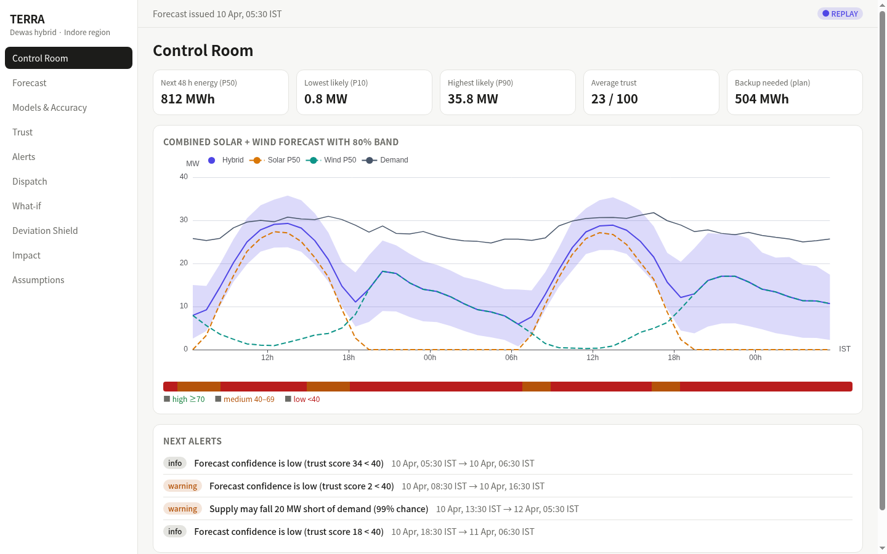
*Note: Values in this screenshot are from the replay run issued 2026-04-10 05:30 IST and will differ for other runs.*

### What You See
1. **Top KPI Row:**
   - **Next 48 h energy (P50)** (`MWh`): Expected total hybrid generation (median forecast) over the next 48 hours (e.g. `812 MWh`).
   - **Lowest likely (P10)** (`MW`): 10th percentile instantaneous power across the 48-hour window (e.g. `0.8 MW`), representing downside risk during calm night hours.
   - **Highest likely (P90)** (`MW`): 90th percentile instantaneous peak generation (e.g. `35.8 MW`), representing generation potential during peak solar hours.
   - **Average trust** (`/ 100`): Mean trust reliability score across all 48 hours (e.g. `23 / 100`).
   - **Backup needed (plan)** (`MWh`): Total deficit energy that the battery cannot fulfill under the linear program, requiring auxiliary backup power or grid purchases (e.g. `504 MWh`).
2. **Combined Solar + Wind Forecast with 80% Band (Chart):**
   - **Hybrid** (Solid purple curve with shaded band): Median total generation ($P_{50}$) surrounded by the calibrated 80% uncertainty envelope ($P_{10}$ to $P_{90}$).
   - **Solar P50** (Dashed orange curve): Median expected solar generation.
   - **Wind P50** (Dashed teal curve): Median expected wind generation.
   - **Demand** (Solid dark grey curve): 30 MW peak contracted off-taker demand profile.
   - **Trust Ribbon** (Horizontal strip beneath chart): Hour-by-hour color-coded reliability indicator:
     - Green: `high ≥70`
     - Amber: `medium 40–69`
     - Red: `low <40`
3. **Next Alerts (Card):**
   - Chronological summary list of the next unacknowledged alarms (up to 4), showing severity badges (`warning`, `info`, `critical`), message text, and IST validity windows.

### How to Use It
- Hover over any hour in the forecast chart to inspect exact values for Hybrid, Solar, Wind, and Demand in MW.
- Click legend items (**Hybrid**, **Solar P50**, **Wind P50**, **Demand**) to isolate individual components.
- Items in the **Next alerts** card provide a quick operational preview. To filter alerts by severity, inspect event history, or acknowledge active alarms, navigate to the [Alerts Center](#6-alerts-center-alerts) via the sidebar.

### How to Read It
- **Feasibility Assessment:** When the Hybrid curve exceeds the Demand curve, the plant is self-sufficient and charging the battery. When Demand lies above the Hybrid curve, observe whether the shaded $P_{90}$ upper band reaches Demand. If even $P_{90}$ falls short, backup dispatch is expected.
- **Trust Evaluation:** The Trust Score (0–100) measures expected forecast reliability relative to the validation error baseline ($\text{err\_ref}$, the 95th percentile of validation predicted error). Because scores are scaled relative to this reference, hours with wide quantile bands or high capacity naturally yield lower scores. On the replay run shown, the average trust across 48 hours is `23 / 100`.

> **Watch Out For:**  
> Solar $P_{50}$ is strictly 0.0 MW when the sun is down (`zenith >= 90°`). Sunset and sunrise times vary across seasons based on solar geometry; for instance, in early April, solar generation is zero between approximately 18:30 IST and 06:00 IST. During these night hours, hybrid generation is driven entirely by the 50 MW wind fleet.

### Suggested Workflow (Not Part of the App)
1. **Verify active run:** Check the top banner to confirm the issue timestamp of the current forecast (e.g. `Forecast issued 10 Apr, 05:30 IST`).
2. **Review energy & backup:** Check **Next 48 h energy (P50)** and **Backup needed (plan)** against off-taker schedule commitments.
3. **Inspect the Trust Ribbon:** Scan the strip beneath the forecast chart for red hours (< 40) where forecast uncertainty is elevated.
4. **Review alerts:** Check **Next alerts** for imminent threshold notices, and open the **Alerts** page to review details or acknowledge them.

---

## 3. Forecast Explorer (`/forecast`)

### Purpose
Enables detailed time-series inspection of individual renewable generation sources (Solar vs Wind), comparing actual historical output against model predictions across the held-out test split, and examining the upcoming 48-hour forecast.

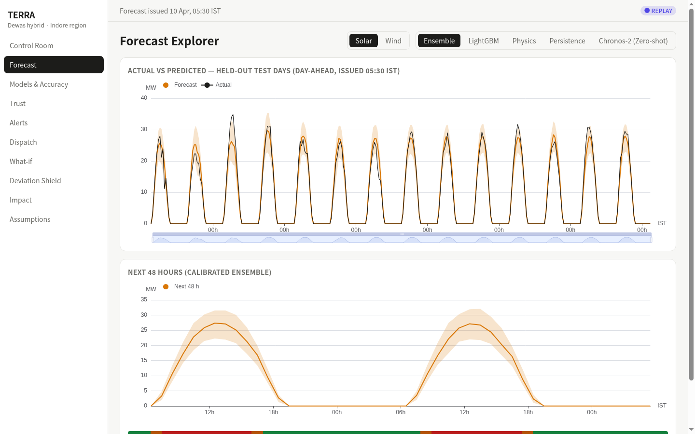
*Note: Values in this screenshot are from the replay run issued 2026-04-10 05:30 IST and will differ for other runs.*

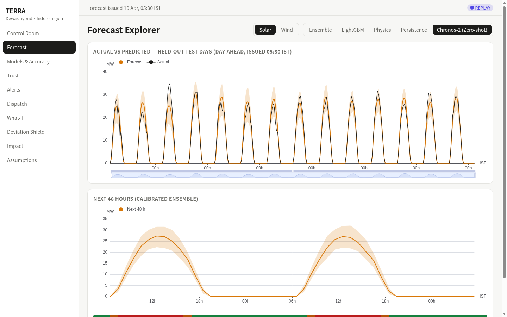
*Note: Values in this screenshot are from the replay run issued 2026-04-10 05:30 IST and will differ for other runs.*

### What You See
1. **Control Header:**
   - **Source Segmented Selector:** `Solar` | `Wind` (defaults to `Solar`).
   - **Model Segmented Selector:** `Ensemble` | `LightGBM` | `Physics` | `Persistence` | `Chronos-2 (Zero-shot)` (defaults to `Ensemble`).
2. **Actual vs Predicted — Held-Out Test Days (Top Chart):**
   - Shows day-ahead forecasts issued daily at 05:30 IST against true actual plant generation (`MW`).
   - Orange curve: Model forecast ($P_{50}$) with shaded 80% band ($P_{10}$–$P_{90}$).
   - Dark curve: Observed actual generation (`Actual`).
   - Interactive timeline slider: Drag handles at the base of the chart to zoom into specific weeks or weather periods.
3. **Next 48 Hours (Calibrated Ensemble) (Bottom Chart):**
   - Rolling operational outlook for the selected source over hours 1–48 ($P_{10}$, $P_{50}$, $P_{90}$) from the calibrated production ensemble.
   - Includes the hourly Trust Ribbon at the base of the card.

### How to Use It
- **Evaluate Foundation Models:** Toggle between **Ensemble** and **Chronos-2 (Zero-shot)** to evaluate how Amazon's deep pretrained probabilistic foundation model performs alongside the physics-guided LightGBM ensemble.
- **Analyze Physics Baseline:** Select **Physics** to observe the raw uncorrected output of `pvlib` or `windpowerlib` driven purely by numerical weather variables without machine-learning error correction.
- **Interactive Timeline Zoom:** Click and drag the bottom brush slider to expand any 7-day period.

### How to Read It
- In the top chart, tight tracking between the `Actual` line and `Forecast` line within the shaded envelope confirms calibration. Midday solar output clips at the 40 MW AC inverter capacity limit.
- In the Chronos-2 zero-shot view, observe how the foundation model captures diurnal cycles effectively while exhibiting different uncertainty interval characteristics due to being evaluated without site-specific training.

> **Watch Out For:**  
> `Chronos-2 (Zero-shot)` is evaluated on Kaggle GPUs (2× Tesla T4) as an external benchmark (ADR-013, ADR-014, ADR-016). It is not bundled in the default production serving pipeline to maintain a lightweight, zero-torch inference container.

---

## 4. Models & Accuracy (`/models`)

### Purpose
Provides transparent, auditable accuracy benchmarks comparing machine learning models against physical and statistical baselines across identical test-split data.

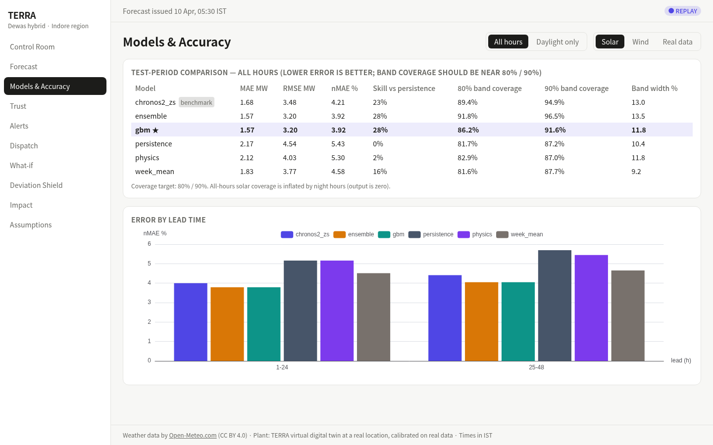
*Note: Values in this screenshot are from the replay run issued 2026-04-10 05:30 IST and will differ for other runs.*

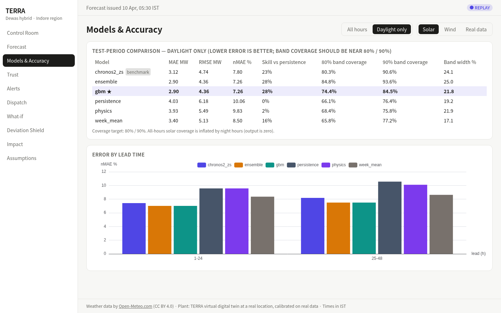
*Note: Values in this screenshot are from the replay run issued 2026-04-10 05:30 IST and will differ for other runs.*

### What You See
1. **Control Header:**
   - **Daylight Filter:** `All hours` | `Daylight only` (active when Solar is selected; defaults to `Daylight only`).
   - **Source Selector:** `Solar` | `Wind` | `Real data`.
2. **Test-Period Comparison (Table):**
   - **Model:** Name of model candidate (`ensemble`, `gbm ★`, `chronos2_zs [benchmark]`, `persistence`, `physics`, `week_mean`).
     - **Gold Star `★`:** Dynamically marks the candidate model with the lowest test-period MAE among deployable models (filtering out baseline `persistence` and external foundation models starting with `chronos2`).
     - **Benchmark Badge:** Models beginning with `chronos2` display a gray `benchmark` badge to indicate an external foundation model evaluated on Kaggle GPUs rather than an in-container model.
   - **MAE MW:** Mean Absolute Error in megawatts.
   - **RMSE MW:** Root Mean Squared Error in megawatts.
   - **nMAE %:** Normalized MAE as a percentage of plant rated capacity.
   - **Skill vs persistence:** Percentage error reduction over the naive day-ahead persistence baseline ($1 - \text{MAE}_{\text{model}} / \text{MAE}_{\text{pers}}$).
   - **80% band coverage:** Percentage of actual test hours falling within $P_{10}$–$P_{90}$ (nominal target: 80.0%).
   - **90% band coverage:** Percentage of actual test hours falling within $P_{05}$–$P_{95}$ (nominal target: 90.0%).
   - **Band width %:** Mean Prediction Interval Width normalized by plant capacity.
3. **Error by Lead Time (Bar Chart):**
   - Breaks down nMAE % across forecast lead buckets: **1–24 h** (Day 1) and **25–48 h** (Day 2).
4. **Real Data Results (Markdown Card):**
   - When **Real data** is selected, displays calibration tables and validation metrics against the Kaggle Gandikota solar SCADA dataset and CEA regional wind statistics.

### Verified Benchmark Tables (Test Split)

#### Solar Model Accuracy (Capacity: 40 MW AC)
| Model | View | MAE (MW) | RMSE (MW) | nMAE % | Skill vs Pers. | 80% Coverage | 90% Coverage | Band Width % |
|---|---|---|---|---|---|---|---|---|
| `gbm ★` | Daylight | **2.90** | **4.36** | **7.26%** | **+28%** | 74.4% | 84.5% | 21.8% |
| `ensemble` | Daylight | **2.90** | **4.36** | **7.26%** | **+28%** | 84.8% | 93.6% | 25.0% |
| `chronos2_zs` | Daylight | 3.12 | 4.74 | 7.80% | +23% | 80.3% | 90.6% | 24.1% |
| `week_mean` | Daylight | 3.40 | 5.13 | 8.50% | +16% | 65.8% | 77.2% | 17.1% |
| `physics` | Daylight | 3.93 | 5.49 | 9.83% | +2% | 68.4% | 75.8% | 21.9% |
| `persistence`| Daylight | 4.03 | 6.18 | 10.06% | 0% | 66.1% | 76.4% | 19.2% |
| `ensemble` | All hours | **1.57** | **3.20** | **3.92%** | **+28%** | 91.8% | 96.5% | 13.5% |

#### Wind Model Accuracy (Capacity: 50 MW)
| Model | MAE (MW) | RMSE (MW) | nMAE % | Skill vs Pers. | 80% Coverage | 90% Coverage | Band Width % |
|---|---|---|---|---|---|---|---|
| `gbm ★` | **3.99** | **5.96** | **7.98%** | **+38%** | 76.8% | 88.1% | 24.6% |
| `chronos2_zs` | 4.05 | **5.94** | 8.10% | +37% | 74.6% | 86.5% | 23.3% |
| `ensemble` | 4.15 | 6.10 | 8.31% | +36% | 72.6% | 86.1% | 21.2% |
| `physics` | 5.26 | 7.55 | 10.53% | +19% | 38.6% | 49.4% | 10.3% |
| `week_mean` | 6.37 | 8.90 | 12.74% | +2% | 43.1% | 55.5% | 15.4% |
| `persistence`| 6.47 | 9.52 | 12.94% | 0% | 52.0% | 63.9% | 16.3% |

### How to Read It
- **The "Solar Daylight" Difference:** In the **All hours** view, solar `ensemble` nMAE is **3.92%** (MAE 1.57 MW). When switching to **Daylight only**, nMAE is **7.26%** (MAE 2.90 MW). Quoting All hours includes zero-generation nighttime intervals that lower apparent error; Daylight only reflects operational generation hours.
- **Skill Score:** The Ensemble achieves **+28% skill** over persistence for Solar and **+36% skill** for Wind. A positive skill score indicates substantial value added by machine learning over naive persistence.

> **Watch Out For:**  
> On Wind, the standalone tuned LightGBM model (`gbm`) achieves a slightly lower overall MAE (3.99 MW vs 4.15 MW) than the `ensemble`, and Chronos-2 achieves the lowest wind RMSE (5.94 MW). As documented in the project decisions (ADR-015, `docs/report/report.md`), the wind ensemble weights (0.35 physics / 0.65 gbm for leads 1–24) were fitted via Nelder-Mead pinball loss minimization on the dry winter validation window (`val_fit`) and do not transfer cleanly to the monsoon-heavy test split where wind speed distributions and physics prior error dynamics shift.

---

## 5. Forecast Trust (`/trust`)

### Purpose
Exposes the inner workings of TERRA's Trust Engine, verifying whether the 0–100 reliability score correlates with actual forecasting error on held-out test data.

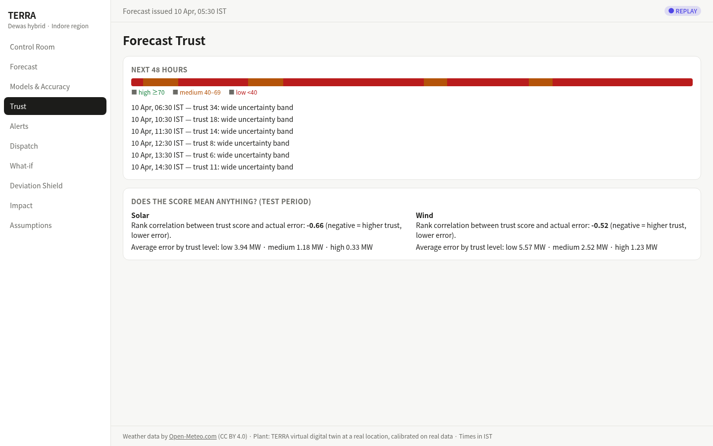
*Note: Values in this screenshot are from the replay run issued 2026-04-10 05:30 IST and will differ for other runs.*

### What You See
1. **Next 48 Hours Card:**
   - Full-width Trust Ribbon displaying the hourly color spectrum.
   - List of upcoming low-confidence hours ($< 40$) detailing the timestamp, trust score, and primary explanatory feature (up to 6 hours; e.g. `10 Apr, 12:30 IST — trust 8: wide uncertainty band`).
2. **Does the Score Mean Anything? (Test Period) Card:**
   - Statistical validation computed over 179 held-out test days:
     - **Solar Rank Correlation:** Spearman correlation between trust score and absolute error (e.g. **-0.66**).
     - **Solar Error by Trust Level:** Average MAE for Low (`3.94 MW`), Medium (`1.18 MW`), and High (`0.33 MW`).
     - **Wind Rank Correlation:** Spearman correlation (e.g. **-0.52**).
     - **Wind Error by Trust Level:** Average MAE for Low (`5.57 MW`), Medium (`2.52 MW`), and High (`1.23 MW`).

### How to Use It
- Check the trust explanation for upcoming red hours to understand which factor dominates:
  - `wide uncertainty band`: The predicted quantile spread $(P_{90} - P_{10}) / \text{capacity}$ is broad.
  - `models disagree`: Physics prior and gradient-boosted trees predict diverging generation levels.
  - `far-ahead hour`: Lead-time uncertainty penalty toward the end of the 48-hour horizon ($L/48$).
  - `recent forecasts were off`: Rolling 7-day error feedback indicates elevated recent discrepancy.

### How to Read It
- **Negative Spearman Correlation:** The negative sign ($-0.66$ solar, $-0.52$ wind) confirms that **higher trust scores correspond to lower actual errors**.
- **Monotonic Error Progression:** In solar, high-trust hours have an average error of only 0.33 MW, while low-trust hours experience 3.94 MW of error—a **12× error separation**. This demonstrates that the score provides an informative operational indicator.

---

## 6. Alerts Center (`/alerts`)

### Purpose
A centralized alarm management dashboard that aggregates probabilistic threshold warnings into merged time windows to prevent operator alert fatigue.

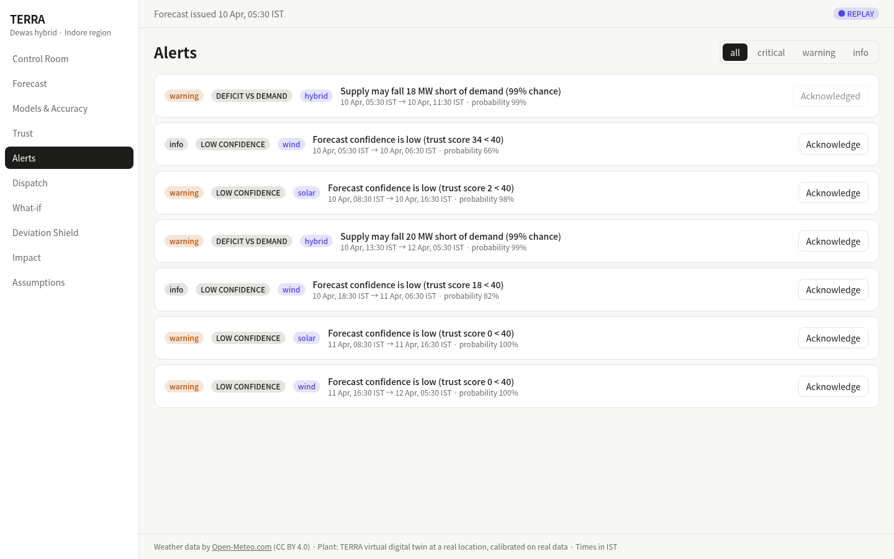
*Note: Values in this screenshot are from the replay run issued 2026-04-10 05:30 IST and will differ for other runs.*

### What You See
1. **Severity Filter Selector:** `all` | `critical` | `warning` | `info`
2. **Alert Cards List:**
   - **Severity Badge:** `critical` (red), `warning` (amber), `info` (grey).
   - **Type Badge:** `LOW GENERATION`, `HIGH GENERATION`, `RAMP`, `DEFICIT VS DEMAND`, `LOW CONFIDENCE`.
   - **Source Badge:** `hybrid`, `solar`, `wind`.
   - **Operational Details:** Event description, IST start and end times, and probability percentage (e.g. `probability 99%`).
   - **Acknowledge Button:** Displays `Acknowledge` (or `Acknowledged` when already acknowledged).

### Verified Alert Thresholds (Learned from Training Split)
To eliminate arbitrary guesswork, thresholds are learned strictly from the training data distribution (ADR-010):

| Source | Alert Type | Basis | Learned Threshold | Precision | Recall | Alert Hours | Event Hours |
|---|---|---|---|---|---|---|---|
| **Solar** | `LOW_GENERATION` | Training P10 (daylight) | 2.11 MW | 0.995 | 0.793 | 200 h | 251 h |
| **Solar** | `HIGH_GENERATION` | Training P90 (daylight) | 28.95 MW | 0.775 | 0.186 | 80 h | 333 h |
| **Wind** | `LOW_GENERATION` | Training P25 (calm) | 1.14 MW | 0.753 | 0.218 | 162 h | 559 h |
| **Wind** | `HIGH_GENERATION` | Training P90 | 18.21 MW | 0.746 | 0.366 | 331 h | 675 h |
| **Hybrid**| `LOW_GENERATION` | Training P10 | 1.68 MW | 0.708 | 0.221 | 72 h | 231 h |
| **Hybrid**| `HIGH_GENERATION` | Training P90 | 31.70 MW | 0.848 | 0.453 | 374 h | 700 h |

### Severity Scoring Formula
Severity is calculated as a composite score of probability $p$ and magnitude normalized by plant capacity $C$ (`_severity()` in `ml/terra/engines/alerts.py`):

$$s = p \cdot \left(0.5 + \frac{\text{magnitude}}{C}\right)$$

- **`critical`**: $s \ge 0.90$
- **`warning`**: $0.55 \le s < 0.90$
- **`info`**: $s < 0.55$

---

## 7. Battery Dispatch Advisor (`/dispatch`)

### Purpose
Translates 48-hour generation forecasts into an optimal battery dispatch plan, minimizing backup generation fuel costs and curtailment while managing battery throughput wear.

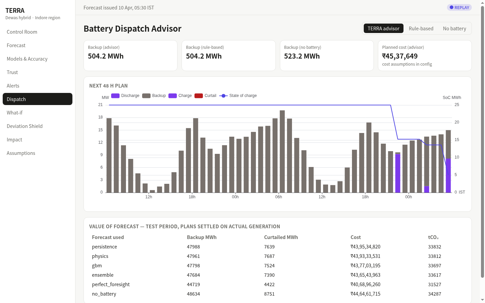
*Note: Values in this screenshot are from the replay run issued 2026-04-10 05:30 IST and will differ for other runs.*

### What You See
1. **Strategy Selector:** `TERRA advisor` | `Rule-based` | `No battery`
2. **Strategy KPI Row:**
   - **Backup (advisor)** (`MWh`): Backup energy required under LP optimization (e.g. `504.2 MWh`).
   - **Backup (rule-based)** (`MWh`): Backup required under greedy heuristic logic (e.g. `504.2 MWh`).
   - **Backup (no battery)** (`MWh`): Unbuffered backup required if no BESS is installed (e.g. `523.2 MWh`).
   - **Planned cost (advisor)** (`INR`): Total estimated dispatch cost over 48 hours formatted in Indian Lakhs (e.g. `₹45,37,649`).
3. **Next 48 H Plan (Chart):**
   - **Stacked Bar Flows:**
     - Purple bars ($>0$): **Discharge** (battery supplying grid power).
     - Grey bars ($>0$): **Backup** (diesel/gas generators or grid import).
     - Blue bars ($<0$): **Charge** (excess solar/wind stored into battery).
     - Red bars ($<0$): **Curtail** (unusable excess spilled due to full battery).
   - **Line (Right Axis):** **State of charge** (`SoC MWh`), bounded between 5 MWh (10% minimum buffer) and 45 MWh (90% maximum buffer).
4. **Value of Forecast — Test Period Table:**
   - Settles day-ahead plans against *actual historical generation* across all 179 test days:
     - Columns in UI: `Forecast used`, `Backup MWh`, `Curtailed MWh`, `Cost`, `tCO₂`.

### Value of Forecast Benchmark (Day-Ahead Plans Settled on Actuals)
| Strategy | Backup MWh | Curtailed MWh | Dispatch Cost (INR) | Carbon Emissions (tCO₂) | Battery Throughput (MWh)* |
|---|---|---|---|---|---|
| `persistence` | 47,988.4 | 7,639.0 | ₹43,95,34,820 | 33,831.8 | 9,241.4 |
| `physics` | 47,960.8 | 7,686.6 | ₹43,93,33,531 | 33,812.3 | 7,812.3 |
| `gbm` | 47,797.7 | 7,523.6 | ₹43,77,03,195 | 33,697.4 | 7,811.6 |
| `ensemble` | **47,683.8** | **7,390.1** | **₹43,65,43,963** | **33,617.1** | **8,181.1** |
| `perfect_foresight`| 44,719.3 | 4,422.4 | ₹40,68,96,260 | 31,527.1 | 8,244.2 |
| `no_battery` | 48,634.5 | 8,751.5 | ₹44,64,61,715 | 34,287.3 | 0.0 |

*\*Battery throughput is tracked in the underlying evaluation report (`docs/engine-results.md`), while the UI table displays the primary five operational columns.*

---

## 8. What-If Simulator (`/whatif`)

### Purpose
An interactive scenario sandbox that allows plant managers and grid operators to evaluate plant performance under parametric weather adjustments and explore battery sizing changes.

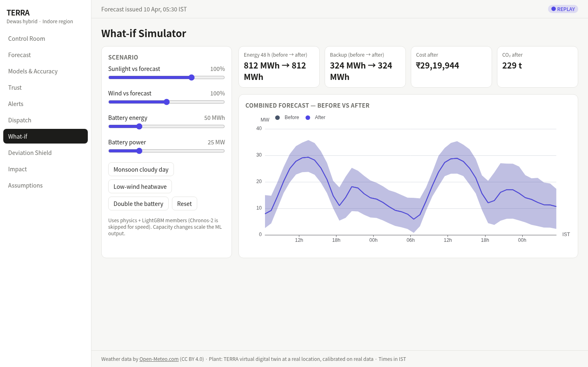
*Note: Values in this screenshot are from the replay run issued 2026-04-10 05:30 IST and will differ for other runs.*

### What You See
1. **Scenario Control Card (Left Column):**
   - **Sunlight vs forecast** slider: Adjust solar irradiance scale from 20% to 130% (step 5%).
   - **Wind vs forecast** slider: Adjust wind speed scale from 50% to 150% (step 5%).
   - **Battery energy** slider: Scale storage capacity from 0 to 200 MWh (step 10 MWh).
   - **Battery power** slider: Scale inverter rating from 0 to 100 MW (step 5 MW).
   - **Preset Buttons:**
     - `Monsoon cloudy day`: Sunlight 45%, Wind 120%.
     - `Low-wind heatwave`: Sunlight 105%, Wind 60%.
     - `Double the battery`: 50 MW power, 100 MWh energy.
     - `Reset`: Returns irradiance and wind sliders to baseline (100%, 100%).
2. **KPI Comparison Row (Right Column):**
   - **Energy 48 h (before → after)**: Total median generation transition (e.g. `812 MWh → 812 MWh`).
   - **Backup (before → after)**: Required backup energy transition (e.g. `324 MWh → 324 MWh`).
   - **Cost after**: Scenario dispatch cost in INR (e.g. `₹29,19,944`).
   - **CO₂ after**: Carbon emissions under the scenario (e.g. `229 t`).
3. **Combined Forecast — Before vs After (Chart):**
   - Dark grey curve with band: Baseline forecast (**Before**).
   - Purple curve with band: Scenario forecast (**After**).

### How to Use It
- Click **Monsoon cloudy day** to simulate reduced solar irradiance and increased wind speed.
- Click **Double the battery** to evaluate whether expanding BESS capacity to 100 MWh reduces backup requirements.
- Sliders send debounced requests (400 ms) to `POST /whatif`.

> **Technical Note:**  
> The What-If engine evaluates using physics and LightGBM models. Chronos-2 is bypassed during interactive slider manipulation to ensure instant UI responsiveness.

---

## 9. Deviation Shield (`/deviation`)

### Purpose
Assesses exposure under India's Deviation Settlement Mechanism (CERC DSM 2024 regulations) by identifying the cost-optimal schedule quantile and exporting 96-block 15-minute schedules.

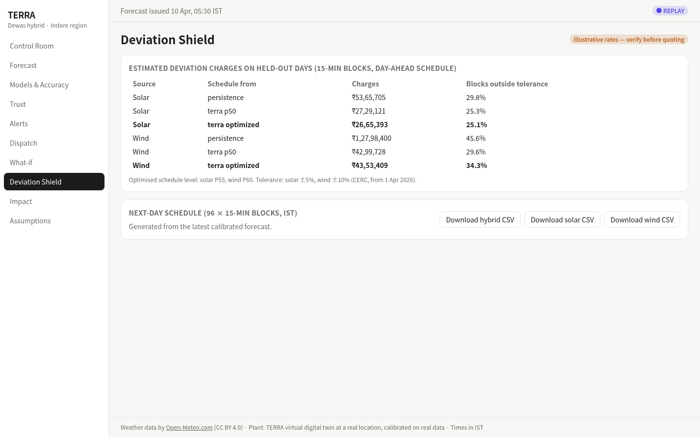
*Note: Values in this screenshot are from the replay run issued 2026-04-10 05:30 IST and will differ for other runs.*

### What You See
1. **Header Badge:**
   - `Illustrative rates — verify before quoting`: Notice indicating financial penalty tariffs in config are illustrative placeholders.
2. **Estimated Deviation Charges Table:**
   - Evaluated across all 15-minute blocks over the 179-day test period:
     - **Source:** `Solar` | `Wind`
     - **Schedule from:** `persistence` | `terra p50` | `terra optimized`
     - **Charges:** Total accrued penalty in INR.
     - **Blocks outside tolerance:** Percentage of 15-minute intervals exceeding regulatory limits ($\pm 5\%$ solar, $\pm 10\%$ wind).
3. **Optimized Quantile Footnote:**
   - Displays the quantile selected by grid search on validation data: `Optimised schedule level: solar P55, wind P60. Tolerance: solar ±5%, wind ±10% (CERC, from 1 Apr 2026).`
4. **Next-Day Schedule (96 × 15-Min Blocks, IST) Card:**
   - Download buttons:
     - `Download hybrid CSV` (`terra_schedule_hybrid.csv`)
     - `Download solar CSV` (`terra_schedule_solar.csv`)
     - `Download wind CSV` (`terra_schedule_wind.csv`)

### Verified Deviation Settlement Backtest (Test Split)
| Source | Schedule Strategy | Deviation Penalty (INR) | Blocks Outside Tolerance (%) |
|---|---|---|---|
| **Solar** | `persistence` | ₹53,65,705 | 29.8% |
| **Solar** | `terra_p50` | ₹27,29,121 | 25.3% |
| **Solar** | `terra_optimized` | **₹26,65,393** | **25.1%** |
| **Wind** | `persistence` | ₹1,27,98,400 | 45.6% |
| **Wind** | `terra_p50` | **₹42,99,728** | **29.6%** |
| **Wind** | `terra_optimized` | ₹43,53,409 | 34.3% |

---

## 10. Impact (`/impact`)

### Purpose
Quantifies the carbon abatement, backup fuel reduction, and cost savings associated with TERRA forecast-guided dispatch, providing a scaling tool to extrapolate benefits across larger fleets.

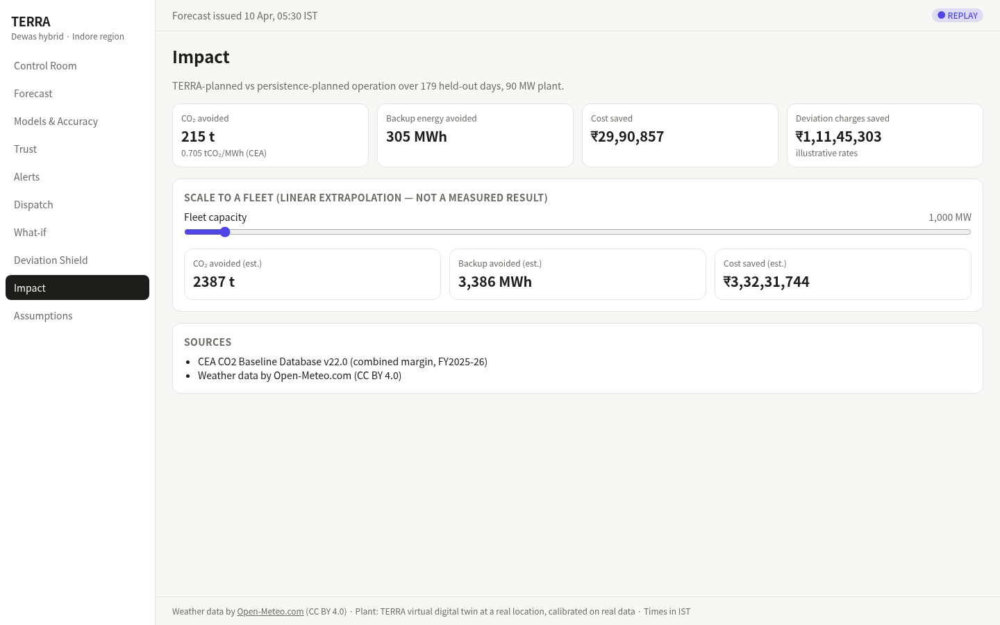
*Note: Values in this screenshot are from the replay run issued 2026-04-10 05:30 IST and will differ for other runs.*

### What You See
1. **Subtitle:**
   - Details baseline comparison: `TERRA-planned vs persistence-planned operation over 179 held-out days, 90 MW plant.`
2. **Verified Test-Period KPIs:**
   - **CO₂ avoided** (`t`): Net carbon emissions abated (e.g. `215 t`). Subtitle cites `0.705 tCO₂/MWh (CEA)`.
   - **Backup energy avoided** (`MWh`): Auxiliary generation avoided (e.g. `305 MWh`).
   - **Cost saved** (`INR`): Operational expenditure saved on fuel and battery optimization (e.g. `₹29,90,857`).
   - **Deviation charges saved** (`INR`): Regulatory penalties avoided under CERC rules with illustrative tariffs (e.g. `₹1,11,45,303`).
3. **Scale to a Fleet (Linear Extrapolation) Card:**
   - **Fleet capacity slider:** Adjust hypothetical portfolio size from 100 MW to 20,000 MW (default: `1,000 MW`).
   - **Scaled KPIs:**
     - **CO₂ avoided (est.)** (e.g. `2387 t`)
     - **Backup avoided (est.)** (e.g. `3,386 MWh`)
     - **Cost saved (est.)** (e.g. `₹3,32,31,744`)
4. **Sources Card:**
   - Formal references: CEA CO₂ Baseline Database v22.0 (combined margin, FY2025-26) and Open-Meteo CC BY 4.0.

### How to Use It
- Adjust the **Fleet capacity** slider to model corporate decarbonization targets or illustrate potential benefits across regional portfolios.

> **Caution:**  
> The fleet scaling section is explicitly labeled *(linear extrapolation — not a measured result)*. It assumes identical atmospheric conditions and capacity factors across all sites.

---

## 11. Assumptions & Data (`/assumptions`)

### Purpose
Provides scientific and regulatory transparency, rendering Markdown technical documentation directly from the backend.

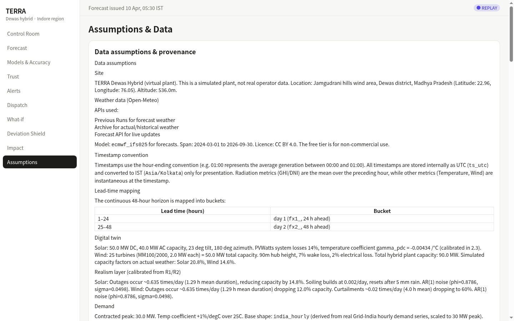
*Note: Values in this screenshot are from the replay run issued 2026-04-10 05:30 IST and will differ for other runs.*

### What You See
Three expandable scientific audit cards:
1. **Data assumptions & provenance:** Site coordinates (22.96° N, 76.05° E, 536 m elevation), weather models used (`ecmwf_ifs025`), solar tilt/azimuth ($23^\circ$ tilt, $180^\circ$ south), wind turbine specifications (25 × 2.0 MW MM100/2000 turbines, 90 m hub height), battery parameters (25 MW / 50 MWh, 90% round-trip efficiency), and realism noise layers.
2. **Calibration on real data:** Parameter tuning against Kaggle Gandikota solar SCADA, wind turbine datasets, and CEA regional capacity factors.
3. **Results on real generation data:** Backtest evaluation of TERRA models on real operational solar SCADA data.

---

# Part 2: Reference for Technical Analysts & Power Engineers

## 12. Reading the Numbers & Uncertainty Quantiles

TERRA produces non-parametric predictive distributions represented by 5 quantiles:

$$\mathbf{q} = [P_{05}, P_{10}, P_{50}, P_{90}, P_{95}]$$

| Quantile | Plain Meaning | Operational Role |
|---|---|---|
| **P05** | 5% chance generation is lower; 95% chance generation is higher. | Deep tail downside risk; extreme shortfall planning. |
| **P10** | 10% chance generation is lower; 90% chance generation is higher. | Conservative base for firm day-ahead power commitments. |
| **P50** | Median forecast: 50% chance generation is higher or lower. | Expected energy yield; baseline for dispatch planning. |
| **P90** | 90% chance generation is lower; 10% chance generation is higher. | Upside ceiling; headroom check for battery charging and curtailment. |
| **P95** | 95% chance generation is lower; 5% chance generation is higher. | Deep tail upside; interconnection headroom check. |

### Prediction Intervals & Coverage
- **80% Uncertainty Band:** Spans $P_{10}$ to $P_{90}$. Nominally, 80% of observed actual generation values should fall inside this envelope.
- **90% Uncertainty Band:** Spans $P_{05}$ to $P_{95}$. Nominally, 90% of observed actual generation values should fall inside this envelope.

> **Honest Caveat on Conformal Coverage (PICP):**  
> Under Conformalized Quantile Regression (CQR), formal mathematical coverage guarantees require that calibration data and test data are *exchangeable* (drawn from the same distribution). In TERRA:
> - The calibration set (`val_cal`) covers the dry winter window (January – March 2026).
> - The held-out test set (`test`) covers the monsoon-heavy window (April – September 2026).
> 
> Due to seasonal atmospheric shift (dense monsoon clouds and high ridge wind speeds), observed coverage on the test split is **72.6% for the 80% band** and **83.3% for the 90% band** on hybrid generation. TERRA reports empirical coverage transparently rather than artificially inflating intervals.

---

## 13. Copula Modeling for Hybrid Solar-Wind Uncertainty

Because solar and wind generation are physically coupled by regional weather systems, their uncertainty cannot be treated as independent. Adding quantiles directly would overestimate combined volatility. In `ml/terra/engines/hybrid.py`, TERRA models joint solar-wind generation using a **Gaussian copula** fitted on Probability Integral Transform (PIT) residuals separately for day and night hours:

1. **Probability Integral Transform (PIT):** For each source, actual values $y$ are mapped through piecewise-linear empirical quantile functions to uniform variables $u \in [0, 1]$.
2. **Day vs Night Correlation:**
   - **Night Hours (`cal_is_day == 0` / zenith $\ge 90^\circ$):** Solar generation is identically zero ($y_{\text{sol}} \equiv 0$). The correlation is set to $\rho = 0.0$, and hybrid quantiles collapse to wind quantiles.
   - **Daylight Hours (`cal_is_day == 1` / zenith $< 90^\circ$):** Standard normal scores $z_{\text{sol}} = \Phi^{-1}(u_{\text{sol}})$ and $z_{\text{win}} = \Phi^{-1}(u_{\text{win}})$ yield an empirical Gaussian copula correlation:
     $$\rho_{\text{copula}} = -0.0582$$
3. **Joint Sampling:** At inference time, $n=1000$ correlated bivariate normal draws are generated:
   $$z_1 \sim \mathcal{N}(0, 1), \quad z_2 = \rho \cdot z_1 + \sqrt{1 - \rho^2} \cdot e, \quad e \sim \mathcal{N}(0, 1)$$
   The uniform draws $u_1 = \Phi(z_1)$ and $u_2 = \Phi(z_2)$ are mapped through each source's inverse quantile function, added, and sorted to extract the hybrid quantiles $[P_{05}, P_{10}, P_{50}, P_{90}, P_{95}]$.

---

## 14. Evaluation Metrics Reference

All metrics reported in the dashboard are computed strictly by the automated evaluation harness (`ml/terra/eval/metrics.py`). No numbers are hand-typed.

| Metric | Plain Definition | Mathematical Formula | Units | Better Is |
|---|---|---|---|---|
| **MAE** | Mean Absolute Error; average magnitude of forecast errors. | $\frac{1}{N}\sum \|y_t - \hat{y}_t\|$ | MW | Lower |
| **RMSE** | Root Mean Squared Error; penalizes large outlier errors quadratically. | $\sqrt{\frac{1}{N}\sum (y_t - \hat{y}_t)^2}$ | MW | Lower |
| **nMAE %** | Normalized MAE; error expressed as a percentage of plant capacity. | $\frac{\text{MAE}}{\text{Capacity}_{\text{plant}}} \times 100$ | % | Lower |
| **Bias** | Mean signed error; indicates systematic over- or under-forecasting. | $\frac{1}{N}\sum (\hat{y}_t - y_t)$ | MW | Near 0 |
| **Pinball Loss** | Asymmetric loss function evaluating quantile calibration at target $\tau$. | $\frac{1}{N}\sum \max(\tau(y_t - q_\tau), (1-\tau)(q_\tau - y_t))$ | MW | Lower |
| **PICP** | Prediction Interval Coverage Probability; empirical band coverage. | $\frac{1}{N}\sum \mathbb{I}(y_t \in [q_{\text{low}}, q_{\text{high}}])$ | Fraction / % | Near Target (80%/90%) |
| **MPIW %** | Mean Prediction Interval Width; sharpness of uncertainty envelope. | $\frac{1}{N\cdot \text{Cap}}\sum (q_{90,t} - q_{10,t}) \times 100$ | % | Lower (for same PICP) |
| **Skill Score** | Percentage error reduction compared to naive Day-Ahead Persistence. | $1 - \frac{\text{MAE}_{\text{model}}}{\text{MAE}_{\text{persistence}}}$ | % / Fraction | Higher |

---

## 15. Time, Energy, & Currency Conventions

### Time Conventions
- **Internal Storage:** All timestamps in Parquet datasets, SQLite databases, and API payloads are stored in tz-aware UTC (`ts_utc`), formatted as ISO 8601 strings (e.g. `2026-04-10T00:00:00Z`).
- **Presentation Display:** The frontend converts all timestamps to Indian Standard Time (`Asia/Kolkata`, UTC +05:30) immediately prior to display.
- **Hour-Ending Convention:** Timestamps represent the *conclusion* of the hourly integration period. For example, `10 Apr, 06:00 IST` denotes generation over the interval 05:00 to 06:00 IST.

### Power vs Energy Units
- **Power (MW):** Instantaneous rate of electricity generation or demand (plant capacity: 40 MW AC solar, 50 MW wind, 25 MW battery inverter).
- **Energy (MWh):** Electricity produced or consumed over time. Over a 1-hour block, 1 MW of power equals 1 MWh of energy. Over a 15-minute block, 1 MW equals 0.25 MWh.

### Indian Financial Conventions
Currency figures are formatted using the standard Indian numbering system:
- **1 Lakh (₹1,00,000):** One hundred thousand rupees.
- **1 Crore (₹1,00,00,000):** Ten million rupees (100 Lakhs).

---

## 16. System Modes: Replay vs Live

| Dimension | Replay Mode (`REPLAY`) | Live Mode (`LIVE`) |
|---|---|---|
| **Data Source** | Archived ECMWF IFS forecasts & actuals from held-out test split. | Real-time Open-Meteo API queries for Jamgudrani ridge. |
| **Issue Time** | Advances deterministically through historical test dates (e.g. `2026-04-10 05:30 IST`). | Current wall-clock issue time (00:00, 06:00, 12:00, or 18:00 UTC). |
| **Evaluation** | Ground-truth actual generation is known, enabling backtest metrics. | Actual generation is observed progressively hour by hour. |
| **Intended Use** | Evaluation, stress-testing, operator training. | Operational plant dispatch and scheduling workflows. |

---

## 17. Model Fleet Architecture

TERRA implements a 5-tier model fleet adhering to leak-free temporal framing:

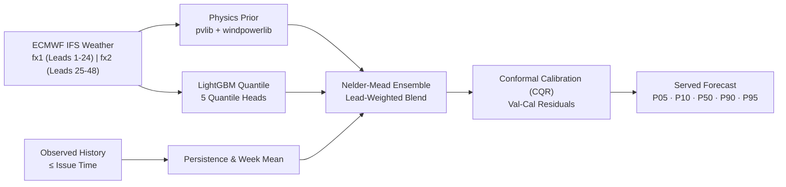

1. **Day-Ahead Persistence (`persistence`):** Baseline assuming generation today equals generation at the same hour yesterday ($y_t = y_{t-24}$).
2. **Week Mean Baseline (`week_mean`):** Averages generation observed at the same hour over the preceding 7 observed days ($y_t = \frac{1}{7}\sum_{k=1}^7 y_{t-24k}$).
3. **Physics Twin Prior (`physics`):** Physical simulation executing `pvlib` (Hay-Davies transposition, Sandia cell temperature, PVWatts DC/AC conversion) and `windpowerlib` (Hellmann wind profile shear, 2 MW power curves, wake derating).
4. **Quantile Gradient Boosted Trees (`gbm`):** LightGBM regressor training 5 separate quantile trees ($P_{05}, P_{10}, P_{50}, P_{90}, P_{95}$) with pinball loss objectives, tuned via Optuna on a temporal holdout inside the training data (ADR-015), using leak-free forecast weather features (`fx*`), solar angles (`cal*`), and pre-issue generation history.
5. **Calibrated Ensemble (`ensemble`):** Production served model. Blends member predictions with lead-dependent weights fitted via Nelder-Mead optimization on validation data, followed by Conformalized Quantile Regression (CQR) interval adjustment.
6. **Chronos-2 Zero-Shot (`chronos2_zs`):** Amazon's pretrained probabilistic foundation model evaluated on Kaggle GPUs (2× Tesla T4) across 68,928 rows per source as an external benchmark (ADR-013, ADR-014, ADR-016).

---

## 18. Linear Programming Formulation for Battery Dispatch

The Battery Dispatch Advisor formulates dispatch planning over the 48-hour planning horizon ($T=48$) as a Linear Program (LP) solved using SciPy's HiGHS solver (`scipy.optimize.linprog(method="highs")`, implemented in `ml/terra/engines/dispatch.py`):

### Decision Variables ($5T$ total variables)
For each hour $t = 1 \dots T$:
- $P_{\text{chg}, t} \ge 0$: Battery charging power (MW)
- $P_{\text{dis}, t} \ge 0$: Battery discharging power (MW)
- $\text{SoC}_t$: Battery state of charge (MWh)
- $P_{\text{backup}, t} \ge 0$: Auxiliary backup power (MW)
- $P_{\text{curtail}, t} \ge 0$: Curtailed surplus generation (MW)

### Objective Function
Minimize total dispatch and penalty costs:

$$\min \sum_{t=1}^T \Big( \frac{c_{\text{deg}}}{2} \cdot P_{\text{chg}, t} + \frac{c_{\text{deg}}}{2} \cdot P_{\text{dis}, t} + c_{\text{backup}} \cdot P_{\text{backup}, t} + c_{\text{curtail}} \cdot P_{\text{curtail}, t} \Big)$$

Where cost coefficients are loaded from `config/site.yaml`:
- $c_{\text{deg}} = ₹300/\text{MWh}$ (battery cell throughput degradation, split as $₹150/\text{MWh}$ on charging and $₹150/\text{MWh}$ on discharging so a 1 MWh full throughput cycle costs ₹300)
- $c_{\text{backup}} = ₹9,000/\text{MWh}$ (auxiliary diesel/gas fuel purchase)
- $c_{\text{curtail}} = ₹1,000/\text{MWh}$ (lost green attribute / curtailment penalty)

*(Note: The degradation term in the objective penalizes unnecessary battery cycling; reported dispatch cost in the KPI row reflects $P_{\text{backup}} \cdot c_{\text{backup}} + P_{\text{curtail}} \cdot c_{\text{curtail}}$.)*

### Constraints
1. **Power Balance at Each Hour $t$:**
   $$P_{\text{gen}, t} - P_{\text{curtail}, t} - P_{\text{chg}, t} + P_{\text{dis}, t} + P_{\text{backup}, t} = D_t$$
   Where $D_t$ is contracted off-taker demand and $P_{\text{gen}, t}$ is the median forecast ($P_{50}$).
2. **Battery State of Charge Dynamics:**
   $$\text{SoC}_t = \text{SoC}_{t-1} + \eta \cdot P_{\text{chg}, t} \cdot \Delta t - \frac{1}{\eta} \cdot P_{\text{dis}, t} \cdot \Delta t$$
   With $\Delta t = 1\text{ h}$ and one-way efficiency $\eta = \sqrt{\eta_{\text{rt}}} = \sqrt{0.90} \approx 0.9487$.
3. **Power and Storage Bounds:**
   $$0 \le P_{\text{chg}, t} \le P_{\text{max}} = 25\text{ MW}, \quad 0 \le P_{\text{dis}, t} \le P_{\text{max}} = 25\text{ MW}$$
   $$0 \le P_{\text{curtail}, t} \le P_{\text{gen}, t}, \quad P_{\text{backup}, t} \ge 0$$
   $$\min(\text{SoC}_{\text{min}} + \text{reserve}_t, \text{SoC}_{\text{max}}) \le \text{SoC}_t \le \text{SoC}_{\text{max}}$$
   Where $\text{SoC}_{\text{min}} = 5\text{ MWh}$ (10%), $\text{SoC}_{\text{max}} = 45\text{ MWh}$ (90%), and $\text{reserve}_t = \min(1.0 \cdot (P_{50, t+1} - P_{10, t+1}), \text{SoC}_{\text{max}} - \text{SoC}_{\text{min}})$ provides a buffer against the next hour's low-generation shortfall. If the reserve constraint proves infeasible, the solver falls back to standard $[5, 45]\text{ MWh}$ bounds.

---

## 19. Indian Grid Regulations & CERC DSM Settlement Rules

Under the Central Electricity Regulatory Commission (Deviation Settlement Mechanism and Related Matters) Regulations 2024 (with X-factor order effective 1 April 2026), wind and solar generators are subject to deviation accounting between scheduled generation ($S_b$) and actual metered injection ($A_b$) across 15-minute time blocks ($b=1 \dots 96$).

### Percentage Deviation Formula
In `ml/terra/engines/dsm.py`:

$$\text{Dev}\%_b = \frac{A_b - S_b}{\text{denom}_b} \times 100$$

$$\text{denom}_b = X \cdot \text{AvC}_b + (1 - X) \cdot S_b$$

Where $\text{AvC}_b$ is Available Capacity. For FY2026-27, the regulatory $X\text{-factor} = 1.0$, making the denominator equal to Available Capacity.

### Regulatory Tolerance Bands
- **Solar PV / Hybrid:** $\pm 5.0\%$ of Available Capacity.
- **Wind:** $\pm 10.0\%$ of Available Capacity.

### Deviation Penalty Calculation
Within the tolerance band, deviation incurs zero penalty surcharge. Outside the tolerance band, the deviation percentage beyond tolerance is:

$$\text{beyond}\% = \max(|\text{Dev}\%_b| - \text{tol}, 0.0)$$

Penalty charges apply to the energy beyond tolerance ($\Delta E_{\text{beyond}} = \frac{\text{beyond}\%}{100} \cdot \text{denom}_b \cdot 0.25\text{ h} \times 1000\text{ kWh/MWh}$).

### Slabs (Illustrative Placeholders in `config/dsm.yaml`)
Under statutory CERC DSM 2024 regulations, deviation charges are computed as a percentage of the generator's PPA Contract Rate (CR). Because contract rates vary by commercial power purchase agreement, `config/dsm.yaml` uses illustrative fixed INR/kWh rates (`illustrative: true`):
- **Slab 1 (Beyond tolerance up to 10% beyond tol):** ₹0.50 / kWh
- **Slab 2 (Between 10% and 20% beyond tol):** ₹1.00 / kWh
- **Slab 3 (Beyond 20% beyond tol):** ₹1.50 / kWh

> **Illustrative Caveat:**  
> These rupee rates are placeholder tariffs modeled to demonstrate asymmetric penalty mechanics. Plant commercial teams must update `config/dsm.yaml` with applicable MPERC/CERC tariff orders before executing binding commercial settlements.

---

## 20. Technical Glossary (A–Z)

- **Available Capacity (AvC):** Cumulative capacity of operating wind turbines and solar inverters declared capable of generating power for a dispatch interval.
- **BESS:** Battery Energy Storage System. In TERRA: 25 MW power rating, 50 MWh capacity, lithium-ion chemistry.
- **Capacity Factor (CF):** Ratio of actual energy output over a period to theoretical maximum output at full rated capacity.
- **CERC:** Central Electricity Regulatory Commission. National grid regulatory authority in India.
- **CQR (Conformalized Quantile Regression):** Distribution-free calibration using validation residuals to adjust predicted quantiles to achieve empirical coverage targets.
- **Curtailment:** Reduction in renewable generation below available potential, triggered by transmission limits or full battery storage.
- **Deviation Settlement Mechanism (DSM):** Commercial framework penalizing differences between scheduled grid injection and actual metered delivery.
- **Hour-Ending:** Convention where a timestamp labels the conclusion of the 60-minute integration period.
- **MPIW (Mean Prediction Interval Width):** Average width between upper and lower quantile bands, measuring forecast sharpness.
- **nMAE (Normalized Mean Absolute Error):** MAE divided by plant capacity, expressed as a percentage.
- **NNLS (Non-Negative Least Squares):** Constrained regression ensuring all model feature weights remain non-negative ($\ge 0$). Used in the Trust Engine.
- **NWP (Numerical Weather Prediction):** Numerical atmospheric simulation (e.g. ECMWF IFS).
- **PICP (Prediction Interval Coverage Probability):** Measured percentage of actual observations falling inside an uncertainty interval.
- **QCA (Qualified Coordinating Agency):** Entity authorized to aggregate forecasting, scheduling, and commercial settlement for renewable plants in India.
- **Ramp Rate:** Rate of change of generation over time (MW/h).
- **RLDC / SLDC:** Regional / State Load Despatch Centre. Operational authorities directing grid dispatch in India.
- **Skill Score:** Relative improvement of a forecasting model compared to a baseline ($1 - \text{Error}_{\text{model}} / \text{Error}_{\text{baseline}}$).
- **SoC (State of Charge):** Available energy in a battery expressed as a fraction or percentage of total storage capacity.
- **X-Factor:** Parameter in CERC DSM regulations weighting Available Capacity in the deviation denominator (set to 1.0 for FY2026-27).

---

## 21. Troubleshooting & FAQ

### Q1: The browser displays "The API is waking up...". What should I do?
**Answer:** Wait 30–60 seconds. The backend is hosted on Render's free tier, which puts idle containers to sleep. The frontend automatically retries with exponential backoff up to 12 attempts. Do not refresh the page, as refreshing resets the retry counter.

### Q2: Why are all cards displaying "—" (dashes)?
**Answer:** The frontend is waiting for initial API query resolution. If dashes persist beyond 90 seconds, check your network connection or verify whether the backend URL (`terra-api-bpm6.onrender.com/health`) responds with `{"status":"ok"}`.

### Q3: Why is Solar generation exactly 0.0 MW at night?
**Answer:** Solar generation requires solar irradiance. In the digital twin, solar output drops to 0.0 MW whenever the solar zenith angle is $\ge 90^\circ$ (`cal_is_day == 0`). Sunset and sunrise times vary across seasons based on solar geometry; in early April, solar generation is zero between approximately 18:30 IST and 06:00 IST. At night, only the 50 MW wind fleet generates power.

### Q4: Why is the Wind Ensemble nMAE (8.31%) slightly higher than single LightGBM (7.98%)?
**Answer:** The wind ensemble blends LightGBM with the physical turbine prior (`windpowerlib`) using weights fitted on the dry winter validation window (`val_fit`, October 2025 – March 2026). As documented in the project decisions (ADR-015, `docs/report/report.md`), these weights do not transfer cleanly to the monsoon-heavy test split (April – September 2026), where wind speed distributions and turbine prior error characteristics shift. Both standalone tuned LightGBM (3.99 MW MAE) and Chronos-2 zero-shot (4.05 MW MAE) beat the wind ensemble on test, and Chronos-2 achieved the lowest wind RMSE overall (5.94 MW). Re-fitting blend weights with seasonal validation is recorded as future work rather than re-tuning on test split outcomes.

### Q5: Why do metrics in the UI differ slightly from individual run numbers?
**Answer:** The Models & Accuracy page, Deviation Shield, and Impact page display aggregate backtest metrics evaluated across the full 179-day held-out test split (April–September 2026) generated by `ml/terra/eval/` (matching `docs/accuracy-report.md` and `docs/engine-results.md`). In contrast, the Control Room, Dispatch 48-hour plan, and What-if pages show operational predictions for a single forecast issue time (e.g. replay run `2026-04-10 05:30 IST`).

### Q6: Can I use this dashboard for real commercial dispatch at an operating plant?
**Answer:** **No.** TERRA is a decision-support demonstration built for a virtual digital-twin plant. While calibrated on real Indian SCADA data and driven by real ECMWF weather, operational deployment at a commercial plant requires live on-site pyranometer/anemometer telemetry, certified QCA integration, and formal utility PPA validation.

### Q7: Why does the Trust Score often rate low or medium during daytime hours?
**Answer:** The Trust Engine computes a 0–100 score based on four features: relative uncertainty band width ($(P_{90} - P_{10}) / \text{capacity}$), model disagreement spread, lead time, and recent error. Non-negative least squares (NNLS) fits weights on validation data, and scores are scaled relative to $\text{err\_ref}$ (the 95th percentile of validation predicted error). Hybrid trust is calculated as an expected-generation-weighted average of solar and wind trust scores. Because the score is scaled relative to the validation error baseline, hours with wide uncertainty bands or large potential capacity swings naturally rate as "low" (< 40) or "medium" (40–69).

### Q8: What do the gold star `★` and `benchmark` badge mean on the Models & Accuracy page?
**Answer:** In `frontend/src/app/models/page.tsx`, the gold star `★` dynamically highlights the deployable candidate model with the lowest test-period MAE among non-baseline models (excluding `persistence` and external models starting with `chronos2`). The foundation model (`chronos2_zs`) displays a gray `benchmark` pill badge because it was evaluated zero-shot on Kaggle GPUs as an external reference and is not included in the lightweight serverless inference container.

### Q9: Why does What-If respond so quickly compared to full backtesting?
**Answer:** The What-If engine runs an analytical pipeline using pre-cached LightGBM and physics models, bypassing the heavy Chronos-2 zero-shot GPU model to deliver sub-second interactive simulation.

### Q10: How often does live weather update?
**Answer:** In live mode, Open-Meteo updates ECMWF IFS runs every 6 hours (00:00, 06:00, 12:00, 18:00 UTC). The backend scheduler automatically polls for new forecast issues and pushes updates to connected clients.

---

## 22. Accessibility & Navigation

- **Responsive Design:** Supports viewports from desktop displays down to tablet resolutions.
- **Keyboard Navigation:** Interactive segmented selectors, buttons, and slider controls support standard `Tab` focus and `Enter` / `Space` activation.
- **Color Independence:** Trust ribbons, alert severity badges, and status indicators combine color with explicit text labels (`high ≥70`, `warning`, `critical`), ensuring accessibility for color-blind operators.
- **Theme Support:** Adapts to operating system light and dark color preferences.

---

## 23. Engineering Limitations & Boundary Conditions

1. **Extreme Weather Limits:** ECMWF IFS numerical weather models struggle with rapid local micro-convection and sudden dust storms (Andhi) in western Madhya Pradesh, which can cause sudden temporary trust score drops.
2. **Exchangeability Shift:** Conformal prediction intervals exhibit lower coverage during peak monsoon months due to seasonal distribution shift between winter calibration data and monsoon test data.
3. **Battery Model Simplification:** The dispatch engine models battery degradation at a flat rate (₹300/MWh total throughput) and assumes fixed 90% round-trip efficiency without non-linear cell thermal modeling.

---

## 24. Related Documentation

For deeper architectural, mathematical, and algorithmic details, consult the repository technical guides:
- [`DEV.md`](DEV.md): Technical manual, build instructions, and developer architecture.
- [`docs/model-card.md`](docs/model-card.md): Machine learning model specifications, feature lists, and training hyperparameters.
- [`docs/accuracy-report.md`](docs/accuracy-report.md): Statistical metric tables across all splits and lead times.
- [`docs/engine-results.md`](docs/engine-results.md): Backtest outputs for Trust, Dispatch, DSM, and Impact engines.
- [`config/site.yaml`](config/site.yaml): Single source of truth for plant hardware, realism, and cost parameters.
- [`config/dsm.yaml`](config/dsm.yaml): CERC DSM regulatory parameters and penalty tariff slabs.

---
*End of USE.md — TERRA User Manual*
