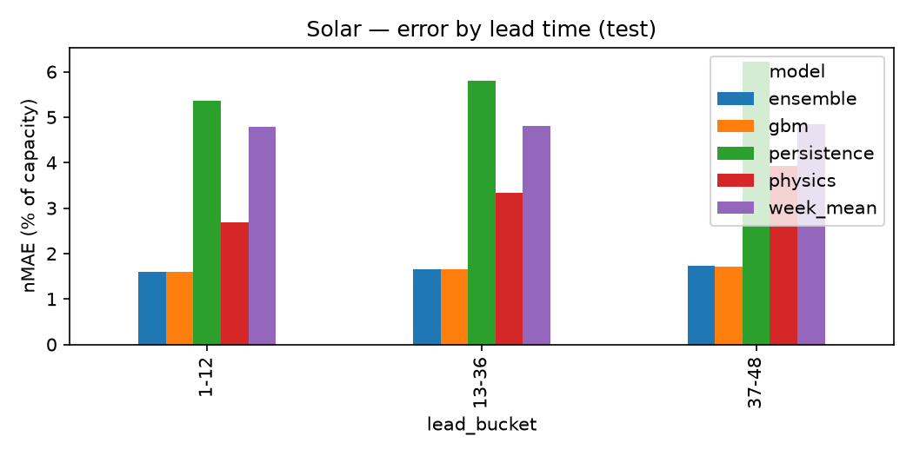
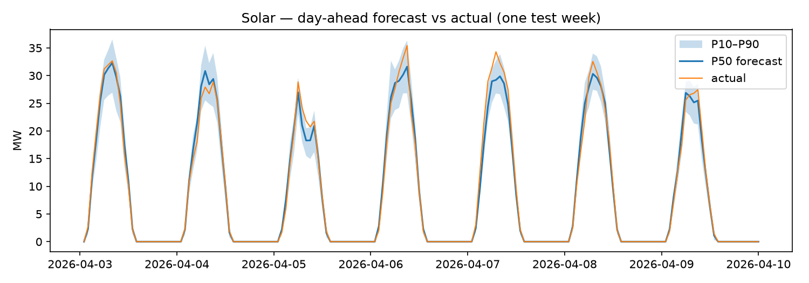
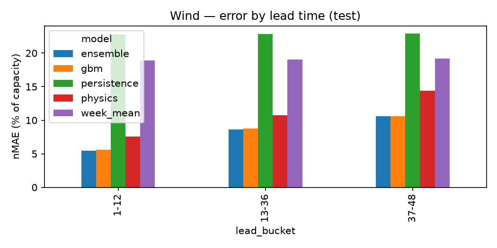
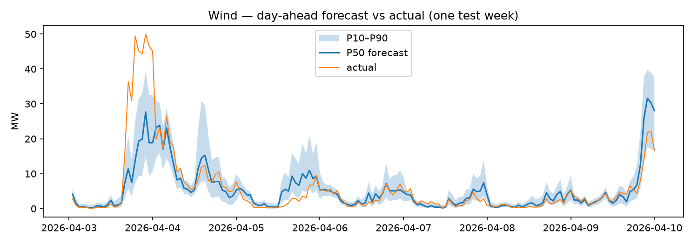

# Accuracy report (test split)

Generated by `terra report` from `artifacts/backtests/`. Do not edit numbers by hand.

## Solar (capacity 40 MW)

### Overall

| model       |   mae |   rmse |   nmae_pct |   nrmse_pct |   bias |   pinball |   picp80 |   picp90 |   mpiw80_pct |   skill_vs_persistence |
|:------------|------:|-------:|-----------:|------------:|-------:|----------:|---------:|---------:|-------------:|-----------------------:|
| ensemble    | 0.663 |  1.365 |      1.657 |       3.413 | -0.184 |     0.175 |    0.919 |    0.97  |        5.791 |                  0.714 |
| gbm         | 0.66  |  1.358 |      1.649 |       3.394 | -0.179 |     0.175 |    0.829 |    0.907 |        4.128 |                  0.715 |
| persistence | 2.317 |  4.852 |      5.793 |      12.13  |  0.01  |     0.649 |    0.886 |    0.934 |       16.807 |                  0     |
| physics     | 1.326 |  2.653 |      3.315 |       6.632 | -0.332 |     0.37  |    0.873 |    0.921 |       10.294 |                  0.428 |
| week_mean   | 1.927 |  3.898 |      4.817 |       9.744 |  0.052 |     0.524 |    0.888 |    0.935 |       14.553 |                  0.168 |

### Daylight hours only

| model       |   mae |   rmse |   nmae_pct |   nrmse_pct |   bias |   pinball |   picp80 |   picp90 |   mpiw80_pct |   skill_vs_persistence |
|:------------|------:|-------:|-----------:|------------:|-------:|----------:|---------:|---------:|-------------:|-----------------------:|
| ensemble    | 1.229 |  1.859 |      3.072 |       4.647 | -0.342 |     0.325 |    0.85  |    0.944 |       10.738 |                  0.714 |
| gbm         | 1.223 |  1.849 |      3.058 |       4.622 | -0.333 |     0.324 |    0.682 |    0.827 |        7.654 |                  0.715 |
| persistence | 4.297 |  6.607 |     10.742 |      16.518 |  0.019 |     1.204 |    0.789 |    0.878 |       31.164 |                  0     |
| physics     | 2.459 |  3.612 |      6.147 |       9.03  | -0.615 |     0.686 |    0.764 |    0.854 |       19.087 |                  0.428 |
| week_mean   | 3.573 |  5.308 |      8.932 |      13.269 |  0.096 |     0.972 |    0.793 |    0.879 |       26.985 |                  0.168 |

### By lead bucket

| model       | lead_bucket   |   mae |   rmse |   nmae_pct |   nrmse_pct |   bias |   pinball |   picp80 |   picp90 |   mpiw80_pct |   skill_vs_persistence |
|:------------|:--------------|------:|-------:|-----------:|------------:|-------:|----------:|---------:|---------:|-------------:|-----------------------:|
| ensemble    | 1-12          | 0.636 |  1.317 |      1.589 |       3.293 | -0.164 |     0.166 |    0.919 |    0.974 |        5.455 |                  0.704 |
| ensemble    | 13-36         | 0.663 |  1.366 |      1.658 |       3.415 | -0.195 |     0.176 |    0.917 |    0.966 |        5.673 |                  0.714 |
| ensemble    | 37-48         | 0.689 |  1.41  |      1.724 |       3.526 | -0.184 |     0.183 |    0.924 |    0.974 |        6.368 |                  0.723 |
| gbm         | 1-12          | 0.637 |  1.317 |      1.592 |       3.292 | -0.157 |     0.164 |    0.838 |    0.916 |        4.004 |                  0.703 |
| gbm         | 13-36         | 0.66  |  1.359 |      1.65  |       3.398 | -0.189 |     0.176 |    0.827 |    0.907 |        4.086 |                  0.715 |
| gbm         | 37-48         | 0.682 |  1.395 |      1.705 |       3.488 | -0.183 |     0.182 |    0.822 |    0.897 |        4.336 |                  0.726 |
| persistence | 1-12          | 2.147 |  4.526 |      5.367 |      11.314 |  0.002 |     0.605 |    0.893 |    0.936 |       16.212 |                  0     |
| persistence | 13-36         | 2.317 |  4.852 |      5.792 |      12.13  |  0.012 |     0.65  |    0.886 |    0.934 |       16.783 |                  0     |
| persistence | 37-48         | 2.49  |  5.161 |      6.225 |      12.903 |  0.016 |     0.692 |    0.879 |    0.934 |       17.455 |                  0     |
| physics     | 1-12          | 1.071 |  2.114 |      2.678 |       5.285 | -0.314 |     0.303 |    0.873 |    0.92  |        8.798 |                  0.501 |
| physics     | 13-36         | 1.331 |  2.63  |      3.327 |       6.576 | -0.397 |     0.371 |    0.879 |    0.925 |       10.659 |                  0.426 |
| physics     | 37-48         | 1.573 |  3.141 |      3.933 |       7.852 | -0.219 |     0.436 |    0.862 |    0.916 |       11.068 |                  0.368 |
| week_mean   | 1-12          | 1.914 |  3.866 |      4.786 |       9.665 |  0.037 |     0.521 |    0.886 |    0.936 |       14.248 |                  0.108 |
| week_mean   | 13-36         | 1.926 |  3.897 |      4.815 |       9.742 |  0.053 |     0.524 |    0.889 |    0.934 |       14.572 |                  0.169 |
| week_mean   | 37-48         | 1.941 |  3.931 |      4.853 |       9.828 |  0.065 |     0.528 |    0.889 |    0.934 |       14.823 |                  0.22  |





## Wind (capacity 50 MW)

### Overall

| model       |    mae |   rmse |   nmae_pct |   nrmse_pct |   bias |   pinball |   picp80 |   picp90 |   mpiw80_pct |   skill_vs_persistence |
|:------------|-------:|-------:|-----------:|------------:|-------:|----------:|---------:|---------:|-------------:|-----------------------:|
| ensemble    |  4.164 |  6.31  |      8.327 |      12.62  | -0.747 |     1.02  |    0.73  |    0.842 |       22.604 |                  0.636 |
| gbm         |  4.212 |  6.385 |      8.424 |      12.771 | -1.171 |     1.041 |    0.708 |    0.811 |       23.525 |                  0.631 |
| persistence | 11.425 | 15.377 |     22.849 |      30.754 |  0.036 |     3.335 |    0.539 |    0.687 |       32.473 |                  0     |
| physics     |  5.436 |  8.128 |     10.871 |      16.256 |  1.984 |     1.672 |    0.526 |    0.688 |       14.139 |                  0.524 |
| week_mean   |  9.514 | 12.182 |     19.029 |      24.364 | -0.075 |     2.751 |    0.457 |    0.607 |       32.252 |                  0.167 |

### By lead bucket

| model       | lead_bucket   |    mae |   rmse |   nmae_pct |   nrmse_pct |   bias |   pinball |   picp80 |   picp90 |   mpiw80_pct |   skill_vs_persistence |
|:------------|:--------------|-------:|-------:|-----------:|------------:|-------:|----------:|---------:|---------:|-------------:|-----------------------:|
| ensemble    | 1-12          |  2.724 |  4.018 |      5.448 |       8.036 | -0.105 |     0.674 |    0.721 |    0.843 |       15.186 |                  0.76  |
| ensemble    | 13-36         |  4.329 |  6.51  |      8.659 |      13.02  | -1.25  |     1.062 |    0.737 |    0.842 |       23.21  |                  0.621 |
| ensemble    | 37-48         |  5.283 |  7.651 |     10.567 |      15.303 | -0.382 |     1.286 |    0.724 |    0.842 |       28.87  |                  0.539 |
| gbm         | 1-12          |  2.79  |  4.145 |      5.579 |       8.289 | -0.676 |     0.709 |    0.721 |    0.826 |       17.497 |                  0.755 |
| gbm         | 13-36         |  4.391 |  6.612 |      8.782 |      13.225 | -1.557 |     1.081 |    0.711 |    0.814 |       23.563 |                  0.616 |
| gbm         | 37-48         |  5.287 |  7.658 |     10.574 |      15.315 | -0.895 |     1.294 |    0.691 |    0.791 |       29.528 |                  0.539 |
| persistence | 1-12          | 11.373 | 15.334 |     22.746 |      30.667 |  0.008 |     3.389 |    0.528 |    0.673 |       30.902 |                  0     |
| persistence | 13-36         | 11.43  | 15.379 |     22.859 |      30.757 |  0.031 |     3.336 |    0.537 |    0.687 |       32.549 |                  0     |
| persistence | 37-48         | 11.467 | 15.417 |     22.934 |      30.834 |  0.074 |     3.277 |    0.553 |    0.702 |       33.902 |                  0     |
| physics     | 1-12          |  3.797 |  5.572 |      7.594 |      11.143 |  1.758 |     1.385 |    0.446 |    0.592 |        7.714 |                  0.666 |
| physics     | 13-36         |  5.386 |  8.045 |     10.772 |      16.09  |  1.553 |     1.629 |    0.55  |    0.724 |       14.655 |                  0.529 |
| physics     | 37-48         |  7.188 | 10.202 |     14.375 |      20.405 |  3.076 |     2.046 |    0.557 |    0.715 |       19.584 |                  0.373 |
| week_mean   | 1-12          |  9.436 | 12.121 |     18.871 |      24.241 | -0.109 |     2.739 |    0.449 |    0.604 |       31.514 |                  0.17  |
| week_mean   | 13-36         |  9.519 | 12.183 |     19.038 |      24.367 | -0.08  |     2.75  |    0.457 |    0.608 |       32.288 |                  0.167 |
| week_mean   | 37-48         |  9.585 | 12.24  |     19.17  |      24.481 | -0.03  |     2.765 |    0.464 |    0.607 |       32.926 |                  0.164 |





## Ensemble weights

```json
{
  "solar": {
    "physics": {
      "1-12": 0.0419,
      "13-36": 0.0283,
      "37-48": 0.0284
    },
    "gbm": {
      "1-12": 0.9581,
      "13-36": 0.9717,
      "37-48": 0.9716
    }
  },
  "wind": {
    "physics": {
      "1-12": 0.2345,
      "13-36": 0.0986,
      "37-48": 0.1291
    },
    "gbm": {
      "1-12": 0.7655,
      "13-36": 0.9014,
      "37-48": 0.8709
    }
  }
}
```