# TERRA Architecture

TERRA's backend integrates Open-Meteo weather data with a calibrated digital twin of a virtual 90 MW hybrid plant (40 MW AC solar + 50 MW wind) in the Dewas wind belt near Indore, MP. Physical heuristics and LightGBM-Quantile models feed into domain engines (Trust, Dispatch LP, Deviation Shield, Alerts, What-If), exposing typed REST and SSE endpoints via FastAPI to a 10-page Next.js control room.

```mermaid
flowchart LR
  subgraph Sources["Data Sources (Real Data)"]
    PR["Open-Meteo Previous Runs<br/>strict lead mapping: 24h (fx1) / 48h (fx2)"]
    AR["Open-Meteo Archive<br/>actual weather (CC BY 4.0)"]
    LF["Open-Meteo Forecast<br/>live weather"]
    RD["Real Indian Data (R1-R4)<br/>Kaggle plants, SCADA, Grid-India, CEA"]
  end
  subgraph ML["ml/terra (Python ML & Physics)"]
    TW["Virtual Digital Twin<br/>pvlib + windpowerlib + realism"]
    CAL["Calibration Engine<br/>calibrated on R1/R2/R4"]
    FR["Framing + 34 Features<br/>strict leak-free matching"]
    MD["Models: Persistence · Physics<br/>LightGBM-Q · Chronos-2"]
    EN["Ensemble + CQR<br/>80% and 90% uncertainty bands"]
    ENG["Engines: Hybrid · Trust · Alerts<br/>Dispatch LP · Deviation Shield · Impact"]
  end
  KG["Kaggle 2×T4<br/>Chronos-2 LoRA (GPU optional)"] -.-> MD
  subgraph API["Backend (FastAPI)"]
    SCH["Scheduler (ForecastJob)<br/>live / replay via APScheduler"]
    RT["FastAPI Routers<br/>REST + SSE /alerts/stream"]
    DB[("Storage<br/>SQLite terra.db + Parquet runs")]
  end
  subgraph UI["Frontend (Next.js App Router — 10 Pages)"]
    P1["Overview / Control Room (/)"]
    P2["Forecast (/forecast)"]
    P3["Models (/models)"]
    P4["Alerts (/alerts)"]
    P5["Dispatch (/dispatch)"]
    P6["What-if (/whatif)"]
    P7["Deviation Shield (/deviation)"]
    P8["Impact (/impact)"]
    P9["Trust (/trust)"]
    P10["Assumptions (/assumptions)"]
  end
  AR --> TW
  RD --> CAL --> TW
  PR --> FR
  TW --> FR --> MD --> EN --> ENG
  LF --> SCH --> ENG --> DB --> RT
  RT --> UI
```

## Data Provenance & Leakage Controls
- **Weather Provenance**: Actual and forecast weather series are obtained from the Open-Meteo API (`ecmwf_ifs025` model, CC BY 4.0).
- **Plant Provenance**: The generation target is produced by a virtual digital twin at a real location in Dewas, MP, calibrated against real Indian plant datasets (Kaggle solar, wind turbine SCADA, and CEA monthly capacity factors). It is not an actual plant operator's telemetry.
- **Strict Leak-Free Lead Mapping**: Under ADR-009, forecast features use `fx1_` (24 h-old forecast) for leads 1–24 and `fx2_` (48 h-old forecast) for leads 25–48. Forecasts issued after issue time (`fx0_`) are never used as lead-resolved features.
- **Alert Ingestion**: The scheduler runs `ForecastJob.tick()`, records runs and data-driven alerts into SQLite (`terra.db`), and streams real-time events over SSE.
- **Deployment Status**: Cloud deployment is deferred per ADR-008; deployment configs exist only as configuration.
