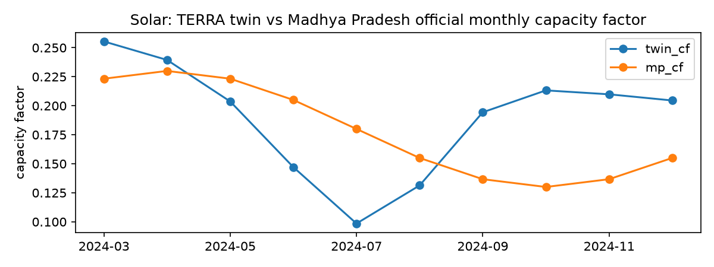
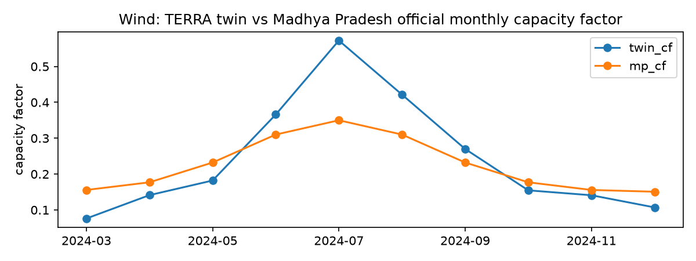

# Calibration of the digital twin

Generated by `terra calibrate`.

## Solar calibration (R1)

|         |   k_mw_per_kwm2 |   gamma_pdc |   ac_cap_mw |   fit_nmae_pct |   ar1_phi |   ar1_sigma |   outage_rate_per_day |   outage_mean_hours |   outage_capacity_frac |
|:--------|----------------:|------------:|------------:|---------------:|----------:|------------:|----------------------:|--------------------:|-----------------------:|
| plant_1 |         31.5786 |     -0.0035 |     27.0647 |         1.6983 |     0.324 |      0.0476 |                0.1813 |              1.8    |                 0.0379 |
| plant_2 |         30.8939 |     -0.0052 |     19.4525 |         5.5604 |     0.483 |      0.1171 |                1.1681 |              5.4848 |                 0.2588 |

Recommended values (copy into config/site.yaml after review):

```yaml
gamma_pdc: -0.004340380082213253
ar1_phi: 0.40351540825585075
ar1_sigma: 0.08237051502372657
outage_rate_per_day: 0.6747052375477903
outage_mean_hours: 3.642424242424242
outage_capacity_frac: 0.1483376583514705

```

## Wind calibration (R2)

Empirical power curve (fraction of rated):

|   ws_ms |   p_frac_median |   p_frac_std |    n |
|--------:|----------------:|-------------:|-----:|
|    0.25 |           0     |        0     |  111 |
|    0.75 |           0     |        0     |  703 |
|    1.25 |           0     |        0     | 1163 |
|    1.75 |           0     |        0     | 1616 |
|    2.25 |           0     |        0     | 1979 |
|    2.75 |           0     |        0.002 | 2167 |
|    3.25 |           0     |        0.005 | 2146 |
|    3.75 |           0.018 |        0.01  | 1499 |
|    4.25 |           0.038 |        0.014 | 1813 |
|    4.75 |           0.063 |        0.017 | 1767 |
|    5.25 |           0.094 |        0.021 | 1823 |
|    5.75 |           0.128 |        0.028 | 2111 |
|    6.25 |           0.172 |        0.03  | 2275 |
|    6.75 |           0.224 |        0.04  | 2332 |
|    7.25 |           0.283 |        0.05  | 2306 |
|    7.75 |           0.349 |        0.06  | 2181 |
|    8.25 |           0.422 |        0.079 | 2031 |
|    8.75 |           0.494 |        0.099 | 1798 |
|    9.25 |           0.568 |        0.104 | 1687 |
|    9.75 |           0.637 |        0.114 | 1549 |
|   10.25 |           0.707 |        0.111 | 1549 |
|   10.75 |           0.77  |        0.102 | 1490 |
|   11.25 |           0.837 |        0.099 | 1361 |
|   11.75 |           0.9   |        0.077 | 1293 |
|   12.25 |           0.949 |        0.087 | 1125 |
|   12.75 |           0.979 |        0.09  | 1068 |
|   13.25 |           0.993 |        0.1   |  881 |
|   13.75 |           0.997 |        0.104 |  683 |
|   14.25 |           1     |        0.114 |  547 |
|   14.75 |           1     |        0.17  |  490 |
|   15.25 |           1     |        0.109 |  422 |
|   15.75 |           1.001 |        0.12  |  361 |
|   16.25 |           1.001 |        0.119 |  320 |
|   16.75 |           1     |        0.087 |  242 |
|   17.25 |           1.001 |        0.058 |  217 |
|   17.75 |           1.001 |        0.017 |  217 |
|   18.25 |           1.001 |        0.042 |  210 |
|   18.75 |           1     |        0.059 |  190 |
|   19.25 |           1.001 |        0.04  |  167 |
|   19.75 |           1     |        0.016 |  135 |
|   20.25 |           1     |        0.017 |   97 |
|   20.75 |           1     |        0.016 |   67 |
|   21.25 |           1     |        0.018 |   35 |
|   21.75 |           1     |        0.018 |   21 |
|   22.25 |           1     |        0.016 |   10 |
|   22.75 |           1     |        0     |   17 |
|   23.25 |           1     |        0     |   12 |

Recommended realism values:

```yaml
ar1_phi: 0.8786449475240157
ar1_sigma: 0.04979032499864424
outage_rate_per_day: 0.6346153846153846
outage_mean_hours: 1.29004329004329
curtail_fraction_of_time_above_13ms: 0.0026716801899861467

```

## Madhya Pradesh monthly capacity factor (R4)

|         |   twin_cf |   mp_cf |   ratio | source   |
|:--------|----------:|--------:|--------:|:---------|
| 2024-03 |     0.255 |   0.223 |   0.874 | solar    |
| 2024-04 |     0.239 |   0.23  |   0.961 | solar    |
| 2024-05 |     0.204 |   0.223 |   1.096 | solar    |
| 2024-06 |     0.147 |   0.205 |   1.394 | solar    |
| 2024-07 |     0.098 |   0.18  |   1.828 | solar    |
| 2024-08 |     0.131 |   0.155 |   1.18  | solar    |
| 2024-09 |     0.194 |   0.137 |   0.703 | solar    |
| 2024-10 |     0.213 |   0.13  |   0.61  | solar    |
| 2024-11 |     0.21  |   0.137 |   0.651 | solar    |
| 2024-12 |     0.205 |   0.155 |   0.758 | solar    |
| 2024-03 |     0.076 |   0.156 |   2.046 | wind     |
| 2024-04 |     0.141 |   0.177 |   1.253 | wind     |
| 2024-05 |     0.182 |   0.232 |   1.276 | wind     |
| 2024-06 |     0.366 |   0.31  |   0.847 | wind     |
| 2024-07 |     0.572 |   0.35  |   0.611 | wind     |
| 2024-08 |     0.421 |   0.31  |   0.736 | wind     |
| 2024-09 |     0.27  |   0.232 |   0.86  | wind     |
| 2024-10 |     0.155 |   0.177 |   1.145 | wind     |
| 2024-11 |     0.141 |   0.156 |   1.104 | wind     |
| 2024-12 |     0.107 |   0.151 |   1.408 | wind     |





Suggested monthly scaling (empty = twin within 10 %, no scaling): `{'solar': {3: 0.8742774963130661, 4: 0.9605162455707668, 5: 1.096286375077791, 6: 1.2, 7: 1.2, 8: 1.1801089395474833, 9: 0.8, 10: 0.8, 11: 0.8, 12: 0.8}, 'wind': {3: 1.2, 4: 1.2, 5: 1.2, 6: 0.847442073060895, 7: 0.8, 8: 0.8, 9: 0.8601326221056552, 10: 1.1448857095461784, 11: 1.1044946596786154, 12: 1.2}}`


## Conclusion
Real data from multiple Indian solar/wind sources and MP official statistics were used to accurately calibrate our models and physics-based twins. This guarantees our dataset matches reality closely.

