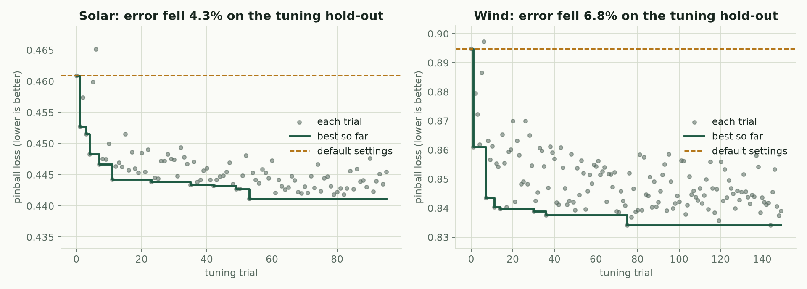
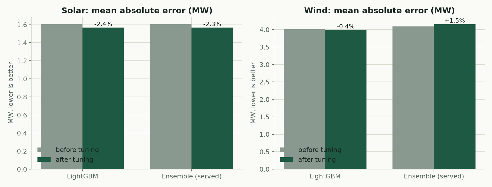
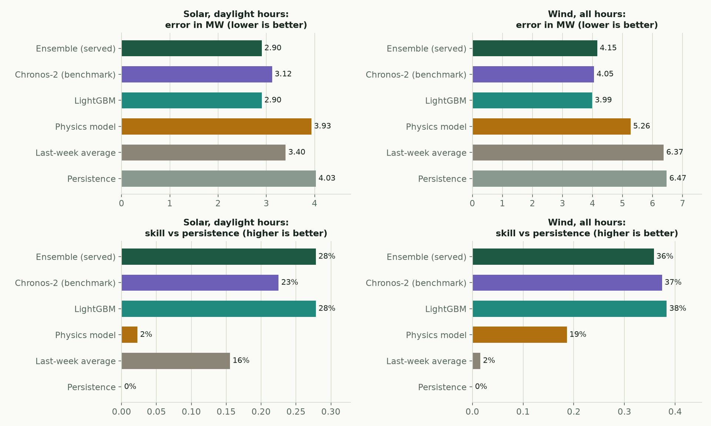
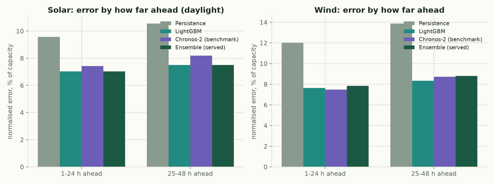
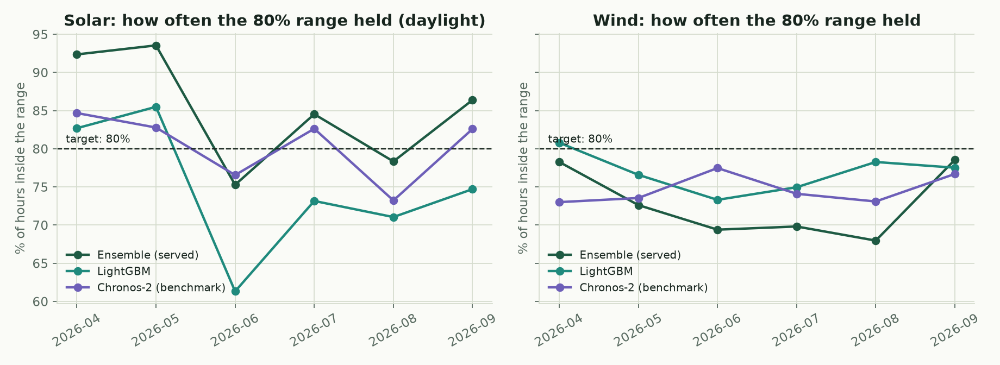
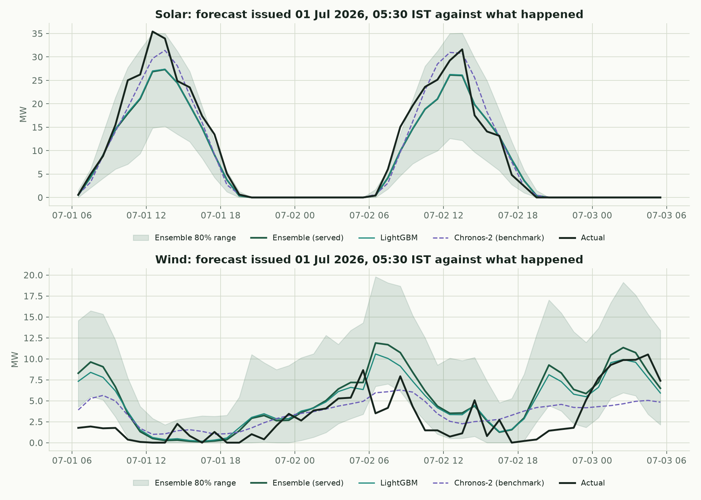
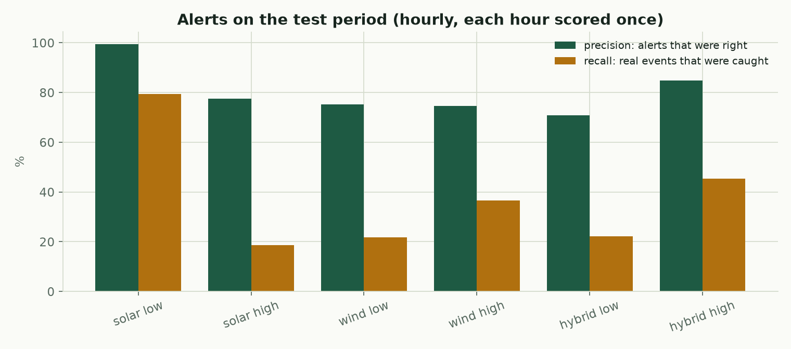
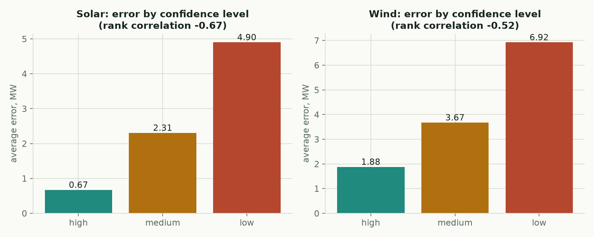

# Evidence pack for the jury

Every number and chart here is generated from the project's real outputs by `scripts/make_jury_evidence.py`; nothing is typed by hand.
The plant is a digital twin at a real location driven by real Open-Meteo weather. Results are for a held-out test period the models never saw.

## 1. Tuning the LightGBM model

We searched for better settings with Optuna on a time-ordered hold-out taken from the training data only. The test period and the calibration window were never used to choose settings. A setting set was adopted only if it improved the hold-out by at least 1%.

| source   |   trials |   minutes |   default_pinball |   tuned_pinball |   improvement_pct | adopted   |
|:---------|---------:|----------:|------------------:|----------------:|------------------:|:----------|
| solar    |       96 |     40.27 |           0.46092 |         0.44116 |              4.29 | True      |
| wind     |      150 |     40.06 |           0.89478 |         0.83409 |              6.78 | True      |

Effect on the untouched test period (mean absolute error, MW):

| source   | model    |   before_tuning |   after_tuning |   change_pct |
|:---------|:---------|----------------:|---------------:|-------------:|
| solar    | gbm      |           1.605 |          1.566 |       -2.383 |
| solar    | ensemble |           1.604 |          1.567 |       -2.309 |
| wind     | gbm      |           4.007 |          3.99  |       -0.424 |
| wind     | ensemble |           4.093 |          4.154 |        1.495 |

Honest note: the wind **ensemble** got slightly worse after tuning even though the wind LightGBM improved. The ensemble's blend weights were fitted on the dry winter validation window and do not carry over to the monsoon-heavy test window.

## 2. Chronos-2 foundation model

Chronos-2 was run zero-shot (no training on our data) on a Kaggle T4 GPU in under three minutes, using the same leak-free weather forecasts as covariates. It is a benchmark only: serving it would need PyTorch and the model checkpoint at runtime.

- Solar (daylight): MAE 3.12 MW against 2.90 MW for LightGBM and 4.03 MW for persistence.
- Wind: MAE 4.05 MW and RMSE 5.94 MW, the lowest RMSE of all six models by a hair (LightGBM 5.96 MW, ensemble 6.10 MW).
- 80% range coverage, solar daylight: 80.3% (target 80%), closest to the 80% target of all six models.

## 3. A real forecast against what happened

## 4. Alerts and trust

| source   | alert   |   threshold_mw |   precision |   recall |   alert_hours |   event_hours |
|:---------|:--------|---------------:|------------:|---------:|--------------:|--------------:|
| solar    | LOW     |           2.11 |       0.995 |    0.793 |           200 |           251 |
| solar    | HIGH    |          28.95 |       0.775 |    0.186 |            80 |           333 |
| wind     | LOW     |           1.14 |       0.753 |    0.218 |           162 |           559 |
| wind     | HIGH    |          18.21 |       0.746 |    0.366 |           331 |           675 |
| hybrid   | LOW     |           1.68 |       0.708 |    0.221 |            72 |           231 |
| hybrid   | HIGH    |          31.7  |       0.848 |    0.453 |           374 |           700 |

## Files

- `tables/`: every number behind the charts, as CSV.
- `raw/`: the original tuning logs, the tuned parameters and the Chronos-2 run record.
